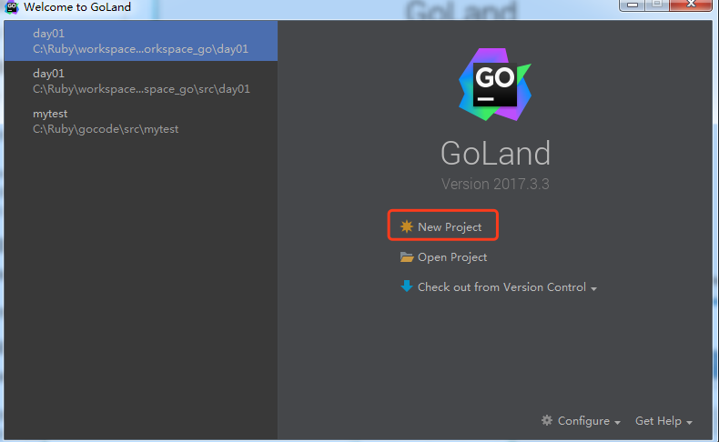
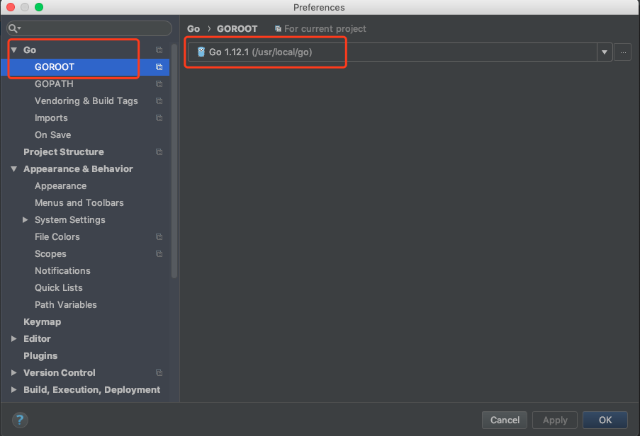
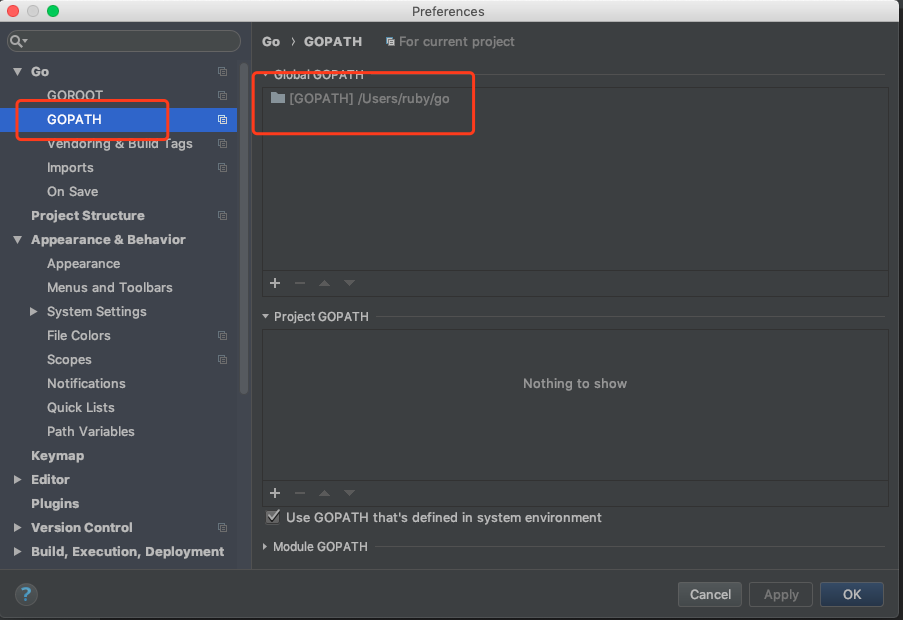
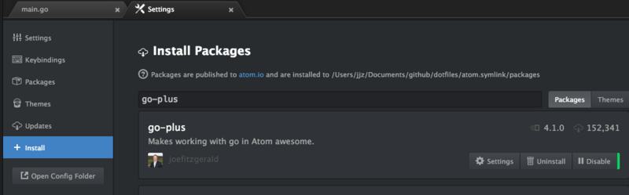
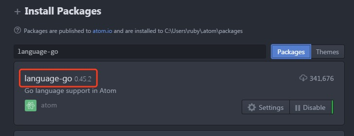
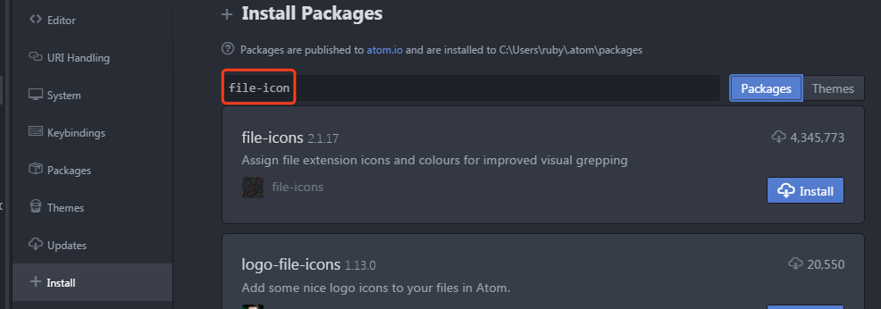
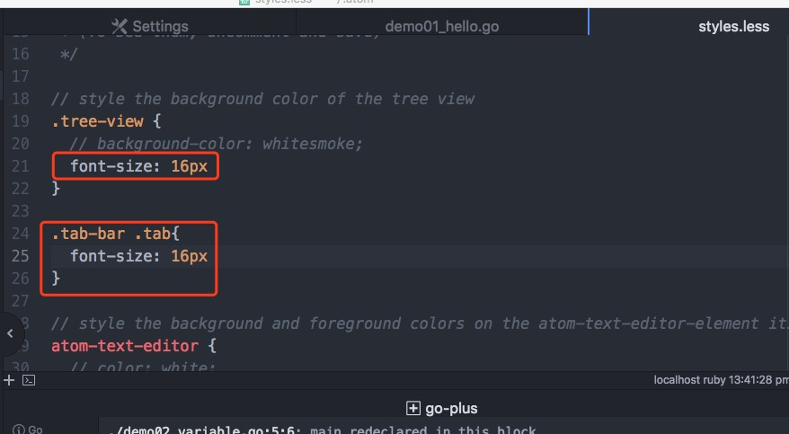

# 安装Goland开发工具

> @author：韩茹
> 版权所有：北京千锋互联科技有限公司

开发工具：

文本类的编辑器：记事本，notepad，sublime text，atom。。。

​	通过命令执行程序

IED：集成开发环境（integrated development environment）

​	goland


## 1.1 使用Goland

Goland是JetBrains公司推出的Go语言IDE，是一款功能强大，使用便捷的产品。

下载地址：<http://www.jetbrains.com/go>

对于Mac和Windows，都有直接的安装文件，直接双击后，傻瓜式安装，一路next，直到完成。


打开Goland工具，goland的激活码：http://idea.iblue.me


新建Go项目：




创建项目：


Goland配置goroot：




配置gopath：




```
Goland常用快捷键
文件相关快捷键：

CTRL+E，打开最近浏览过的文件。
CTRL+SHIFT+E，打开最近更改的文件。
CTRL+N，可以快速打开struct结构体。
CTRL+SHIFT+N，可以快速打开文件。
代码格式化：

CTRL+ALT+T，可以把代码包在一个块内，例如if{…}else{…}。
CTRL+ALT+L，格式化代码。
CTRL+空格，代码提示。
CTRL+/，单行注释。CTRL+SHIFT+/，进行多行注释。
CTRL+B，快速打开光标处的结构体或方法（跳转到定义处）。
CTRL+“+/-”，可以将当前方法进行展开或折叠。
查找和定位
CTRL+R，替换文本。
CTRL+F，查找文本。
CTRL+SHIFT+F，进行全局查找。
CTRL+G，快速定位到某行。
代码编辑

ALT+Q，可以看到当前方法的声明。
CTRL+Backspace，按单词进行删除。
SHIFT+ENTER，可以向下插入新行，即使光标在当前行的中间。
CTRL+X，删除当前光标所在行。
CTRL+D，复制当前光标所在行。
ALT+SHIFT+UP/DOWN，可以将光标所在行的代码上下移动。
CTRL+SHIFT+U，可以将选中内容进行大小写转化。


```


**Ubuntu下安装GoLand工具**

首先下载GoLand软件到下载文件夹下。然后在终端输入以下命令：

```shell
ruby@ubuntu:~/下载$ sudo tar -xzf goland-2017.3.3.tar.gz -C /opt
```

进入bin目录下执行以下命令：

```shell
ruby@ubuntu:/opt/GoLand-2017.3.3/bin$ sh goland.sh
```


## 1.2 使用atom

安装好atom工具，然后安装go-plus插件和atom-terminal-panel等插件。

1.安装go-plus插件，这个插件提供了Atom中几乎所有go语言开发的支持，包括 tools, build flows, linters, vet 和 coverage tools。它还包含很多代码片段和一些其它特性。




2.language-go




3.安装file-icon插件，它提针对不同后缀的文件，提供了大量的icon显示。




4.设置字体大小等




## 1.3 其他开发工具

比如sublime text，editplus，notpad++，eclipse等等。。


千锋Go语言的学习群：784190273

对应视频地址：

https://www.bilibili.com/video/av56018934

https://www.bilibili.com/video/av47467197

源代码：

https://github.com/rubyhan1314/go_foundation


# 