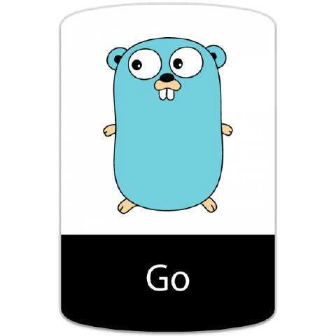
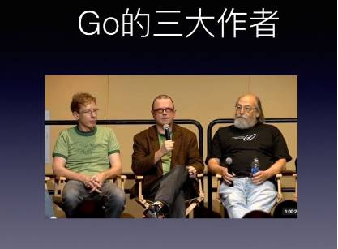
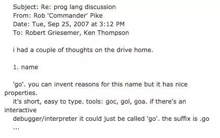
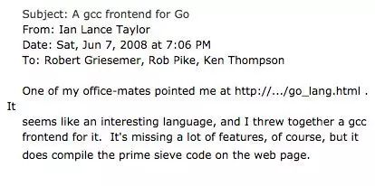
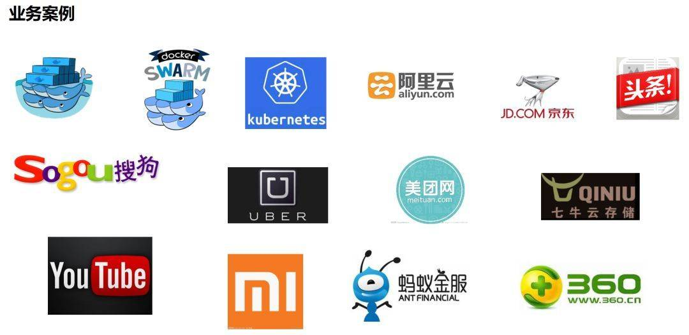

# Go语言的前世今生

> @author：韩茹
> 版权所有：北京千锋互联科技有限公司

## 一、 为什么需要一个新的语言

最近十年来，C/C++在计算领域没有很好得到发展，并没有新的系统编程语言出现。对开发程度和系统效率在很多情况下不能兼得。要么执行效率高，但低效的开发和编译，如C++；要么执行低效，但拥有有效的编译，如.NET、Java；所以需要一种拥有较高效的执行速度、编译速度和开发速度的编程语言，Go就横空出世了。

> 传统的语言比如c++，大家花费太多时间来学习如何使用这门语言，而不是如何更好的表达写作者的思想，同时编译花费的时间实在太长，对于编写-编译-运行这个链条来说周期太长。动态语言如Python，由于没有强类型的约束，很多问题需要在运行时发现，这种低级错误更应该交给编译器来发现。

- 人力成本越来越高

- 机器越来越便宜

- 机器的性能越来越厉害

- 在开发效率和运行速度上达到平衡

  

go出现之前，无论汇编语言、还是动态脚本语言，在执行效率和开发效率上都不能兼备。

> 执行效率 execution speed：  C/C++    >  Java   >  PHP
> 开发效率 developing efficiency：  PHP   >  Java  >  C/C++

 

## 二、 谷歌工程师的20%时间

谷歌的“20%时间”工作方式，允许工程师拿出20%的时间来研究自己喜欢的项目。语音服务Google Now、谷歌新闻Google News、谷歌地图Google Map上的交通信息等，全都是20%时间的产物。

Go语言最开始也是20%时间的产物。

## 三、 创始人

Go的三个作者分别是： Rob Pike（罗伯.派克），Ken Thompson（肯.汤普森）和Robert Griesemer（罗伯特.格利茨默） 。

- Rob Pike：曾是贝尔实验室（Bell Labs）的Unix团队，和Plan 9操作系统计划的成员。他与Thompson共事多年，并共创出广泛使用的UTF-8 字元编码。

- Ken Thompson：主要是B语言、C语言的作者、Unix之父。1983年图灵奖（Turing Award）和1998年美国国家技术奖（National Medal of Technology）得主。他与Dennis Ritchie是Unix的原创者。Thompson也发明了后来衍生出C语言的B程序语言。

- Robert Griesemer：在开发Go之前是Google V8、Chubby和HotSpot JVM的主要贡献者。

  

> 此外还有Plan 9开发者Russ Cox、和曾改善目前广泛使用之开原码编译器GCC的Ian Taylor。

## 四、 Go的缔造与发展

### 4.1 Go的命名

这是一封由 Rob Pike 在 2007 年 9 月 25 号，星期二，下午 3：12 回复给 Robert Griesemer、Ken Thompson 的有关编程语言讨论主题的邮件，邮件正文大意为：在开车回家的路上我得到了些灵感。1.给这门编程语言取名为“go”，它很简短，易书写。工具类可以命名为：goc、 gol、goa。交互式的调试工具也可以直接命名为“go”。语言文件后缀名为 .go 等等

这就是 Go 语言名字的来源，自此之后 Robert、Rob 和 Ken 三个人开始在 Google 内部进行了研发，一直到了 2009 年，Go 正式开源了，Go 项目团队将 2009 年 11 月 10 日，即该语言正式对外开源的日字作为其官方生日。源代码最初托管在 [http://code.google.com](http://link.zhihu.com/?target=http%3A//code.google.com) 上，之后几年才逐步的迁移到 GitHub 上。

### 4.2 Go的发展过程中的记事

**第一个事情是在开发设计 Go 语言过程中的第一个重大惊喜是收到了以下这封邮件：**

这是一封由 Ian Lance Taylor 在 2008 年 6月 7 日（星期六）的晚上 7：06 写给 Robert Griesemer、Rob Pike、 Ken Thompson 的关于 Go gcc 编译器前端的邮件。邮件正文大意如下：我的同事向我推荐了这个网站 http://…/go_lang.html 。这似乎是一门很有趣的编程语言。我为它写了一个 gcc 编译器前端。虽然这个工具仍缺少很多的功能，但它确实可以编译网站上展示的那个素数筛选程序了。

Ian Lance Taylor 的加入以及第二个编译器 (gcc go) 的实现 在带来震惊的同时，也伴随着喜悦。这对 Go 项目来说不仅仅是鼓励，更是一种对可行性的证明。语言的第二次实现对制定语言规范和确定标准库的过程至关重要，同时也有助于保证其高可移植性，这也是 Go 语言承诺的一部分。自此之后 Ian Lance Taylor 成为了设计和实现 Go 语言及其工具的核心人物。

**第二件事情是 Russ Cox 在2008年带着他的语言设计天赋和编程技巧加入了刚成立不久的 Go 团队。**Russ 发现 Go 方法的通用性意味着函数也能拥有自己的方法，这直接促成了 **http.HandlerFunc** 的实现，这是一个让 Go 一下子变得无限可能的特性。Russ 还提出了更多的泛化性的想法，比如 io.Reader 和 io.Writer 接口，奠定了所有 I/O 库的整体结构。

**第三件事情是聘请了安全专家 Adam Langley 帮助 Go 走向 Google 外面的世界。**Adam 为 Go 团队做了许多不为外人知晓的工作，包括创建最初的 **http://golang.org** 网站以及 **build dashboard**。不过他最大的贡献当属创建了 cryptographic 库。起先，在我们中的部分人看来，这个库无论在规模还是复杂度上都不成气候。但是就是这个库在后期成为了很多重要的网络和安全软件的基础，并且成为了 Go 语言开发历史的关键组成部分。许多网络基础设施公司，比如 **Cloudflare**，均重度依赖 Adam 在 Go 项目上的工作，互联网也因它变得更好。我记得当初 beego 设计的时候，session 模块设计的时候也得到了 Adam 的很多建议，因此，就 Go 而言，我们由衷地感谢 Adam。

**第四个事情就是一家叫做 Docker 的公司。**就是使用 Go 进行项目开发，并促进了计算机领域的容器行业，进而出现了像 Kubernetes 这样的项目。现在，我们完全可以说 Go 是容器语言，这是另一个完全出乎意料的结果。

除了大名鼎鼎的Docker，完全用GO实现。业界最为火爆的容器编排管理系统kubernetes完全用GO实现。之后的Docker Swarm，完全用GO实现。除此之外，还有各种有名的项目，如etcd/consul/flannel，七牛云存储等等
均使用GO实现。有人说，GO语言之所以出名，是赶上了云时代。但为什么不能换种说法？也是GO语言促使了云的发展。

除了云项目外，还有像今日头条、UBER这样的公司，他们也使用GO语言对自己的业务进行了彻底的重构。

## 五、最后

Go语言是谷歌2009年发布的第二款开源编程语言（系统开发语言)，它是基于编译、垃圾收集和并发的编程语言。
Go语言专门针对多处理器系统应用程序的编程进行了优化，使用Go编译的程序可以媲美 C / C++代码的速度，而且更加安全、支持并行进程。作为出现在21世纪的语言，其近C的执行性能和近解析型语言的开发效率，以及近乎于完美的编译速度，已经风靡全球。特别是在云项目中，大部分都使用了Golang来开发。不得不说，Golang早已深入人心。而对于一个没有历史负担的新项目，Golang或许就是个不二的选择。
很多人将Go语言称为21世纪的C语言，因为Go不仅拥有C的简洁和性能。而且还很好的提供了21世纪互联网环境下服务端开发的各种实用特性。被称为Go语言之父的罗勃·派克(Rob Pike)就曾说过，你是否同意Go语言，取决于你是认可少就是多，还是少就是少(Less is more or less is less)。Go语言的整个设计哲学就是：将简单、实用体现得淋漓尽致。
如今 Go 已经是云计算编程语言，GO语言背靠Google这棵大树，又不乏牛人坐镇，是名副其实的“牛二代”。想象一下：一个只有十几年发展经历的编程语言，已经成为了如此巨大而且正在不断发展的行业的主导者，这种成功是每个人都无法想象的。

本文所有图片来自网络，侵删

千锋Go语言的学习群：784190273

对应视频地址

https://www.bilibili.com/video/av47467197

https://www.bilibili.com/video/av56018934/

源代码

https://github.com/rubyhan1314/go_foundation