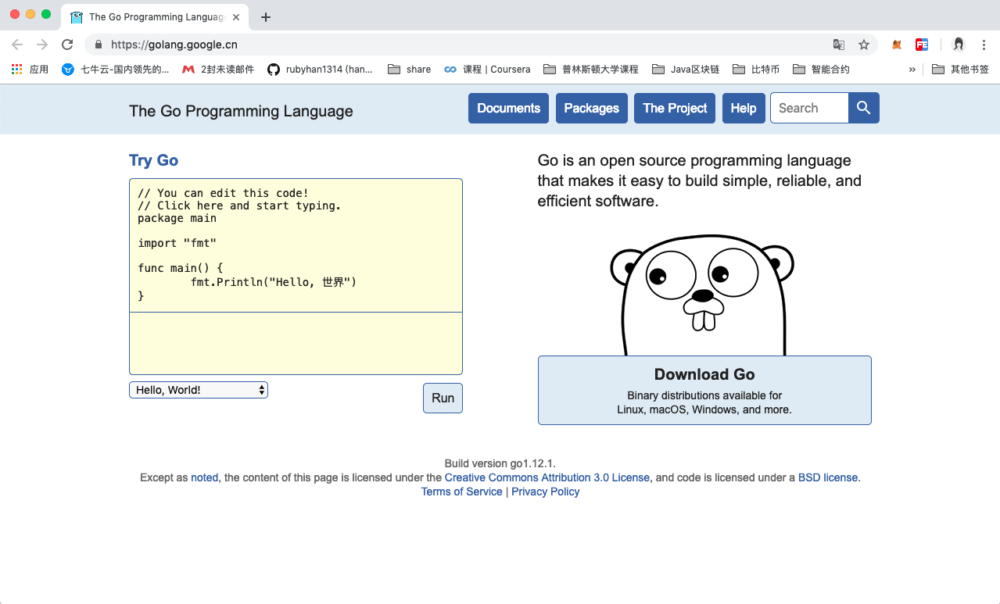

# Go语言logo和版本

> @author：韩茹
> 版权所有：北京千锋互联科技有限公司

## 一、 Go的logo

### 1.1 Go语言的logo

Go语言的logo就是很简洁的GO两个字母。

### 1.2 Go的吉祥物

Go之所以叫Go，是想表达这门语言的运行速度、开发速度、学习速度（develop）都像gopher一样快。

gopher是一种生活在加拿大的小动物，go的吉祥物就是这个小动物， 它的中文名叫做囊地鼠，他们最大的特点就是挖洞速度特别快，当然可能不止是挖洞啦。

## 二、[Go的官网](https://golang.google.cn/)

## 三、 Go语言主要发展过程

- 2007年9月，雏形设计 ，Rob Pike（罗伯.派克） 正式命名为Go；
- 2008年5月，Google全力支持该项目；
- 2009年11月10日，首次公开发布，Go将代码全部开源，它获得了当年的年度语言；

- 2011年3月16日，Go语言的第一个稳定(stable)版本r56发布。

- 2012年3月28日，Go语言的第一个正式版本Go1发布。

- 2013年4月04日，Go语言的第一个Go 1.1beta1测试版发布。

- 2013年4月08日，Go语言的第二个Go 1.1beta2测试版发布。

- 2013年5月02日，Go语言Go 1.1RC1版发布。

- 2013年5月07日，Go语言Go 1.1RC2版发布。

- 2013年5月09日，Go语言Go 1.1RC3版发布。

- 2013年5月13日，Go语言Go 1.1正式版发布。

- 2013年9月20日，Go语言Go 1.2RC1版发布。

- 2013年12月1日，Go语言Go 1.2正式版发布。

- 2014年6月18日，Go语言Go 1.3版发布。

- 2014年12月10日，Go语言Go 1.4版发布。

- 2015年8月19日，Go语言Go 1.5版发布，本次更新中移除了”最后残余的C代码”。

- 2016年2月17日，Go语言Go 1.6版发布。

- 2016年8月15日，Go语言Go 1.7版发布。

- 2017年2月17日，Go语言Go 1.8版发布。

- 2017年8月24日，Go语言Go 1.9版发布。

- 2018年2月16日，Go语言Go 1.10版发布。

- 2018年8月24日，Go语言Go 1.11版发布。

- 2019年2月25日，GO语言Go1.12版发布。

Go 语言起源 2007 年，并于 2009 年正式对外发布。它从 2009 年 9 月 21 日开始作为谷歌公司 20% 兼职项目，即相关员工利用 20% 的空余时间来参与 Go 语言的研发工作。

其实可以看到，Go语言的历史不算很短。

2009年11月 GO语言第一个版本发布。2012年3月 第一个正式版本Go1.0发布。

2015年8月 go1.5发布，这个版本被认为是历史性的。完全移除C语言部分，使用GO编译GO，少量代码使用汇编实现。另外，他们请来了内存管理方面的权威专家Rick Hudson，对GC进行了重新设计，支持并发GC，解决了一直以来广为诟病的GC时延（STW）问题。并且在此后的版本中，又对GC做了更进一步的优化。到go1.8时，相同业务场景下的GC时延已经可以从go1.1的数秒，控制在1ms以内。GC问题的解决，可以说GO语言在服务端开发方面，几乎抹平了所有的弱点。

直到今年的2月25日，Go语言发布最新的版本是Go 1.12。

在GO语言的版本迭代过程中，语言特性基本上没有太大的变化，基本上维持在GO1.1的基准上，并且官方承诺，新版本对老版本下开发的代码完全兼容。事实上，GO开发团队在新增语言特性上显得非常谨慎，而在稳定性、编译速度、执行效率以及GC性能等方面进行了持续不断的优化。

> Go稳定版发布时，Go Team承诺后续的版本都会兼容之前的版本。这对于开发者来说非常重要，Go后续的版本也一直在提升内功，从而可以让用户无缝的升级Go版本。

本文部分图片来自网络，侵删

千锋Go语言的学习群：784190273

对应视频地址：

https://www.bilibili.com/video/av47467197

https://www.bilibili.com/video/av56018934/

源代码：

https://github.com/rubyhan1314/go_foundation