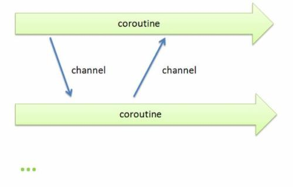

# Go语言的核心特性

> @author：韩茹
> 版权所有：北京千锋互联科技有限公司

Go语言，作为编程语言的后生，站在巨人的肩膀上，吸收了其他一些编程语言的特点。

Go 编程语言是一个开源项目，它使程序员更具生产力。Go 语言具有很强的表达能力，它简洁、清晰而高效。得益于其并发机制， 用它编写的程序能够非常有效地利用多核与联网的计算机，其新颖的类型系统则使程序结构变得灵活而模块化。 Go 代码编译成机器码不仅非常迅速，还具有方便的垃圾收集机制和强大的运行时反射机制。 它是一个快速的、静态类型的编译型语言，感觉却像动态类型的解释型语言。(摘取自官网)

##  一、思想

Less can be more

大道至简,小而蕴真

让事情变得复杂很容易，让事情变得简单才难

深刻的工程文化

## 二、核心特性

Go语言之所以厉害，是因为它在服务端的开发中，总能抓住程序员的痛点，以最直接、简单、高效、稳定的方式来解决问题。这里我们并不会深入讨论GO语言的具体语法，只会将语言中关键的、对简化编程具有重要意义的方面介绍给大家，体验Go的核心特性。

### 2.1 并发编程

Go语言在并发编程方面比绝大多数语言要简洁不少，这一点是其最大亮点之一，也是其在未来进入高并发高性能场景的重要筹码。

不同于传统的多进程或多线程，golang的并发执行单元是一种称为goroutine的协程。

由于在共享数据场景中会用到锁，再加上GC，其并发性能有时不如异步复用IO模型，因此相对于大多数语言来说，golang的并发编程简单比并发性能更具卖点。

在当今这个多核时代，并发编程的意义不言而喻。当然，很多语言都支持多线程、多进程编程，但遗憾的是，实现和控制起来并不是那么令人感觉轻松和愉悦。Golang不同的是，语言级别支持协程(goroutine)并发（协程又称微线程，比线程更轻量、开销更小，性能更高），操作起来非常简单，语言级别提供关键字（go）用于启动协程，并且在同一台机器上可以启动成千上万个协程。协程经常被理解为轻量级线程，一个线程可以包含多个协程，共享堆不共享栈。协程间一般由应用程序显式实现调度，上下文切换无需下到内核层，高效不少。协程间一般不做同步通讯，而golang中实现协程间通讯有两种：1）共享内存型，即使用全局变量+mutex锁来实现数据共享；2）消息传递型，即使用一种独有的channel机制进行异步通讯。

对比JAVA的多线程和GO的协程实现，明显更直接、简单。这就是GO的魅力所在，以简单、高效的方式解决问题，关键字go，或许就是GO语言最重要的标志。

**高并发是Golang语言最大的亮点**

### 2.2 内存回收(GC)

从C到C++，从程序性能的角度来考虑，这两种语言允许程序员自己管理内存，包括内存的申请和释放等。因为没有垃圾回收机制所以C/C++运行起来速度很快，但是随着而来的是程序员对内存使用上的很谨小慎微的考虑。因为哪怕一点不小心就可能会导致“内存泄露”使得资源浪费或者“野指针”使得程序崩溃等，尽管C++11后来使用了智能指针的概念，但是程序员仍然需要很小心的使用。后来为了提高程序开发的速度以及程序的健壮性，java和C#等高级语言引入了GC机制，即程序员不需要再考虑内存的回收等，而是由语言特性提供垃圾回收器来回收内存。但是随之而来的可能是程序运行效率的降低。 

GC过程是：先stop the world，扫描所有对象判活，把可回收对象在一段bitmap区中标记下来，接着立即start the world，恢复服务，同时起一个专门gorountine回收内存到空闲list中以备复用，不物理释放。物理释放由专门线程定期来执行。

GC瓶颈在于每次都要扫描所有对象来判活，待收集的对象数目越多，速度越慢。一个经验值是扫描10w个对象需要花费1ms，所以尽量使用对象少的方案，比如我们同时考虑链表、map、slice、数组来进行存储，链表和map每个元素都是一个对象，而slice或数组是一个对象，因此slice或数组有利于GC。

GC性能可能随着版本不断更新会不断优化，这块没仔细调研，团队中有HotSpot开发者，应该会借鉴jvm gc的设计思想，比如分代回收、safepoint等。

- 内存自动回收，再也不需要开发人员管理内存
- 开发人员专注业务实现，降低了心智负担
- 只需要new分配内存，不需要释放

### 2.3 内存分配

初始化阶段直接分配一块大内存区域，大内存被切分成各个大小等级的块，放入不同的空闲list中，对象分配空间时从空闲list中取出大小合适的内存块。内存回收时，会把不用的内存重放回空闲list。空闲内存会按照一定策略合并，以减少碎片。

### 2.4 编译

编译涉及到两个问题：编译速度和依赖管理

目前Golang具有两种编译器，一种是建立在GCC基础上的Gccgo，另外一种是分别针对64位x64和32位x86计算机的一套编译器(6g和8g)。

依赖管理方面，由于golang绝大多数第三方开源库都在github上，在代码的import中加上对应的github路径就可以使用了，库会默认下载到工程的pkg目录下。

另外，编译时会默认检查代码中所有实体的使用情况，凡是没使用到的package或变量，都会编译不通过。这是golang挺严谨的一面。

### 2.5 网络编程

由于golang诞生在互联网时代，因此它天生具备了去中心化、分布式等特性，具体表现之一就是提供了丰富便捷的网络编程接口，比如socket用net.Dial(基于tcp/udp，封装了传统的connect、listen、accept等接口)、http用http.Get/Post()、rpc用client.Call('class_name.method_name', args, &reply)，等等。

> 高性能HTTP Server

### 2.6 函数多返回值

在C，C++中，包括其他的一些高级语言是不支持多个函数返回值的。但是这项功能又确实是需要的，所以在C语言中一般通过将返回值定义成一个结构体，或者通过函数的参数引用的形式进行返回。而在Go语言中，作为一种新型的语言，目标定位为强大的语言当然不能放弃对这一需求的满足，所以支持函数多返回值是必须的。

函数定义时可以在入参后面再加(a,b,c)，表示将有3个返回值a、b、c。这个特性在很多语言都有，比如python。

这个语法糖特性是有现实意义的，比如我们经常会要求接口返回一个三元组（errno,errmsg,data），在大多数只允许一个返回值的语言中，我们只能将三元组放入一个map或数组中返回，接收方还要写代码来检查返回值中包含了三元组，如果允许多返回值，则直接在函数定义层面上就做了强制，使代码更简洁安全。

### 2.7 语言交互性

语言交互性指的是本语言是否能和其他语言交互，比如可以调用其他语言编译的库。

在Go语言中直接重用了大部份的C模块，这里称为Cgo.Cgo允许开发者混合编写C语言代码，然后Cgo工具可以将这些混合的C代码提取并生成对于C功能的调用包装代码。开发者基本上可以完全忽略这个Go语言和C语言的边界是如何跨越的。

 golang可以和C程序交互，但不能和C++交互。可以有两种替代方案：1）先将c++编译成动态库，再由go调用一段c代码，c代码通过dlfcn库动态调用动态库（记得export LD_LIBRARY_PATH）；2）使用swig(没玩过)

### 2.8 异常处理

golang不支持try...catch这样的结构化的异常解决方式，因为觉得会增加代码量，且会被滥用，不管多小的异常都抛出。golang提倡的异常处理方式是：

- 普通异常：被调用方返回error对象，调用方判断error对象。
- 严重异常：指的是中断性panic（比如除0），使用defer...recover...panic机制来捕获处理。严重异常一般由golang内部自动抛出，不需要用户主动抛出，避免传统try...catch写得到处都是的情况。当然，用户也可以使用panic('xxxx')主动抛出，只是这样就使这一套机制退化成结构化异常机制了。

### 2.9 其他一些有趣的特性

- 类型推导：类型定义：支持`var abc = 10`这样的语法，让golang看上去有点像动态类型语言，但golang实际上时强类型的，前面的定义会被自动推导出是int类型。

  > 作为强类型语言，隐式的类型转换是不被允许的，记住一条原则：让所有的东西都是显式的。
  >
  > 简单来说，Go是一门写起来像动态语言，有着动态语言开发效率的静态语言。

- 一个类型只要实现了某个interface的所有方法，即可实现该interface，无需显式去继承。

  > Go编程规范推荐每个Interface只提供一到两个的方法。这样使得每个接口的目的非常清晰。另外Go的隐式推导也使得我们组织程序架构的时候更加灵活。在写JAVA／C++程序的时候，我们一开始就需要把父类／子类／接口设计好，因为一旦后面有变更，修改起来会非常痛苦。而Go不一样，当你在实现的过程中发现某些方法可以抽象成接口的时候，你直接定义好这个接口就OK了，其他代码不需要做任何修改，编译器的自动推导会帮你做好一切。

- 不能循环引用：即如果a.go中import了b，则b.go要是import a会报import cycle not allowed。好处是可以避免一些潜在的编程危险，比如a中的func1()调用了b中的func2()，如果func2()也能调用func1()，将会导致无限循环调用下去。

- defer机制：在Go语言中，提供关键字defer，可以通过该关键字指定需要延迟执行的逻辑体，即在函数体return前或出现panic时执行。这种机制非常适合善后逻辑处理，比如可以尽早避免可能出现的资源泄漏问题。

  可以说，defer是继goroutine和channel之后的另一个非常重要、实用的语言特性，对defer的引入，在很大程度上可以简化编程，并且在语言描述上显得更为自然，极大的增强了代码的可读性。

- “包”的概念：和python一样，把相同功能的代码放到一个目录，称之为包。包可以被其他包引用。main包是用来生成可执行文件，每个程序只有一个main包。包的主要用途是提高代码的可复用性。通过package可以引入其他包。

- 编程规范：GO语言的编程规范强制集成在语言中，比如明确规定花括号摆放位置，强制要求一行一句，不允许导入没有使用的包，不允许定义没有使用的变量，提供gofmt工具强制格式化代码等等。奇怪的是，这些也引起了很多程序员的不满，有人发表GO语言的XX条罪状，里面就不乏对编程规范的指责。要知道，从工程管理的角度，任何一个开发团队都会对特定语言制定特定的编程规范，特别像Google这样的公司，更是如此。GO的设计者们认为，与其将规范写在文档里，还不如强制集成在语言里，这样更直接，更有利用团队协作和工程管理。

- 交叉编译：比如说你可以在运行 Linux 系统的计算机上开发运行 Windows 下运行的应用程序。这是第一门完全支持 UTF-8 的编程语言，这不仅体现在它可以处理使用 UTF-8 编码的字符串，就连它的源码文件格式都是使用的 UTF-8 编码。Go 语言做到了真正的国际化！

## 三、功能

此处我们说个小段子：(引自网上某篇文章，具体是哪一篇想不起来了)

很久以前，有一个IT公司，这公司有个传统，允许员工拥有20%自由时间来开发实验性项目。在2007的某一天，公司的几个大牛，正在用c++开发一些比较繁琐但是核心的工作，主要包括庞大的分布式集群，大牛觉得很闹心，后来c++委员会来他们公司演讲，说c++将要添加大概35种新特性。这几个大牛的其中一个人，名为：Rob Pike，听后心中一万个xxx飘过，“c++特性还不够多吗？简化c++应该更有成就感吧”。于是乎，Rob Pike和其他几个大牛讨论了一下，怎么解决这个问题，过了一会，Rob Pike说要不我们自己搞个语言吧，名字叫“go”，非常简短，容易拼写。其他几位大牛就说好啊，然后他们找了块白板，在上面写下希望能有哪些功能。接下来的时间里，大牛们开心的讨论设计这门语言的特性，经过漫长的岁月，他们决定，以c语言为原型，以及借鉴其他语言的一些特性，来解放程序员，解放自己，然后在2009年，go语言诞生。

以下就是这些大牛所罗列出的Go要有的功能：

- 规范的语法（不需要符号表来解析）
- 垃圾回收（独有）
- 无头文件
- 明确的依赖
- 无循环依赖
- 常量只能是数字
- int和int32是两种类型
- 字母大小写设置可见性（letter case sets visibility）
- 任何类型（type）都有方法（不是类型）
- 没有子类型继承（不是子类）
- 包级别初始化以及明确的初始化顺序
- 文件被编译到一个包里
- 包package-level globals presented in any order
- 没有数值类型转换（常量起辅助作用）
- 接口隐式实现（没有“implement”声明）
- 嵌入（不会提升到超类）
- 方法按照函数声明（没有特别的位置要求）
- 方法即函数
- 接口只有方法（没有数据）
- 方法通过名字匹配（而非类型）
- 没有构造函数和析构函数
- postincrement（如++i）是状态，不是表达式
- 没有preincrement(i++)和predecrement
- 赋值不是表达式
- 明确赋值和函数调用中的计算顺序（没有“sequence point”）
- 没有指针运算
- 内存一直以零值初始化
- 局部变量取值合法
- 方法中没有“this”
- 分段的堆栈
- 没有静态和其它类型的注释
- 没有模板
- 内建string、slice和map
- 数组边界检查

> ## 大牛真身
>
> 最大牌的当属B和C语言设计者、Unix和Plan 9创始人、1983年图灵奖获得者Ken Thompson，这份名单中还包括了Unix核心成员Rob Pike（go语言之父）、java HotSpot虚拟机和js v8引擎的开发者Robert Griesemer、Memcached作者Brad Fitzpatrick，等等。

本文图片来自网络，侵删

千锋Go语言的学习群：784190273

对应视频地址：

https://www.bilibili.com/video/av47467197

https://www.bilibili.com/video/av56018934/

源代码：

https://github.com/rubyhan1314/go_foundation