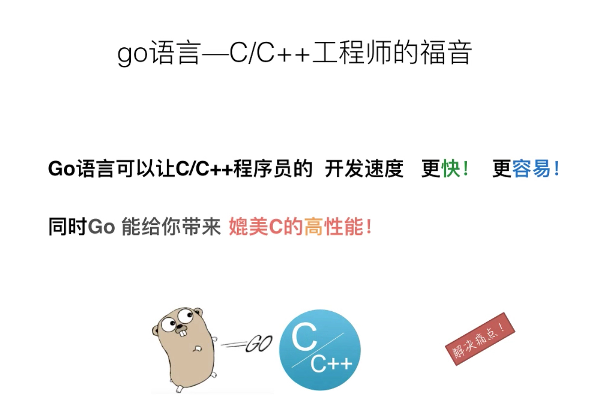
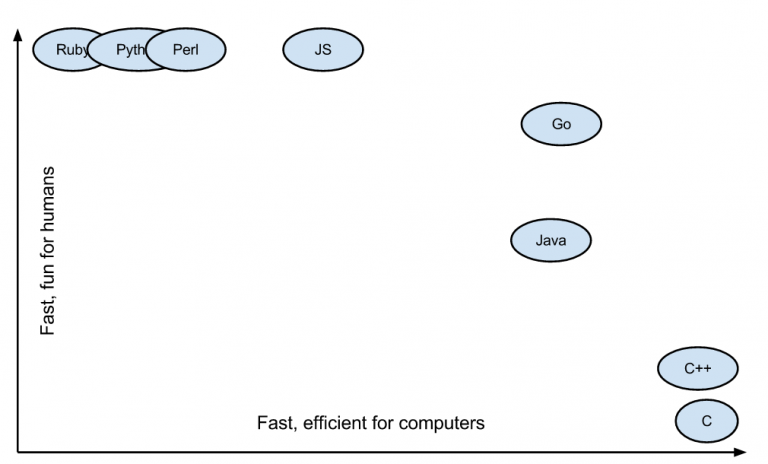
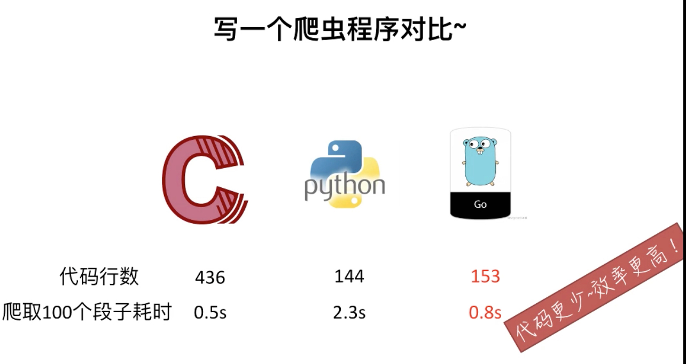
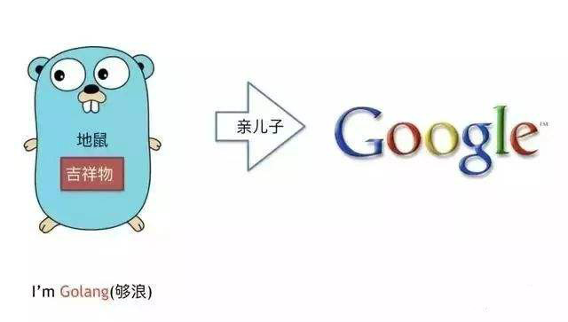
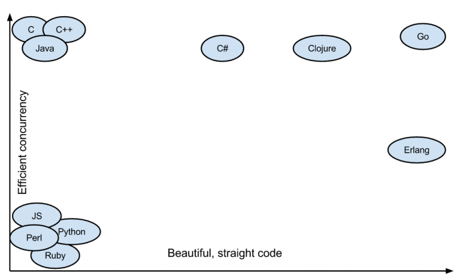
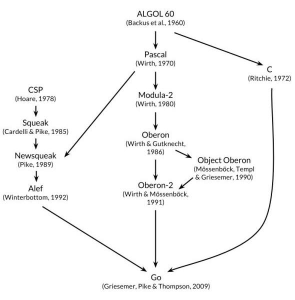

# Go语言和其他语言的对比

> @author：韩茹
> 版权所有：北京千锋互联科技有限公司

## 一、Go语言设计初衷

1、设计Go语言是为了解决当时Google开发遇到的问题：

- 大量的C++代码，同时又引入了Java和Python
- 成千上万的工程师
- 数以万计行的代码
- 分布式的编译系统
- 数百万的服务器

2、Google开发中的痛点：

- 编译慢
- 失控的依赖
- 每个工程师只是用了一个语言里面的一部分
- 程序难以维护（可读性差、文档不清晰等）
- 更新的花费越来越长
- 交叉编译困难

3、如何解决当前的问题和痛点？

- Go希望成为互联网时代的C语言。多数系统级语言（包括Java和C#）的根本编程哲学来源于C++，将C++的面向对象进一步发扬光大。但是Go语言的设计者却有不同的看法，他们认为值得学习的是C语言。C语言经久不衰的根源是它足够简单。因此，Go语言也是足够简单。

- 所以，他们当时设计Go的目标是为了消除各种缓慢和笨重、改进各种低效和扩展性。Go是由那些开发大型系统的人设计的，同时也是为了这些人服务的；它是为了解决工程上的问题，不是为了研究语言设计；它还是为了让我们的编程变得更舒适和方便。
- 但是结合Google当时内部的一些现实情况，如很多工程师都是C系的，所以新设计的语言一定要易学习，最好是类似C的语言；20年没有出新的语言了，所以新设计的语言必须是现代化的（例如内置GC）等情况。最后根据实战经验，他们向着目标设计了Go这个语言。

4、Go语言的特色：

- 没有继承多态的面向对象
- 强一致类型
- interface不需要显式声明(Duck Typing)
- 没有异常处理(Error is value)
- 基于首字母的可访问特性
- 不用的import或者变量引起编译错误
- 完整而卓越的标准库包
- Go内置runtime（作用是性能监控、垃圾回收等）

## 二、Go语言的优势

1、学习曲线容易

​    Go语言语法简单，包含了类C语法。因为Go语言容易学习，所以一个普通的大学生花几个星期就能写出来可以上手的、高性能的应用。在国内大家都追求快，这也是为什么国内Go流行的原因之一。

​    

> Go 语言的语法特性简直是太简单了，简单到你几乎玩不出什么花招，直来直去的，学习曲线很低，上手非常快。

2、效率：快速的编译时间，开发效率和运行效率高

​    开发过程中相较于 Java 和 C++呆滞的编译速度，Go 的快速编译时间是一个主要的效率优势。Go拥有接近C的运行效率和接近PHP的开发效率。

C 语言的理念是信任程序员，保持语言的小巧，不屏蔽底层且底层友好，关注语言的执行效率和性能。而 Python 的姿态是用尽量少的代码完成尽量多的事。于是我能够感觉到，Go 语言想要把 C 和 Python 统一起来，这是多棒的一件事啊。

3、出身名门、血统纯正

​    之所以说Go出身名门，从Go语言的创造者就可见端倪，Go语言绝对血统纯正。其次Go语言出自Google公司，Google在业界的知名度和实力自然不用多说。Google公司聚集了一批牛人，在各种编程语言称雄争霸的局面下推出新的编程语言，自然有它的战略考虑。而且从Go语言的发展态势来看，Google对它这个新的宠儿还是很看重的，Go自然有一个良好的发展前途。

4、自由高效：组合的思想、无侵入式的接口

​    Go语言可以说是开发效率和运行效率二者的完美融合，天生的并发编程支持。Go语言支持当前所有的编程范式，包括过程式编程、面向对象编程、面向接口编程、函数式编程。程序员们可以各取所需、自由组合、想怎么玩就怎么玩。

​    

5、强大的标准库

​    这包括互联网应用、系统编程和网络编程。Go里面的标准库基本上已经是非常稳定了，特别是我这里提到的三个，网络层、系统层的库非常实用。**Go 语言的 lib 库麻雀虽小五脏俱全。**Go 语言的 lib 库中基本上有绝大多数常用的库，虽然有些库还不是很好，但我觉得不是问题，因为我相信在未来的发展中会把这些问题解决掉。

6、部署方便：二进制文件，Copy部署

​    这一点是很多人选择Go的最大理由，因为部署太方便了，所以现在也有很多人用Go开发运维程序。

7、简单的并发

**并行和异步编程几乎无痛点。**Go 语言的 Goroutine 和 Channel 这两个神器简直就是并发和异步编程的巨大福音。像 C、C++、Java、Python 和 JavaScript 这些语言的并发和异步方式太控制就比较复杂了，而且容易出错，而 Go 解决这个问题非常地优雅和流畅。这对于编程多年受尽并发和异步折磨的编程者来说，完全就是让人眼前一亮的感觉。Go 是一种非常高效的语言，高度支持并发性。Go是为大数据、微服务、并发而生的一种编程语言。

- Go 作为一门语言致力于使事情简单化。它并未引入很多新概念，而是聚焦于打造一门简单的语言，它使用起来异常快速并且简单。其唯一的创新之处是 goroutines 和通道。Goroutines 是 Go 面向线程的轻量级方法，而通道是 goroutines 之间通信的优先方式。

- 创建 Goroutines 的成本很低，只需几千个字节的额外内存，正由于此，才使得同时运行数百个甚至数千个 goroutines 成为可能。可以借助通道实现 goroutines 之间的通信。Goroutines 以及基于通道的并发性方法使其非常容易使用所有可用的 CPU 内核，并处理并发的 IO。相较于 Python/Java，在一个 goroutine 上运行一个函数需要最小的代码。

8、稳定性

​    Go拥有强大的编译检查、严格的编码规范和完整的软件生命周期工具，具有很强的稳定性，稳定压倒一切。那么为什么Go相比于其他程序会更稳定呢？这是因为Go提供了软件生命周期（开发、测试、部署、维护等等）的各个环节的工具，如go tool、gofmt、go test。

## 三、对比其他语言

Go的很多语言特性借鉴与它的三个祖先：C，Pascal和CSP。Go的语法、数据类型、控制流等继承于C，Go的包、面对对象等思想来源于Pascal分支，而Go最大的语言特色，基于管道通信的协程并发模型，则借鉴于CSP分支。

### Java

编译语言，速度适中（2.67s），目前的大型网站都是拿java写的，比如淘宝、京东等。主要特点是稳定，开源性好，具有自己的一套编写规范，开发效率适中，目前最主流的语言。

> 作为编程语言中的大腕。具有最大的知名度和用户群。无论风起云涌，我自巍然不动。他强任他强，清风拂山岗；他横由他横，明月照大江。

### c#

执行速度快（4.28），学习难度适中，开发速度适中。但是由于c#存在很多缺点，京东、携程等大型网站前身都是用c#开发的，但是现在都迁移到了java上。

### C/C++

现存编程语言中的老祖，其他语言皆由此而生。执行速度最快无人能及。但是写起来最为复杂，开发难度大。

### Javascript

编程语言中特立独行的傲娇美女。前端处理能力是其它语言无法比拟。发展中的js后端处理能力也是卓越不凡。前后端通吃，舍我其谁？

### Python

脚本语言，速度最慢（258s），代码简洁、学习进度短，开发速度快。豆瓣就是拿python写的。Python著名的服务器框架有django，flask。但是python在大型项目上不太稳定，因此有些用python的企业后来迁移到了java上。

### scala

编译语言，比python快十倍，和java差不多，但是学习进度慢，而且在实际编程中，如果对语言不够精通，很容易造成性能严重下降。，后来比如Yammer就从scala迁移到了java上。微服务框架有lagom等。

### Go

编程界的小鲜肉。高并发能力无人能及。即具有像Python一样的简洁代码、开发速度，又具有C语言一样的执行效率，优势突出。

## 四、最后

因为Go的语法和Erlang、Python类似，所以我们将这三门语言做个详细的对比。

相比于Python的40个特性，Go只有31个，可以说Go在语言设计上是相当克制的。比如，它没有隐式的数值转换，没有构造函数和析构函数，没有运算符重载，没有默认参数，也没有继承，没有泛型，没有异常，没有宏，没有函数修饰，更没有线程局部存储。

但是Go的特点也很鲜明，比如，它拥有协程、自动垃圾回收、包管理系统、一等公民的函数、栈空间管理等。

Go作为静态类型语言，保证了Go在运行效率、内存用量、类型安全都要强于Python和Erlang。

Go的数据类型也更加丰富，除了支持表、字典等复杂的数据结构，还支持指针和接口类型，这是Python和Erlang所没有的。特别是接口类型特别强大，它提供了管理类型系统的手段。而指针类型提供了管理内存的手段，这让Go进入底层软件开发提供了强有力的支持。

Go在面对对象的特性支持上做了很多反思和取舍，它没有类、虚函数、继承、泛型等特性。Go语言中面向对象编程的核心是组合和方法(function)。组合很类似于C语言的struct结构体的组合方式，方法类似于Java的接口(Interface)，但是使用方法上与对象更加解耦，减少了对对象内部的侵入。Erlang则不支持面对对象编程范式，相比而言，Python对面对对象范式的支持最为全面。

在函数式编程的特性支持上，Erlang作为函数式语言，支持最为全面。但是基本的函数式语言特性，如lambda、高阶函数、curry等，三种语言都支持。

控制流的特性支持上，三种语言都差不多。Erlang支持尾递归优化，这给它在函数式编程上带来便利。而Go在通过动态扩展协程栈的方式来支持深度递归调用。Python则在深度递归调用上经常被爆栈。

Go和Erlang的并发模型都来源于CSP，但是Erlang是基于actor和消息传递（mailbox）的并发实现，Go是基于goroutine和管道（channel）的并发实现。不管Erlang的actor还是Go的goroutine，都满足协程的特点：由编程语言实现和调度，切换在用户态完成，创建销毁开销很小。至于Python，其多线程的切换和调度是基于操作系统实现，而且因为GIL的大坑级存在，无法真正做到并行。

而且从笔者的并发编程体验上看，Erlang的函数式编程语法风格和其OTP behavior框架提供的晦涩的回调（callback）使用方法，对大部分的程序员，如C/C++和Java出身的程序员来说，有一定的入门门槛和挑战。而被称为“互联网时代的C”的Go，其类C的语法和控制流，以及面对对象的编程范式，编程体验则好很多。

本文图片来自网络，侵删

千锋Go语言的学习群：784190273

对应视频地址：

https://www.bilibili.com/video/av47467197

https://www.bilibili.com/video/av56018934/

源代码：

https://github.com/rubyhan1314/go_foundation