# Go语言环境搭建

> @author：韩茹
> 版权所有：北京千锋互联科技有限公司

## 一、Golang语言的官网

首先我们登录Golang的官方网站：https://golang.org/

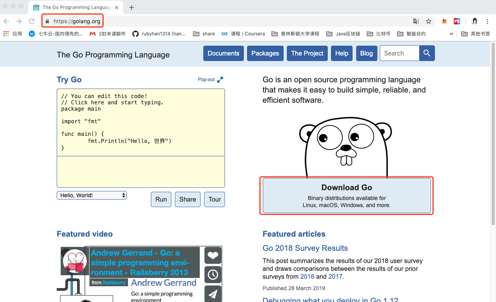


> 因为Google和中国的关系，直接登录Golang的官网，需要翻墙。


当然你也可以登录Golang的国内网站：<https://golang.google.cn/>

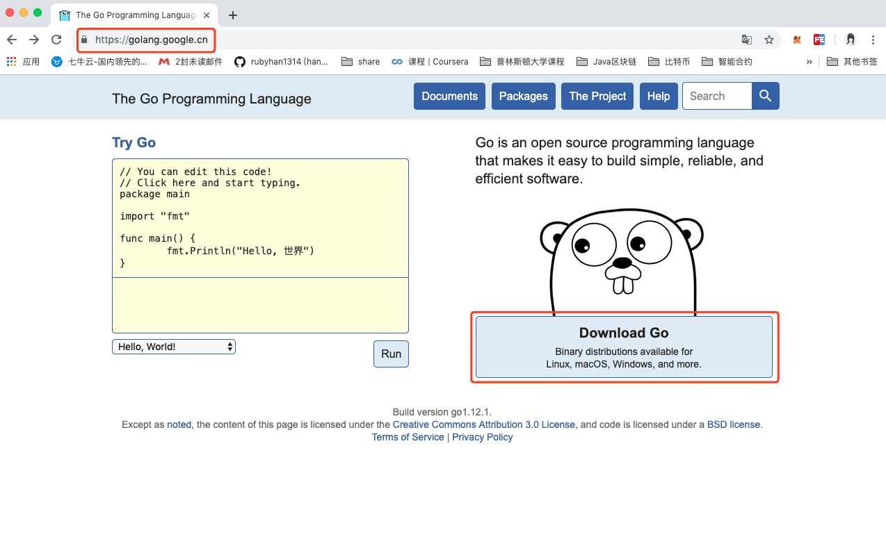

## 二、下载


在Mac、Windows和Linux三个平台上都支持Golang。您可以从<https://golang.org/dl/>下载相应平台的安装包。

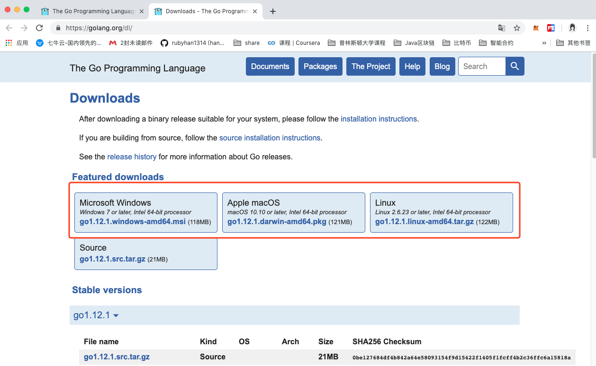


该网站在国内不容易访问，所以可以访问中国对应的<https://golang.google.cn/dl/>或者是Go语言中文网

<https://www.studygolang.com/dl> 进行安装软件的下载。

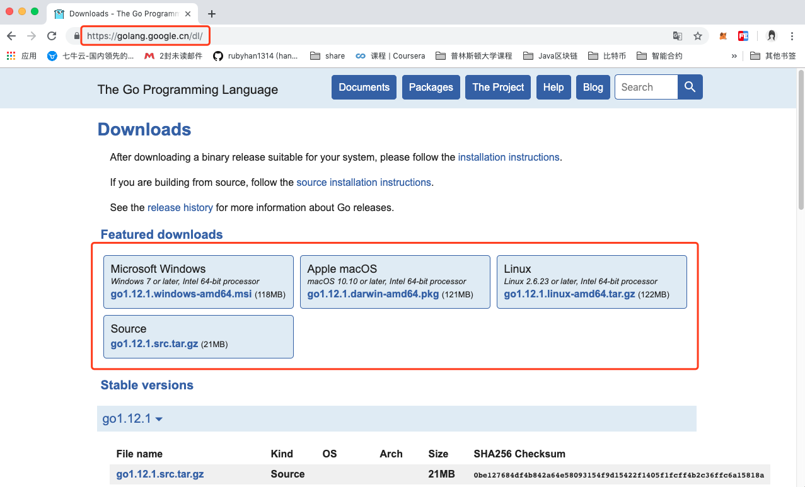


和

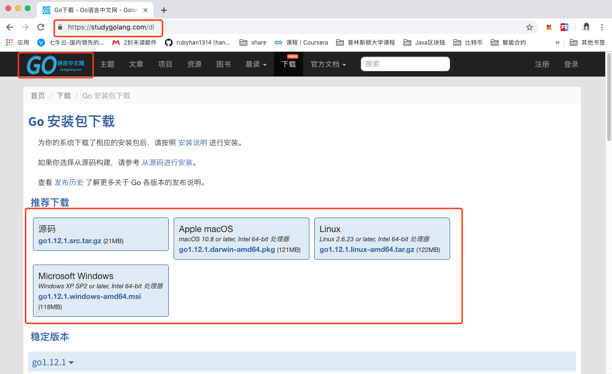


目前最新的版本，是今年2月份发布的Go1.12。


Mac OS
从https://golang.org/dl/下载osx安装程序。双击启动安装。按照提示，这应该在/usr/local/go中安装了Golang，并且还会将文件夹/usr/local/go/bin添加到您的PATH环境变量中。

Windows
从https://golang.org/dl/下载MSI安装程序。双击启动安装并遵循提示。这将在位置c中安装Golang:\Go，并且还将添加目录c:\Go\bin到您的path环境变量。

Linux
从https://golang.org/dl/下载tar文件，并将其解压到/usr/local。将/usr/local/go/bin添加到PATH环境变量中。这应该安装在linux中。


```
开发工具包又分为安装版和压缩版。安装版是Mac和Windows特有的，他们的名字类似于：

- go1.12.1.darwin-amd64.pkg
- go1.12.1.windows-386.msi
- go1.12.1.windows-amd64.msi

安装版，顾名思义，双击打开会出现安装向导，让你选择安装的路径，帮你设置好环境比安康等信息，比较省事方便一些。

压缩版的就是一个压缩文件，可以解压得到里面的内容，他们的名字类似于：

- go1.12.1.darwin-amd64.tar.gz
- go1.12.1.linux-386.tar.gz
- go1.12.1.linux-amd64.tar.gz
- go1.12.1.windows-386.zip
- go1.12.1.windows-amd64.zip

压缩版我们下载后需要解压，然后自己移动到要存放的路径下，并且配置环境变量等信息，相比安装版来说，比较复杂一些，手动配置的比较多。

```


## 三、安装和配置环境变量

### 3.1 Linux系统安装和配置

Linux系统，我们以Ubuntu为例。

**第一步：下载安装**

到go的官网上下载go的安装包，自动下载到了下载目录。

打开终端，进入到下载目录，查看安装包：

```shell
ruby@hanru:~$ cd 下载
ruby@hanru:~/下载$ ls
```

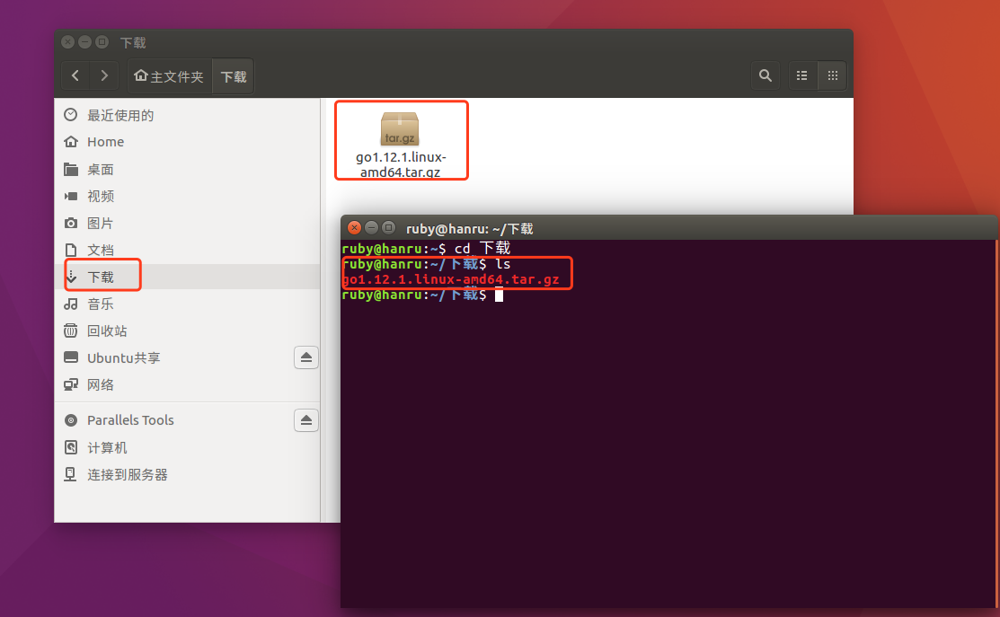


然后我们需要将压缩包解压，并拷贝到指定的目录下，所以在终端继续执行以下命令：

```shell
ruby@ubuntu:~/下载$ sudo tar -xzf go1.12.1.linux-amd64.tar.gz -C /usr/local
```

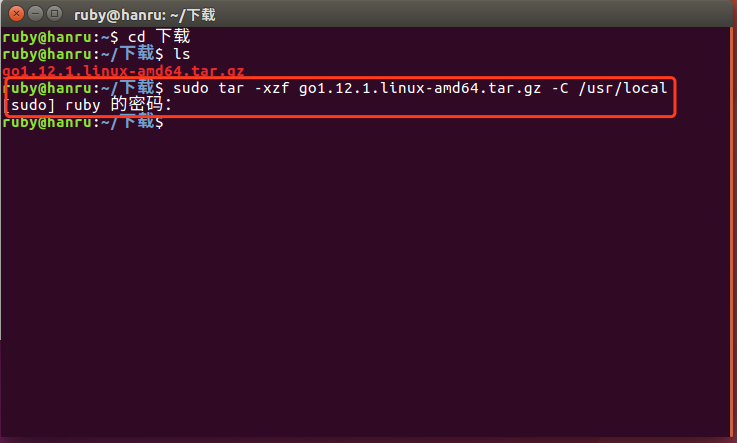


> 输入sudo，表示使用管理员身份执行命令，需要输入密码

此时，就将从go官网https://golang.org/dl/上下载tar文件，解压到/usr/local目录下，该目录下会有一个go文件夹。

可以进入这个文件夹直接查看：

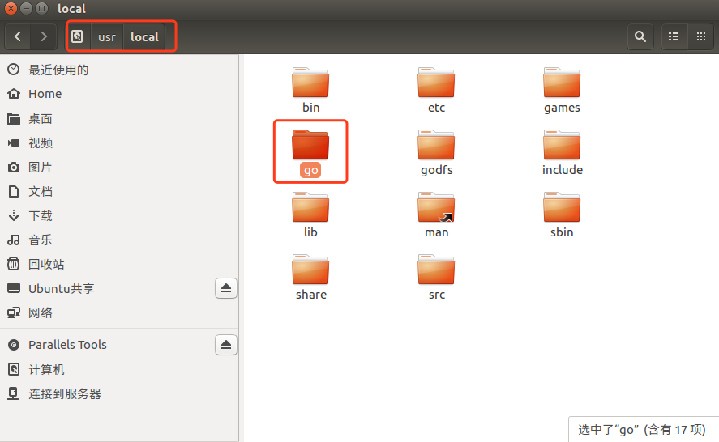


也可以通过终端命令进行查看，输入以下命令：

```shell
ruby@hanru:~/下载$ cd /usr/local
ruby@hanru:/usr/local$ ls
```

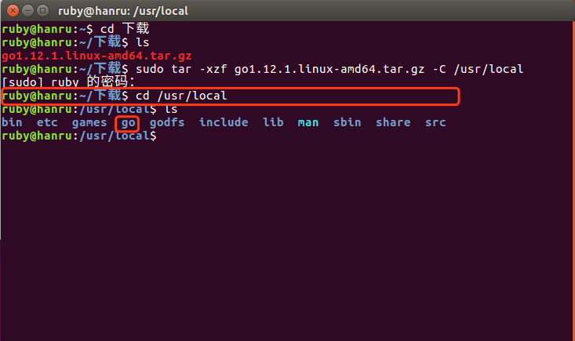


**第二步：配置环境变量**	

一：需要先安装vim。

直接在终端执行以下命令：

```shell
ruby@ubuntu:~$ sudo apt-get install vim
```

二：编辑$HOME/.profile文件

**A：先配置GOROOT，就是go的安装目录**

```shell
export GOROOT="/usr/local/go"
```


**B：然后配置GOPATH**

Gopath就是Go项目代码存放的位置。这个是我们自己定义的目录。就好比是其他IDE的Workspace。

​	对于Ubuntu系统，默认使用Home/go目录作为gopath。

​		该目录下有3个子目录：src，pkg，bin

> GO代码必须在工作空间内。工作空间是一个目录，其中包含三个子目录：
>
> ​	src ---- 里面每一个子目录，就是一个包。包内是Go的源码文件
>
> ​	pkg ---- 编译后生成的，包的目标文件
>
> ​	bin ---- 生成的可执行文件。


```shell
export GOPATH=$HOME/go
```


**C：GOBIN**

```shell
export GOBIN=$GOROOT/bin
```


**D：添加到PATH中**

我们需要将GOBIN添加到环境变量PATH中。可以通过vi直接将下面内容添加到$HOME/.profile中

```shell
export PATH=$PATH:$GOBIN
```


> 当然，你也可以将GO的bin目录直接配置到PATH中：
>
> ```shell
> export PATH=$GOROOT/bin:$PATH
> ```
> 
>相当于将上面的C和D步骤，写在一起


具体操作：


 1. 首先使用ls -a命令，查看home目录下是否有.profile文件。(以.开头的文件都是隐藏文件，使用-a命令查看)
2. 直接在终端中输入：vi $HOME/.profile
3. 输入i，切片到编辑模式，将以上内容复制到文件中，并保存退出。
>
> ​	点击esc键后，
>
> ​	:q!，强制退出不保存
>
> ​	:wq，保存并退出	


三：让配置文件立刻生效

使用source命令让配置文件生效

```shell
ruby@ubuntu:~$ source $HOME/.profile
```

四：测试安装

版本检测

```shell
ruby@ubuntu:~$ go version
```

检查go的配置信息

```shell
ruby@ubuntu:~$ go env
```


额外扩展：

```
vi命令后文件的保存

Linux中vi的英文全称为Visual Interface。

末行模式下执行以下操作。[命令模式下按下:就切换到末行模式下]
w
保存文件不退出vi

w file
文件另存到file中，不退出vi

w!
强制保存，不退出vi

wq
保持文件并退出

wq!
强制保存文件并退出

q
不保存文件退出vi

q!
不保存文件强制退出vi

e!
放弃所有修改，从上次保持的文件处在编辑
```


### 3.2 mac系统安装并配置

Mac分为压缩版和安装版，他们都是64位的。压缩版和Linux的大同小异，因为Mac和Linux都是基于Unix，终端这一块基本上是相同的。

**A：安装**

找到下载后的pkg安装包：一般情况下，下载后的文件都在下载目录下。

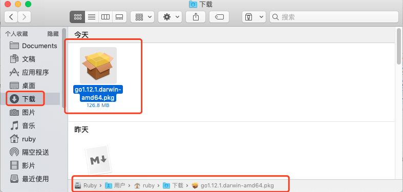


双击pkg包，顺着指引，即可安装成功。 


在命令行输入 go version，获取到go的版本号，则代表安装成功。

**配置环境变量**

1、打开终端输入cd ~进入用户主目录; 
2、输入ls -all命令查看是否存在.bash_profile; 
3、存在既使用vim .bash_profile 打开文件; 
4、输入 i 进入vim编辑模式； 
5、输入下面代码： 

```shell
export GOROOT=/usr/local/go
export GOPATH=/Users/ruby/go
export GOBIN=$GOROOT/bin
export PATH=$PATH:$GOBIN
```

其中 GOPATH: 日常开发的根目录。GOBIN:是GOPATH下的bin目录。

6、点击ESC，并输入 :wq 保存并退出编辑。可输入vim .bash_profile 查看是否保存成功。

7、输入source ~/.bash_profile 完成对golang环境变量的配置，配置成功没有提示。 
8、输入go env 查看配置结果。


### 3.3 Windows

**A、安装**

安装步骤就不在多说什么了，一路下一步到底

**B、配置环境变量**

注意：如果是msi安装文件，Go语言的环境变量会自动设置好。

我的电脑——右键“属性”——“高级系统设置”——“环境变量”——“系统变量”

​	假设GO安装于C盘根目录

**新建：**

- GOROOT：Go安装路径（例：C:\Go）

- GOPATH：Go工程的路径（例：E:\go）。如果有多个，就以分号分隔添加

  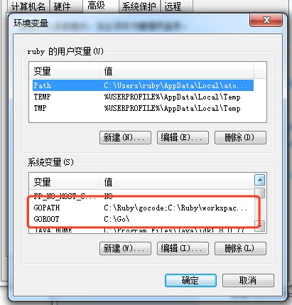

**修改：**

- Path：在path中增加：C:\Go\bin;%GOPATH%\bin;

  > 需要把GOPATH中的可执行目录也配置到环境变量中, 否则你自行下载的第三方go工具就无法使用了

  

  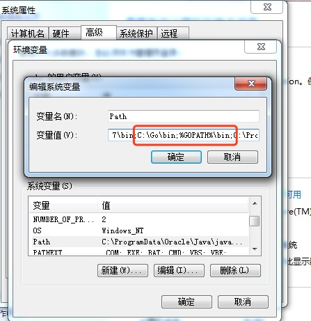

  

> 1. 工作目录就是我们用来存放开发的源代码的地方，对应的也是Go里的GOPATH这个环境变量。这个环境变量指定之后，我们编译源代码等生成的文件都会放到这个目录下，GOPATH环境变量的配置参考上面的安装Go，配置到Windows下的系统变量里。
> 2. GOPATH之下主要包含三个目录: bin、pkg、src。bin目录主要存放可执行文件; pkg目录存放编译好的库文件, 主要是*.a文件; src目录下主要存放go的源文件


**C、查看是否安装配置成功**

使用快捷键win+R键，输入cmd，打开命令行提示符，在命令行中输入

```go
go env  # 查看得到go的配置信息
go version  # 查看go的版本号
```


千锋Go语言的学习群：784190273

对应视频地址：

https://www.bilibili.com/video/av56018934

https://www.bilibili.com/video/av47467197

源代码：

https://github.com/rubyhan1314/go_foundation