# Go的执行原理以及Go的命令

> @author：韩茹
> 版权所有：北京千锋互联科技有限公司

## 一、Go的源码文件

 Go 的源码文件分类：

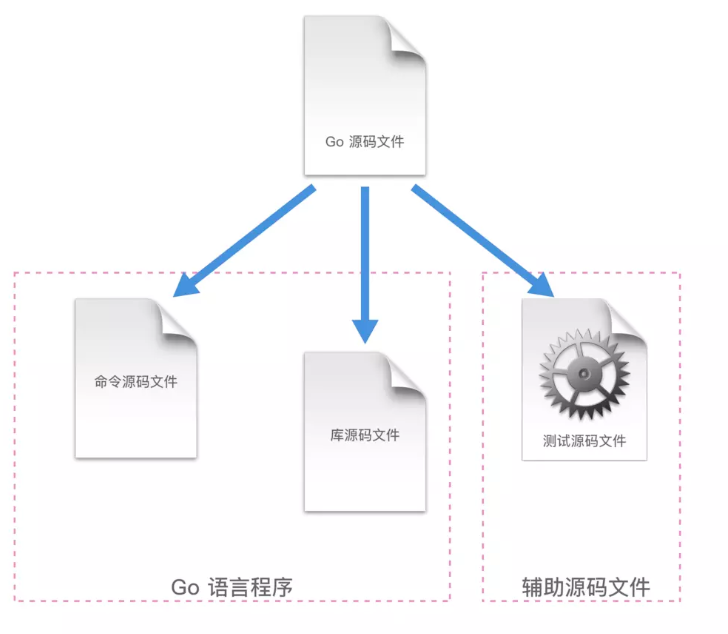

如上图，分为三类：

**1、命令源码文件：**

声明自己属于 main 代码包、包含无参数声明和结果声明的 main 函数。

命令源码文件被安装以后，GOPATH 如果只有一个工作区，那么相应的可执行文件会被存放当前工作区的 bin 文件夹下；如果有多个工作区，就会安装到 GOBIN 指向的目录下。

命令源码文件是 Go 程序的入口。

同一个代码包中最好也不要放多个命令源码文件。多个命令源码文件虽然可以分开单独 go run 运行起来，但是无法通过 go build 和 go install。


我们先打开上次课的hello目录，然后复制helloworld.go为helloworld2.go文件，并修改里面的内容：

```go
package main
import "fmt"
func main(){
	fmt.Println("我是第二个helloworld文件")
	fmt.Print("Go Go Go !!!")
}
```

hello目录下有两个go文件了，一个是helloworld.go，一个是helloworld2.go。先说明一下，在上述文件夹中放了两个命令源码文件，同时都声明自己属于 main 代码包。

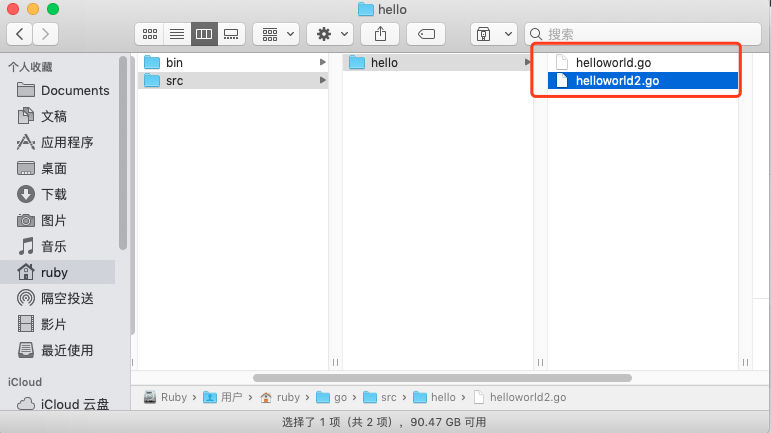

打开终端，进入hello这个目录，也可以看到这两个文件：

```shell
localhost:~ ruby cd go/src/hello
localhost:hello ruby ls
helloworld.go	helloworld2.go
```

然后我们分别执行go run命令，可以看到两个go文件都可以被执行：

```shell
localhost:hello ruby$ go run helloworld.go
HelloWorld
Go Go Go !!!localhost:hello ruby$ go run helloworld2.go
我是第二个helloworld文件
Go Go Go !!!
```

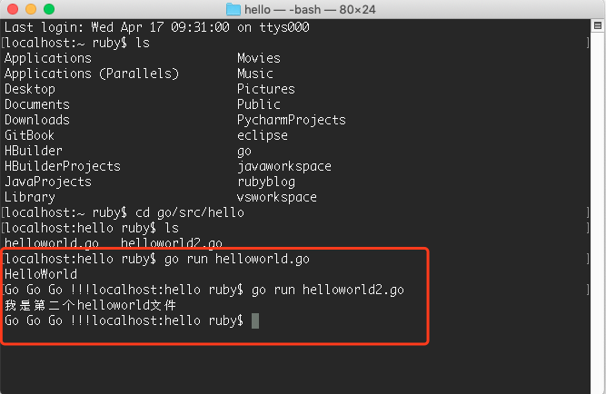


接下来执行 go build 和 go install ，看看会发生什么：

```shell
localhost:hello ruby$ go build 
# hello
./helloworld2.go:3:6: main redeclared in this block
	previous declaration at ./helloworld.go:3:6
localhost:hello ruby$ go install
# hello
./helloworld2.go:3:6: main redeclared in this block
	previous declaration at ./helloworld.go:3:6
localhost:hello ruby$ 
```

运行效果图：

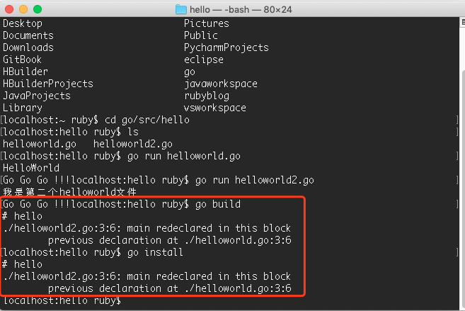


这也就证明了多个命令源码文件虽然可以分开单独 go run 运行起来，但是无法通过 go build 和 go install。

同理，如果命令源码文件和库源码文件也会出现这样的问题，库源码文件不能通过 go build 和 go install 这种常规的方法编译和安装。具体例子和上述类似，这里就不再贴代码了。

所以命令源码文件应该是被单独放在一个代码包中。

**2、库源码文件**

库源码文件就是不具备命令源码文件上述两个特征的源码文件。存在于某个代码包中的普通的源码文件。

库源码文件被安装后，相应的归档文件（.a 文件）会被存放到当前工作区的 pkg 的平台相关目录下。


**3、测试源码文件**

名称以 _test.go 为后缀的代码文件，并且必须包含 Test 或者 Benchmark 名称前缀的函数：

```go
func TestXXX( t *testing.T) {

}
```

名称以 Test 为名称前缀的函数，只能接受 *testing.T 的参数，这种测试函数是功能测试函数。

```go
func BenchmarkXXX( b *testing.B) {

}

```

名称以 Benchmark 为名称前缀的函数，只能接受 *testing.B 的参数，这种测试函数是性能测试函数。

现在答案就很明显了：

命令源码文件是可以单独运行的。可以使用 go run 命令直接运行，也可以通过 go build 或 go install 命令得到相应的可执行文件。所以命令源码文件是可以在机器的任何目录下运行的。

举个栗子：

比如平时我们在 LeetCode 上刷算法题，这时候写的就是一个程序，这就是命令源码文件，可以在电脑的任意一个文件夹新建一个 go 文件就可以开始刷题了，写完就可以运行，对比执行结果，答案对了就可以提交代码。

但是公司项目里面的代码就不能这样了，只能存放在 GOPATH 目录下。因为公司项目不可能只有命令源码文件的，肯定是包含库源码文件，甚至包含测试源码文件的。


## 二、Go的命令

目前Go的最新版1.12里面基本命令有以下17个。

我们可以打开终端输入：go help即可看到Go的这些命令以及简介。

```shell
	bug         start a bug report
	build       compile packages and dependencies
	clean       remove object files and cached files
	doc         show documentation for package or symbol
	env         print Go environment information
	fix         update packages to use new APIs
	fmt         gofmt (reformat) package sources
	generate    generate Go files by processing source
	get         download and install packages and dependencies
	install     compile and install packages and dependencies
	list        list packages or modules
	mod         module maintenance
	run         compile and run Go program
	test        test packages
	tool        run specified go tool
	version     print Go version
	vet         report likely mistakes in packages
```


其中和编译相关的有build、get、install、run这4个。接下来就依次看看这四个的作用。

在详细分析这4个命令之前，先罗列一下通用的命令标记，以下这些命令都可适用的：

| 名称  | 说明                                                         |
| ----- | ------------------------------------------------------------ |
| -a    | 用于强制重新编译所有涉及的 Go 语言代码包（包括 Go 语言标准库中的代码包），即使它们已经是最新的了。该标记可以让我们有机会通过改动底层的代码包做一些实验。 |
| -n    | 使命令仅打印其执行过程中用到的所有命令，而不去真正执行它们。如果不只想查看或者验证命令的执行过程，而不想改变任何东西，使用它正好合适。 |
| -race | 用于检测并报告指定 Go 语言程序中存在的数据竞争问题。当用 Go 语言编写并发程序的时候，这是很重要的检测手段之一。 |
| -v    | 用于打印命令执行过程中涉及的代码包。这一定包括我们指定的目标代码包，并且有时还会包括该代码包直接或间接依赖的那些代码包。这会让你知道哪些代码包被执行过了。 |
| -work | 用于打印命令执行时生成和使用的临时工作目录的名字，且命令执行完成后不删除它。这个目录下的文件可能会对你有用，也可以从侧面了解命令的执行过程。如果不添加此标记，那么临时工作目录会在命令执行完毕前删除。 |
| -x    | 使命令打印其执行过程中用到的所有命令，并同时执行它们。       |

### 1. go run

专门用来运行命令源码文件的命令，**注意，这个命令不是用来运行所有 Go 的源码文件的！**

go run 命令只能接受一个命令源码文件以及若干个库源码文件（必须同属于 main 包）作为文件参数，且**不能接受测试源码文件**。它在执行时会检查源码文件的类型。如果参数中有多个或者没有命令源码文件，那么 go run 命令就只会打印错误提示信息并退出，而不会继续执行。

这个命令具体干了些什么事情呢？来分析分析，我们先重新创建一个新文件：mytest.go，并加入以下代码：

```go
package main
import "fmt"
func main(){
	fmt.Println("HelloWorld")
	fmt.Println("你好，Go!!!")
}
```


执行go run 配合-n：

```shell
localhost:hello ruby$ go run -n mytest.go 

#
# command-line-arguments
#

mkdir -p $WORK/b001/
cat >$WORK/b001/importcfg << 'EOF' # internal
# import config
packagefile fmt=/usr/local/go/pkg/darwin_amd64/fmt.a
packagefile runtime=/usr/local/go/pkg/darwin_amd64/runtime.a
EOF
cd /Users/ruby/go/src/hello
/usr/local/go/pkg/tool/darwin_amd64/compile -o $WORK/b001/_pkg_.a -trimpath $WORK/b001 -p main -complete -buildid ieg41NOobNF0eqq3xgnP/ieg41NOobNF0eqq3xgnP -dwarf=false -goversion go1.12.1 -D _/Users/ruby/go/src/hello -importcfg $WORK/b001/importcfg -pack -c=4 ./mytest.go
/usr/local/go/pkg/tool/darwin_amd64/buildid -w $WORK/b001/_pkg_.a # internal
cat >$WORK/b001/importcfg.link << 'EOF' # internal
... # 此处省略
EOF
mkdir -p $WORK/b001/exe/
cd .
/usr/local/go/pkg/tool/darwin_amd64/link -o $WORK/b001/exe/mytest -importcfg $WORK/b001/importcfg.link -s -w -buildmode=exe -buildid=vpgT856LhbZPXp6WeHib/ieg41NOobNF0eqq3xgnP/ieg41NOobNF0eqq3xgnP/vpgT856LhbZPXp6WeHib -extld=clang $WORK/b001/_pkg_.a
$WORK/b001/exe/mytest
localhost:hello ruby$ 

```

运行效果图：

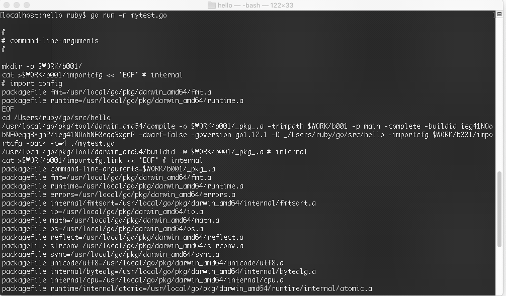


这里可以看到创建了两个临时文件夹 b001 和 exe，先执行了 compile 命令，然后 link，生成了归档文件.a 和 最终可执行文件，最终的可执行文件放在 exe 文件夹里面。命令的最后一步就是执行了可执行文件。

总结一下如下图：


举个例子，生成的临时文件可以用`go run -work`看到，比如当前生成的临时文件夹是如下的路径：

```shell
localhost:hello ruby$ go run -work mytest.go 
WORK=/var/folders/kt/nlhsnpgn6lgd_q16f8j83sbh0000gn/T/go-build593750496
HelloWorld
你好，Go!!!
localhost:hello ruby$ 
```

我们进入：`/var/folders/kt/nlhsnpgn6lgd_q16f8j83sbh0000gn/T/go-build593750496`目录，可以看到如下目录结构：

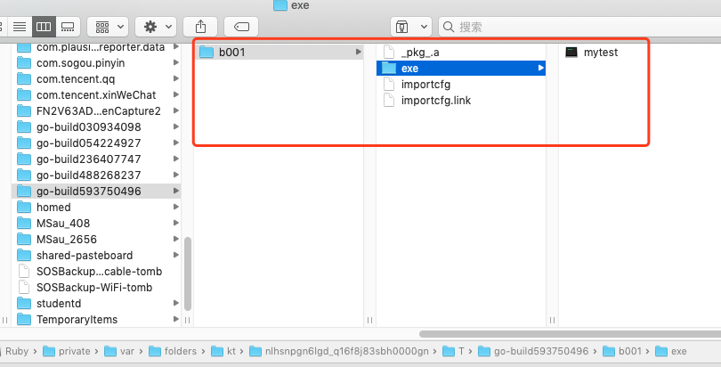


可以看到，最终`go run`命令是生成了2个文件，一个是归档文件，一个是可执行文件。

go run 命令在第二次执行的时候，如果发现导入的代码包没有发生变化，那么 go run 不会再次编译这个导入的代码包。直接静态链接进来。

```shell
localhost:hello ruby$ go run -n mytest.go 
mkdir -p $WORK/b001/
cat >$WORK/b001/importcfg.link << 'EOF' # internal
packagefile command-line-arguments=/Users/ruby/Library/Caches/go-build/6b/6b9577027c8da20b0ae6da790267f558b3b71eea1feb44039fb933b35eaef6f9-d
packagefile fmt=/usr/local/go/pkg/darwin_amd64/fmt.a
...
EOF
mkdir -p $WORK/b001/exe/
cd .
/usr/local/go/pkg/tool/darwin_amd64/link -o $WORK/b001/exe/mytest -importcfg $WORK/b001/importcfg.link -s -w -buildmode=exe -buildid=goiqf_1cemqljgOYzSRA/ieg41NOobNF0eqq3xgnP/MVbHdxOky1BGK6Aq_4bM/goiqf_1cemqljgOYzSRA -extld=clang /Users/ruby/Library/Caches/go-build/6b/6b9577027c8da20b0ae6da790267f558b3b71eea1feb44039fb933b35eaef6f9-d
$WORK/b001/exe/mytest
localhost:hello ruby$ 

```


### 2. go build

go build 命令主要是用于测试编译。在包的编译过程中，若有必要，会同时编译与之相关联的包。

1. 如果是普通包，当你执行go build命令后，不会产生任何文件。
2. 如果是main包，当只执行go build命令后，会在当前目录下生成一个可执行文件。如果需要在$GOPATH/bin目录下生成相应的exe文件，需要执行go install 或者使用 go build -o 路径/可执行文件。
3. 如果某个文件夹下有多个文件，而你只想编译其中某一个文件，可以在 go build 之后加上文件名，例如 go build a.go；go build 命令默认会编译当前目录下的所有go文件。
4. 你也可以指定编译输出的文件名。比如，我们可以指定go build -o 可执行文件名，默认情况是你的package名(非main包)，或者是第一个源文件的文件名(main包)。
5. go build 会忽略目录下以”_”或者”.”开头的go文件。
6. 如果你的源代码针对不同的操作系统需要不同的处理，那么你可以根据不同的操作系统后缀来命名文件。


当代码包中有且仅有一个命令源码文件的时候，在文件夹所在目录中执行 go build 命令，会在该目录下生成一个与目录同名的可执行文件。

```shell
// 假设当前文件夹名叫 hello
localhost:hello ruby$ pwd
/Users/ruby/go/src/hello
localhost:hello ruby$ ls
helloworld.go
localhost:hello ruby$ go build
localhost:hello ruby$ ls
hello		helloworld.go
localhost:hello ruby$ 
```


于是在当前目录直接生成了以当前文件夹为名的可执行文件（ 在 Mac 平台下是 Unix executable 文件，在 Windows 平台下是 exe 文件）

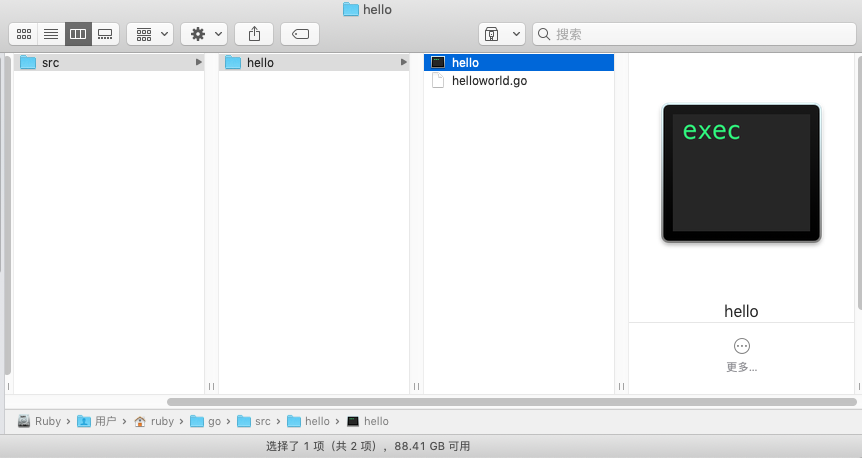


但是这种情况下，如果使用 go install 命令，如果 GOPATH 里面只有一个工作区，就会在当前工作区的 bin 目录下生成相应的可执行文件。如果 GOPATH 下有多个工作区，则是在 GOBIN 下生成对应的可执行文件。

```shell
localhost:hello ruby$ go install
go install hello: open /usr/local/go/bin/hello: permission denied
localhost:hello ruby$ 
```


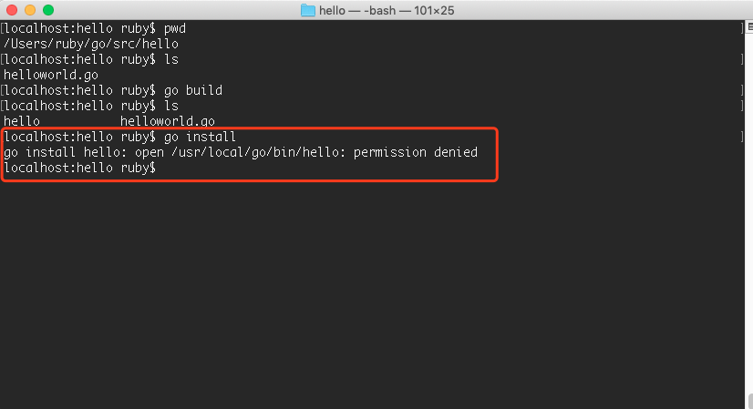


> 这个问题是因为它需要创建bin目录，然后把可刚才的可执行文件放进去，而目前我们在gopath下还没有bin目录，那么就需要先创建这个文件，而普通用户没有直接创建文件夹的权限，这个和Go语言的命令是没有关系的。我们可以加上sodu 来执行这个命令，表示使用管理员的身份执行，然后输入密码，那么就可以创建bin这个文件夹了。


再次执行：

```shell
localhost:hello ruby$ sudo go install
Password:
localhost:hello ruby$ 

```

执行完 go install 会发现可执行文件不见了！去哪里了呢？其实是被移动到了 bin 目录下了（如果 GOPATH 下有多个工作区，就会放在GOBIN 目录下）。

查看目录：

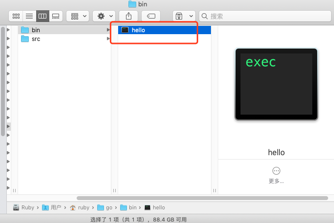


那 go build 和 go install 究竟干了些什么呢？

先来说说 go build。go build 用于编译我们指定的源码文件或代码包以及它们的依赖包。但是**注意如果用来编译非命令源码文件，即库源码文件，go build 执行完是不会产生任何结果的。这种情况下，go build 命令只是检查库源码文件的有效性，只会做检查性的编译，而不会输出任何结果文件。**

go build 编译命令源码文件，则会在该命令的执行目录中生成一个可执行文件，上面的例子也印证了这个过程。

go build 后面不追加目录路径的话，它就把当前目录作为代码包并进行编译。go build 命令后面如果跟了代码包导入路径作为参数，那么该代码包及其依赖都会被编译。

go build 命令究竟做了些什么呢？我们可以执行-n这个命令来查看：

```shell
localhost:hello ruby$ go build -n

#
# hello
#

mkdir -p $WORK/b001/
cat >$WORK/b001/importcfg << 'EOF' # internal
# import config
packagefile fmt=/usr/local/go/pkg/darwin_amd64/fmt.a
packagefile runtime=/usr/local/go/pkg/darwin_amd64/runtime.a
EOF
cd /Users/ruby/go/src/hello
/usr/local/go/pkg/tool/darwin_amd64/compile -o $WORK/b001/_pkg_.a -trimpath $WORK/b001 -p main -complete -buildid PXDetO1R1NhLFMK5QGUc/PXDetO1R1NhLFMK5QGUc -goversion go1.12.1 -D "" -importcfg $WORK/b001/importcfg -pack -c=4 ./helloworld.go
/usr/local/go/pkg/tool/darwin_amd64/buildid -w $WORK/b001/_pkg_.a # internal
cat >$WORK/b001/importcfg.link << 'EOF' # internal
packagefile hello=$WORK/b001/_pkg_.a
...
EOF
mkdir -p $WORK/b001/exe/
cd .
/usr/local/go/pkg/tool/darwin_amd64/link -o $WORK/b001/exe/a.out -importcfg $WORK/b001/importcfg.link -buildmode=exe -buildid=diTh1q6kcbGRIX3aj3mU/PXDetO1R1NhLFMK5QGUc/PXDetO1R1NhLFMK5QGUc/diTh1q6kcbGRIX3aj3mU -extld=clang $WORK/b001/_pkg_.a
/usr/local/go/pkg/tool/darwin_amd64/buildid -w $WORK/b001/exe/a.out # internal
mv $WORK/b001/exe/a.out hello
localhost:hello ruby$ 

```

可以看到，执行过程和 go run 大体相同，唯一不同的就是在最后一步，go run 是执行了可执行文件，但是 go build 命令，只是把库源码文件编译了一遍，然后把可执行文件移动到了当前目录的文件夹中。

总结一下如下图：


最后：


### 3. go install

go install 命令是用来编译并安装代码包或者源码文件的。

go install 命令在内部实际上分成了两步操作：第一步是生成结果文件(可执行文件或者.a包)，第二步会把编译好的结果移到` $GOPATH/pkg `或者​`$GOPATH/bin`。

可执行文件： 一般是 go install 带main函数的go文件产生的，有函数入口，所有可以直接运行。

.a应用包： 一般是 go install 不包含main函数的go文件产生的，没有函数入口，只能被调用。

go install 用于编译并安装指定的代码包及它们的依赖包。当指定的代码包的依赖包还没有被编译和安装时，该命令会先去处理依赖包。与 go build 命令一样，传给 go install 命令的代码包参数应该以导入路径的形式提供。并且，go build 命令的绝大多数标记也都可以用于
实际上，go install 命令只比 go build 命令多做了一件事，即：安装编译后的结果文件到指定目录。

安装代码包会在当前工作区的 pkg 的平台相关目录下生成归档文件（即 .a 文件）。
安装命令源码文件会在当前工作区的 bin 目录（如果 GOPATH 下有多个工作区，就会放在 GOBIN 目录下）生成可执行文件。

同样，go install 命令如果后面不追加任何参数，它会把当前目录作为代码包并安装。这和 go build 命令是完全一样的。

go install 命令后面如果跟了代码包导入路径作为参数，那么该代码包及其依赖都会被安装。

go install 命令后面如果跟了命令源码文件以及相关库源码文件作为参数的话，只有这些文件会被编译并安装。

go install 命令究竟做了些什么呢？

```shell
localhost:hello ruby$ go install -n

#
# hello
#

mkdir -p $WORK/b001/
cat >$WORK/b001/importcfg << 'EOF' # internal
# import config
packagefile fmt=/usr/local/go/pkg/darwin_amd64/fmt.a
packagefile runtime=/usr/local/go/pkg/darwin_amd64/runtime.a
EOF
cd /Users/ruby/go/src/hello
/usr/local/go/pkg/tool/darwin_amd64/compile -o $WORK/b001/_pkg_.a -trimpath $WORK/b001 -p main -complete -buildid E1CTs4eXkD5M28s_FQXT/E1CTs4eXkD5M28s_FQXT -goversion go1.12.1 -D "" -importcfg $WORK/b001/importcfg -pack -c=4 ./helloworld.go
/usr/local/go/pkg/tool/darwin_amd64/buildid -w $WORK/b001/_pkg_.a # internal
cat >$WORK/b001/importcfg.link << 'EOF' # internal
packagefile hello=$WORK/b001/_pkg_.a
packagefile fmt=/usr/local/go/pkg/darwin_amd64/fmt.a
...
EOF
mkdir -p $WORK/b001/exe/
cd .
/usr/local/go/pkg/tool/darwin_amd64/link -o $WORK/b001/exe/a.out -importcfg $WORK/b001/importcfg.link -buildmode=exe -buildid=FJ6kJTmN9rcWcwLhqfiQ/E1CTs4eXkD5M28s_FQXT/E1CTs4eXkD5M28s_FQXT/FJ6kJTmN9rcWcwLhqfiQ -extld=clang $WORK/b001/_pkg_.a
/usr/local/go/pkg/tool/darwin_amd64/buildid -w $WORK/b001/exe/a.out # internal
mkdir -p /usr/local/go/bin/
mv $WORK/b001/exe/a.out /usr/local/go/bin/hello
localhost:hello ruby$ 

```

前面几步依旧和 go run 、go build 完全一致，只是最后一步的差别，go install 会把命令源码文件安装到当前工作区的 bin 目录（如果 GOPATH 下有多个工作区，就会放在 GOBIN 目录下）。如果是库源码文件，就会被安装到当前工作区的 pkg 的平台相关目录下。


总结一下如下图：

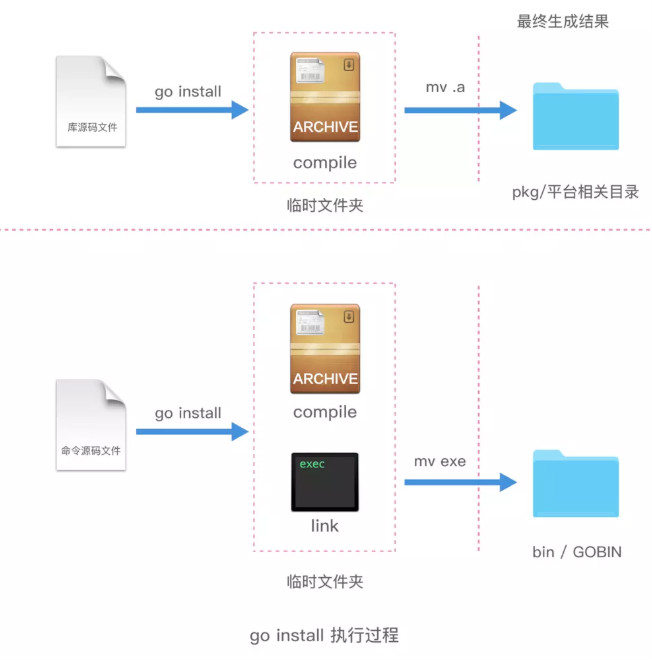


在安装多个库源码文件时有可能遇到如下的问题：

```shell
localhost:hello ruby$  go install envir.go fpath.go ipath.go pnode.go util.go
go install: no install location for .go files listed on command line (GOBIN not set)
```

而且，在我们为环境变量 GOBIN 设置了正确的值之后，这个错误提示信息仍然会出现。这是因为，只有在安装命令源码文件的时候，命令程序才会将环境变量 GOBIN 的值作为结果文件的存放目录。而在安装库源码文件时，在命令程序内部的代表结果文件存放目录路径的那个变量不会被赋值。最后，命令程序会发现它依然是个无效的空值。所以，命令程序会同样返回一个关于“无安装位置”的错误。这就引出一个结论，我们只能使用安装代码包的方式来安装库源码文件，而不能在 go install 命令罗列并安装它们。另外，go install 命令目前无法接受标记`-o`以自定义结果文件的存放位置。这也从侧面说明了
 go install 命令不支持针对库源码文件的安装操作。


### 4. go get

go get 命令用于从远程代码仓库（比如 Github ）上下载并安装代码包。**注意，go get 命令会把当前的代码包下载到 $GOPATH 中的第一个工作区的 src 目录中，并安装。**

> 使用 go get 下载第三方包的时候，依旧会下载到 $GOPATH 的第一个工作空间，而非 vendor 目录。当前工作链中并没有真正意义上的包依赖管理，不过好在有不少第三方工具可选。

如果在 go get 下载过程中加入`-d` 标记，那么下载操作只会执行下载动作，而不执行安装动作。比如有些非常特殊的代码包在安装过程中需要有特殊的处理，所以我们需要先下载下来，所以就会用到`-d` 标记。

还有一个很有用的标记是`-u`标记，加上它可以利用网络来更新已有的代码包及其依赖包。如果已经下载过一个代码包，但是这个代码包又有更新了，那么这时候可以直接用`-u`标记来更新本地的对应的代码包。如果不加这个`-u`标记，执行 go get 一个已有的代码包，会发现命令什么都不执行。只有加了`-u`标记，命令会去执行 git pull 命令拉取最新的代码包的最新版本，下载并安装。

命令 go get 还有一个很值得称道的功能——智能下载。在使用它检出或更新代码包之后，它会寻找与本地已安装 Go 语言的版本号相对应的标签（tag）或分支（branch）。比如，本机安装 Go 语言的版本是1.x，那么 go get 命令会在该代码包的远程仓库中寻找名为 “go1” 的标签或者分支。如果找到指定的标签或者分支，则将本地代码包的版本切换到此标签或者分支。如果没有找到指定的标签或者分支，则将本地代码包的版本切换到主干的最新版本。

go get 常用的一些标记如下：

| 标记名称  | 标记描述                                                     |
| --------- | ------------------------------------------------------------ |
| -d        | 让命令程序只执行下载动作，而不执行安装动作。                 |
| -f        | 仅在使用`-u`标记时才有效。该标记会让命令程序忽略掉对已下载代码包的导入路径的检查。如果下载并安装的代码包所属的项目是你从别人那里 Fork 过来的，那么这样做就尤为重要了。 |
| -fix      | 让命令程序在下载代码包后先执行修正动作，而后再进行编译和安装。 |
| -insecure | 允许命令程序使用非安全的 scheme（如 HTTP ）去下载指定的代码包。如果你用的代码仓库（如公司内部的 Gitlab ）没有HTTPS 支持，可以添加此标记。请在确定安全的情况下使用它。 |
| -t        | 让命令程序同时下载并安装指定的代码包中的测试源码文件中依赖的代码包。 |
| -u        | 让命令利用网络来更新已有代码包及其依赖包。默认情况下，该命令只会从网络上下载本地不存在的代码包，而不会更新已有的代码包。 |

go get 命令究竟做了些什么呢？我们还是来打印一下每一步的执行过程。

```shell
localhost:hello ruby$ go get -x github.com/go-errors/errors
cd .
git clone https://github.com/go-errors/errors /Users/ruby/go/src/github.com/go-errors/errors
cd /Users/ruby/go/src/github.com/go-errors/errors
git submodule update --init --recursive
cd /Users/ruby/go/src/github.com/go-errors/errors
git show-ref
cd /Users/ruby/go/src/github.com/go-errors/errors
git submodule update --init --recursive
WORK=/var/folders/kt/nlhsnpgn6lgd_q16f8j83sbh0000gn/T/go-build188558329
localhost:hello ruby$ 
```

效果图：

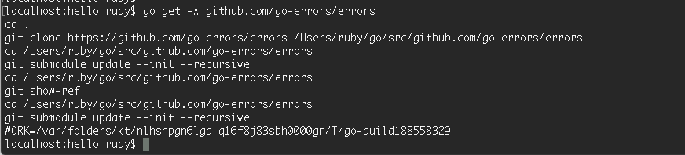


这里可以很明显的看到，执行完 go get 命令以后，会调用 git clone 方法下载源码，并编译，最终会把库源码文件编译成归档文件安装到 pkg 对应的相关平台目录下。

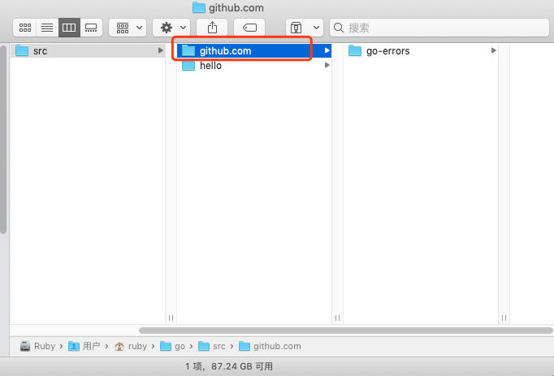


总结一下如下图：


### 5. 其他命令

**go clean**

go clean 命令是用来移除当前源码包里面编译生成的文件，这些文件包括

- _obj/ 旧的object目录，由Makefiles遗留
- _test/ 旧的test目录，由Makefiles遗留
- _testmain.go 旧的gotest文件，由Makefiles遗留
- test.out 旧的test记录，由Makefiles遗留
- build.out 旧的test记录，由Makefiles遗留
- *.[568ao] object文件，由Makefiles遗留
- DIR(.exe) 由 go build 产生
- DIR.test(.exe) 由 go test -c 产生
- MAINFILE(.exe) 由 go build MAINFILE.go产生


**go fmt**

go fmt 命令主要是用来帮你格式化所写好的代码文件。

比如我们写了一个格式很糟糕的 test.go 文件，我们只需要使用 fmt go test.go 命令，就可以让go帮我们格式化我们的代码文件。但是我们一般很少使用这个命令，因为我们的开发工具一般都带有保存时自动格式化功能，这个功能底层其实就是调用了 go fmt 命令而已。

使用go fmt命令，更多时候是用gofmt，而且需要参数-w，否则格式化结果不会写入文件。gofmt -w src，可以格式化整个项目。


**go test**

go test 命令，会自动读取源码目录下面名为*_test.go的文件，生成并运行测试用的可执行文件。默认的情况下，不需要任何的参数，它会自动把你源码包下面所有test文件测试完毕，当然你也可以带上参数，详情请参考go help testflag


**go doc**

go doc 命令其实就是一个很强大的文档工具。

如何查看相应package的文档呢？ 例如builtin包，那么执行go doc builtin；如果是http包，那么执行go doc net/http；查看某一个包里面的函数，那么执行go doc fmt Printf；也可以查看相应的代码，执行go doc -src fmt Printf；

```shell
# 查看net/http包
localhost:hello ruby$ go doc net/http
# 查看time包
localhost:hello ruby$ go doc time
# 查看某个包里的指定函数
localhost:hello ruby$ go doc fmt Printf
```


通过命令在命令行执行 go doc -http=:端口号，比如godoc -http=:8080。然后在浏览器中打开127.0.0.1:8080，你将会看到一个golang.org的本地copy版本，通过它你可以查询pkg文档等其它内容。如果你设置了GOPATH，在pkg分类下，不但会列出标准包的文档，还会列出你本地GOPATH中所有项目的相关文档，这对于经常被限制访问的用户来说是一个不错的选择。

```shell
localhost:hello ruby$ godoc -http=:9527
```


go fix 用来修复以前老版本的代码到新版本，例如go1之前老版本的代码转化到go1

go version 查看go当前的版本

go env 查看当前go的环境变量

go list 列出当前全部安装的package


本文部门文字和图片引自：https://www.jianshu.com/p/35a4ec1b3067


千锋Go语言的学习群：784190273

对应视频地址：

https://www.bilibili.com/video/av56018934

https://www.bilibili.com/video/av47467197

源代码：

https://github.com/rubyhan1314/go_foundation