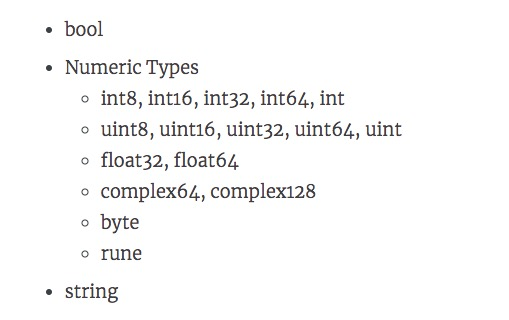

# 基本语法——数据类型

> @author：韩茹
>
> 版权所有：北京千锋互联科技有限公司

## 一、基本数据类型

以下是go中可用的基本数据类型




### 1.1 布尔型bool

布尔型的值只可以是常量 true 或者 false。一个简单的例子：var b bool = true

### 1.2 数值型

1、整数型

- int8
  有符号 8 位整型 (-128 到 127)
长度：8bit

- int16
  有符号 16 位整型 (-32768 到 32767)
- int32
  有符号 32 位整型 (-2147483648 到 2147483647)
- int64
  有符号 64 位整型 (-9223372036854775808 到 9223372036854775807)
- uint8
  无符号 8 位整型 (0 到 255)
8位都用于表示数值：

- uint16
  无符号 16 位整型 (0 到 65535)
- uint32
  无符号 32 位整型 (0 到 4294967295)
- uint64
  无符号 64 位整型 (0 到 18446744073709551615)
> int和uint:根据底层平台，表示32或64位整数。除非需要使用特定大小的整数，否则通常应该使用int来表示整数。
> 大小:32位系统32位，64位系统64位。
> 范围:-2147483648到2147483647的32位系统和-9223372036854775808到9223372036854775807的64位系统。

**2、浮点型**

- float32

  IEEE-754 32位浮点型数

- float64

  IEEE-754 64位浮点型数

- complex64

  32 位实数和虚数

- complex128

  64 位实数和虚数

**3、其他**

- byte

  类似 uint8

- rune

  类似 int32

- uint

  32 或 64 位

- int

  与 uint 一样大小

- uintptr

  无符号整型，用于存放一个指针

### 1.3 字符串型

字符串就是一串固定长度的字符连接起来的字符序列。Go的字符串是由单个字节连接起来的。Go语言的字符串的字节使用UTF-8编码标识Unicode文本

```go
	var str string
	str = "Hello World"
```


### 1.4 数据类型转换：Type Convert

语法格式：Type(Value)

常数：在有需要的时候，会自动转型

变量：需要手动转型	T(V)


注意点：兼容类型可以转换


## 二、 复合类型(派生类型)

1、指针类型（Pointer）
2、数组类型
3、结构化类型(struct)
4、Channel 类型
5、函数类型
6、切片类型
7、接口类型（interface）
8、Map 类型


# 运算符

表达式：(a + b) * c

	a,b,c叫做操作数
	
	+，*，叫做运算符

## 一、运算符

### 1.1  算术运算符

```go
+ - * / %(求余) ++ --
```

### 1.2 关系运算符

```go
== != > < >= <=
```

### 1.3 逻辑运算符

| 运算符 | 描述                                                         |
| ------ | ------------------------------------------------------------ |
| &&     | 所谓逻辑与运算符。如果两个操作数都非零，则条件变为真         |
| \|\|   | 所谓的逻辑或操作。如果任何两个操作数是非零，则条件变为真     |
| !      | 所谓逻辑非运算符。使用反转操作数的逻辑状态。如果条件为真，那么逻辑非操后结果为假 |

### 1.4 位运算符

| A    | B    | A&B  | A\|B | A^B  |
| ---- | ---- | ---- | ---- | ---- |
| 0    | 0    | 0    | 0    | 0    |
| 0    | 1    | 0    | 1    | 1    |
| 1    | 1    | 1    | 1    | 0    |
| 1    | 0    | 0    | 1    | 1    |

这里最难理解的就是^了，只要认为AB两者都相同的时候，为0，其他都为1

假设A为60，B为13

| 运算 | 描述                                                         | 示例                            |
| ---- | ------------------------------------------------------------ | ------------------------------- |
| &    | 二进制与操作副本位的结果，如果它存在于两个操作数             | (A & B) = 12, 也就是 0000 1100  |
| \|   | 二进制或操作副本，如果它存在一个操作数                       | (A \| B) = 61, 也就是 0011 1101 |
| ^    | 二进制异或操作副本，如果它被设置在一个操作数就是按位取非     | (A ^ B) = 49, 也就是 0011 0001  |
| &^   | 二进制位清空&^                                               | (A&^B)=48，也就是110000         |
| <<   | 二进制左移位运算符。左边的操作数的值向左移动由右操作数指定的位数 | A << 2 =240 也就是 1111 0000    |
| >>   | 二进制向右移位运算符。左边的操作数的值由右操作数指定的位数向右移动 | A >> 2 = 15 也就是 0000 1111    |

### 1.5 赋值运算符

| 运算符 | 描述                                                         | 示例                         |
| ------ | ------------------------------------------------------------ | ---------------------------- |
| =      | 简单的赋值操作符，分配值从右边的操作数左侧的操作数           | C = A + B 将分配A + B的值到C |
| +=     | 相加并赋值运算符，它增加了右操作数左操作数和分配结果左操作数 | C += A 相当于 C = C + A      |
| -=     | 减和赋值运算符，它减去右操作数从左侧的操作数和分配结果左操作数 | C -= A 相当于 C = C - A      |
| *=     | 乘法和赋值运算符，它乘以右边的操作数与左操作数和分配结果左操作数 | C *= A 相当于 C = C * A      |
| /=     | 除法赋值运算符，它把左操作数与右操作数和分配结果左操作数     | C /= A 相当于 C = C / A      |
| %=     | 模量和赋值运算符，它需要使用两个操作数的模量和分配结果左操作数 | C %= A 相当于 C = C % A      |
| <<=    | 左移位并赋值运算符                                           | C <<= 2 相同于 C = C << 2    |
| >>=    | 向右移位并赋值运算符                                         | C >>= 2 相同于 C = C >> 2    |
| &=     | 按位与赋值运算符                                             | C &= 2 相同于 C = C & 2      |
| ^=     | 按位异或并赋值运算符                                         | C ^= 2 相同于 C = C ^ 2      |
| \|=    | 按位或并赋值运算符                                           | C \|= 2 相同于 C = C \| 2    |

### 1.6优先级运算符优先级

有些运算符拥有较高的优先级，二元运算符的运算方向均是从左至右。下表列出了所有运算符以及它们的优先级，由上至下代表优先级由高到低：

| 优先级 | 运算符           |
| ------ | ---------------- |
| 7      | ~ ! ++ --        |
| 6      | * / % << >> & &^ |
| 5      | + -  ^           |
| 4      | == != < <= >= >  |
| 3      | <-               |
| 2      | &&               |
| 1      | \|\|             |

当然，你可以通过使用括号来临时提升某个表达式的整体运算优先级。


千锋Go语言的学习群：784190273

作者B站：

https://space.bilibili.com/353694001

对应视频地址：

https://www.bilibili.com/video/av56018934

https://www.bilibili.com/video/av47467197

源代码：

https://github.com/rubyhan1314/go_foundation