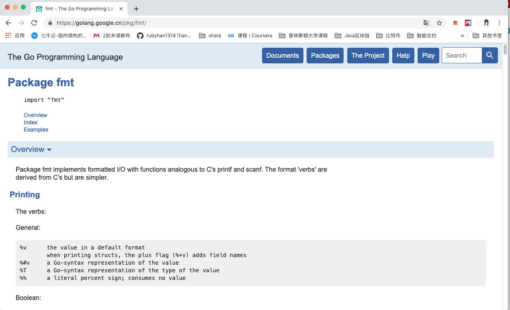
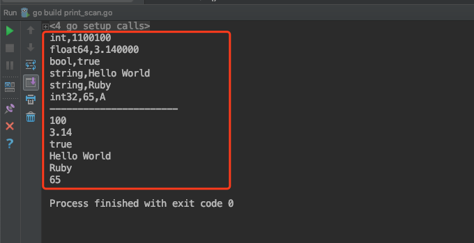
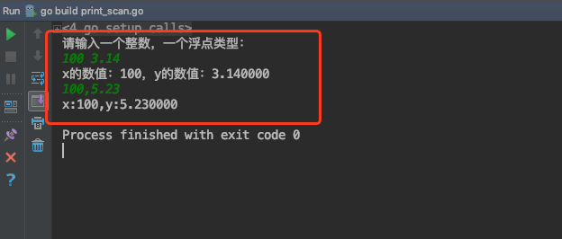
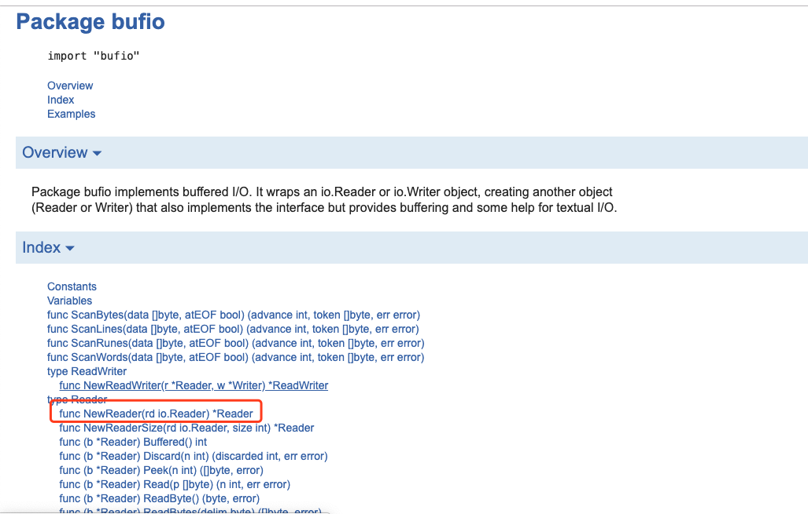
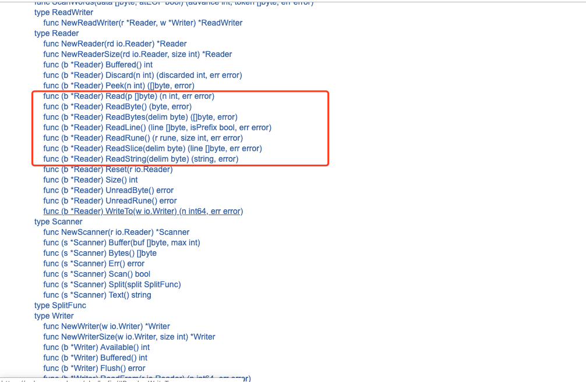
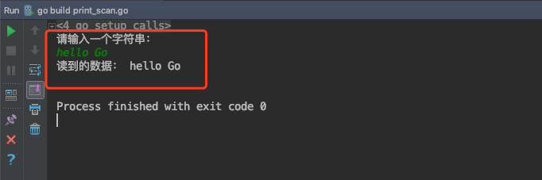

# 键盘输入和打印输出

>作者：韩茹
>
>出处：千锋教育

## 一、打印输出

### 1.1 fmt包

fmt包实现了类似C语言printf和scanf的格式化I/O。格式化verb（'verb'）源自C语言但更简单。

详见官网fmt的API：https://golang.google.cn/pkg/fmt/




### 1.2 导入包

```go
import "fmt"
```


### 1.3 常用打印函数

**打印：**

[func Print(a ...interface{}) (n int, err error)](https://golang.google.cn/pkg/fmt/#Print)

**格式化打印：**

[func Printf(format string, a ...interface{}) (n int, err error)](https://golang.google.cn/pkg/fmt/#Printf)

**打印后换行**

[func Println(a ...interface{}) (n int, err error)](https://golang.google.cn/pkg/fmt/#Println)


格式化打印中的常用占位符：

```
格式化打印占位符：
			%v,原样输出
			%T，打印类型
			%t,bool类型
			%s，字符串
			%f，浮点
			%d，10进制的整数
			%b，2进制的整数
			%o，8进制
			%x，%X，16进制
				%x：0-9，a-f
				%X：0-9，A-F
			%c，打印字符
			%p，打印地址
			。。。
```

示例代码：

```go
package main

import (
	"fmt"
)

func main() {
	a := 100           //int
	b := 3.14          //float64
	c := true          // bool
	d := "Hello World" //string
	e := `Ruby`        //string
	f := 'A'
	fmt.Printf("%T,%b\n", a, a)
	fmt.Printf("%T,%f\n", b, b)
	fmt.Printf("%T,%t\n", c, c)
	fmt.Printf("%T,%s\n", d, d)
	fmt.Printf("%T,%s\n", e, e)
	fmt.Printf("%T,%d,%c\n", f, f, f)
	fmt.Println("-----------------------")
	fmt.Printf("%v\n", a)
	fmt.Printf("%v\n", b)
	fmt.Printf("%v\n", c)
	fmt.Printf("%v\n", d)
	fmt.Printf("%v\n", e)
	fmt.Printf("%v\n", f)

}

```


运行结果：




## 二、键盘输入

### 2.1 fmt包读取键盘输入

常用方法：

[func Scan(a ...interface{}) (n int, err error)](https://golang.google.cn/pkg/fmt/#Scan)

[func Scanf(format string, a ...interface{}) (n int, err error)](https://golang.google.cn/pkg/fmt/#Scanf)

[func Scanln(a ...interface{}) (n int, err error)](https://golang.google.cn/pkg/fmt/#Scanln)


```go
package main

import (
	"fmt"
)

func main() {
	var x int
	var y float64
	fmt.Println("请输入一个整数，一个浮点类型：")
	fmt.Scanln(&x,&y)//读取键盘的输入，通过操作地址，赋值给x和y   阻塞式
	fmt.Printf("x的数值：%d，y的数值：%f\n",x,y)

	fmt.Scanf("%d,%f",&x,&y)
	fmt.Printf("x:%d,y:%f\n",x,y)
}
```

运行结果：




### 2.2 bufio包读取

https://golang.google.cn/pkg/bufio/


bufio包中都是IO操作的方法：

先创建Reader对象：




然后就可以各种读取了：




示例代码：

```go
package main

import (
	"fmt"
	"os"
	"bufio"
)

func main() {
	fmt.Println("请输入一个字符串：")
	reader := bufio.NewReader(os.Stdin)
	s1, _ := reader.ReadString('\n')
	fmt.Println("读到的数据：", s1)

}
```

运行效果：




千锋Go语言的学习群：784190273

对应视频地址：

https://www.bilibili.com/video/av56018934

https://www.bilibili.com/video/av47467197

源代码：

https://github.com/rubyhan1314/go_foundation