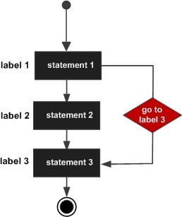

# 一、程序的流程结构

> @author：韩茹
>
> 版权所有：北京千锋互联科技有限公司

程序的流程控制结构一共有三种：顺序结构，选择结构，循环结构。

顺序结构：代码从上向下逐行的执行

选择结构：条件满足，某些代码才会被执行。0-1次

​	if语句，switch语句

循环结构：条件满足，某些代码会被反复的多次执行。0-n次

​	for语句

# 二、循环语句

循环语句表示条件满足，可以反复的执行某段代码。

for是唯一的循环语句。(Go没有while循环)

##2.1 for语句

语法结构：

```
for init; condition; post { }
```

> 初始化语句只执行一次。在初始化循环之后，将检查该条件。如果条件计算为true，那么{}中的循环体将被执行，然后是post语句。post语句将在循环的每次成功迭代之后执行。在执行post语句之后，该条件将被重新检查。如果它是正确的，循环将继续执行，否则循环终止。

示例代码：

```go
package main

import (  
    "fmt"
)

func main() {  
    for i := 1; i <= 10; i++ {
        fmt.Printf(" %d",i)
    }
}
```

>在for循环中声明的变量仅在循环范围内可用。因此，i不能在外部访问循环。


## 2.2 for循环变体

**所有的三个组成部分，即初始化、条件和post都是可选的。**

```
for condition { }
```

效果与while相似

```
for { }
```

效果与for(;;) 一样

for 循环的 range 格式可以对 slice、map、数组、字符串等进行迭代循环

```
for key, value := range oldMap {
    newMap[key] = value
}
```

```go
package main

import "fmt"

func main() {

   var b int = 15
   var a int

   numbers := [6]int{1, 2, 3, 5} 

   /* for 循环 */
   for a := 0; a < 10; a++ {
      fmt.Printf("a 的值为: %d\n", a)
   }

   for a < b {
      a++
      fmt.Printf("a 的值为: %d\n", a)
      }

   for i,x:= range numbers {
      fmt.Printf("第 %d 位 x 的值 = %d\n", i,x)
   }   
}
```

运行结果：

```
a 的值为: 0
a 的值为: 1
a 的值为: 2
a 的值为: 3
a 的值为: 4
a 的值为: 5
a 的值为: 6
a 的值为: 7
a 的值为: 8
a 的值为: 9
a 的值为: 1
a 的值为: 2
a 的值为: 3
a 的值为: 4
a 的值为: 5
a 的值为: 6
a 的值为: 7
a 的值为: 8
a 的值为: 9
a 的值为: 10
a 的值为: 11
a 的值为: 12
a 的值为: 13
a 的值为: 14
a 的值为: 15
第 0 位 x 的值 = 1
第 1 位 x 的值 = 2
第 2 位 x 的值 = 3
第 3 位 x 的值 = 5
第 4 位 x 的值 = 0
第 5 位 x 的值 = 0
```


## 2.2 多层for循环

for循环中又有循环嵌套，就表示多层循环了。


# 三、跳出循环的语句

> @author：韩茹
> 版权所有：北京千锋互联科技有限公司

## 1、 break语句

break：跳出循环体。break语句用于在结束其正常执行之前突然终止for循环

示例代码：

```go
package main

import (  
    "fmt"
)

func main() {  
    for i := 1; i <= 10; i++ {
        if i > 5 {
            break //loop is terminated if i > 5
        }
        fmt.Printf("%d ", i)
    }
    fmt.Printf("\nline after for loop")
}
```

##  2、continue语句

continue：跳出一次循环。continue语句用于跳过for循环的当前迭代。在continue语句后面的for循环中的所有代码将不会在当前迭代中执行。循环将继续到下一个迭代。

示例代码：

```go
package main

import (  
    "fmt"
)

func main() {  
    for i := 1; i <= 10; i++ {
        if i%2 == 0 {
            continue
        }
        fmt.Printf("%d ", i)
    }
}
```


# 四、goto语句

goto：可以无条件地转移到过程中指定的行。

语法结构：

```go
goto label;
..
..
label: statement;
```




```go
package main

import "fmt"

func main() {
   /* 定义局部变量 */
   var a int = 10

   /* 循环 */
   LOOP: for a < 20 {
      if a == 15 {
         /* 跳过迭代 */
         a = a + 1
         goto LOOP
      }
      fmt.Printf("a的值为 : %d\n", a)
      a++     
   }  
}
```


统一错误处理
多处错误处理存在代码重复时是非常棘手的，例如：

```go
		err := firstCheckError()
    if err != nil {
        goto onExit
    }
    err = secondCheckError()
    if err != nil {
        goto onExit
    }
    fmt.Println("done")
    return
onExit:
    fmt.Println(err)
    exitProcess()


```


本文图片来源于网络


千锋Go语言的学习群：784190273

作者B站：

https://space.bilibili.com/353694001

对应视频地址：

https://www.bilibili.com/video/av56018934

https://www.bilibili.com/video/av47467197

源代码：

https://github.com/rubyhan1314/go_foundation


