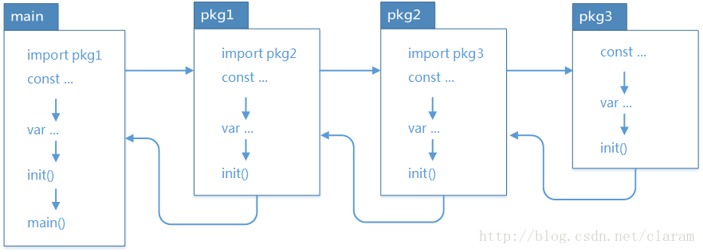
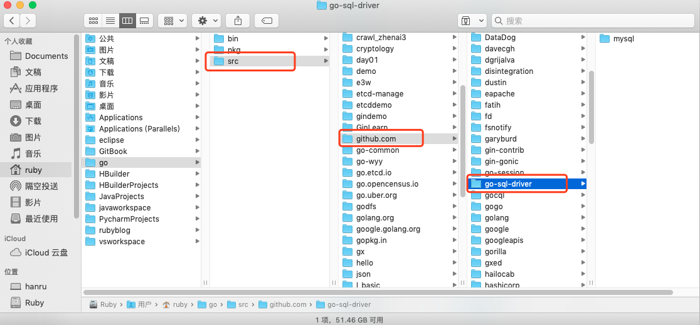

# Go语言中包的使用

> @author：韩茹
> 
> 版权所有：北京千锋互联科技有限公司


Go语言使用包（package）这种语法元素来组织源码，所有语法可见性均定义在package这个级别，与Java 、python等语言相比，这算不上什么创新，但与C传统的include相比，则是显得“先进”了许多。

```
myblog
├── conf
│   └── app.conf
├── controllers
│   ├── aboutme_controller.go
│   ├── add_article_controller.go
│   ├── album_controller.go
│   ├── base_controller.go
│   ├── default.go
│   ├── delete_article_controller.go
│   ├── exit_controller.go
│   ├── home_controller.go
│   ├── login_controller.go
│   ├── register_controller.go
│   ├── show_article_controller.go
│   ├── tags_controller.go
│   ├── update_article_controller.go
│   └── upload_controller.go
├── main.go
├── models
│   ├── album_model.go
│   ├── article_model.go
│   ├── home_model.go
│   ├── tags_model.go
│   └── user_model.go
├── myblogweb
├── routers
│   └── router.go
├── static
│   ├── css
│   │   ├── blogsheet.css
│   │   └── lib
│   │       ├── highlight.css
│   │       └── login.css
│   ├── img
│   ├── js
│   │   ├── blog.js
│   │   ├── lib
│   │   │   ├── jquery-3.3.1.min.js
│   │   │   └── jquery.url.js
│   │   └── reload.min.js
│   └── upload
│       └── img
│           └── 2018
│               └── 12
│                   └── 11
│                       ├── 1544511378-bee2.png
├── tests
│   └── default_test.go
├── utils
│   ├── myUtils.go
│   └── mysqlUtils.go
└── views
    ├── aboultme.html
    ├── album.html
    ├── block
    │   ├── home_block.html
    │   └── nav.html
    ├── home.html
    ├── index.tpl
    ├── login.html
    ├── register.html
    ├── show_article.html
    ├── tags.html
    └── write_article.html
```


Go 语言的源码复用建立在包（package）基础之上。包通过 package, import, GOPATH 操作完成。

## 1、 main包

Go 语言的入口 main() 函数所在的包（package）叫 main，main 包想要引用别的代码，需要import导入！


## 2、 package

src 目录是以代码包的形式组织并保存 Go 源码文件的。每个代码包都和 src 目录下的文件夹一一对应。每个子目录都是一个代码包。

> 代码包包名和文件目录名，不要求一致。比如文件目录叫 hello，但是代码包包名可以声明为 “main”，但是同一个目录下的源码文件第一行声明的所属包，必须一致！


同一个目录下的所有.go文件的第一行添加 包定义，以标记该文件归属的包，演示语法：

```go
package 包名
```

包需要满足：

- 一个目录下的同级文件归属一个包。也就是说，在同一个包下面的所有文件的package名，都是一样的。
- 在同一个包下面的文件`package`名都建议设为是该目录名，但也可以不是。也就是说，包名可以与其目录不同名。
- 包名为 main 的包为应用程序的入口包，其他包不能使用。


> 在同一个包下面的文件属于同一个工程文件，不用`import`包，可以直接使用

包可以嵌套定义，对应的就是嵌套目录，但包名应该与所在的目录一致，例如：

```go
// 文件：qf/ruby/tool.go中
package ruby
// 可以被导出的函数
func FuncPublic() {
}
// 不可以被导出的函数
func funcPrivate() {
}
```

包中，通过标识符首字母是否大写，来确定是否可以被导出。首字母大写才可以被导出，视为 public 公共的资源。


## 3、 import

要引用其他包，可以使用 import 关键字，可以单个导入或者批量导入，语法演示：

A：通常导入

```go
// 单个导入
import "package"
// 批量导入
import (
  "package1"
  "package2"
  )
```

B：点操作
我们有时候会看到如下的方式导入包

```go
import(
	. "fmt"
) 
```

这个点操作的含义就是这个包导入之后在你调用这个包的函数时，你可以省略前缀的包名，也就是前面你调

用的`fmt.Println("hello world")`可以省略的写成`Println("hello world")`


C：起别名

别名操作顾名思义我们可以把包命名成另一个我们用起来容易记忆的名字。导入时，可以为包定义别名，语法演示：

```go
import (
  p1 "package1"
  p2 "package2"
  )
// 使用时：别名操作，调用包函数时前缀变成了我们的前缀
p1.Method()
```


D：_操作
如果仅仅需要导入包时执行初始化操作，并不需要使用包内的其他函数，常量等资源。则可以在导入包时，匿名导入。

这个操作经常是让很多人费解的一个操作符，请看下面这个import：

```go
import (
   "database/sql"
   _ "github.com/ziutek/mymysql/godrv"
 ) 
```

_操作其实是引入该包，而不直接使用包里面的函数，而是调用了该包里面的init函数。也就是说，使用下划线作为包的别名，会仅仅执行init()。

> 导入的包的路径名，可以是相对路径也可以是绝对路径，推荐使用绝对路径（起始于工程根目录）。


## 4、GOPATH环境变量

import导入时，会从GO的安装目录（也就是GOROOT环境变量设置的目录）和GOPATH环境变量设置的目录中，检索 src/package 来导入包。如果不存在，则导入失败。
GOROOT，就是GO内置的包所在的位置。
GOPATH，就是我们自己定义的包的位置。

通常我们在开发Go项目时，调试或者编译构建时，需要设置GOPATH指向我们的项目目录，目录中的src目录中的包就可以被导入了。


## 5、init() 包初始化

下面我们详细的来介绍一下这两个函数：init()、main() 是 go 语言中的保留函数。我们可以在源码中，定义 init() 函数。此函数会在包被导入时执行，例如如果是在 main 中导入包，包中存在 init()，那么 init() 中的代码会在 main() 函数执行前执行，用于初始化包所需要的特定资料。例如：
包源码：

```go
src/userPackage/tool.go

package userPackage
import "fmt"
func init() {
  fmt.Println("tool init")
}
```

主函数源码：

```go
src/main.go

package main
import (
  "userPackage"
  )
func main() {
  fmt.Println("main run")
  // 使用userPackage
  userPackage.SomeFunc()
}
```

执行时，会先输出 "tool init"，再输出 "main run"。


下面我们详细的来介绍一下init()、main() 这两个函数。在 go 语言中的区别如下： 
相同点：

两个函数在定义时不能有任何的参数和返回值。
该函数只能由 go 程序自动调用，不可以被引用。

不同点：

init 可以应用于任意包中，且可以重复定义多个。
main 函数只能用于 main 包中，且只能定义一个。

两个函数的执行顺序：

在 main 包中的 go 文件默认总是会被执行。

对同一个 go 文件的 init( ) 调用顺序是从上到下的。

对同一个 package 中的不同文件，将文件名按字符串进行“从小到大”排序，之后顺序调用各文件中的init()函数。

对于不同的 package，如果不相互依赖的话，按照 main 包中 import 的顺序调用其包中的 init() 函数。

如果 package 存在依赖，调用顺序为最后被依赖的最先被初始化，例如：导入顺序 main –> A –> B –> C，则初始化顺序为 C –> B –> A –> main，一次执行对应的 init 方法。main 包总是被最后一个初始化，因为它总是依赖别的包



图片引自网络


避免出现循环 import，例如：A –> B –> C –> A。

一个包被其它多个包 import，但只能被初始化一次


## 6、管理外部包

go允许import不同代码库的代码。对于import要导入的外部的包，可以使用 go get 命令取下来放到GOPATH对应的目录中去。

举个例子，比如说我们想通过go语言连接mysql数据库，那么需要先下载mysql的数据包，打开终端并输入以下命令：

```shell
localhost:~ ruby$ go get github.com/go-sql-driver/mysql
```

安装之后，就可以在gopath目录的src下，看到对应的文件包目录：




>也就是说，对于go语言来讲，其实并不关心你的代码是内部还是外部的，总之都在GOPATH里，任何import包的路径都是从GOPATH开始的；唯一的区别，就是内部依赖的包是开发者自己写的，外部依赖的包是go get下来的。


## 扩展

我们可以通过go install 来编译包文件。

我们知道一个非main包在编译后会生成一个.a文件（在临时目录下生成，除非使用go install安装到`$GOROOT`或​`$GOPATH`下，否则你看不到.a），用于后续可执行程序链接使用。

比如Go标准库中的包对应的源码部分路径在：`$GOROOT/src`，而标准库中包编译后的.a文件路径在`$GOROOT/pkg/darwin_amd64`下。


千锋Go语言的学习群：784190273

作者B站：

https://space.bilibili.com/353694001

对应视频地址：

https://www.bilibili.com/video/av56018934

https://www.bilibili.com/video/av47467197

源代码：

https://github.com/rubyhan1314/go_advanced


