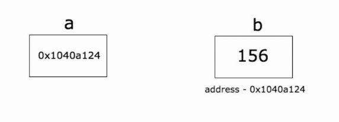

# 一、指针

> @author：韩茹
> 
> 版权所有：北京千锋互联科技有限公司

## 1.1 指针的概念

指针是存储另一个变量的内存地址的变量。

我们都知道，变量是一种使用方便的占位符，用于引用计算机内存地址。

一个指针变量可以指向任何一个值的内存地址它指向那个值的内存地址。

 

在上面的图中，变量b的值为156，存储在内存地址0x1040a124。变量a持有b的地址，现在a被认为指向b。

## 1.2 获取变量的地址

Go 语言的取地址符是 &，放到一个变量前使用就会返回相应变量的内存地址。

```go
package main

import "fmt"

func main() {
   var a int = 10   

   fmt.Printf("变量的地址: %x\n", &a  )
}
```

运行结果：

```go
变量的地址: 20818a220
```

## 1.3 声明指针

声明指针，*T是指针变量的类型，它指向T类型的值。

```go
var var_name *var-type
```

var-type 为指针类型，var_name 为指针变量名，* 号用于指定变量是作为一个指针。

```go
var ip *int        /* 指向整型*/
var fp *float32    /* 指向浮点型 */
```

示例代码：

```go
package main

import "fmt"

func main() {
   var a int= 20   /* 声明实际变量 */
   var ip *int        /* 声明指针变量 */

   ip = &a  /* 指针变量的存储地址 */

   fmt.Printf("a 变量的地址是: %x\n", &a  )

   /* 指针变量的存储地址 */
   fmt.Printf("ip 变量的存储地址: %x\n", ip )

   /* 使用指针访问值 */
   fmt.Printf("*ip 变量的值: %d\n", *ip )
}
```

运行结果：

```go
a 变量的地址是: 20818a220
ip 变量的存储地址: 20818a220
*ip 变量的值: 20
```

示例代码：

```go
package main

import "fmt"

type name int8
type first struct {
	a int
	b bool
	name
}

func main() {
	a := new(first)
	a.a = 1
	a.name = 11
	fmt.Println(a.b, a.a, a.name)
}
```

运行结果：

```go
false 1 11
```

> 未初始化的变量自动赋上初始值

```go
package main

import "fmt"

type name int8
type first struct {
	a int
	b bool
	name
}

func main() {
	var a = first{1, false, 2}
	var b *first = &a
	fmt.Println(a.b, a.a, a.name, &a, b.a, &b, (*b).a)
}
```

运行结果：

```go
false 1 2 &{1 false 2} 1 0xc042068018 1
```

> 获取指针地址在指针变量前加&的方式

## 1.4 空指针

**Go 空指针**
当一个指针被定义后没有分配到任何变量时，它的值为 nil。
nil 指针也称为空指针。
nil在概念上和其它语言的null、None、nil、NULL一样，都指代零值或空值。
一个指针变量通常缩写为 ptr。

空指针判断：

```go
if(ptr != nil)     /* ptr 不是空指针 */
if(ptr == nil)    /* ptr 是空指针 */
```

## 1.5 获取指针的值

获取一个指针意味着访问指针指向的变量的值。语法是：*a

示例代码：

```go
package main  
import (  
    "fmt"
)

func main() {  
    b := 255
    a := &b
    fmt.Println("address of b is", a)
    fmt.Println("value of b is", *a)
}
```

## 1.6 操作指针改变变量的数值

示例代码：

```go
package main

import (  
    "fmt"
)

func main() {  
    b := 255
    a := &b
    fmt.Println("address of b is", a)
    fmt.Println("value of b is", *a)
    *a++
    fmt.Println("new value of b is", b)
}
```

运行结果

```
address of b is 0x1040a124  
value of b is 255  
new value of b is 256  
```


## 1.7 使用指针传递函数的参数

示例代码

```go
package main

import (  
    "fmt"
)

func change(val *int) {  
    *val = 55
}
func main() {  
    a := 58
    fmt.Println("value of a before function call is",a)
    b := &a
    change(b)
    fmt.Println("value of a after function call is", a)
}
```

运行结果

```
value of a before function call is 58  
value of a after function call is 55  
```

**不要将一个指向数组的指针传递给函数。使用切片。**

假设我们想对函数内的数组进行一些修改，并且对调用者可以看到函数内的数组所做的更改。一种方法是将一个指向数组的指针传递给函数。

```go
package main

import (  
    "fmt"
)

func modify(arr *[3]int) {  
    (*arr)[0] = 90
}

func main() {  
    a := [3]int{89, 90, 91}
    modify(&a)
    fmt.Println(a)
}
```

运行结果

```
[90 90 91]
```

示例代码：

```go
package main

import (  
    "fmt"
)

func modify(arr *[3]int) {  
    arr[0] = 90
}

func main() {  
    a := [3]int{89, 90, 91}
    modify(&a)
    fmt.Println(a)
}
```

运行结果

```
[90 90 91]
```

**虽然将指针传递给一个数组作为函数的参数并对其进行修改，但这并不是实现这一目标的惯用方法。我们有切片。**

示例代码：

```go
package main

import (  
    "fmt"
)

func modify(sls []int) {  
    sls[0] = 90
}

func main() {  
    a := [3]int{89, 90, 91}
    modify(a[:])
    fmt.Println(a)
}
```

运行结果：

```
[90 90 91]
```


>Go不支持指针算法。
>
>package main
>
>func main() {  
>    b := [...]int{109, 110, 111}
>    p := &b
>    p++
>}
>
>nvalid operation: p++ (non-numeric type *[3]int)


**指针数组**

```go
package main

import "fmt"

const MAX int = 3

func main() {

   a := []int{10,100,200}
   var i int

   for i = 0; i < MAX; i++ {
      fmt.Printf("a[%d] = %d\n", i, a[i] )
   }
}
```

`结果`

```go
a[0] = 10
a[1] = 100
a[2] = 200
```

有一种情况，我们可能需要保存数组，这样我们就需要使用到指针。

```go
package main

import "fmt"

const MAX int = 3

func main() {
   a := []int{10,100,200}
   var i int
   var ptr [MAX]*int;

   for  i = 0; i < MAX; i++ {
      ptr[i] = &a[i] /* 整数地址赋值给指针数组 */
   }

   for  i = 0; i < MAX; i++ {
      fmt.Printf("a[%d] = %d\n", i,*ptr[i] )
   }
}
```

`结果`

```go
a[0] = 10
a[1] = 100
a[2] = 200
```

## 1.8 指针的指针

**指针的指针**

如果一个指针变量存放的又是另一个指针变量的地址，则称这个指针变量为指向指针的指针变量。

```go
var ptr **int;
```

```go
package main

import "fmt"

func main() {

   var a int
   var ptr *int
   var pptr **int

   a = 3000

   /* 指针 ptr 地址 */
   ptr = &a

   /* 指向指针 ptr 地址 */
   pptr = &ptr

   /* 获取 pptr 的值 */
   fmt.Printf("变量 a = %d\n", a )
   fmt.Printf("指针变量 *ptr = %d\n", *ptr )
   fmt.Printf("指向指针的指针变量 **pptr = %d\n", **pptr)
}
```

`结果`

```go
变量 a = 3000
指针变量 *ptr = 3000
指向指针的指针变量 **pptr = 3000
```

**指针作为函数参数**

```go
package main

import "fmt"

func main() {
   /* 定义局部变量 */
   var a int = 100
   var b int= 200

   fmt.Printf("交换前 a 的值 : %d\n", a )
   fmt.Printf("交换前 b 的值 : %d\n", b )

   /* 调用函数用于交换值
   * &a 指向 a 变量的地址
   * &b 指向 b 变量的地址
   */
   swap(&a, &b);

   fmt.Printf("交换后 a 的值 : %d\n", a )
   fmt.Printf("交换后 b 的值 : %d\n", b )
}

func swap(x *int, y *int) {
   var temp int
   temp = *x    /* 保存 x 地址的值 */
   *x = *y      /* 将 y 赋值给 x */
   *y = temp    /* 将 temp 赋值给 y */
}
```

`结果`

```go
交换前 a 的值 : 100
交换前 b 的值 : 200
交换后 a 的值 : 200
交换后 b 的值 : 100
```


千锋Go语言的学习群：784190273

作者B站：

https://space.bilibili.com/353694001

对应视频地址：

https://www.bilibili.com/video/av56018934

https://www.bilibili.com/video/av47467197

源代码：

https://github.com/rubyhan1314/go_advanced