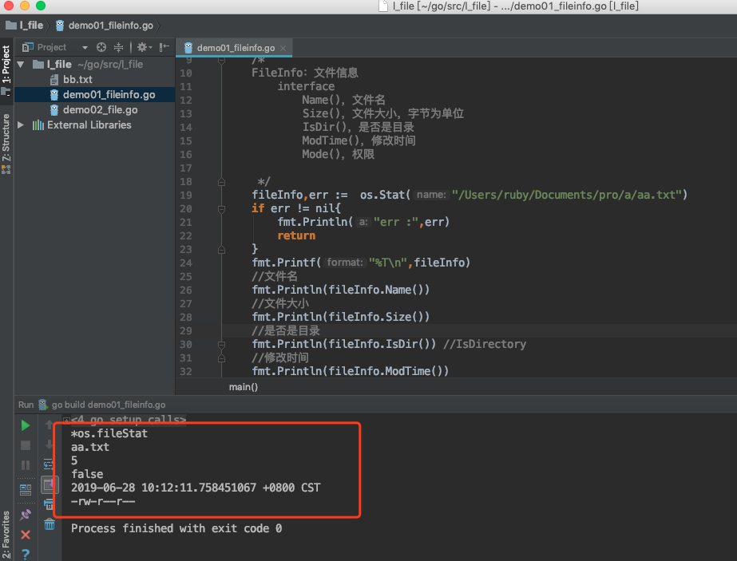
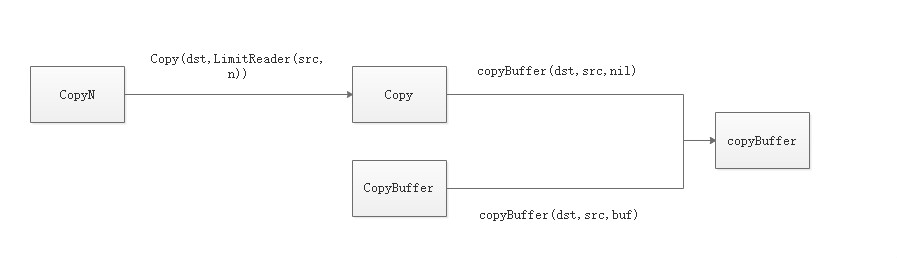
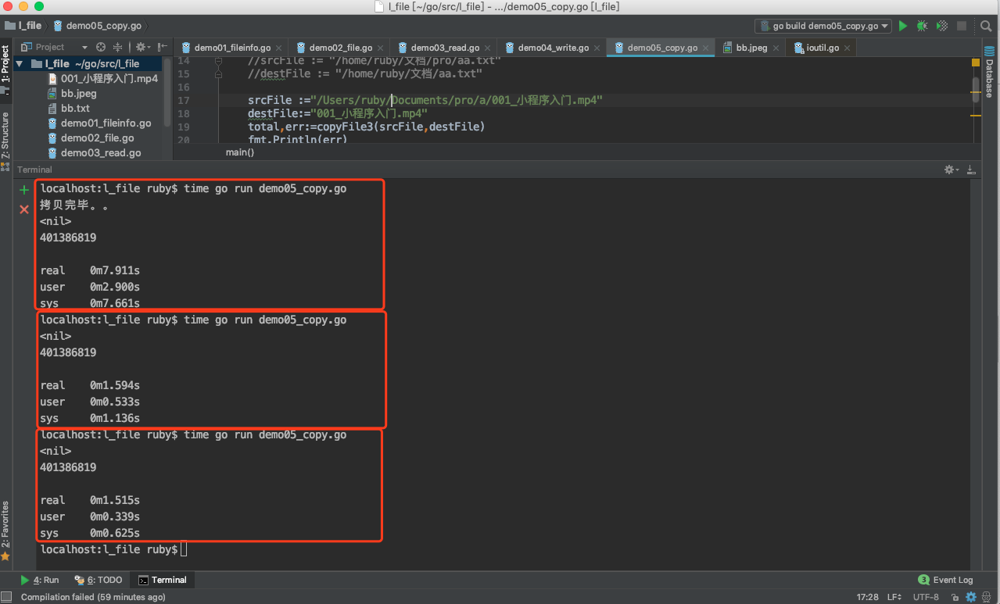
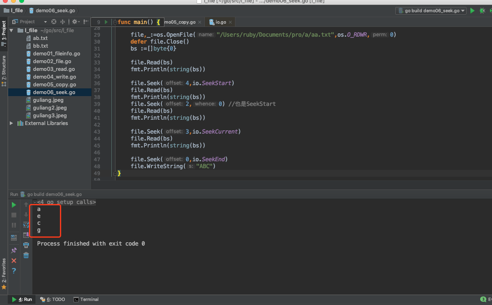
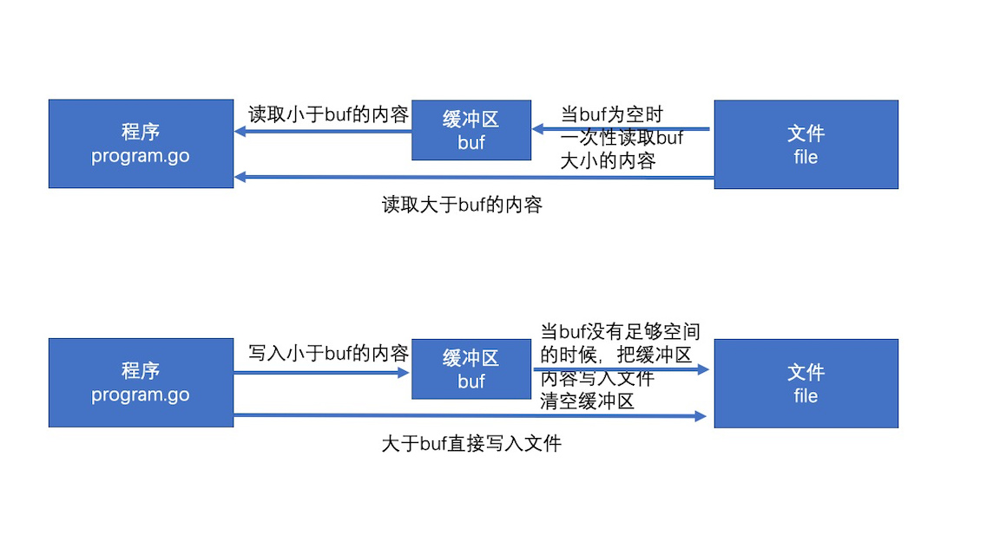
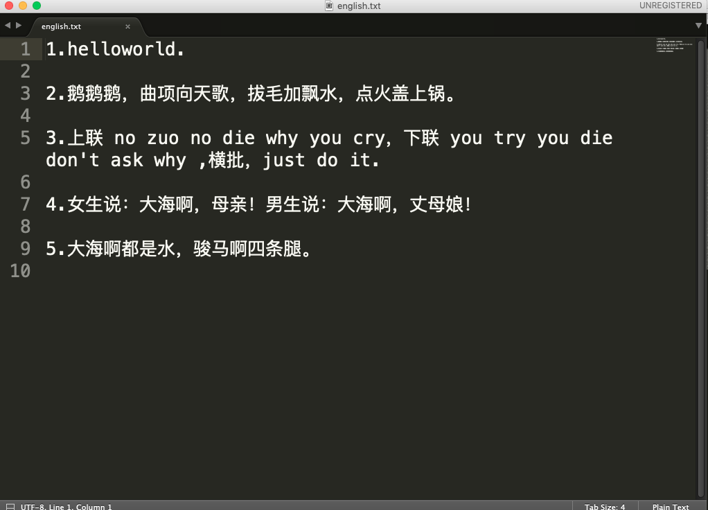
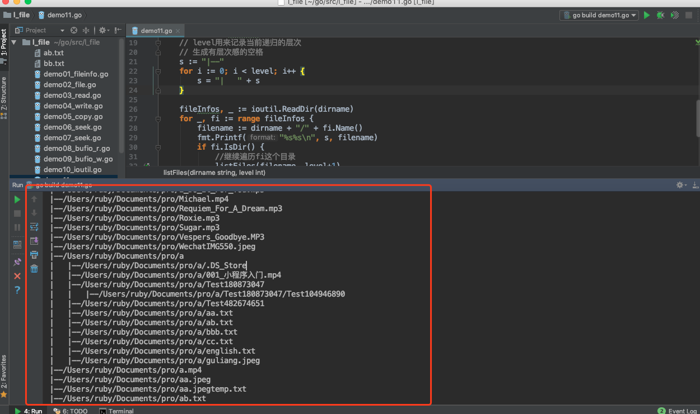

# 一、File文件操作

> @author：韩茹
> 版权所有：北京千锋互联科技有限公司


首先，file类是在os包中的，封装了底层的文件描述符和相关信息，同时封装了Read和Write的实现。

## 1、FileInfo接口

FileInfo接口中定义了File信息相关的方法。

```go
type FileInfo interface {
	Name() string       // base name of the file 文件名.扩展名 aa.txt
	Size() int64        // 文件大小，字节数 12540
	Mode() FileMode     // 文件权限 -rw-rw-rw-
	ModTime() time.Time // 修改时间 2018-04-13 16:30:53 +0800 CST
	IsDir() bool        // 是否文件夹
	Sys() interface{}   // 基础数据源接口(can return nil)
}
```


## 2、权限

至于操作权限perm，除非创建文件时才需要指定，不需要创建新文件时可以将其设定为０。虽然go语言给perm权限设定了很多的常量，但是习惯上也可以直接使用数字，如0666(具体含义和Unix系统的一致)。

权限控制：

```go
linux 下有2种文件权限表示方式，即“符号表示”和“八进制表示”。

（1）符号表示方式:
-      ---         ---        ---
type   owner       group      others
文件的权限是这样子分配的 读 写 可执行 分别对应的是 r w x 如果没有那一个权限，用 - 代替
(-文件 d目录 |连接符号)
例如：-rwxr-xr-x


（2）八进制表示方式：	
r ——> 004
w ——> 002
x ——> 001
- ——> 000

0755
0777
0555
0444
0666
```


## 3、打开模式

文件打开模式：

```go
const (
    O_RDONLY int = syscall.O_RDONLY // 只读模式打开文件
    O_WRONLY int = syscall.O_WRONLY // 只写模式打开文件
    O_RDWR   int = syscall.O_RDWR   // 读写模式打开文件
    O_APPEND int = syscall.O_APPEND // 写操作时将数据附加到文件尾部
    O_CREATE int = syscall.O_CREAT  // 如果不存在将创建一个新文件
    O_EXCL   int = syscall.O_EXCL   // 和O_CREATE配合使用，文件必须不存在
    O_SYNC   int = syscall.O_SYNC   // 打开文件用于同步I/O
    O_TRUNC  int = syscall.O_TRUNC  // 如果可能，打开时清空文件
)
```


## 4、File操作

```go
type File
//File代表一个打开的文件对象。

func Create(name string) (file *File, err error)
//Create采用模式0666（任何人都可读写，不可执行）创建一个名为name的文件，如果文件已存在会截断它（为空文件）。如果成功，返回的文件对象可用于I/O；对应的文件描述符具有O_RDWR模式。如果出错，错误底层类型是*PathError。

func Open(name string) (file *File, err error)
//Open打开一个文件用于读取。如果操作成功，返回的文件对象的方法可用于读取数据；对应的文件描述符具有O_RDONLY模式。如果出错，错误底层类型是*PathError。

func OpenFile(name string, flag int, perm FileMode) (file *File, err error)
//OpenFile是一个更一般性的文件打开函数，大多数调用者都应用Open或Create代替本函数。它会使用指定的选项（如O_RDONLY等）、指定的模式（如0666等）打开指定名称的文件。如果操作成功，返回的文件对象可用于I/O。如果出错，错误底层类型是*PathError。

func NewFile(fd uintptr, name string) *File
//NewFile使用给出的Unix文件描述符和名称创建一个文件。

func Pipe() (r *File, w *File, err error)
//Pipe返回一对关联的文件对象。从r的读取将返回写入w的数据。本函数会返回两个文件对象和可能的错误。

func (f *File) Name() string
//Name方法返回（提供给Open/Create等方法的）文件名称。

func (f *File) Stat() (fi FileInfo, err error)
//Stat返回描述文件f的FileInfo类型值。如果出错，错误底层类型是*PathError。

func (f *File) Fd() uintptr
//Fd返回与文件f对应的整数类型的Unix文件描述符。

func (f *File) Chdir() error
//Chdir将当前工作目录修改为f，f必须是一个目录。如果出错，错误底层类型是*PathError。

func (f *File) Chmod(mode FileMode) error
//Chmod修改文件的模式。如果出错，错误底层类型是*PathError。

func (f *File) Chown(uid, gid int) error
//Chown修改文件的用户ID和组ID。如果出错，错误底层类型是*PathError。

func (f *File) Close() error
//Close关闭文件f，使文件不能用于读写。它返回可能出现的错误。


func (f *File) Readdir(n int) (fi []FileInfo, err error)
//Readdir读取目录f的内容，返回一个有n个成员的[]FileInfo，这些FileInfo是被Lstat返回的，采用目录顺序。对本函数的下一次调用会返回上一次调用剩余未读取的内容的信息。如果n>0，Readdir函数会返回一个最多n个成员的切片。这时，如果Readdir返回一个空切片，它会返回一个非nil的错误说明原因。如果到达了目录f的结尾，返回值err会是io.EOF。如果n<=0，Readdir函数返回目录中剩余所有文件对象的FileInfo构成的切片。此时，如果Readdir调用成功（读取所有内容直到结尾），它会返回该切片和nil的错误值。如果在到达结尾前遇到错误，会返回之前成功读取的FileInfo构成的切片和该错误。

func (f *File) Readdirnames(n int) (names []string, err error)
//Readdir读取目录f的内容，返回一个有n个成员的[]string，切片成员为目录中文件对象的名字，采用目录顺序。对本函数的下一次调用会返回上一次调用剩余未读取的内容的信息。如果n>0，Readdir函数会返回一个最多n个成员的切片。这时，如果Readdir返回一个空切片，它会返回一个非nil的错误说明原因。如果到达了目录f的结尾，返回值err会是io.EOF。如果n<=0，Readdir函数返回目录中剩余所有文件对象的名字构成的切片。此时，如果Readdir调用成功（读取所有内容直到结尾），它会返回该切片和nil的错误值。如果在到达结尾前遇到错误，会返回之前成功读取的名字构成的切片和该错误。

func (f *File) Truncate(size int64) error
//Truncate改变文件的大小，它不会改变I/O的当前位置。 如果截断文件，多出的部分就会被丢弃。如果出错，错误底层类型是*PathError。


```


## 5、示例代码

文件信息：FileInfo

```go
package main

import (
	"os"
	"fmt"
)

func main() {
	/*
	FileInfo：文件信息
		interface
			Name()，文件名
			Size()，文件大小，字节为单位
			IsDir()，是否是目录
			ModTime()，修改时间
			Mode()，权限

	 */
	fileInfo,err :=  os.Stat("/Users/ruby/Documents/pro/a/aa.txt")
	if err != nil{
		fmt.Println("err :",err)
		return
	}
	fmt.Printf("%T\n",fileInfo)
	//文件名
	fmt.Println(fileInfo.Name())
	//文件大小
	fmt.Println(fileInfo.Size())
	//是否是目录
	fmt.Println(fileInfo.IsDir()) //IsDirectory
	//修改时间
	fmt.Println(fileInfo.ModTime())
	//权限
	fmt.Println(fileInfo.Mode()) //-rw-r--r--
}

```


运行结果：




文件操作实例：

```go
package main

import (
	"fmt"
	"path/filepath"
	"path"
	"os"
)

func main() {
	/*
	文件操作：
	1.路径：
		相对路径：relative
			ab.txt
			相对于当前工程
		绝对路径：absolute
			/Users/ruby/Documents/pro/a/aa.txt

		.当前目录
		..上一层
	2.创建文件夹，如果文件夹存在，创建失败
		os.MkDir()，创建一层
		os.MkDirAll()，可以创建多层

	3.创建文件，Create采用模式0666（任何人都可读写，不可执行）创建一个名为name的文件，如果文件已存在会截断它（为空文件）
		os.Create()，创建文件

	4.打开文件：让当前的程序，和指定的文件之间建立一个连接
		os.Open(filename)
		os.OpenFile(filename,mode,perm)

	5.关闭文件：程序和文件之间的链接断开。
		file.Close()

	5.删除文件或目录：慎用，慎用，再慎用
		os.Remove()，删除文件和空目录
		os.RemoveAll()，删除所有
	 */
	 //1.路径
	 fileName1:="/Users/ruby/Documents/pro/a/aa.txt"
	 fileName2:="bb.txt"
	 fmt.Println(filepath.IsAbs(fileName1)) //true
	 fmt.Println(filepath.IsAbs(fileName2)) //false
	 fmt.Println(filepath.Abs(fileName1))
	 fmt.Println(filepath.Abs(fileName2)) // /Users/ruby/go/src/l_file/bb.txt

	 fmt.Println("获取父目录：",path.Join(fileName1,".."))

	 //2.创建目录
	 //err := os.Mkdir("/Users/ruby/Documents/pro/a/bb",os.ModePerm)
	 //if err != nil{
	 //	fmt.Println("err:",err)
	 //	return
	 //}
	 //fmt.Println("文件夹创建成功。。")
	 //err :=os.MkdirAll("/Users/ruby/Documents/pro/a/cc/dd/ee",os.ModePerm)
	 //if err != nil{
	 //	fmt.Println("err:",err)
	 //	return
	 //}
	 //fmt.Println("多层文件夹创建成功")

	 //3.创建文件:Create采用模式0666（任何人都可读写，不可执行）创建一个名为name的文件，如果文件已存在会截断它（为空文件）
	 //file1,err :=os.Create("/Users/ruby/Documents/pro/a/ab.txt")
	 //if err != nil{
	 //	fmt.Println("err：",err)
	 //	return
	 //}
	 //fmt.Println(file1)

	 //file2,err := os.Create(fileName2)//创建相对路径的文件，是以当前工程为参照的
	 //if err != nil{
	 //	fmt.Println("err :",err)
	 //	return
	 //}
	 //fmt.Println(file2)

	 //4.打开文件：
	 //file3 ,err := os.Open(fileName1) //只读的
	 //if err != nil{
	 //	fmt.Println("err:",err)
	 //	return
	 //}
	 //fmt.Println(file3)
	/*
	第一个参数：文件名称
	第二个参数：文件的打开方式
		const (
	// Exactly one of O_RDONLY, O_WRONLY, or O_RDWR must be specified.
		O_RDONLY int = syscall.O_RDONLY // open the file read-only.
		O_WRONLY int = syscall.O_WRONLY // open the file write-only.
		O_RDWR   int = syscall.O_RDWR   // open the file read-write.
		// The remaining values may be or'ed in to control behavior.
		O_APPEND int = syscall.O_APPEND // append data to the file when writing.
		O_CREATE int = syscall.O_CREAT  // create a new file if none exists.
		O_EXCL   int = syscall.O_EXCL   // used with O_CREATE, file must not exist.
		O_SYNC   int = syscall.O_SYNC   // open for synchronous I/O.
		O_TRUNC  int = syscall.O_TRUNC  // truncate regular writable file when opened.
	)
	第三个参数：文件的权限：文件不存在创建文件，需要指定权限
	 */
	 //file4,err := os.OpenFile(fileName1,os.O_RDONLY|os.O_WRONLY,os.ModePerm)
	 //if err != nil{
	 //	fmt.Println("err:",err)
	 //	return
	 //}
	 //fmt.Println(file4)

	 //5关闭文件，
	 //file4.Close()

	 //6.删除文件或文件夹：
	 //删除文件
	//err :=  os.Remove("/Users/ruby/Documents/pro/a/aa.txt")
	//if err != nil{
	//	fmt.Println("err:",err)
	//	return
	//}
	//fmt.Println("删除文件成功。。")
	//删除目录
	err :=  os.RemoveAll("/Users/ruby/Documents/pro/a/cc")
	if err != nil{
		fmt.Println("err:",err)
		return
	}
	fmt.Println("删除目录成功。。")
}

```


# 二、I/O操作

I/O操作也叫输入输出操作。其中I是指Input，O是指Output，用于读或者写数据的，有些语言中也叫流操作，是指数据通信的通道。

Golang 标准库对 IO 的抽象非常精巧，各个组件可以随意组合，可以作为接口设计的典范。

## 1、io包

io包中提供I/O原始操作的一系列接口。它主要包装了一些已有的实现，如 os 包中的那些，并将这些抽象成为实用性的功能和一些其他相关的接口。

由于这些接口和原始的操作以不同的实现包装了低级操作，客户不应假定它们对于并行执行是安全的。

在io包中最重要的是两个接口：Reader和Writer接口，首先来介绍这两个接口．

Reader接口的定义，Read()方法用于读取数据。

```go
type Reader interface {
        Read(p []byte) (n int, err error)
}
```

```
Read 将 len(p) 个字节读取到 p 中。它返回读取的字节数 n（0 <= n <= len(p)）以及任何遇到的错误。即使 Read 返回的 n < len(p)，它也会在调用过程中使用 p的全部作为暂存空间。若一些数据可用但不到 len(p) 个字节，Read 会照例返回可用的东西，而不是等待更多。

当 Read 在成功读取 n > 0 个字节后遇到一个错误或 EOF 情况，它就会返回读取的字节数。它会从相同的调用中返回（非nil的）错误或从随后的调用中返回错误（和 n == 0）。这种一般情况的一个例子就是 Reader 在输入流结束时会返回一个非零的字节数，可能的返回不是 err == EOF 就是 err == nil。无论如何，下一个 Read 都应当返回 0, EOF。

调用者应当总在考虑到错误 err 前处理 n > 0 的字节。这样做可以在读取一些字节，以及允许的 EOF 行为后正确地处理I/O错误。

Read 的实现会阻止返回零字节的计数和一个 nil 错误，调用者应将这种情况视作空操作。
```


Writer接口的定义，Write()方法用于写出数据。

```go
type Writer interface {
        Write(p []byte) (n int, err error)
}
```

```
Write 将 len(p) 个字节从 p 中写入到基本数据流中。它返回从 p 中被写入的字节数n（0 <= n <= len(p)）以及任何遇到的引起写入提前停止的错误。若 Write 返回的n < len(p)，它就必须返回一个非nil的错误。Write 不能修改此切片的数据，即便它是临时的。
```


Seeker接口的定义，封装了基本的 Seek 方法。

```go
type Seeker interface {
        Seek(offset int64, whence int) (int64, error)
}
```

```
Seeker 用来移动数据的读写指针
Seek 设置下一次读写操作的指针位置，每次的读写操作都是从指针位置开始的
whence 的含义：
	如果 whence 为 0：表示从数据的开头开始移动指针
	如果 whence 为 1：表示从数据的当前指针位置开始移动指针
	如果 whence 为 2：表示从数据的尾部开始移动指针
offset 是指针移动的偏移量
	返回移动后的指针位置和移动过程中遇到的任何错误
```


 ReaderFrom接口的定义，封装了基本的 ReadFrom 方法。

```go
type ReaderFrom interface {
        ReadFrom(r Reader) (n int64, err error)
}
```

```
ReadFrom 从 r 中读取数据到对象的数据流中
	直到 r 返回 EOF 或 r 出现读取错误为止
	返回值 n 是读取的字节数
	返回值 err 就是 r 的返回值 err
```


WriterTo接口的定义，封装了基本的 WriteTo 方法。

```go
type WriterTo interface {
        WriteTo(w Writer) (n int64, err error)
}
```

```
WriterTo 将对象的数据流写入到 w 中
	直到对象的数据流全部写入完毕或遇到写入错误为止
	返回值 n 是写入的字节数
	返回值 err 就是 w 的返回值 err
```


定义ReaderAt接口，ReaderAt 接口封装了基本的 ReadAt 方法

```go
type ReaderAt interface {
        ReadAt(p []byte, off int64) (n int, err error)
}
```

```
ReadAt 从对象数据流的 off 处读出数据到 p 中
	忽略数据的读写指针，从数据的起始位置偏移 off 处开始读取
	如果对象的数据流只有部分可用，不足以填满 p
	则 ReadAt 将等待所有数据可用之后，继续向 p 中写入
	直到将 p 填满后再返回
	在这点上 ReadAt 要比 Read 更严格
	返回读取的字节数 n 和读取时遇到的错误
	如果 n < len(p)，则需要返回一个 err 值来说明
	为什么没有将 p 填满（比如 EOF）
	如果 n = len(p)，而且对象的数据没有全部读完，则
	err 将返回 nil
	如果 n = len(p)，而且对象的数据刚好全部读完，则
	err 将返回 EOF 或者 nil（不确定）
```


定义WriterAt接口，WriterAt 接口封装了基本的 WriteAt 方法

```go
type WriterAt interface {
        WriteAt(p []byte, off int64) (n int, err error)
}
```

```
WriteAt 将 p 中的数据写入到对象数据流的 off 处
	忽略数据的读写指针，从数据的起始位置偏移 off 处开始写入
	返回写入的字节数和写入时遇到的错误
	如果 n < len(p)，则必须返回一个 err 值来说明
	为什么没有将 p 完全写入
```


其他。。。


## 2、文件读写

file类是在os包中的，封装了底层的文件描述符和相关信息，同时封装了Read和Write的实现。

```go

func (f *File) Read(b []byte) (n int, err error)
//Read方法从f中读取最多len(b)字节数据并写入b。它返回读取的字节数和可能遇到的任何错误。文件终止标志是读取0个字节且返回值err为io.EOF。

func (f *File) ReadAt(b []byte, off int64) (n int, err error)
//ReadAt从指定的位置（相对于文件开始位置）读取len(b)字节数据并写入b。它返回读取的字节数和可能遇到的任何错误。当n<len(b)时，本方法总是会返回错误；如果是因为到达文件结尾，返回值err会是io.EOF。

func (f *File) Write(b []byte) (n int, err error)
//Write向文件中写入len(b)字节数据。它返回写入的字节数和可能遇到的任何错误。如果返回值n!=len(b)，本方法会返回一个非nil的错误。

func (f *File) WriteString(s string) (ret int, err error)
//WriteString类似Write，但接受一个字符串参数。

func (f *File) WriteAt(b []byte, off int64) (n int, err error)
//WriteAt在指定的位置（相对于文件开始位置）写入len(b)字节数据。它返回写入的字节数和可能遇到的任何错误。如果返回值n!=len(b)，本方法会返回一个非nil的错误。

func (f *File) Seek(offset int64, whence int) (ret int64, err error)
//Seek设置下一次读/写的位置。offset为相对偏移量，而whence决定相对位置：0为相对文件开头，1为相对当前位置，2为相对文件结尾。它返回新的偏移量（相对开头）和可能的错误。

func (f *File) Sync() (err error)
//Sync递交文件的当前内容进行稳定的存储。一般来说，这表示将文件系统的最近写入的数据在内存中的拷贝刷新到硬盘中稳定保存。


```


## 3、实例代码

读取文件中的数据：

```go
package main

import (
	"os"
	"fmt"
	"io"
)

func main() {
	/*
	读取数据：
		Reader接口：
			Read(p []byte)(n int, error)
	 */
	 //读取本地aa.txt文件中的数据
	 //step1：打开文件
	 fileName := "/Users/ruby/Documents/pro/a/aa.txt"
	 file,err := os.Open(fileName)
	 if err != nil{
	 	fmt.Println("err:",err)
	 	return
	 }
	 //step3：关闭文件
	 defer file.Close()

	 //step2：读取数据
	 bs := make([]byte,4,4)
	 /*
	 //第一次读取
	 n,err :=file.Read(bs)
	 fmt.Println(err) //<nil>
	 fmt.Println(n) //4
	 fmt.Println(bs) //[97 98 99 100]
	fmt.Println(string(bs)) //abcd

	//第二次读取
	n,err = file.Read(bs)
	fmt.Println(err)//<nil>
	fmt.Println(n)//4
	fmt.Println(bs) //[101 102 103 104]
	fmt.Println(string(bs)) //efgh

	//第三次读取
	n,err = file.Read(bs)
	fmt.Println(err) //<nil>
	fmt.Println(n) //2
	fmt.Println(bs) //[105 106 103 104]
	fmt.Println(string(bs)) //ijgh

	//第四次读取
	n,err = file.Read(bs)
	fmt.Println(err) //EOF
	fmt.Println(n) //0
	 */
	 n := -1
	 for{
	 	n,err = file.Read(bs)
	 	if n == 0 || err == io.EOF{
	 		fmt.Println("读取到了文件的末尾，结束读取操作。。")
	 		break
		}
	 	fmt.Println(string(bs[:n]))
	 }
}

```


写出数据到本地文件：

```go
package main

import (
	"os"
	"fmt"
	"log"
)

func main() {
	/*
	写出数据：
	 */

	 fileName := "/Users/ruby/Documents/pro/a/ab.txt"
	//step1：打开文件
	//step2：写出数据
	//step3：关闭文件
	//file,err := os.Open(fileName)
	file,err := os.OpenFile(fileName,os.O_CREATE|os.O_WRONLY|os.O_APPEND,os.ModePerm)
	if err != nil{
		fmt.Println(err)
		return
	}
	defer file.Close()

	//写出数据
	//bs :=[]byte{65,66,67,68,69,70}//A,B,C,D,E,F
	bs :=[] byte{97,98,99,100} //a,b,c,d
	//n,err := file.Write(bs)
	n,err := file.Write(bs[:2])
	fmt.Println(n)
	HandleErr(err)
	file.WriteString("\n")

	//直接写出字符串
	n,err = file.WriteString("HelloWorld")
	fmt.Println(n)
	HandleErr(err)

	file.WriteString("\n")
	n,err =file.Write([]byte("today"))
	fmt.Println(n)
	HandleErr(err)

}

func HandleErr(err error){
	if err != nil{
		log.Fatal(err)
	}
}

```


# 三、文件复制

在io包中主要是操作流的一些方法，今天主要学习一下copy。就是把一个文件复制到另一个目录下。

它的原理就是通过程序，从源文件读取文件中的数据，在写出到目标文件里。


## 1、方法一：io包下的Read()和Write()方法实现

我们可以通过io包下的Read()和Write()方法，边读边写，就能够实现文件的复制。这个方法是按块读取文件，块的大小也会影响到程序的性能。

```go
}
/*
该函数的功能：实现文件的拷贝，返回值是拷贝的总数量(字节),错误
 */
func copyFile1(srcFile,destFile string)(int,error){
	file1,err:=os.Open(srcFile)
	if err != nil{
		return 0,err
	}
	file2,err:=os.OpenFile(destFile,os.O_WRONLY|os.O_CREATE,os.ModePerm)
	if err !=nil{
		return 0,err
	}
	defer file1.Close()
	defer file2.Close()
	//拷贝数据
	bs := make([]byte,1024,1024)
	n :=-1//读取的数据量
	total := 0
	for {
		n,err = file1.Read(bs)
		if err == io.EOF || n == 0{
			fmt.Println("拷贝完毕。。")
			break
		}else if err !=nil{
			fmt.Println("报错了。。。")
			return total,err
		}
		total += n
		file2.Write(bs[:n])
	}
	return total,nil

}

```


## 2、方法二：io包下的Copy()方法实现

我们也可以直接使用io包下的Copy()方法。

示例代码如下：

```go
func copyFile2(srcFile, destFile string)(int64,error){
	file1,err:=os.Open(srcFile)
	if err != nil{
		return 0,err
	}
	file2,err:=os.OpenFile(destFile,os.O_WRONLY|os.O_CREATE,os.ModePerm)
	if err !=nil{
		return 0,err
	}
	defer file1.Close()
	defer file2.Close()

	return io.Copy(file2,file1)
}
```


### 扩展内容：

在io包（golang 版本 1.12）中，不止提供了Copy()方法，还有另外2个公开的copy方法：CopyN()，CopyBuffer()。

```go
Copy（dst,src） 为复制src 全部到 dst 中。

CopyN(dst,src,n) 为复制src 中 n 个字节到 dst。

CopyBuffer（dst,src,buf）为指定一个buf缓存区，以这个大小完全复制。

```


他们的关系如下：



(图片来自网络)

从图可以看出，无论是哪个copy方法最终都是由copyBuffer（）这个私有方法实现的。

```go
func copyBuffer(dst Writer, src Reader, buf []byte) (written int64, err error) {
	// If the reader has a WriteTo method, use it to do the copy.
	// Avoids an allocation and a copy.
	if wt, ok := src.(WriterTo); ok {
		return wt.WriteTo(dst)
	}
	// Similarly, if the writer has a ReadFrom method, use it to do the copy.
	if rt, ok := dst.(ReaderFrom); ok {
		return rt.ReadFrom(src)
	}
	if buf == nil {
		size := 32 * 1024
		if l, ok := src.(*LimitedReader); ok && int64(size) > l.N {
			if l.N < 1 {
				size = 1
			} else {
				size = int(l.N)
			}
		}
		buf = make([]byte, size)
	}
	for {
		nr, er := src.Read(buf)
		if nr > 0 {
			nw, ew := dst.Write(buf[0:nr])
			if nw > 0 {
				written += int64(nw)
			}
			if ew != nil {
				err = ew
				break
			}
			if nr != nw {
				err = ErrShortWrite
				break
			}
		}
		if er != nil {
			if er != EOF {
				err = er
			}
			break
		}
	}
	return written, err
}
```


从这部分代码可以看出，复制主要分为3种。

 1.如果被复制的Reader（src）会尝试能否断言成writerTo，如果可以则直接调用下面的writerTo方法

 2.如果 Writer（dst） 会尝试能否断言成ReadFrom ，如果可以则直接调用下面的readfrom方法

 3.如果都木有实现，则调用底层read实现复制。


其中，有这么一段代码：

```go
if buf == nil {
		size := 32 * 1024
		if l, ok := src.(*LimitedReader); ok && int64(size) > l.N {
			if l.N < 1 {
				size = 1
			} else {
				size = int(l.N)
			}
		}
		buf = make([]byte, size)
	}
```


这部分主要是实现了对Copy和CopyN的处理。通过上面的调用关系图，我们看出CopyN在调用后，会把Reader转成LimiteReader。

区别是如果Copy，直接建立一个缓存区默认大小为 32* 1024 的buf，如果是CopyN 会先判断 要复制的字节数，如果小于默认大小，会创建一个等于要复制字节数的buf。


## 3、方法三：ioutil包

第三种方法是使用ioutil包中的 `ioutil.WriteFile()`和 `ioutil.ReadFile()`，但由于使用一次性读取文件，再一次性写入文件的方式，所以该方法不适用于大文件，容易内存溢出。

示例代码：

```go

func copyFile3(srcFile, destFile string)(int,error){
	input, err := ioutil.ReadFile(srcFile)
	if err != nil {
		fmt.Println(err)
		return 0,err
	}

	err = ioutil.WriteFile(destFile, input, 0644)
	if err != nil {
		fmt.Println("操作失败：", destFile)
		fmt.Println(err)
		return 0,err
	}

	return len(input),nil
}

```


## 4、总结

最后，我们来测试一下这3种拷贝需要花费时间，拷贝的文件都是一样的一个mp4文件(400M)，


代码：

```go
func main() {
	/*
	复制文件：
	 */
	//srcFile := "/home/ruby/文档/pro/aa.txt"
	//destFile := "/home/ruby/文档/aa.txt"

	srcFile :="/Users/ruby/Documents/pro/a/001_小程序入门.mp4"
	destFile:="001_小程序入门.mp4"
	total,err:=copyFile1(srcFile,destFile)
	fmt.Println(err)
	fmt.Println(total)

}
```


第一种：io包下Read()和Write()直接读写：我们自己创建读取数据的切片的大小，直接影响性能。

```go
localhost:l_file ruby$ time go run demo05_copy.go 
拷贝完毕。。
<nil>
401386819

real    0m7.911s
user    0m2.900s
sys     0m7.661s


```


第二种：io包下Copy()方法：

```go
localhost:l_file ruby$ time go run demo05_copy.go 
<nil>
401386819

real    0m1.594s
user    0m0.533s
sys     0m1.136s


```


第三种：ioutil包

```go
localhost:l_file ruby$ time go run demo05_copy.go 
<nil>
401386819

real    0m1.515s
user    0m0.339s
sys     0m0.625s

```

运行结果：




这3种方式，在性能上，不管是还是io.Copy()还是ioutil包，性能都是还不错的。


# 四、断点续传

## 1、Seeker接口

Seeker是包装基本Seek方法的接口。

```go
type Seeker interface {
        Seek(offset int64, whence int) (int64, error)
}
```


seek(offset,whence),设置指针光标的位置，随机读写文件：

	第一个参数：偏移量
	第二个参数：如何设置			
	
				0：seekStart表示相对于文件开始，
				1：seekCurrent表示相对于当前偏移量，
				2：seek end表示相对于结束。


```go
const (
	SeekStart   = 0 // seek relative to the origin of the file
	SeekCurrent = 1 // seek relative to the current offset
	SeekEnd     = 2 // seek relative to the end
)
```


示例代码：

我们要读取本地/Users/ruby/Documents/pro/a 目录下的aa.txt文件，文件中的内容是：abcdefghij这几个字符。


示例代码：

```go
package main

import (
	"os"
	"fmt"
	"io"
)

func main() {
	/*
	seek(offset,whence),设置指针光标的位置
	第一个参数：偏移量
	第二个参数：如何设置
		0：seekStart表示相对于文件开始，
		1：seekCurrent表示相对于当前偏移量，
		2：seek end表示相对于结束。


	const (
	SeekStart   = 0 // seek relative to the origin of the file
	SeekCurrent = 1 // seek relative to the current offset
	SeekEnd     = 2 // seek relative to the end
)

	随机读取文件：
		可以设置指针光标的位置
	 */

	file,_:=os.OpenFile("/Users/ruby/Documents/pro/a/aa.txt",os.O_RDWR,0)
	defer file.Close()
	bs :=[]byte{0}

	file.Read(bs)
	fmt.Println(string(bs))

	file.Seek(4,io.SeekStart)
	file.Read(bs)
	fmt.Println(string(bs))
	file.Seek(2,0) //也是SeekStart
	file.Read(bs)
	fmt.Println(string(bs))

	file.Seek(3,io.SeekCurrent)
	file.Read(bs)
	fmt.Println(string(bs))

	file.Seek(0,io.SeekEnd)
	file.WriteString("ABC")
}

```

运行结果：




本地文件：


## 2、断点续传

首先思考几个问题
Q1：如果你要传的文件，比较大，那么是否有方法可以缩短耗时？
Q2：如果在文件传递过程中，程序因各种原因被迫中断了，那么下次再重启时，文件是否还需要重头开始？
Q3：传递文件的时候，支持暂停和恢复么？即使这两个操作分布在程序进程被杀前后。


通过断点续传可以实现，不同的语言有不同的实现方式。我们看看Go语言中，通过Seek()方法如何实现：

先说一下思路：想实现断点续传，主要就是记住上一次已经传递了多少数据，那我们可以创建一个临时文件，记录已经传递的数据量，当恢复传递的时候，先从临时文件中读取上次已经传递的数据量，然后通过Seek()方法，设置到该读和该写的位置，再继续传递数据。

示例代码：

```go
package main

import (
	"fmt"
	"os"
	"strconv"
	"io"
)

func main() {
	/*
	断点续传：
		文件传递：文件复制
			/Users/ruby/Documents/pro/a/guliang.jpeg

		复制到
			guliang4.jpeg

	思路：
		边复制，边记录复制的总量
	 */

	srcFile:="/Users/ruby/Documents/pro/a/guliang.jpeg"
	destFile:="guliang4.jpeg"
	tempFile:=destFile+"temp.txt"
	//fmt.Println(tempFile)
	file1,_:=os.Open(srcFile)
	file2,_:=os.OpenFile(destFile,os.O_CREATE|os.O_WRONLY,os.ModePerm)
	file3,_:=os.OpenFile(tempFile,os.O_CREATE|os.O_RDWR,os.ModePerm)


	defer file1.Close()
	defer file2.Close()
	//1.读取临时文件中的数据，根据seek
	file3.Seek(0,io.SeekStart)
	bs:=make([]byte,100,100)
	n1,err:=file3.Read(bs)
	fmt.Println(n1)
	countStr:=string(bs[:n1])
	fmt.Println(countStr)
	//count,_:=strconv.Atoi(countStr)
	count,_:=strconv.ParseInt(countStr,10,64)
	fmt.Println(count)

	//2. 设置读，写的偏移量
	file1.Seek(count,0)
	file2.Seek(count,0)
	data:=make([]byte,1024,1024)
	n2:=-1// 读取的数据量
	n3:=-1//写出的数据量
	total :=int(count)//读取的总量

	for{
		//3.读取数据
		n2,err=file1.Read(data)
		if err ==io.EOF{
			fmt.Println("文件复制完毕。。")
			file3.Close()
			os.Remove(tempFile)
			break
		}
		//将数据写入到目标文件
		n3,_=file2.Write(data[:n2])
		total += n3
		//将复制总量，存储到临时文件中
		file3.Seek(0,io.SeekStart)
		file3.WriteString(strconv.Itoa(total))


		//假装断电
		//if total>8000{
		//	panic("假装断电了。。。，假装的。。。")
		//}
	}

}

```


# 五、bufio包

> @author：韩茹
> 版权所有：北京千锋互联科技有限公司


生命不止，继续Go go go。。

Go语言在io操作中，还提供了一个bufio的包，使用这个包可以大幅提高文件读写的效率。


## 1、bufio包原理

bufio 是通过缓冲来提高效率。

io操作本身的效率并不低，低的是频繁的访问本地磁盘的文件。所以bufio就提供了缓冲区(分配一块内存)，读和写都先在缓冲区中，最后再读写文件，来降低访问本地磁盘的次数，从而提高效率。

简单的说就是，把文件读取进缓冲（内存）之后再读取的时候就可以避免文件系统的io 从而提高速度。同理，在进行写操作时，先把文件写入缓冲（内存），然后由缓冲写入文件系统。看完以上解释有人可能会表示困惑了，直接把 内容->文件 和 内容->缓冲->文件相比， 缓冲区好像没有起到作用嘛。其实缓冲区的设计是为了存储多次的写入，最后一口气把缓冲区内容写入文件。



bufio 封装了io.Reader或io.Writer接口对象，并创建另一个也实现了该接口的对象。

io.Reader或io.Writer 接口实现read() 和 write() 方法，对于实现这个接口的对象都是可以使用这两个方法的。


Reader对象

bufio.Reader 是bufio中对io.Reader 的封装

```go
// Reader implements buffering for an io.Reader object.
type Reader struct {
	buf          []byte
	rd           io.Reader // reader provided by the client
	r, w         int       // buf read and write positions
	err          error
	lastByte     int // last byte read for UnreadByte; -1 means invalid
	lastRuneSize int // size of last rune read for UnreadRune; -1 means invalid
}
```

bufio.Read(p []byte) 相当于读取大小len(p)的内容，思路如下：

1. 当缓存区有内容的时，将缓存区内容全部填入p并清空缓存区
2. 当缓存区没有内容的时候且len(p)>len(buf),即要读取的内容比缓存区还要大，直接去文件读取即可
3. 当缓存区没有内容的时候且len(p)<len(buf),即要读取的内容比缓存区小，缓存区从文件读取内容充满缓存区，并将p填满（此时缓存区有剩余内容）
4. 以后再次读取时缓存区有内容，将缓存区内容全部填入p并清空缓存区（此时和情况1一样）

源码：

```go
// Read reads data into p.
// It returns the number of bytes read into p.
// The bytes are taken from at most one Read on the underlying Reader,
// hence n may be less than len(p).
// To read exactly len(p) bytes, use io.ReadFull(b, p).
// At EOF, the count will be zero and err will be io.EOF.
func (b *Reader) Read(p []byte) (n int, err error) {
	n = len(p)
	if n == 0 {
		return 0, b.readErr()
	}
	if b.r == b.w {
		if b.err != nil {
			return 0, b.readErr()
		}
		if len(p) >= len(b.buf) {
			// Large read, empty buffer.
			// Read directly into p to avoid copy.
			n, b.err = b.rd.Read(p)
			if n < 0 {
				panic(errNegativeRead)
			}
			if n > 0 {
				b.lastByte = int(p[n-1])
				b.lastRuneSize = -1
			}
			return n, b.readErr()
		}
		// One read.
		// Do not use b.fill, which will loop.
		b.r = 0
		b.w = 0
		n, b.err = b.rd.Read(b.buf)
		if n < 0 {
			panic(errNegativeRead)
		}
		if n == 0 {
			return 0, b.readErr()
		}
		b.w += n
	}

	// copy as much as we can
	n = copy(p, b.buf[b.r:b.w])
	b.r += n
	b.lastByte = int(b.buf[b.r-1])
	b.lastRuneSize = -1
	return n, nil
}

```

说明：

reader内部通过维护一个r, w 即读入和写入的位置索引来判断是否缓存区内容被全部读出。

Writer对象

bufio.Writer 是bufio中对io.Writer 的封装

```go
// Writer implements buffering for an io.Writer object.
// If an error occurs writing to a Writer, no more data will be
// accepted and all subsequent writes, and Flush, will return the error.
// After all data has been written, the client should call the
// Flush method to guarantee all data has been forwarded to
// the underlying io.Writer.
type Writer struct {
	err error
	buf []byte
	n   int
	wr  io.Writer
}
```

bufio.Write(p []byte) 的思路如下

1. 判断buf中可用容量是否可以放下 p
2. 如果能放下，直接把p拼接到buf后面，即把内容放到缓冲区
3. 如果缓冲区的可用容量不足以放下，且此时缓冲区是空的，直接把p写入文件即可
4. 如果缓冲区的可用容量不足以放下，且此时缓冲区有内容，则用p把缓冲区填满，把缓冲区所有内容写入文件，并清空缓冲区
5. 判断p的剩余内容大小能否放到缓冲区，如果能放下（此时和步骤1情况一样）则把内容放到缓冲区
6. 如果p的剩余内容依旧大于缓冲区，（注意此时缓冲区是空的，情况和步骤3一样）则把p的剩余内容直接写入文件

以下是源码

```go

// Write writes the contents of p into the buffer.
// It returns the number of bytes written.
// If nn < len(p), it also returns an error explaining
// why the write is short.
func (b *Writer) Write(p []byte) (nn int, err error) {
	for len(p) > b.Available() && b.err == nil {
		var n int
		if b.Buffered() == 0 {
			// Large write, empty buffer.
			// Write directly from p to avoid copy.
			n, b.err = b.wr.Write(p)
		} else {
			n = copy(b.buf[b.n:], p)
			b.n += n
			b.Flush()
		}
		nn += n
		p = p[n:]
	}
	if b.err != nil {
		return nn, b.err
	}
	n := copy(b.buf[b.n:], p)
	b.n += n
	nn += n
	return nn, nil
}

```

说明：

b.wr 存储的是一个io.writer对象，实现了Write()的接口，所以可以使用b.wr.Write(p) 将p的内容写入文件。

b.flush() 会将缓存区内容写入文件，当所有写入完成后，因为缓存区会存储内容，所以需要手动flush()到文件。

b.Available() 为buf可用容量，等于len(buf) - n。

下图解释的是其中一种情况，即缓存区有内容，剩余p大于缓存区


## 2、bufio包

bufio包实现了有缓冲的I/O。它包装一个io.Reader或io.Writer接口对象，创建另一个也实现了该接口，且同时还提供了缓冲和一些文本I/O的帮助函数的对象。

bufio.Reader：

bufio.Reader 实现了如下接口：
	io.Reader
	io.WriterTo
	io.ByteScanner
	io.RuneScanner

```go
// NewReaderSize 将 rd 封装成一个带缓存的 bufio.Reader 对象，
// 缓存大小由 size 指定（如果小于 16 则会被设置为 16）。
// 如果 rd 的基类型就是有足够缓存的 bufio.Reader 类型，则直接将
// rd 转换为基类型返回。
func NewReaderSize(rd io.Reader, size int) *Reader

// NewReader 相当于 NewReaderSize(rd, 4096)
func NewReader(rd io.Reader) *Reader

// Peek 返回缓存的一个切片，该切片引用缓存中前 n 个字节的数据，
// 该操作不会将数据读出，只是引用，引用的数据在下一次读取操作之
// 前是有效的。如果切片长度小于 n，则返回一个错误信息说明原因。
// 如果 n 大于缓存的总大小，则返回 ErrBufferFull。
func (b *Reader) Peek(n int) ([]byte, error)

// Read 从 b 中读出数据到 p 中，返回读出的字节数和遇到的错误。
// 如果缓存不为空，则只能读出缓存中的数据，不会从底层 io.Reader
// 中提取数据，如果缓存为空，则：
// 1、len(p) >= 缓存大小，则跳过缓存，直接从底层 io.Reader 中读
// 出到 p 中。
// 2、len(p) < 缓存大小，则先将数据从底层 io.Reader 中读取到缓存
// 中，再从缓存读取到 p 中。
func (b *Reader) Read(p []byte) (n int, err error)

// Buffered 返回缓存中未读取的数据的长度。
func (b *Reader) Buffered() int

// ReadBytes 功能同 ReadSlice，只不过返回的是缓存的拷贝。
func (b *Reader) ReadBytes(delim byte) (line []byte, err error)

// ReadString 功能同 ReadBytes，只不过返回的是字符串。
func (b *Reader) ReadString(delim byte) (line string, err error)

...
```


bufio.Writer：

bufio.Writer 实现了如下接口：
	io.Writer
	io.ReaderFrom
	io.ByteWriter


```go
// NewWriterSize 将 wr 封装成一个带缓存的 bufio.Writer 对象，
// 缓存大小由 size 指定（如果小于 4096 则会被设置为 4096）。
// 如果 wr 的基类型就是有足够缓存的 bufio.Writer 类型，则直接将
// wr 转换为基类型返回。
func NewWriterSize(wr io.Writer, size int) *Writer

// NewWriter 相当于 NewWriterSize(wr, 4096)
func NewWriter(wr io.Writer) *Writer

// WriteString 功能同 Write，只不过写入的是字符串
func (b *Writer) WriteString(s string) (int, error)

// WriteRune 向 b 写入 r 的 UTF-8 编码，返回 r 的编码长度。
func (b *Writer) WriteRune(r rune) (size int, err error)

// Flush 将缓存中的数据提交到底层的 io.Writer 中
func (b *Writer) Flush() error

// Available 返回缓存中未使用的空间的长度
func (b *Writer) Available() int

// Buffered 返回缓存中未提交的数据的长度
func (b *Writer) Buffered() int

// Reset 将 b 的底层 Writer 重新指定为 w，同时丢弃缓存中的所有数据，复位
// 所有标记和错误信息。相当于创建了一个新的 bufio.Writer。
func (b *Writer) Reset(w io.Writer)

...
```


## 3、实例代码

读取数据：

```go
package main

import (
	"os"
	"fmt"
	"bufio"
)

func main() {
	/*
	bufio:高效io读写
		buffer缓存
		io：input/output

	将io包下的Reader，Write对象进行包装，带缓存的包装，提高读写的效率

		ReadBytes()
		ReadString()
		ReadLine()

	 */

	 fileName:="/Users/ruby/Documents/pro/a/english.txt"
	 file,err := os.Open(fileName)
	 if err != nil{
	 	fmt.Println(err)
	 	return
	 }
	 defer file.Close()

	 //创建Reader对象
	 //b1 := bufio.NewReader(file)
	 //1.Read()，高效读取
	 //p := make([]byte,1024)
	 //n1,err := b1.Read(p)
	 //fmt.Println(n1)
	 //fmt.Println(string(p[:n1]))

	 //2.ReadLine()
	 //data,flag,err := b1.ReadLine()
	 //fmt.Println(flag)
	 //fmt.Println(err)
	 //fmt.Println(data)
	 //fmt.Println(string(data))

	 //3.ReadString()
	// s1,err :=b1.ReadString('\n')
	// fmt.Println(err)
	// fmt.Println(s1)
	//
	// s1,err = b1.ReadString('\n')
	// fmt.Println(err)
	// fmt.Println(s1)
	//
	//s1,err = b1.ReadString('\n')
	//fmt.Println(err)
	//fmt.Println(s1)
	//
	//for{
	//	s1,err := b1.ReadString('\n')
	//	if err == io.EOF{
	//		fmt.Println("读取完毕。。")
	//		break
	//	}
	//	fmt.Println(s1)
	//}

	//4.ReadBytes()
	//data,err :=b1.ReadBytes('\n')
	//fmt.Println(err)
	//fmt.Println(string(data))


	//Scanner
	//s2 := ""
	//fmt.Scanln(&s2)
	//fmt.Println(s2)

	b2 := bufio.NewReader(os.Stdin)
	s2, _ := b2.ReadString('\n')
	fmt.Println(s2)

}

```

本地文件：english.txt文件内容：




写数据示例代码：

```go
package main

import (
	"os"
	"fmt"
	"bufio"
)

func main() {
	/*
	bufio:高效io读写
		buffer缓存
		io：input/output

	将io包下的Reader，Write对象进行包装，带缓存的包装，提高读写的效率

		func (b *Writer) Write(p []byte) (nn int, err error)
		func (b *Writer) WriteByte(c byte) error
		func (b *Writer) WriteRune(r rune) (size int, err error)
		func (b *Writer) WriteString(s string) (int, error)

	 */

	 fileName := "/Users/ruby/Documents/pro/a/cc.txt"
	 file,err := os.OpenFile(fileName,os.O_CREATE|os.O_WRONLY,os.ModePerm)
	 if err != nil{
	 	fmt.Println(err)
	 	return
	 }
	 defer file.Close()

	 w1 := bufio.NewWriter(file)
	 //n,err := w1.WriteString("helloworld")
	 //fmt.Println(err)
	 //fmt.Println(n)
	 //w1.Flush() //刷新缓冲区

	 for i:=1;i<=1000;i++{
	 	w1.WriteString(fmt.Sprintf("%d:hello",i))
	 }
	 w1.Flush()
}

```


# 六、ioutil包

除了io包可以读写数据，Go语言中还提供了一个辅助的工具包就是ioutil，里面的方法虽然不多，但是都还蛮好用的。

```go
import "io/ioutil"
```

该包的介绍只有一句话：Package ioutil implements some I/O utility functions。

## 1、ioutil包的方法

下面我们来看一下里面的方法：

```go
// Discard 是一个 io.Writer 接口，调用它的 Write 方法将不做任何事情
// 并且始终成功返回。
var Discard io.Writer = devNull(0)

// ReadAll 读取 r 中的所有数据，返回读取的数据和遇到的错误。
// 如果读取成功，则 err 返回 nil，而不是 EOF，因为 ReadAll 定义为读取
// 所有数据，所以不会把 EOF 当做错误处理。
func ReadAll(r io.Reader) ([]byte, error)

// ReadFile 读取文件中的所有数据，返回读取的数据和遇到的错误。
// 如果读取成功，则 err 返回 nil，而不是 EOF
func ReadFile(filename string) ([]byte, error)

// WriteFile 向文件中写入数据，写入前会清空文件。
// 如果文件不存在，则会以指定的权限创建该文件。
// 返回遇到的错误。
func WriteFile(filename string, data []byte, perm os.FileMode) error

// ReadDir 读取指定目录中的所有目录和文件（不包括子目录）。
// 返回读取到的文件信息列表和遇到的错误，列表是经过排序的。
func ReadDir(dirname string) ([]os.FileInfo, error)

// NopCloser 将 r 包装为一个 ReadCloser 类型，但 Close 方法不做任何事情。
func NopCloser(r io.Reader) io.ReadCloser

// TempFile 在 dir 目录中创建一个以 prefix 为前缀的临时文件，并将其以读
// 写模式打开。返回创建的文件对象和遇到的错误。
// 如果 dir 为空，则在默认的临时目录中创建文件（参见 os.TempDir），多次
// 调用会创建不同的临时文件，调用者可以通过 f.Name() 获取文件的完整路径。
// 调用本函数所创建的临时文件，应该由调用者自己删除。
func TempFile(dir, prefix string) (f *os.File, err error)

// TempDir 功能同 TempFile，只不过创建的是目录，返回目录的完整路径。
func TempDir(dir, prefix string) (name string, err error)
```


## 2、示例代码：

```go
package main

import (
	"io/ioutil"
	"fmt"
	"os"
)

func main() {
	/*
	ioutil包：
		ReadFile()
		WriteFile()
		ReadDir()
		..
	 */

	//1.读取文件中的所有的数据
	//fileName1 := "/Users/ruby/Documents/pro/a/aa.txt"
	//data, err := ioutil.ReadFile(fileName1)
	//fmt.Println(err)
	//fmt.Println(string(data))

	//2.写出数据
	//fileName2:="/Users/ruby/Documents/pro/a/bbb.txt"
	//s1:="helloworld面朝大海春暖花开"
	//err:=ioutil.WriteFile(fileName2,[]byte(s1),0777)
	//fmt.Println(err)

	//3.
	//s2:="qwertyuiopsdfghjklzxcvbnm"
	//r1:=strings.NewReader(s2)
	//data,_:=ioutil.ReadAll(r1)
	//fmt.Println(data)

	//4.ReadDir(),读取一个目录下的子内容：子文件和子目录，但是仅有一层
	//dirName:="/Users/ruby/Documents/pro/a"
	//fileInfos,_:=ioutil.ReadDir(dirName)
	//fmt.Println(len(fileInfos))
	//for i:=0;i<len(fileInfos);i++{
	//	//fmt.Printf("%T\n",fileInfos[i])
	//	fmt.Println(i,fileInfos[i].Name(),fileInfos[i].IsDir())
	//
	//}


	// 5.创建临时目录
	dir, err := ioutil.TempDir("/Users/ruby/Documents/pro/a", "Test")
	if err != nil {
		fmt.Println(err)
	}
	defer os.Remove(dir) // 用完删除
	fmt.Printf("%s\n", dir)

	// 创建临时文件
	f, err := ioutil.TempFile(dir, "Test")
	if err != nil {
		fmt.Println(err)
	}
	defer os.Remove(f.Name()) // 用完删除
	fmt.Printf("%s\n", f.Name())

}

```


# 七、遍历文件夹


学习io之后，尤其是文件操作，我们就可以遍历给定的目录文件夹了。可以使用ioutil包下的readDir()方法，这个方法可以获取指定目录下的内容，返回文件和子目录。

因为文件夹下还有子文件夹，而ioutil包的ReadDir()只能获取一层目录，所以我们需要自己去设计算法来实现，最容易实现的思路就是使用递归。

示例代码：

```go
package main

import (
	"io/ioutil"
	"fmt"
	"log"
)

func main() {
	/**
	遍历文件夹：
	 */

	dirname := "/Users/ruby/Documents/pro"
	listFiles(dirname, 0)

}

func listFiles(dirname string, level int) {
	// level用来记录当前递归的层次
	// 生成有层次感的空格
	s := "|--"
	for i := 0; i < level; i++ {
		s = "|   " + s
	}

	fileInfos, err := ioutil.ReadDir(dirname)
	if err != nil{
		log.Fatal(err)
	}
	for _, fi := range fileInfos {
		filename := dirname + "/" + fi.Name()
		fmt.Printf("%s%s\n", s, filename)
		if fi.IsDir() {
			//继续遍历fi这个目录
			listFiles(filename, level+1)
		}
	}
}


```


运行结果：




千锋Go语言的学习群：784190273

作者B站：

https://space.bilibili.com/353694001

对应视频：
https://www.bilibili.com/video/av56945376


源代码已上传github：

https://github.com/rubyhan1314/go_advanced


