# 一、并发性Concurrency

> @author：韩茹
> 版权所有：北京千锋互联科技有限公司

## 1.1 多任务

怎么来理解多任务呢？其实就是指我们的操作系统可以同时执行多个任务。举个例子，你一边听音乐，一边刷微博，一边聊QQ，一边用Markdown写作业，这就是多任务，至少同时有4个任务正在运行。还有很多任务悄悄地在后台同时运行着，只是界面上没有显示而已。


CPU的速度太快啦。。。


## 1.2 什么是并发

Go是并发语言，而不是并行语言。在讨论如何在Go中进行并发处理之前，我们首先必须了解什么是并发，以及它与并行性有什么不同。(Go is a concurrent language and not a parallel one. )

**并发性Concurrency是同时处理许多事情的能力。**

举个例子，假设一个人在晨跑。在晨跑时，他的鞋带松了。现在这个人停止跑步，系鞋带，然后又开始跑步。这是一个典型的并发性示例。这个人能够同时处理跑步和系鞋带，这是一个人能够同时处理很多事情。

什么是并行性parallelism，它与并发concurrency有什么不同?
并行就是同时做很多事情。这听起来可能与并发类似，但实际上是不同的。

让我们用同样的慢跑例子更好地理解它。在这种情况下，我们假设这个人正在慢跑，并且使用它的手机听音乐。在这种情况下，一个人一边慢跑一边听音乐，那就是他同时在做很多事情。这就是所谓的并行性(parallelism)。

并发性和并行性——一种技术上的观点。
假设我们正在编写一个web浏览器。web浏览器有各种组件。其中两个是web页面呈现区域和下载文件从internet下载的下载器。假设我们以这样的方式构建了浏览器的代码，这样每个组件都可以独立地执行。当这个浏览器运行在单个核处理器中时，处理器将在浏览器的两个组件之间进行上下文切换。它可能会下载一个文件一段时间，然后它可能会切换到呈现用户请求的网页的html。这就是所谓的并发性。并发进程从不同的时间点开始，它们的执行周期重叠。在这种情况下，下载和呈现从不同的时间点开始，它们的执行重叠。

假设同一浏览器运行在多核处理器上。在这种情况下，文件下载组件和HTML呈现组件可能同时在不同的内核中运行。这就是所谓的并行性。

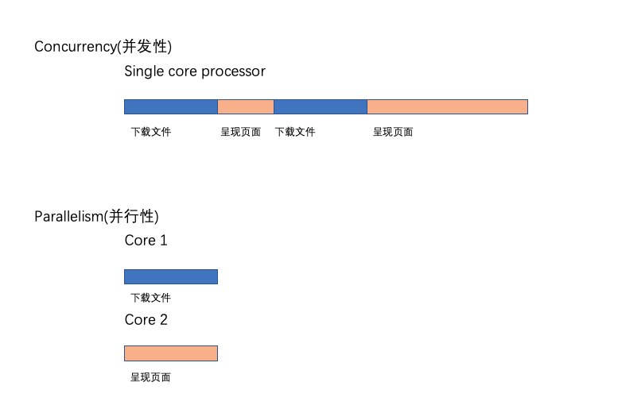


并行性Parallelism不会总是导致更快的执行时间。这是因为并行运行的组件可能需要相互通信。例如，在我们的浏览器中，当文件下载完成时，应该将其传递给用户，比如使用弹出窗口。这种通信发生在负责下载的组件和负责呈现用户界面的组件之间。这种通信开销在并发concurrent 系统中很低。当组件在多个内核中并行concurrent 运行时，这种通信开销很高。因此，并行程序并不总是导致更快的执行时间!


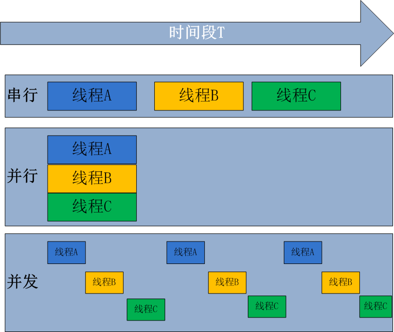


## 1.3 进程、线程、协程

**进程(Process)，线程(Thread)，协程(Coroutine，也叫轻量级线程)**

进程
进程是一个程序在一个数据集中的一次动态执行过程，可以简单理解为“正在执行的程序”，它是CPU资源分配和调度的独立单位。 
进程一般由程序、数据集、进程控制块三部分组成。我们编写的程序用来描述进程要完成哪些功能以及如何完成；数据集则是程序在执行过程中所需要使用的资源；进程控制块用来记录进程的外部特征，描述进程的执行变化过程，系统可以利用它来控制和管理进程，它是系统感知进程存在的唯一标志。 **进程的局限是创建、撤销和切换的开销比较大。**


线程
线程是在进程之后发展出来的概念。 线程也叫轻量级进程，它是一个基本的CPU执行单元，也是程序执行过程中的最小单元，由线程ID、程序计数器、寄存器集合和堆栈共同组成。一个进程可以包含多个线程。 
线程的优点是减小了程序并发执行时的开销，提高了操作系统的并发性能，缺点是线程没有自己的系统资源，只拥有在运行时必不可少的资源，但同一进程的各线程可以共享进程所拥有的系统资源，如果把进程比作一个车间，那么线程就好比是车间里面的工人。不过对于某些独占性资源存在锁机制，处理不当可能会产生“死锁”。


协程
协程是一种用户态的轻量级线程，又称微线程，英文名Coroutine，协程的调度完全由用户控制。人们通常将协程和子程序（函数）比较着理解。 
子程序调用总是一个入口，一次返回，一旦退出即完成了子程序的执行。 

**与传统的系统级线程和进程相比，协程的最大优势在于其"轻量级"，可以轻松创建上百万个而不会导致系统资源衰竭，而线程和进程通常最多也不能超过1万的。这也是协程也叫轻量级线程的原因。**

> 协程与多线程相比，其优势体现在：协程的执行效率极高。因为子程序切换不是线程切换，而是由程序自身控制，因此，没有线程切换的开销，和多线程比，线程数量越多，协程的性能优势就越明显。


**Go语言对于并发的实现是靠协程，Goroutine**


# 二、Go语言的并发模型

Go 语言相比Java等一个很大的优势就是可以方便地编写并发程序。Go 语言内置了 goroutine 机制，使用goroutine可以快速地开发并发程序， 更好的利用多核处理器资源。接下来我们来了解一下Go语言的并发原理。

## 2.1 线程模型

在现代操作系统中，线程是处理器调度和分配的基本单位，进程则作为资源拥有的基本单位。每个进程是由私有的虚拟地址空间、代码、数据和其它各种系统资源组成。线程是进程内部的一个执行单元。 每一个进程至少有一个主执行线程，它无需由用户去主动创建，是由系统自动创建的。 用户根据需要在应用程序中创建其它线程，多个线程并发地运行于同一个进程中。

我们先从线程讲起，无论语言层面何种并发模型，到了操作系统层面，一定是以线程的形态存在的。而操作系统根据资源访问权限的不同，体系架构可分为用户空间和内核空间；内核空间主要操作访问CPU资源、I/O资源、内存资源等硬件资源，为上层应用程序提供最基本的基础资源，用户空间呢就是上层应用程序的固定活动空间，用户空间不可以直接访问资源，必须通过“系统调用”、“库函数”或“Shell脚本”来调用内核空间提供的资源。

我们现在的计算机语言，可以狭义的认为是一种“软件”，它们中所谓的“线程”，往往是用户态的线程，和操作系统本身内核态的线程（简称KSE），还是有区别的。

Go并发编程模型在底层是由操作系统所提供的线程库支撑的，因此还是得从线程实现模型说起。

线程可以视为进程中的控制流。一个进程至少会包含一个线程，因为其中至少会有一个控制流持续运行。因而，一个进程的第一个线程会随着这个进程的启动而创建，这个线程称为该进程的主线程。当然，一个进程也可以包含多个线程。这些线程都是由当前进程中已存在的线程创建出来的，创建的方法就是调用系统调用，更确切地说是调用
pthread create函数。拥有多个线程的进程可以并发执行多个任务，并且即使某个或某些任务被阻塞，也不会影响其他任务正常执行，这可以大大改善程序的响应时间和吞吐量。另一方面，线程不可能独立于进程存在。它的生命周期不可能逾越其所属进程的生命周期。

线程的实现模型主要有3个，分别是:用户级线程模型、内核级线程模型和两级线程模型。它们之间最大的差异就在于线程与内核调度实体( Kernel Scheduling Entity,简称KSE)之间的对应关系上。顾名思义，内核调度实体就是可以被内核的调度器调度的对象。在很多文献和书中，它也称为内核级线程，是操作系统内核的最小调度单元。

#### 2.1.1 内核级线程模型

用户线程与KSE是1对1关系(1:1)。大部分编程语言的线程库(如linux的pthread，Java的java.lang.Thread，C++11的std::thread等等)都是对操作系统的线程（内核级线程）的一层封装，创建出来的每个线程与一个不同的KSE静态关联，因此其调度完全由OS调度器来做。这种方式实现简单，直接借助OS提供的线程能力，并且不同用户线程之间一般也不会相互影响。但其创建，销毁以及多个线程之间的上下文切换等操作都是直接由OS层面亲自来做，在需要使用大量线程的场景下对OS的性能影响会很大。

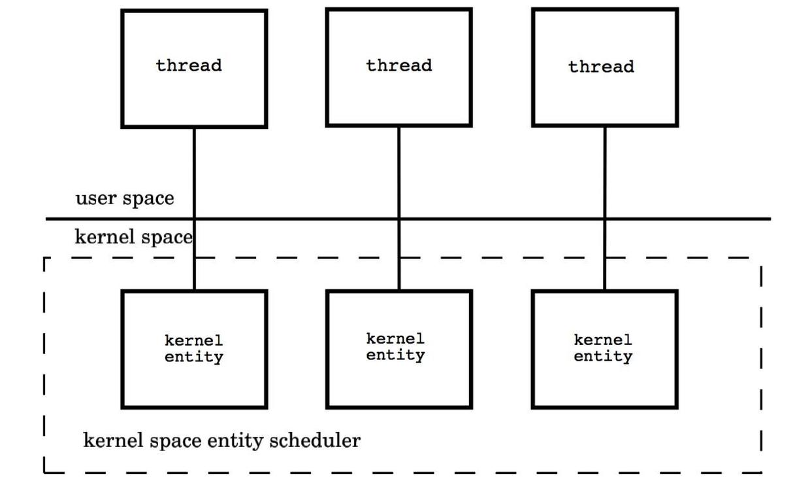

每个线程由内核调度器独立的调度，所以如果一个线程阻塞则不影响其他的线程。

优点：在多核处理器的硬件的支持下，内核空间线程模型支持了真正的并行，当一个线程被阻塞后，允许另一个线程继续执行，所以并发能力较强。

缺点：每创建一个用户级线程都需要创建一个内核级线程与其对应，这样创建线程的开销比较大，会影响到应用程序的性能。

#### 2.1.2 用户级线程模型

用户线程与KSE是多对1关系(M:1)，这种线程的创建，销毁以及多个线程之间的协调等操作都是由用户自己实现的线程库来负责，对OS内核透明，一个进程中所有创建的线程都与同一个KSE在运行时动态关联。现在有许多语言实现的 **协程** 基本上都属于这种方式。这种实现方式相比内核级线程可以做的很轻量级，对系统资源的消耗会小很多，因此可以创建的数量与上下文切换所花费的代价也会小得多。但该模型有个致命的缺点，如果我们在某个用户线程上调用阻塞式系统调用(如用阻塞方式read网络IO)，那么一旦KSE因阻塞被内核调度出CPU的话，剩下的所有对应的用户线程全都会变为阻塞状态（整个进程挂起）。 
所以这些语言的**协程库**会把自己一些阻塞的操作重新封装为完全的非阻塞形式，然后在以前要阻塞的点上，主动让出自己，并通过某种方式通知或唤醒其他待执行的用户线程在该KSE上运行，从而避免了内核调度器由于KSE阻塞而做上下文切换，这样整个进程也不会被阻塞了。

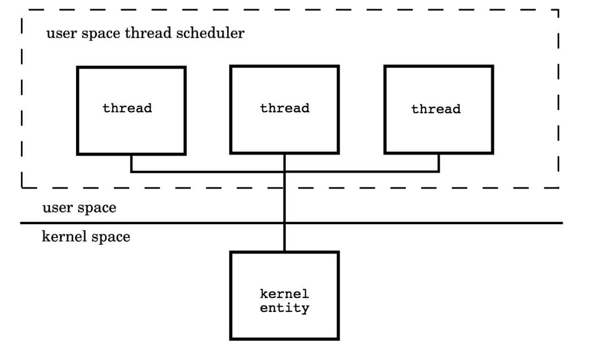

优点： 这种模型的好处是线程上下文切换都发生在用户空间，避免的模态切换（mode switch），从而对于性能有积极的影响。

缺点：所有的线程基于一个内核调度实体即内核线程，这意味着只有一个处理器可以被利用，在多处理器环境下这是不能够被接受的，本质上，用户线程只解决了并发问题，但是没有解决并行问题。如果线程因为 I/O 操作陷入了内核态，内核态线程阻塞等待 I/O 数据，则所有的线程都将会被阻塞，用户空间也可以使用非阻塞而 I/O，但是不能避免性能及复杂度问题。

#### 2.1.3 两级线程模型

用户线程与KSE是多对多关系(M:N)，这种实现综合了前两种模型的优点，为一个进程中创建多个KSE，并且线程可以与不同的KSE在运行时进行动态关联，当某个KSE由于其上工作的线程的阻塞操作被内核调度出CPU时，当前与其关联的其余用户线程可以重新与其他KSE建立关联关系。当然这种动态关联机制的实现很复杂，也需要用户自己去实现，这算是它的一个缺点吧。Go语言中的并发就是使用的这种实现方式，Go为了实现该模型自己实现了一个运行时调度器来负责Go中的"线程"与KSE的动态关联。此模型有时也被称为 **混合型线程模型**，**即用户调度器实现用户线程到KSE的“调度”，内核调度器实现KSE到CPU上的调度**。

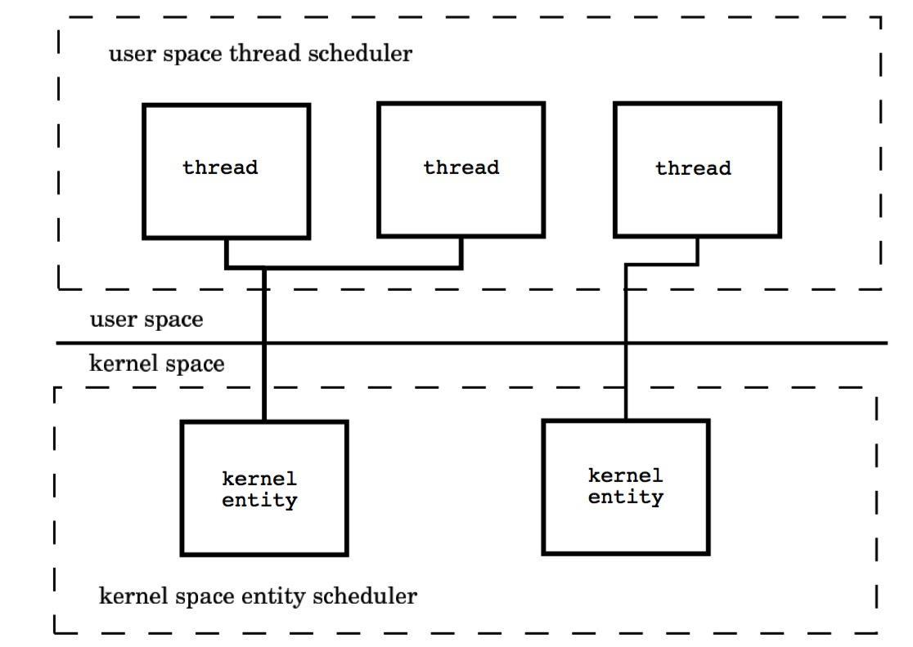


## 2.2 Go并发调度: G-P-M模型

在操作系统提供的内核线程之上，Go搭建了一个特有的两级线程模型。goroutine机制实现了M : N的线程模型，goroutine机制是协程（coroutine）的一种实现，golang内置的调度器，可以让多核CPU中每个CPU执行一个协程。

#### 2.2.1 调度器是如何工作的

有了上面的认识，我们可以开始真正的介绍Go的并发机制了，先用一段代码展示一下在Go语言中新建一个“线程”(Go语言中称为Goroutine)的样子：

```go
// 用go关键字加上一个函数（这里用了匿名函数）
// 调用就做到了在一个新的“线程”并发执行任务
go func() { 
    // do something in one new goroutine
}()
```

功能上等价于Java8的代码:

```java
new java.lang.Thread(() -> { 
    // do something in one new thread
}).start();
```

理解goroutine机制的原理，关键是理解Go语言scheduler的实现。

Go语言中支撑整个scheduler实现的主要有4个重要结构，分别是M、G、P、Sched， 前三个定义在runtime.h中，Sched定义在proc.c中。

- Sched结构就是调度器，它维护有存储M和G的队列以及调度器的一些状态信息等。
- M结构是Machine，系统线程，它由操作系统管理的，goroutine就是跑在M之上的；M是一个很大的结构，里面维护小对象内存cache（mcache）、当前执行的goroutine、随机数发生器等等非常多的信息。
- P结构是Processor，处理器，它的主要用途就是用来执行goroutine的，它维护了一个goroutine队列，即runqueue。Processor是让我们从N:1调度到M:N调度的重要部分。
- G是goroutine实现的核心结构，它包含了栈，指令指针，以及其他对调度goroutine很重要的信息，例如其阻塞的channel。

> Processor的数量是在启动时被设置为环境变量GOMAXPROCS的值，或者通过运行时调用函数GOMAXPROCS()进行设置。Processor数量固定意味着任意时刻只有GOMAXPROCS个线程在运行go代码。

我们分别用三角形，矩形和圆形表示Machine Processor和Goroutine。

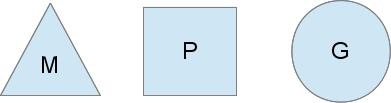


在单核处理器的场景下，所有goroutine运行在同一个M系统线程中，每一个M系统线程维护一个Processor，任何时刻，一个Processor中只有一个goroutine，其他goroutine在runqueue中等待。一个goroutine运行完自己的时间片后，让出上下文，回到runqueue中。 多核处理器的场景下，为了运行goroutines，每个M系统线程会持有一个Processor。

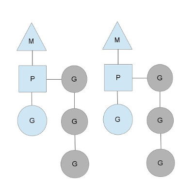


在正常情况下，scheduler会按照上面的流程进行调度，但是线程会发生阻塞等情况，看一下goroutine对线程阻塞等的处理。


#### 2.2.2 线程阻塞

当正在运行的goroutine阻塞的时候，例如进行系统调用，会再创建一个系统线程（M1），当前的M线程放弃了它的Processor，P转到新的线程中去运行。

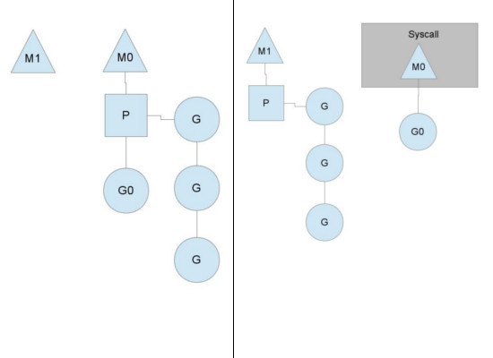


#### 2.2.3 runqueue执行完成

当其中一个Processor的runqueue为空，没有goroutine可以调度。它会从另外一个上下文偷取一半的goroutine。

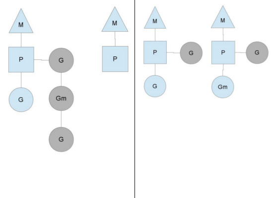


> 其图中的G，P和M都是Go语言运行时系统（其中包括内存分配器，并发调度器，垃圾收集器等组件，可以想象为Java中的JVM）抽象出来概念和数据结构对象：
> G：Goroutine的简称，上面用go关键字加函数调用的代码就是创建了一个G对象，是对一个要并发执行的任务的封装，也可以称作用户态线程。属于用户级资源，对OS透明，具备轻量级，可以大量创建，上下文切换成本低等特点。
> M：Machine的简称，在linux平台上是用clone系统调用创建的，其与用linux pthread库创建出来的线程本质上是一样的，都是利用系统调用创建出来的OS线程实体。M的作用就是执行G中包装的并发任务。**Go运行时系统中的调度器的主要职责就是将G公平合理的安排到多个M上去执行**。其属于OS资源，可创建的数量上也受限了OS，通常情况下G的数量都多于活跃的M的。
> P：Processor的简称，逻辑处理器，主要作用是管理G对象（每个P都有一个G队列），并为G在M上的运行提供本地化资源。

从两级线程模型来看，似乎并不需要P的参与，有G和M就可以了，那为什么要加入P这个东东呢？
其实Go语言运行时系统早期(Go1.0)的实现中并没有P的概念，Go中的调度器直接将G分配到合适的M上运行。但这样带来了很多问题，例如，不同的G在不同的M上并发运行时可能都需向系统申请资源（如堆内存），由于资源是全局的，将会由于资源竞争造成很多系统性能损耗，为了解决类似的问题，后面的Go（Go1.1）运行时系统加入了P，让P去管理G对象，M要想运行G必须先与一个P绑定，然后才能运行该P管理的G。这样带来的好处是，我们可以在P对象中预先申请一些系统资源（本地资源），G需要的时候先向自己的本地P申请（无需锁保护），如果不够用或没有再向全局申请，而且从全局拿的时候会多拿一部分，以供后面高效的使用。就像现在我们去政府办事情一样，先去本地政府看能搞定不，如果搞不定再去中央，从而提供办事效率。
而且由于P解耦了G和M对象，这样即使M由于被其上正在运行的G阻塞住，其余与该M关联的G也可以随着P一起迁移到别的活跃的M上继续运行，从而让G总能及时找到M并运行自己，从而提高系统的并发能力。
Go运行时系统通过构造G-P-M对象模型实现了一套用户态的并发调度系统，可以自己管理和调度自己的并发任务，所以可以说Go语言**原生支持并发**。**自己实现的调度器负责将并发任务分配到不同的内核线程上运行，然后内核调度器接管内核线程在CPU上的执行与调度。**

可以看到Go的并发用起来非常简单，用了一个语法糖将内部复杂的实现结结实实的包装了起来。其内部可以用下面这张图来概述：


写在最后，Go运行时完整的调度系统是很复杂，很难用一篇文章描述的清楚，这里只能从宏观上介绍一下，让大家有个整体的认识。

```go
// Goroutine1
func task1() {
    go task2()
    go task3()
}
```

假如我们有一个G(Goroutine1)已经通过P被安排到了一个M上正在执行，在Goroutine1执行的过程中我们又创建两个G，这两个G会被马上放入与Goroutine1相同的P的本地G任务队列中，排队等待与该P绑定的M的执行，这是最基本的结构，很好理解。 关键问题是:
**a.如何在一个多核心系统上尽量合理分配G到多个M上运行，充分利用多核，提高并发能力呢？**
如果我们在一个Goroutine中通过**go**关键字创建了大量G，这些G虽然暂时会被放在同一个队列, 但如果这时还有空闲P（系统内P的数量默认等于系统cpu核心数），Go运行时系统始终能保证至少有一个（通常也只有一个）活跃的M与空闲P绑定去各种G队列去寻找可运行的G任务，该种M称为**自旋的M**。一般寻找顺序为：自己绑定的P的队列，全局队列，然后其他P队列。如果自己P队列找到就拿出来开始运行，否则去全局队列看看，由于全局队列需要锁保护，如果里面有很多任务，会转移一批到本地P队列中，避免每次都去竞争锁。如果全局队列还是没有，就要开始玩狠的了，直接从其他P队列偷任务了（偷一半任务回来）。这样就保证了在还有可运行的G任务的情况下，总有与CPU核心数相等的M+P组合 在执行G任务或在执行G的路上(寻找G任务)。
**b. 如果某个M在执行G的过程中被G中的系统调用阻塞了，怎么办？**
在这种情况下，这个M将会被内核调度器调度出CPU并处于阻塞状态，与该M关联的其他G就没有办法继续执行了，但Go运行时系统的一个监控线程(sysmon线程)能探测到这样的M，并把与该M绑定的P剥离，寻找其他空闲或新建M接管该P，然后继续运行其中的G，大致过程如下图所示。然后等到该M从阻塞状态恢复，需要重新找一个空闲P来继续执行原来的G，如果这时系统正好没有空闲的P，就把原来的G放到全局队列当中，等待其他M+P组合发掘并执行。


**c. 如果某一个G在M运行时间过长，有没有办法做抢占式调度，让该M上的其他G获得一定的运行时间，以保证调度系统的公平性?**
我们知道linux的内核调度器主要是基于时间片和优先级做调度的。对于相同优先级的线程，内核调度器会尽量保证每个线程都能获得一定的执行时间。为了防止有些线程"饿死"的情况，内核调度器会发起抢占式调度将长期运行的线程中断并让出CPU资源，让其他线程获得执行机会。当然在Go的运行时调度器中也有类似的抢占机制，但并不能保证抢占能成功，因为Go运行时系统并没有内核调度器的中断能力，它只能通过向运行时间过长的G中设置抢占flag的方法温柔的让运行的G自己主动让出M的执行权。 
说到这里就不得不提一下Goroutine在运行过程中可以动态扩展自己线程栈的能力，可以从初始的2KB大小扩展到最大1G（64bit系统上），因此在每次调用函数之前需要先计算该函数调用需要的栈空间大小，然后按需扩展（超过最大值将导致运行时异常）。Go抢占式调度的机制就是利用在判断要不要扩栈的时候顺便查看以下自己的抢占flag，决定是否继续执行，还是让出自己。
运行时系统的监控线程会计时并设置抢占flag到运行时间过长的G，然后G在有函数调用的时候会检查该抢占flag，如果已设置就将自己放入全局队列，这样该M上关联的其他G就有机会执行了。但如果正在执行的G是个很耗时的操作且没有任何函数调用(如只是for循环中的计算操作)，即使抢占flag已经被设置，该G还是将一直霸占着当前M直到执行完自己的任务。


# 三、runtime包

官网文档对runtime包的介绍：

```
Package runtime contains operations that interact with Go's runtime system, such as functions to control goroutines. It also includes the low-level type information used by the reflect package; see reflect's documentation for the programmable interface to the run-time type system.
```

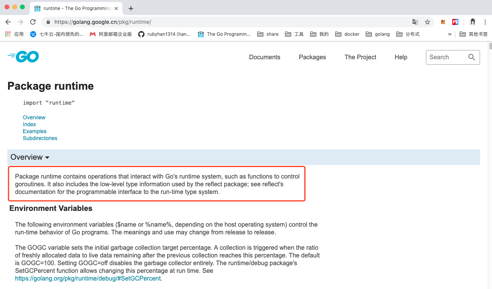


尽管 Go 编译器产生的是本地可执行代码，这些代码仍旧运行在 Go 的 runtime（这部分的代码可以在 runtime 包中找到）当中。这个 runtime 类似 Java 和 .NET 语言所用到的虚拟机，它负责管理包括内存分配、垃圾回收（第 10.8 节）、栈处理、goroutine、channel、切片（slice）、map 和反射（reflection）等等。

## 3.1 常用函数

**`runtime` 调度器是个非常有用的东西，关于 `runtime` 包几个方法:**

- **NumCPU**：返回当前系统的 `CPU` 核数量

- **GOMAXPROCS**：设置最大的可同时使用的 `CPU` 核数

  通过runtime.GOMAXPROCS函数，应用程序何以在运行期间设置运行时系统中得P最大数量。但这会引起“Stop the World”。所以，应在应用程序最早的调用。并且最好是在运行Go程序之前设置好操作程序的环境变量GOMAXPROCS，而不是在程序中调用runtime.GOMAXPROCS函数。

  无论我们传递给函数的整数值是什么值，运行时系统的P最大值总会在1~256之间。

> go1.8后，默认让程序运行在多个核上,可以不用设置了
> go1.8前，还是要设置一下，可以更高效的利益cpu


- **Gosched**：让当前线程让出 `cpu` 以让其它线程运行,它不会挂起当前线程，因此当前线程未来会继续执行

  这个函数的作用是让当前 `goroutine` 让出 `CPU`，当一个 `goroutine` 发生阻塞，`Go` 会自动地把与该 `goroutine` 处于同一系统线程的其他 `goroutine` 转移到另一个系统线程上去，以使这些 `goroutine` 不阻塞。

- **Goexit**：退出当前 `goroutine`(但是`defer`语句会照常执行)

- **NumGoroutine**：返回正在执行和排队的任务总数

  runtime.NumGoroutine函数在被调用后，会返回系统中的处于特定状态的Goroutine的数量。这里的特指是指Grunnable\Gruning\Gsyscall\Gwaition。处于这些状态的Groutine即被看做是活跃的或者说正在被调度。

  注意：垃圾回收所在Groutine的状态也处于这个范围内的话，也会被纳入该计数器。

- **GOOS**：目标操作系统

- **runtime.GC**:会让运行时系统进行一次强制性的垃圾收集

  1. 强制的垃圾回收：不管怎样，都要进行的垃圾回收。
  2. 非强制的垃圾回收：只会在一定条件下进行的垃圾回收（即运行时，系统自上次垃圾回收之后新申请的堆内存的单元（也成为单元增量）达到指定的数值）。

- **GOROOT** :获取goroot目录

- **GOOS** : 查看目标操作系统 
  很多时候，我们会根据平台的不同实现不同的操作，就而已用GOOS了：

- 。。。


## 3.2 示例代码：

1. 获取goroot和os：

 ```go
   //获取goroot目录：
   	fmt.Println("GOROOT-->",runtime.GOROOT())
   
   	//获取操作系统
   	fmt.Println("os/platform-->",runtime.GOOS) // GOOS--> darwin，mac系统
   
 ```

   

2. 获取CPU数量，和设置CPU数量：

```go
func init(){
	//1.获取逻辑cpu的数量
	fmt.Println("逻辑CPU的核数：",runtime.NumCPU())
	//2.设置go程序执行的最大的：[1,256]
	n := runtime.GOMAXPROCS(runtime.NumCPU())
	fmt.Println(n)
}
```

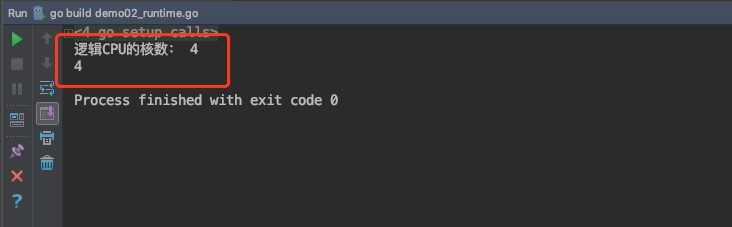


3. Gosched()：

```go
func main() {
	go func() {
		for i := 0; i < 5; i++ {
			fmt.Println("goroutine。。。")
		}

	}()

	for i := 0; i < 4; i++ {
		//让出时间片，先让别的协议执行，它执行完，再回来执行此协程
		runtime.Gosched()
		fmt.Println("main。。")
	}
}

```

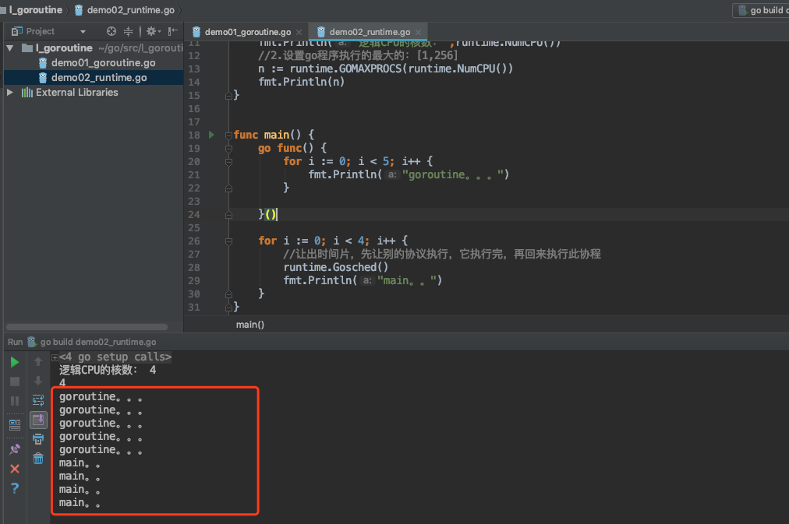


4. Goexit的使用（终止协程）

```go

func main() {
	//创建新建的协程
	go func() {
		fmt.Println("goroutine开始。。。")

		//调用了别的函数
		fun()

		fmt.Println("goroutine结束。。")
	}() //别忘了()

	//睡一会儿，不让主协程结束
	time.Sleep(3*time.Second)
}


func fun() {
	defer fmt.Println("defer。。。")

	//return           //终止此函数
	runtime.Goexit() //终止所在的协程

	fmt.Println("fun函数。。。")
}
```

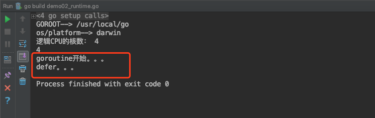


# 四、临界资源安全问题

## 4.1 临界资源

**临界资源:** 指并发环境中多个进程/线程/协程共享的资源。

但是在并发编程中对临界资源的处理不当， 往往会导致数据不一致的问题。

示例代码：

```go
package main

import (
	"fmt"
	"time"
)

func main()  {
	a := 1
	go func() {
		a = 2
		fmt.Println("子goroutine。。",a)
	}()
	a = 3
	time.Sleep(1)
	fmt.Println("main goroutine。。",a)
}
```

我们通过终端命令来执行：

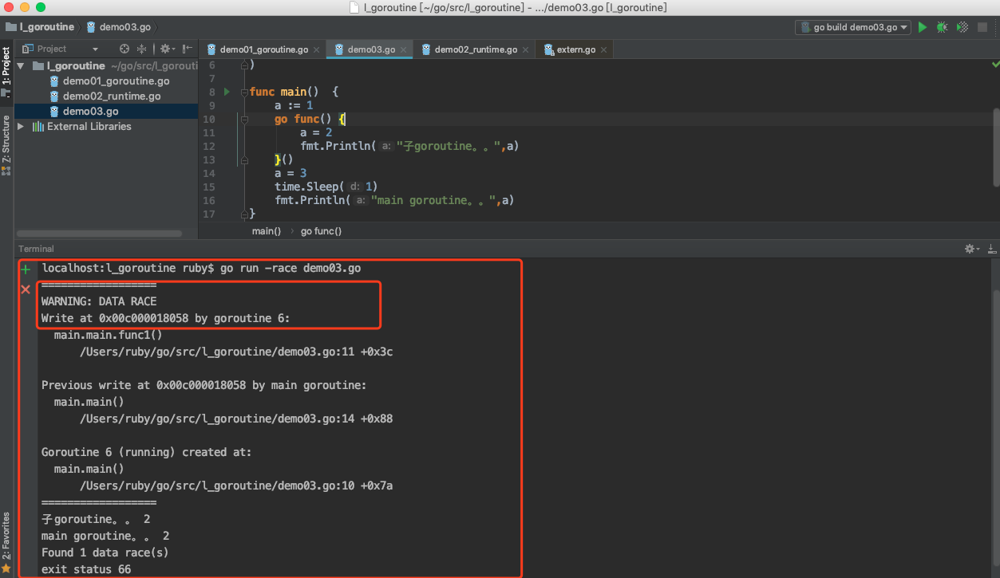

能够发现一处被多个goroutine共享的数据。


## 4.2 临界资源安全问题


并发本身并不复杂，但是因为有了资源竞争的问题，就使得我们开发出好的并发程序变得复杂起来，因为会引起很多莫名其妙的问题。

如果多个goroutine在访问同一个数据资源的时候，其中一个线程修改了数据，那么这个数值就被修改了，对于其他的goroutine来讲，这个数值可能是不对的。

举个例子，我们通过并发来实现火车站售票这个程序。一共有100张票，4个售票口同时出售。

我们先来看一下示例代码：

```go
package main

import (
	"fmt"
	"math/rand"
	"time"
)

//全局变量
var ticket = 10 // 100张票

func main() {
	/*
	4个goroutine，模拟4个售票口，4个子程序操作同一个共享数据。
	 */
	go saleTickets("售票口1") // g1,100
	go saleTickets("售票口2") // g2,100
	go saleTickets("售票口3") //g3,100
	go saleTickets("售票口4") //g4,100

	time.Sleep(5*time.Second)
}

func saleTickets(name string) {
	rand.Seed(time.Now().UnixNano())
	//for i:=1;i<=100;i++{
	//	fmt.Println(name,"售出：",i)
	//}
	for { //ticket=1
		if ticket > 0 { //g1,g3,g2,g4
			//睡眠
			time.Sleep(time.Duration(rand.Intn(1000)) * time.Millisecond)
			// g1 ,g3, g2,g4
			fmt.Println(name, "售出：", ticket)  // 1 , 0, -1 , -2
			ticket--   //0 , -1 ,-2 , -3
		} else {
			fmt.Println(name,"售罄，没有票了。。")
			break
		}
	}
}

```


我们为了更好的观察临界资源问题，每个goroutine先睡眠一个随机数，然后再售票，我们发现程序的运行结果，还可以卖出编号为负数的票。

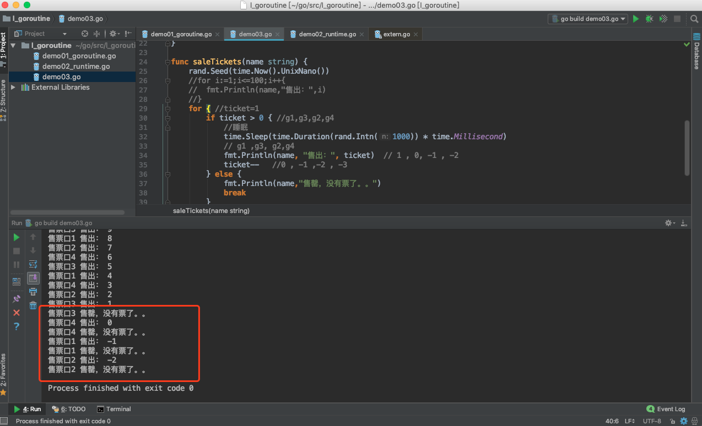


**分析：**

我们的卖票逻辑是先判断票数的编号是否为负数，如果大于0，然后我们就进行卖票，只不过在卖票钱先睡眠，然后再卖，假如说此时已经卖票到只剩最后1张了，某一个goroutine持有了CPU的时间片，那么它再片段是否有票的时候，条件是成立的，所以它可以卖票编号为1的最后一张票。但是因为它在卖之前，先睡眠了，那么其他的goroutine就会持有CPU的时间片，而此时这张票还没有被卖出，那么第二个goroutine再判断是否有票的时候，条件也是成立的，那么它可以卖出这张票，然而它也进入了睡眠。。其他的第三个第四个goroutine都是这样的逻辑，当某个goroutine醒来的时候，不会再判断是否有票，而是直接售出，这样就卖出最后一张票了，然而其他的goroutine醒来的时候，就会陆续卖出了第0张，-1张，-2张。

这就是临界资源的不安全问题。某一个goroutine在访问某个数据资源的时候，按照数值，已经判断好了条件，然后又被其他的goroutine抢占了资源，并修改了数值，等这个goroutine再继续访问这个数据的时候，数值已经不对了。

## 4.3 临界资源安全问题的解决

要想解决临界资源安全的问题，很多编程语言的解决方案都是同步。通过上锁的方式，某一时间段，只能允许一个goroutine来访问这个共享数据，当前goroutine访问完毕，解锁后，其他的goroutine才能来访问。

我们可以借助于sync包下的锁操作。

示例代码：

```go
package main

import (
	"fmt"
	"math/rand"
	"time"
	"sync"
)

//全局变量
var ticket = 10 // 100张票

var wg sync.WaitGroup
var matex sync.Mutex // 创建锁头

func main() {
	/*
	4个goroutine，模拟4个售票口，4个子程序操作同一个共享数据。
	 */
	wg.Add(4)
	go saleTickets("售票口1") // g1,100
	go saleTickets("售票口2") // g2,100
	go saleTickets("售票口3") //g3,100
	go saleTickets("售票口4") //g4,100
	wg.Wait()              // main要等待。。。

	//time.Sleep(5*time.Second)
}

func saleTickets(name string) {
	rand.Seed(time.Now().UnixNano())
	defer wg.Done()
	//for i:=1;i<=100;i++{
	//	fmt.Println(name,"售出：",i)
	//}
	for { //ticket=1
		matex.Lock()
		if ticket > 0 { //g1,g3,g2,g4
			//睡眠
			time.Sleep(time.Duration(rand.Intn(1000)) * time.Millisecond)
			// g1 ,g3, g2,g4
			fmt.Println(name, "售出：", ticket) // 1 , 0, -1 , -2
			ticket--                         //0 , -1 ,-2 , -3
		} else {
			matex.Unlock() //解锁
			fmt.Println(name, "售罄，没有票了。。")
			break
		}
		matex.Unlock() //解锁
	}
}

```


运行结果：

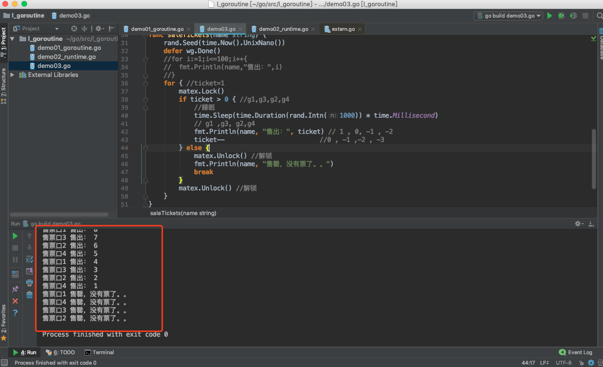


在Go的并发编程中有一句很经典的话：**不要以共享内存的方式去通信，而要以通信的方式去共享内存。**

在Go语言中并不鼓励用锁保护共享状态的方式在不同的Goroutine中分享信息(以共享内存的方式去通信)。而是鼓励通过**channel**将共享状态或共享状态的变化在各个Goroutine之间传递（以通信的方式去共享内存），这样同样能像用锁一样保证在同一的时间只有一个Goroutine访问共享状态。

当然，在主流的编程语言中为了保证多线程之间共享数据安全性和一致性，都会提供一套基本的同步工具集，如锁，条件变量，原子操作等等。Go语言标准库也毫不意外的提供了这些同步机制，使用方式也和其他语言也差不多。


# 五、sync包

官网文档对sync包的介绍：

```
Package sync provides basic synchronization primitives such as mutual exclusion locks. Other than the Once and WaitGroup types, most are intended for use by low-level library routines. Higher-level synchronization is better done via channels and communication.
```


sync是synchronization同步这个词的缩写，所以也会叫做同步包。这里提供了基本同步的操作，比如互斥锁等等。这里除了Once和WaitGroup类型之外，大多数类型都是供低级库例程使用的。更高级别的同步最好通过channel通道和communication通信来完成


## 5.1 WaitGroup

WaitGroup，同步等待组。

在类型上，它是一个结构体。一个WaitGroup的用途是等待一个goroutine的集合执行完成。主goroutine调用了Add()方法来设置要等待的goroutine的数量。然后，每个goroutine都会执行并且执行完成后调用Done()这个方法。与此同时，可以使用Wait()方法来阻塞，直到所有的goroutine都执行完成。

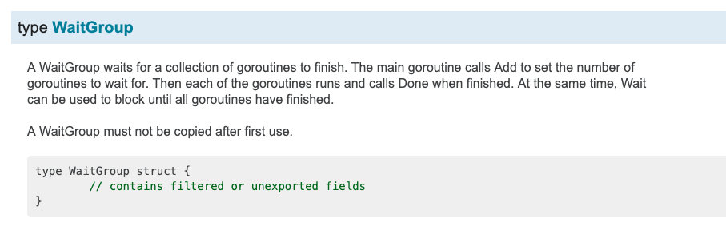

### 5.1.1 Add()方法：

Add这个方法，用来设置到WaitGroup的计数器的值。我们可以理解为每个waitgroup中都有一个计数器
用来表示这个同步等待组中要执行的goroutin的数量。

如果计数器的数值变为0，那么就表示等待时被阻塞的goroutine都被释放，如果计数器的数值为负数，那么就会引发恐慌，程序就报错了。

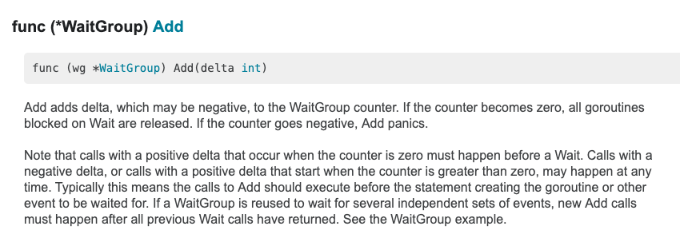


### 5.1.2 Done()方法

Done()方法，就是当WaitGroup同步等待组中的某个goroutine执行完毕后，设置这个WaitGroup的counter数值减1。


其实Done()的底层代码就是调用了Add()方法：

```go
// Done decrements the WaitGroup counter by one.
func (wg *WaitGroup) Done() {
	wg.Add(-1)
}
```


### 5.1.3 Wait()方法

Wait()方法，表示让当前的goroutine等待，进入阻塞状态。一直到WaitGroup的计数器为零。才能解除阻塞，
这个goroutine才能继续执行。

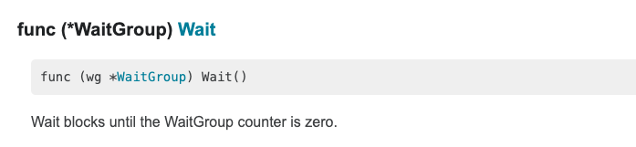


### 5.1.4 示例代码：

我们创建并启动两个goroutine，来打印数字和字母，并在main goroutine中，将这两个子goroutine加入到一个WaitGroup中，同时让main goroutine进入Wait()，让两个子goroutine先执行。当每个子goroutine执行完毕后，调用Done()方法，设置WaitGroup的counter减1。当两条子goroutine都执行完毕后，WaitGroup中的counter的数值为零，解除main goroutine的阻塞。

示例代码：

```go
package main

import (
	"fmt"
	"sync"
)
var wg sync.WaitGroup // 创建同步等待组对象
func main()  {
	/*
	WaitGroup：同步等待组
		可以使用Add(),设置等待组中要 执行的子goroutine的数量，
		
		在main 函数中，使用wait(),让主程序处于等待状态。直到等待组中子程序执行完毕。解除阻塞

		子gorotuine对应的函数中。wg.Done()，用于让等待组中的子程序的数量减1
	 */
	//设置等待组中，要执行的goroutine的数量
	wg.Add(2)
	go fun1()
	go fun2()
	fmt.Println("main进入阻塞状态。。。等待wg中的子goroutine结束。。")
	wg.Wait() //表示main goroutine进入等待，意味着阻塞
	fmt.Println("main，解除阻塞。。")

}
func fun1()  {
	for i:=1;i<=10;i++{
		fmt.Println("fun1.。。i:",i)
	}
	wg.Done() //给wg等待中的执行的goroutine数量减1.同Add(-1)
}
func fun2()  {
	defer wg.Done()
	for j:=1;j<=10;j++{
		fmt.Println("\tfun2..j,",j)
	}
}


```

运行结果：

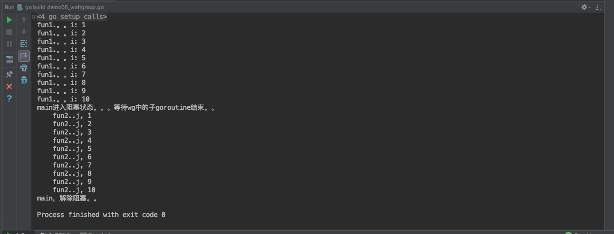


```
GOROOT=/usr/local/go #gosetup
GOPATH=/Users/ruby/go #gosetup
/usr/local/go/bin/go build -i -o /private/var/folders/kt/nlhsnpgn6lgd_q16f8j83sbh0000gn/T/___go_build_demo05_waitgroup_go /Users/ruby/go/src/l_goroutine/demo05_waitgroup.go #gosetup
/private/var/folders/kt/nlhsnpgn6lgd_q16f8j83sbh0000gn/T/___go_build_demo05_waitgroup_go #gosetup
fun1.。。i: 1
fun1.。。i: 2
fun1.。。i: 3
fun1.。。i: 4
fun1.。。i: 5
fun1.。。i: 6
fun1.。。i: 7
fun1.。。i: 8
fun1.。。i: 9
fun1.。。i: 10
main进入阻塞状态。。。等待wg中的子goroutine结束。。
	fun2..j, 1
	fun2..j, 2
	fun2..j, 3
	fun2..j, 4
	fun2..j, 5
	fun2..j, 6
	fun2..j, 7
	fun2..j, 8
	fun2..j, 9
	fun2..j, 10
main，解除阻塞。。

Process finished with exit code 0

```


## 5.2 Mutex(互斥锁)

通过上一小节，我们知道了在并发程序中，会存在临界资源问题。就是当多个协程来访问共享的数据资源，那么这个共享资源是不安全的。为了解决协程同步的问题我们使用了channel，但是Go语言也提供了传统的同步工具。

什么是锁呢？就是某个协程（线程）在访问某个资源时先锁住，防止其它协程的访问，等访问完毕解锁后其他协程再来加锁进行访问。一般用于处理并发中的临界资源问题。

Go语言包中的 sync 包提供了两种锁类型：sync.Mutex 和 sync.RWMutex。

Mutex 是最简单的一种锁类型，互斥锁，同时也比较暴力，当一个 goroutine 获得了 Mutex 后，其他 goroutine 就只能乖乖等到这个 goroutine 释放该 Mutex。

每个资源都对应于一个可称为 “互斥锁” 的标记，这个标记用来保证在任意时刻，只能有一个协程（线程）访问该资源。其它的协程只能等待。

互斥锁是传统并发编程对共享资源进行访问控制的主要手段，它由标准库sync中的Mutex结构体类型表示。sync.Mutex类型只有两个公开的指针方法，Lock和Unlock。Lock锁定当前的共享资源，Unlock进行解锁。

在使用互斥锁时，一定要注意：对资源操作完成后，一定要解锁，否则会出现流程执行异常，死锁等问题。通常借助defer。锁定后，立即使用defer语句保证互斥锁及时解锁。


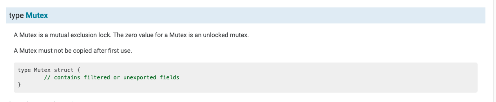

部分源码：

```go
/ A Mutex is a mutual exclusion lock.
// The zero value for a Mutex is an unlocked mutex.
//
// A Mutex must not be copied after first use.
type Mutex struct {
	state int32 //互斥锁上锁状态枚举值如下所示
	sema  uint32 //信号量，向处于Gwaitting的G发送信号
}

// A Locker represents an object that can be locked and unlocked.
type Locker interface {
	Lock()
	Unlock()
}

const (
	mutexLocked = 1 << iota // mutex is locked  ，1 互斥锁是锁定的
	mutexWoken // 2 唤醒锁
	mutexStarving
	mutexWaiterShift = iota // 统计阻塞在这个互斥锁上的goroutine数目需要移位的数值
	starvationThresholdNs = 1e6
)

```


### 5.2.1 Lock()方法：

Lock()这个方法，锁定m。如果该锁已在使用中，则调用goroutine将阻塞，直到互斥体可用。

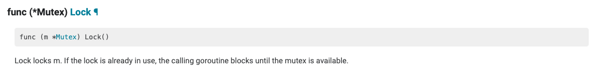


### 5.2.2 Unlock()方法

Unlock()方法，解锁解锁m。如果m未在要解锁的条目上锁定，则为运行时错误。

锁定的互斥体不与特定的goroutine关联。允许一个goroutine锁定互斥体，然后安排另一个goroutine解锁互斥体。

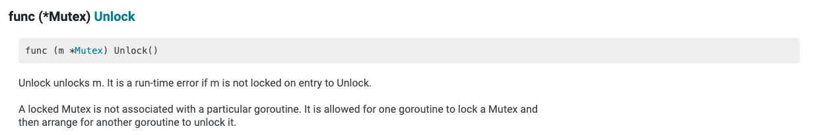


### 5.2.3 示例代码：

我们针对于上次课程汇总，使用goroutine，模拟4个售票口出售火车票的案例。4个售票口同时卖票，会发生临界资源数据安全问题。我们使用互斥锁解决一下。(Go语言推崇的是使用Channel来实现数据共享，但是也还是提供了传统的同步处理方式)

示例代码：

```go
package main

import (
	"fmt"
	"time"
	"math/rand"
	"sync"
)

//全局变量，表示票
var ticket = 10 //100张票


var mutex sync.Mutex //创建锁头

var wg sync.WaitGroup //同步等待组对象
func main() {
	/*
	4个goroutine，模拟4个售票口，


	在使用互斥锁的时候，对资源操作完，一定要解锁。否则会出现程序异常，死锁等问题。
	defer语句
	 */

	 wg.Add(4)
	go saleTickets("售票口1")
	go saleTickets("售票口2")
	go saleTickets("售票口3")
	go saleTickets("售票口4")

	wg.Wait() //main要等待
	fmt.Println("程序结束了。。。")

	//time.Sleep(5*time.Second)
}

func saleTickets(name string){
	rand.Seed(time.Now().UnixNano())
	defer wg.Done()
	for{
		//上锁
		mutex.Lock() //g2
		if ticket > 0{ //ticket 1 g1
			time.Sleep(time.Duration(rand.Intn(1000))*time.Millisecond)
			fmt.Println(name,"售出：",ticket) // 1
			ticket-- // 0
		}else{
			mutex.Unlock() //条件不满足，也要解锁
			fmt.Println(name,"售罄，没有票了。。")
			break
		}
		mutex.Unlock() //解锁
	}
}

```

运行结果：

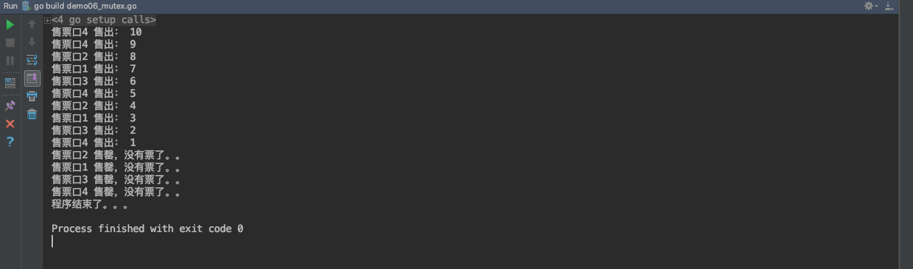


```
GOROOT=/usr/local/go #gosetup
GOPATH=/Users/ruby/go #gosetup
/usr/local/go/bin/go build -i -o /private/var/folders/kt/nlhsnpgn6lgd_q16f8j83sbh0000gn/T/___go_build_demo06_mutex_go /Users/ruby/go/src/l_goroutine/demo06_mutex.go #gosetup
/private/var/folders/kt/nlhsnpgn6lgd_q16f8j83sbh0000gn/T/___go_build_demo06_mutex_go #gosetup
售票口4 售出： 10
售票口4 售出： 9
售票口2 售出： 8
售票口1 售出： 7
售票口3 售出： 6
售票口4 售出： 5
售票口2 售出： 4
售票口1 售出： 3
售票口3 售出： 2
售票口4 售出： 1
售票口2 售罄，没有票了。。
售票口1 售罄，没有票了。。
售票口3 售罄，没有票了。。
售票口4 售罄，没有票了。。
程序结束了。。。

Process finished with exit code 0

```


## 5.3 RWMutex(读写锁)

通过对互斥锁的学习，我们已经知道了锁的概念以及用途。主要是用于处理并发中的临界资源问题。

Go语言包中的 sync 包提供了两种锁类型：sync.Mutex 和 sync.RWMutex。其中RWMutex是基于Mutex实现的，只读锁的实现使用类似引用计数器的功能。

RWMutex是读/写互斥锁。锁可以由任意数量的读取器或单个编写器持有。RWMutex的零值是未锁定的mutex。

如果一个goroutine持有一个rRWMutex进行读取，而另一个goroutine可能调用lock，那么在释放初始读取锁之前，任何goroutine都不应该期望能够获取读取锁。特别是，这禁止递归读取锁定。这是为了确保锁最终可用；被阻止的锁调用会将新的读卡器排除在获取锁之外。


我们怎么理解读写锁呢？当有一个 goroutine 获得写锁定，其它无论是读锁定还是写锁定都将阻塞直到写解锁；当有一个 goroutine 获得读锁定，其它读锁定仍然可以继续；当有一个或任意多个读锁定，写锁定将等待所有读锁定解锁之后才能够进行写锁定。所以说这里的读锁定（RLock）目的其实是告诉写锁定：有很多人正在读取数据，你给我站一边去，等它们读（读解锁）完你再来写（写锁定）。我们可以将其总结为如下三条：

1. 同时只能有一个 goroutine 能够获得写锁定。
2. 同时可以有任意多个 gorouinte 获得读锁定。
3. 同时只能存在写锁定或读锁定（读和写互斥）。

所以，RWMutex这个读写锁，该锁可以加多个读锁或者一个写锁，其经常用于读次数远远多于写次数的场景。

读写锁的写锁只能锁定一次，解锁前不能多次锁定，读锁可以多次，但读解锁次数最多只能比读锁次数多一次，一般情况下我们不建议读解锁次数多余读锁次数。

基本遵循两大原则：

	1、可以随便读，多个goroutine同时读。
	
	2、写的时候，啥也不能干。不能读也不能写。

读写锁即是针对于读写操作的互斥锁。它与普通的互斥锁最大的不同就是，它可以分别针对读操作和写操作进行锁定和解锁操作。读写锁遵循的访问控制规则与互斥锁有所不同。在读写锁管辖的范围内，它允许任意个读操作的同时进行。但是在同一时刻，它只允许有一个写操作在进行。

并且在某一个写操作被进行的过程中，读操作的进行也是不被允许的。也就是说读写锁控制下的多个写操作之间都是互斥的，并且写操作与读操作之间也都是互斥的。但是，多个读操作之间却不存在互斥关系。

### 5.3.1 RLock()方法

```go
func (rw *RWMutex) RLock()
```

读锁，当有写锁时，无法加载读锁，当只有读锁或者没有锁时，可以加载读锁，读锁可以加载多个，所以适用于“读多写少”的场景。

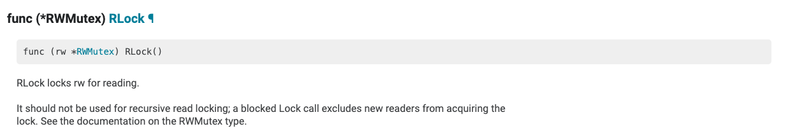


### 5.3.2 RUnlock()方法

```go
func (rw *RWMutex) RUnlock()
```

读锁解锁，RUnlock 撤销单次RLock调用，它对于其它同时存在的读取器则没有效果。若rw并没有为读取而锁定，调用RUnlock就会引发一个运行时错误。


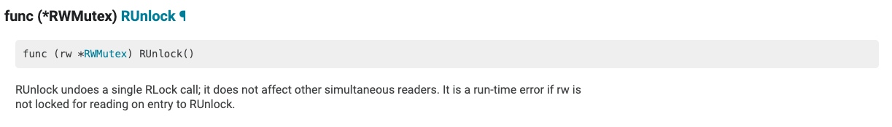


### 5.3.3 Lock()方法：

```go
func (rw *RWMutex) Lock()
```

写锁，如果在添加写锁之前已经有其他的读锁和写锁，则Lock就会阻塞直到该锁可用，为确保该锁最终可用，已阻塞的Lock调用会从获得的锁中排除新的读取锁，即写锁权限高于读锁，有写锁时优先进行写锁定。

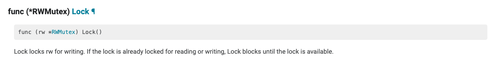


### 5.3.4 Unlock()方法

```go
func (rw *RWMutex) Unlock()
```

写锁解锁，如果没有进行写锁定，则就会引起一个运行时错误。

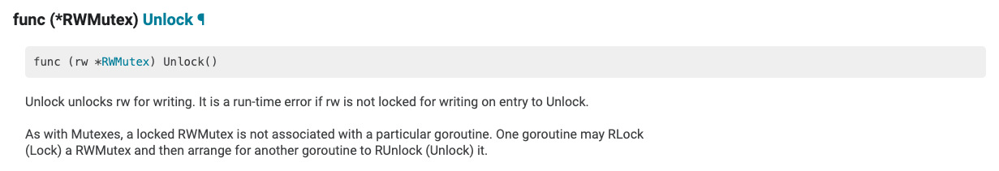


### 5.3.5 示例代码：

示例代码：

```go
package main

import (
	"fmt"
	"sync"
	"time"
)


var rwMutex *sync.RWMutex
var wg *sync.WaitGroup
func main() {
	rwMutex = new(sync.RWMutex)
	wg = new (sync.WaitGroup)

	//wg.Add(2)
	//
	////多个同时读取
	//go readData(1)
	//go readData(2)

	wg.Add(3)
	go writeData(1)
	go readData(2)
	go writeData(3)

	wg.Wait()
	fmt.Println("main..over...")
}


func writeData(i int){
	defer wg.Done()
	fmt.Println(i,"开始写：write start。。")
	rwMutex.Lock()//写操作上锁
	fmt.Println(i,"正在写：writing。。。。")
	time.Sleep(3*time.Second)
	rwMutex.Unlock()
	fmt.Println(i,"写结束：write over。。")
}

func readData(i int) {
	defer wg.Done()

	fmt.Println(i, "开始读：read start。。")

	rwMutex.RLock() //读操作上锁
	fmt.Println(i,"正在读取数据：reading。。。")
	time.Sleep(3*time.Second)
	rwMutex.RUnlock() //读操作解锁
	fmt.Println(i,"读结束：read over。。。")
}


```

运行结果：

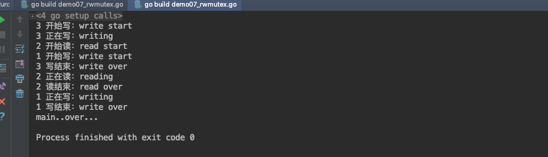


```
GOROOT=/usr/local/go #gosetup
GOPATH=/Users/ruby/go #gosetup
/usr/local/go/bin/go build -i -o /private/var/folders/kt/nlhsnpgn6lgd_q16f8j83sbh0000gn/T/___go_build_demo07_rwmutex_go /Users/ruby/go/src/l_goroutine/demo07_rwmutex.go #gosetup
/private/var/folders/kt/nlhsnpgn6lgd_q16f8j83sbh0000gn/T/___go_build_demo07_rwmutex_go #gosetup
3 开始写：write start
3 正在写：writing
2 开始读：read start
1 开始写：write start
3 写结束：write over
2 正在读：reading
2 读结束：read over
1 正在写：writing
1 写结束：write over
main..over...

Process finished with exit code 0

```


最后概括：

1. 读锁不能阻塞读锁
2. 读锁需要阻塞写锁，直到所有读锁都释放
3. 写锁需要阻塞读锁，直到所有写锁都释放
4. 写锁需要阻塞写锁


本文参考链接：

https://www.bbsmax.com/A/kPzOQY3a5x/

https://studygolang.com/articles/11322?fr=sidebar

https://www.cnblogs.com/williamjie/p/9456764.html


千锋Go语言的学习群：784190273

作者B站：

https://space.bilibili.com/353694001

对应视频地址：

https://www.bilibili.com/video/av56860636

https://www.bilibili.com/video/av56945376

源代码：

https://github.com/rubyhan1314/go_goroutine


