# channel通道

> @author：韩茹
>
> 版权所有：北京千锋互联科技有限公司


通道可以被认为是Goroutines通信的管道。类似于管道中的水从一端到另一端的流动，数据可以从一端发送到另一端，通过通道接收。

在前面讲Go语言的并发时候，我们就说过，当多个Goroutine想实现共享数据的时候，虽然也提供了传统的同步机制，但是Go语言强烈建议的是使用Channel通道来实现Goroutines之间的通信。

```
“不要通过共享内存来通信，而应该通过通信来共享内存” 这是一句风靡golang社区的经典语
```

Go语言中，要传递某个数据给另一个goroutine(协程)，可以把这个数据封装成一个对象，然后把这个对象的指针传入某个channel中，另外一个goroutine从这个channel中读出这个指针，并处理其指向的内存对象。Go从语言层面保证同一个时间只有一个goroutine能够访问channel里面的数据，为开发者提供了一种优雅简单的工具，所以Go的做法就是使用channel来通信，通过通信来传递内存数据，使得内存数据在不同的goroutine中传递，而不是使用共享内存来通信。


## 一、 什么是通道

### 1.1 通道的概念

通道是什么，通道就是goroutine之间的通道。它可以让goroutine之间相互通信。

每个通道都有与其相关的类型。该类型是通道允许传输的数据类型。(通道的零值为nil。nil通道没有任何用处，因此通道必须使用类似于map和切片的方法来定义。)

### 1.2 通道的声明

声明一个通道和定义一个变量的语法一样：

```go
//声明通道
var 通道名 chan 数据类型
//创建通道：如果通道为nil(就是不存在)，就需要先创建通道
通道名 = make(chan 数据类型)
```


示例代码：

```go
package main

import "fmt"

func main() {
	var a chan int
	if a == nil {
		fmt.Println("channel 是 nil 的, 不能使用，需要先创建通道。。")
		a = make(chan int)
		fmt.Printf("数据类型是： %T", a)
	}
}

```

运行结果：

```

channel 是 nil 的, 不能使用，需要先创建通道。。
数据类型是： chan int
```

也可以简短的声明：

```go
a := make(chan int) 
```

### 1.3 channel的数据类型

channel是引用类型的数据，在作为参数传递的时候，传递的是内存地址。

示例代码：

```go
package main

import (
	"fmt"
)

func main() {
	ch1 := make(chan int)
	fmt.Printf("%T,%p\n",ch1,ch1)

	test1(ch1)

}

func test1(ch chan int){
	fmt.Printf("%T,%p\n",ch,ch)
}


```

运行结果：

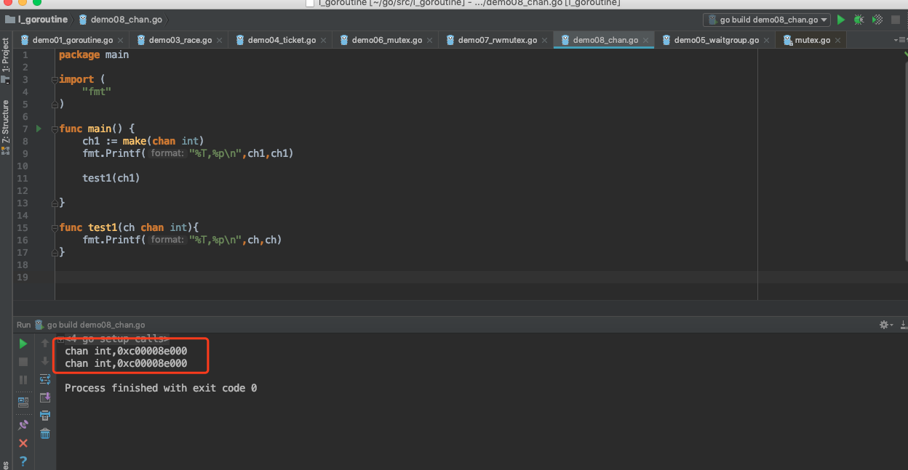

我们能够看到，ch和ch1的地址是一样的，说明它们是同一个通道。


### 1.4 通道的注意点

Channel通道在使用的时候，有以下几个注意点：

- 1.用于goroutine，传递消息的。
- 2.通道，每个都有相关联的数据类型,
  			nil chan，不能使用，类似于nil map，不能直接存储键值对
- 3.使用通道传递数据：<-
  			   chan <- data,发送数据到通道。向通道中写数据
       data <- chan,从通道中获取数据。从通道中读数据
- 4.阻塞：
  			   发送数据：chan <- data,阻塞的，直到另一条goroutine，读取数据来解除阻塞
       读取数据：data <- chan,也是阻塞的。直到另一条goroutine，写出数据解除阻塞。
  
- 5.本身channel就是同步的，意味着同一时间，只能有一条goroutine来操作。

最后：通道是goroutine之间的连接，所以通道的发送和接收必须处在不同的goroutine中。


## 二、通道的使用语法

### 2.1 发送和接收

发送和接收的语法：

```go
data := <- a // read from channel a  
a <- data // write to channel a
```

在通道上箭头的方向指定数据是发送还是接收。

另外：

```go
v, ok := <- a //从一个channel中读取
```


### 2.2 发送和接收默认是阻塞的

一个通道发送和接收数据，默认是阻塞的。当一个数据被发送到通道时，在发送语句中被阻塞，直到另一个Goroutine从该通道读取数据。相对地，当从通道读取数据时，读取被阻塞，直到一个Goroutine将数据写入该通道。

这些通道的特性是帮助Goroutines有效地进行通信，而无需像使用其他编程语言中非常常见的显式锁或条件变量。

示例代码：

```go
package main

import "fmt"

func main() {
	var ch1 chan bool       //声明，没有创建
	fmt.Println(ch1)        //<nil>
	fmt.Printf("%T\n", ch1) //chan bool
	ch1 = make(chan bool)   //0xc0000a4000,是引用类型的数据
	fmt.Println(ch1)

	go func() {
		for i := 0; i < 10; i++ {
			fmt.Println("子goroutine中，i：", i)
		}
		// 循环结束后，向通道中写数据，表示要结束了。。
		ch1 <- true

		fmt.Println("结束。。")

	}()

	data := <-ch1 // 从ch1通道中读取数据
	fmt.Println("data-->", data)
	fmt.Println("main。。over。。。。")
}

```

运行结果：

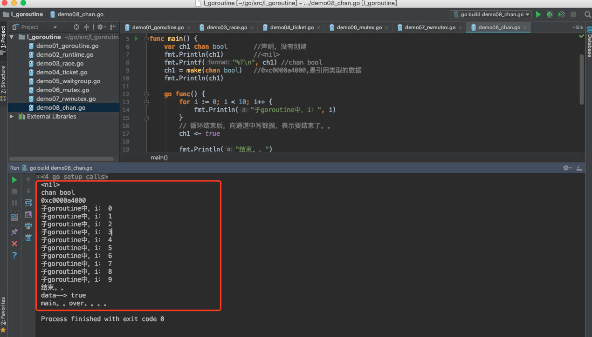

在上面的程序中，我们先创建了一个chan bool通道。然后启动了一条子Goroutine，并循环打印10个数字。然后我们向通道ch1中写入输入true。然后在主goroutine中，我们从ch1中读取数据。这一行代码是阻塞的，这意味着在子Goroutine将数据写入到该通道之前，主goroutine将不会执行到下一行代码。因此，我们可以通过channel实现子goroutine和主goroutine之间的通信。当子goroutine执行完毕前，主goroutine会因为读取ch1中的数据而阻塞。从而保证了子goroutine会先执行完毕。这就消除了对时间的需求。在之前的程序中，我们要么让主goroutine进入睡眠，以防止主要的Goroutine退出。要么通过WaitGroup来保证子goroutine先执行完毕，主goroutine才结束。

示例代码：以下代码加入了睡眠，可以更好的理解channel的阻塞

```go
package main

import (
	"fmt"
	"time"
)

func main() {
	ch1 := make(chan int)
	done := make(chan bool) // 通道
	go func() {
		fmt.Println("子goroutine执行。。。")
		time.Sleep(3 * time.Second)
		data := <-ch1 // 从通道中读取数据
		fmt.Println("data：", data)
		done <- true
	}()
	// 向通道中写数据。。
	time.Sleep(5 * time.Second)
	ch1 <- 100

	<-done
	fmt.Println("main。。over")

}

```

运行结果：

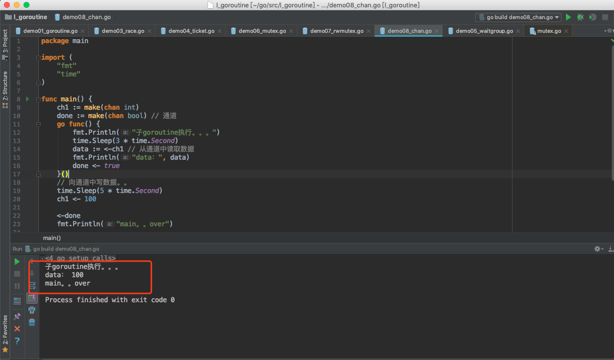


再一个例子，这个程序将打印一个数字的个位数的平方和。

```go
package main

import (  
    "fmt"
)

func calcSquares(number int, squareop chan int) {  
    sum := 0
    for number != 0 {
        digit := number % 10
        sum += digit * digit
        number /= 10
    }
    squareop <- sum
}

func calcCubes(number int, cubeop chan int) {  
    sum := 0 
    for number != 0 {
        digit := number % 10
        sum += digit * digit * digit
        number /= 10
    }
    cubeop <- sum
} 
func main() {  
    number := 589
    sqrch := make(chan int)
    cubech := make(chan int)
    go calcSquares(number, sqrch)
    go calcCubes(number, cubech)
    squares, cubes := <-sqrch, <-cubech
    fmt.Println("Final output", squares + cubes)
}
```

运行结果：

```
Final output 1536
```


### 2.3 死锁

使用通道时要考虑的一个重要因素是死锁。如果Goroutine在一个通道上发送数据，那么预计其他的Goroutine应该接收数据。如果这种情况不发生，那么程序将在运行时出现死锁。

类似地，如果Goroutine正在等待从通道接收数据，那么另一些Goroutine将会在该通道上写入数据，否则程序将会死锁。

示例代码：

```go
package main

func main() {  
    ch := make(chan int)
    ch <- 5
}
```

报错：

```
fatal error: all goroutines are asleep - deadlock!

goroutine 1 [chan send]:
main.main()
	/Users/ruby/go/src/l_goroutine/demo08_chan.go:5 +0x50
```


> 在主流的编程语言中为了保证多线程之间共享数据安全性和一致性，都会提供一套基本的同步工具集，如锁，条件变量，原子操作等等。Go语言标准库也毫不意外的提供了这些同步机制，使用方式也和其他语言也差不多。
> 除了这些基本的同步手段，Go语言还提供了一种新的同步机制: Channel，它在Go语言中是一个像int, float32等的基本类型，一个channel可以认为是一个能够在多个Goroutine之间传递某一类型的数据的管道。Go中的channel无论是实现机制还是使用场景都和Java中的BlockingQueue很接近。


## 三、 关闭通道

发送者可以通过关闭信道，来通知接收方不会有更多的数据被发送到channel上。

```go
close(ch)
```

接收者可以在接收来自通道的数据时使用额外的变量来检查通道是否已经关闭。

语法结构：

```go
v, ok := <- ch  
```

> 类似map操作，存储key，value键值对
>
> v,ok := map[key] //根据key从map中获取value，如果key存在， v就是对应的数据，如果key不存在，v是默认值


在上面的语句中，如果ok的值是true，表示成功的从通道中读取了一个数据value。如果ok是false，这意味着我们正在从一个封闭的通道读取数据。从闭通道读取的值将是通道类型的零值。

例如，如果通道是一个int通道，那么从封闭通道接收的值将为0。

示例代码：


```go
package main

import (
	"fmt"
	"time"
)

func main()  {
	ch1 := make(chan int)
	go sendData(ch1)
	/*
	子goroutine，写出数据10个
			每写一个，阻塞一次，主程序读取一次，解除阻塞

	主goroutine：循环读
			每次读取一个，堵塞一次，子程序，写出一个，解除阻塞

	发送发，关闭通道的--->接收方，接收到的数据是该类型的零值，以及false
	 */
	//主程序中获取通道的数据
	for{
		time.Sleep(1*time.Second)
		v, ok := <- ch1 //其他goroutine，显示的调用close方法关闭通道。
		if !ok{
			fmt.Println("已经读取了所有的数据，", ok)
			break
		}
		fmt.Println("取出数据：",v, ok)
	}

	fmt.Println("main...over....")
}
func sendData(ch1 chan int)  {
	// 发送方：10条数据
	for i:=0;i<10 ;i++  {
		ch1 <- i//将i写入通道中
	}
	close(ch1) //将ch1通道关闭了。
}
```

运行结果

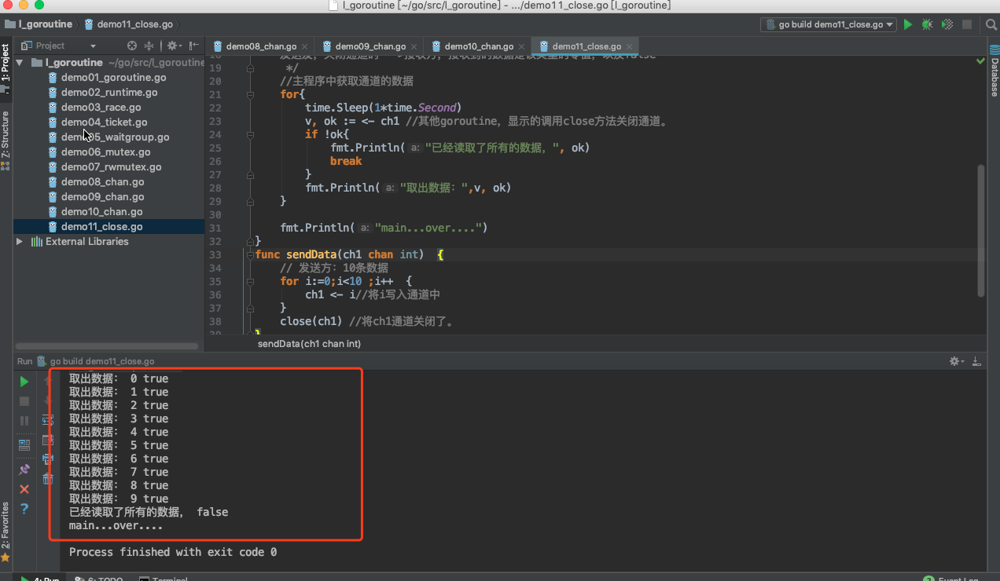


在上面的程序中，send Goroutine将0到9写入chl通道，然后关闭通道。主函数里有一个无限循环。它检查通道是否在发送数据后，使用变量ok关闭。如果ok是假的，则意味着通道关闭，因此循环结束。还可以打印接收到的值和ok的值。


## 四、通道上的范围循环

我们可以循环从通道上获取数据，直到通道关闭。for循环的for range形式可用于从通道接收值，直到它关闭为止。

使用range循环，示例代码：

```go
package main

import (
	"time"
	"fmt"
)

func main()  {
	ch1 :=make(chan int)
	go sendData(ch1)
	// for循环的for range形式可用于从通道接收值，直到它关闭为止。
	for v := range ch1{
		fmt.Println("读取数据：",v)
	}
	fmt.Println("main..over.....")
}
func sendData(ch1 chan int)  {
	for i:=0;i<10 ; i++ {
		time.Sleep(1*time.Second)
		ch1 <- i
	}
	close(ch1)//通知对方，通道关闭
}
```

运行结果：

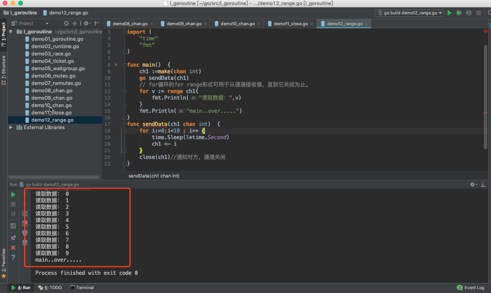


## 五、非缓冲通道

之前学习的所有通道基本上都没有缓冲。发送和接收到一个未缓冲的通道是阻塞的。

一次发送操作对应一次接收操作，对于一个goroutine来讲，它的一次发送，在另一个goroutine接收之前都是阻塞的。同样的，对于接收来讲，在另一个goroutine发送之前，它也是阻塞的。


## 六、缓冲通道

缓冲通道就是指一个通道，带有一个缓冲区。发送到一个缓冲通道只有在缓冲区满时才被阻塞。类似地，从缓冲通道接收的信息只有在缓冲区为空时才会被阻塞。

可以通过将额外的容量参数传递给make函数来创建缓冲通道，该函数指定缓冲区的大小。

语法：

```go
ch := make(chan type, capacity)  
```

上述语法的容量应该大于0，以便通道具有缓冲区。默认情况下，无缓冲通道的容量为0，因此在之前创建通道时省略了容量参数。

示例代码：

以下的代码中，chan通道，是带有缓冲区的。

```go
package main

import (
	"fmt"
	"strconv"
	"time"
)

func main() {
	/*
	非缓存通道：make(chan T)
	缓存通道：make(chan T ,size)
		缓存通道，理解为是队列：

	非缓存，发送还是接受，都是阻塞的
	缓存通道,缓存区的数据满了，才会阻塞状态。。

	 */
	ch1 := make(chan int)           //非缓存的通道
	fmt.Println(len(ch1), cap(ch1)) //0 0
	//ch1 <- 100//阻塞的，需要其他的goroutine解除阻塞，否则deadlock

	ch2 := make(chan int, 5)        //缓存的通道，缓存区大小是5
	fmt.Println(len(ch2), cap(ch2)) //0 5
	ch2 <- 100                      //
	fmt.Println(len(ch2), cap(ch2)) //1 5

	//ch2 <- 200
	//ch2 <- 300
	//ch2 <- 400
	//ch2 <- 500
	//ch2 <- 600
	fmt.Println("--------------")
	ch3 := make(chan string, 4)
	go sendData3(ch3)
	for {
		time.Sleep(1*time.Second)
		v, ok := <-ch3
		if !ok {
			fmt.Println("读完了，，", ok)
			break
		}
		fmt.Println("\t读取的数据是：", v)
	}

	fmt.Println("main...over...")
}

func sendData3(ch3 chan string) {
	for i := 0; i < 10; i++ {
		ch3 <- "数据" + strconv.Itoa(i)
		fmt.Println("子goroutine，写出第", i, "个数据")
	}
	close(ch3)
}


```


运行结果：

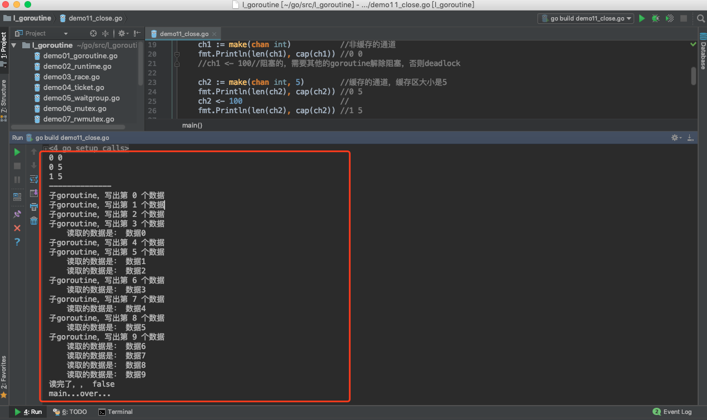


## 七、双向通道

通道，channel，是用于实现goroutine之间的通信的。一个goroutine可以向通道中发送数据，另一条goroutine可以从该通道中获取数据。截止到现在我们所学习的通道，都是既可以发送数据，也可以读取数据，我们又把这种通道叫做双向通道。

```go
data := <- a // read from channel a  
a <- data // write to channel a
```


## 八、单向通道

单向通道，也就是定向通道。

之前我们学习的通道都是双向通道，我们可以通过这些通道接收或者发送数据。我们也可以创建单向通道，这些通道只能发送或者接收数据。


双向通道，实例代码：

```go
package main

import "fmt"

func main()  {
	/*
	双向：
		chan T -->
			chan <- data,写出数据，写
			data <- chan,获取数据，读
	单向：定向
		chan <- T,
			只支持写，
		<- chan T,
			只读
	 */
	ch1 := make(chan string) // 双向，可读，可写
	done := make(chan bool)
	go sendData(ch1, done)
	data :=<- ch1 //阻塞
	fmt.Println("子goroutine传来：", data)
	ch1 <- "我是main。。" // 阻塞

	<-done
	fmt.Println("main...over....")
}
//子goroutine-->写数据到ch1通道中
//main goroutine-->从ch1通道中取
func sendData(ch1 chan string, done chan bool)  {
	ch1 <- "我是小明"// 阻塞
	data := <-ch1 // 阻塞
	fmt.Println("main goroutine传来：",data)

	done <- true
}

```

运行结果：

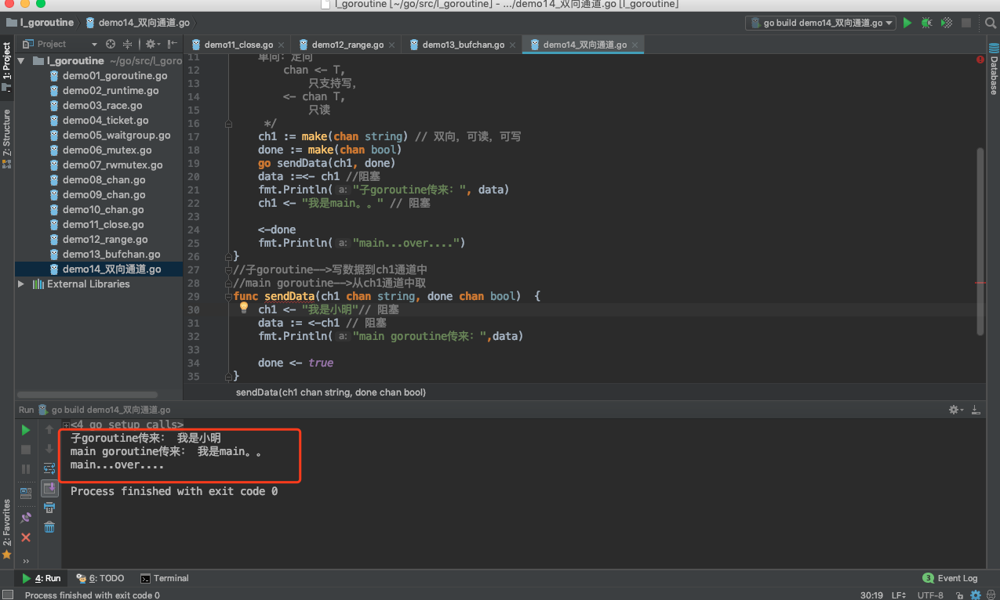


创建仅能发送数据的通道，示例代码：

示例代码：

```go
package main

import "fmt"

func main()  {
	/*
		单向：定向
		chan <- T,
			只支持写，
		<- chan T,
			只读


		用于参数传递：
	 */
	ch1 := make(chan int)//双向，读，写
	//ch2 := make(chan <- int) // 单向，只写，不能读
	//ch3 := make(<- chan int) //单向，只读，不能写
	//ch1 <- 100
	//data :=<-ch1
	//ch2 <- 1000
	//data := <- ch2
	//fmt.Println(data)
	//	<-ch2 //invalid operation: <-ch2 (receive from send-only type chan<- int)
	//ch3 <- 100
	//	<-ch3
	//	ch3 <- 100 //invalid operation: ch3 <- 100 (send to receive-only type <-chan int)

	//go fun1(ch2)
	go fun1(ch1)
	data:= <- ch1
	fmt.Println("fun1中写出的数据是：",data)

	//fun2(ch3)
	go fun2(ch1)
	ch1 <- 200
	fmt.Println("main。。over。。")
}
//该函数接收，只写的通道
func fun1(ch chan <- int){
	// 函数内部，对于ch只能写数据，不能读数据
	ch <- 100
	fmt.Println("fun1函数结束。。")
}

func fun2(ch <-chan int){
	//函数内部，对于ch只能读数据，不能写数据
	data := <- ch
	fmt.Println("fun2函数，从ch中读取的数据是：",data)
}

```

运行结果：

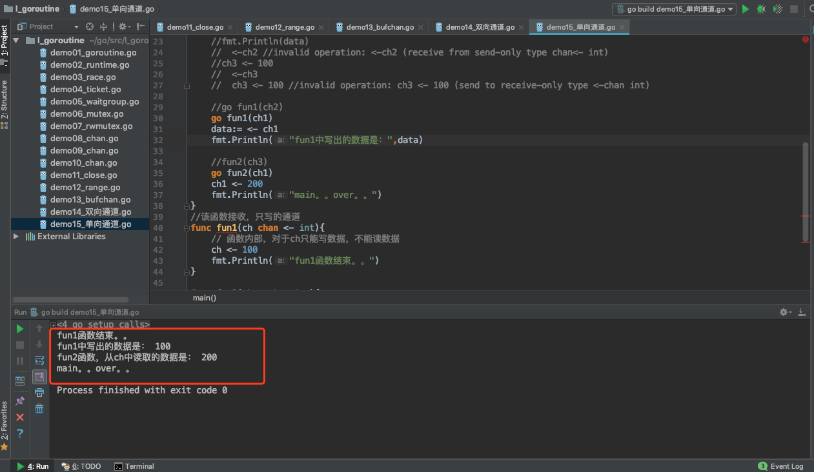


## 九、time包中的通道相关函数

主要就是定时器，标准库中的Timer让用户可以定义自己的超时逻辑，尤其是在应对select处理多个channel的超时、单channel读写的超时等情形时尤为方便。

Timer是一次性的时间触发事件，这点与Ticker不同，Ticker是按一定时间间隔持续触发时间事件。

Timer常见的创建方式：

```go
t:= time.NewTimer(d)
t:= time.AfterFunc(d, f)
c:= time.After(d)
```

虽然说创建方式不同，但是原理是相同的。

Timer有3个要素：

```go
定时时间：就是那个d
触发动作：就是那个f
时间channel： 也就是t.C
```


### 9.1、time.NewTimer()

NewTimer()创建一个新的计时器，该计时器将在其通道上至少持续d之后发送当前时间。


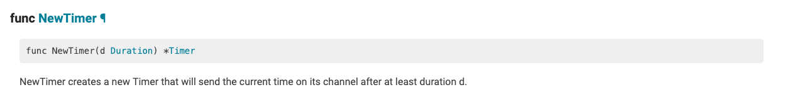

它的返回值是一个Timer。


源代码：

```go
// NewTimer creates a new Timer that will send
// the current time on its channel after at least duration d.
func NewTimer(d Duration) *Timer {
	c := make(chan Time, 1)
	t := &Timer{
		C: c,
		r: runtimeTimer{
			when: when(d),
			f:    sendTime,
			arg:  c,
		},
	}
	startTimer(&t.r)
	return t
}
```

通过源代码我们可以看出，首先创建一个channel，关联的类型为Time，然后创建了一个Timer并返回。

- 用于在指定的Duration类型时间后调用函数或计算表达式。
- 如果只是想指定时间之后执行,使用time.Sleep()
- 使用NewTimer(),可以返回的Timer类型在计时器到期之前,取消该计时器
- 直到使用<-timer.C发送一个值,该计时器才会过期


示例代码：

```go
package main

import (
	"time"
	"fmt"
)

func main() {

	/*
		1.func NewTimer(d Duration) *Timer
			创建一个计时器：d时间以后触发，go触发计时器的方法比较特别，就是在计时器的channel中发送值
	 */
	//新建一个计时器：timer
	timer := time.NewTimer(3 * time.Second)
	fmt.Printf("%T\n", timer) //*time.Timer
	fmt.Println(time.Now())   //2019-08-15 10:41:21.800768 +0800 CST m=+0.000461190

	//此处在等待channel中的信号，执行此段代码时会阻塞3秒
	ch2 := timer.C     //<-chan time.Time
	fmt.Println(<-ch2) //2019-08-15 10:41:24.803471 +0800 CST m=+3.003225965

}

```

运行结果：

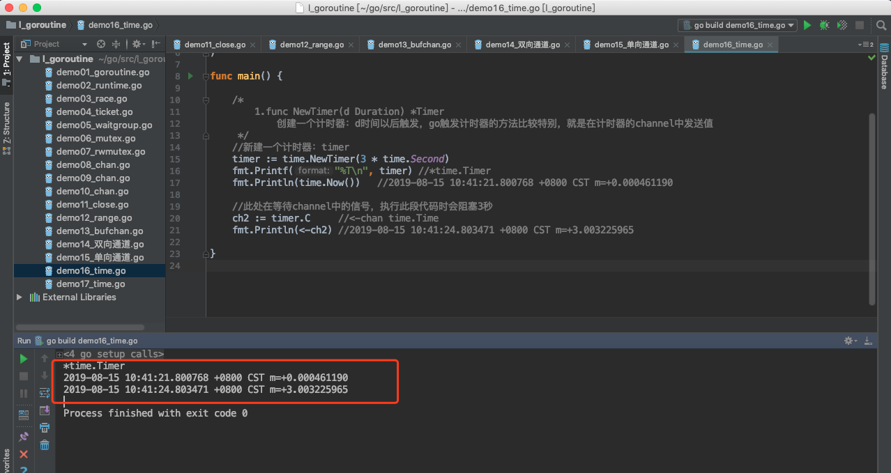


### 9.2、timer.Stop

计时器停止：


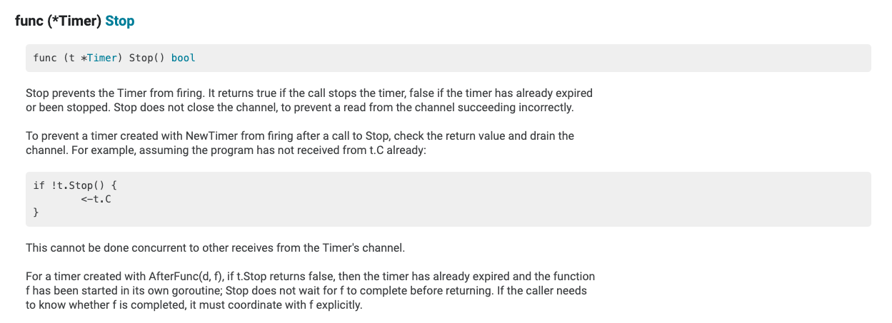


示例代码：

```go
package main

import (
	"time"
	"fmt"
)

func main() {

	/*
		1.func NewTimer(d Duration) *Timer
			创建一个计时器：d时间以后触发，go触发计时器的方法比较特别，就是在计时器的channel中发送值
	 */
	//新建一个计时器：timer
	//timer := time.NewTimer(3 * time.Second)
	//fmt.Printf("%T\n", timer) //*time.Timer
	//fmt.Println(time.Now())   //2019-08-15 10:41:21.800768 +0800 CST m=+0.000461190
	//
	////此处在等待channel中的信号，执行此段代码时会阻塞3秒
	//ch2 := timer.C     //<-chan time.Time
	//fmt.Println(<-ch2) //2019-08-15 10:41:24.803471 +0800 CST m=+3.003225965


	fmt.Println("-------------------------------")

	//新建计时器，一秒后触发

	timer2 := time.NewTimer(5 * time.Second)

	//新开启一个线程来处理触发后的事件

	go func() {

		//等触发时的信号

		<-timer2.C

		fmt.Println("Timer 2 结束。。")

	}()

	//由于上面的等待信号是在新线程中，所以代码会继续往下执行，停掉计时器

	time.Sleep(3*time.Second)
	stop := timer2.Stop()

	if stop {

		fmt.Println("Timer 2 停止。。")

	}

}

```

运行结果：

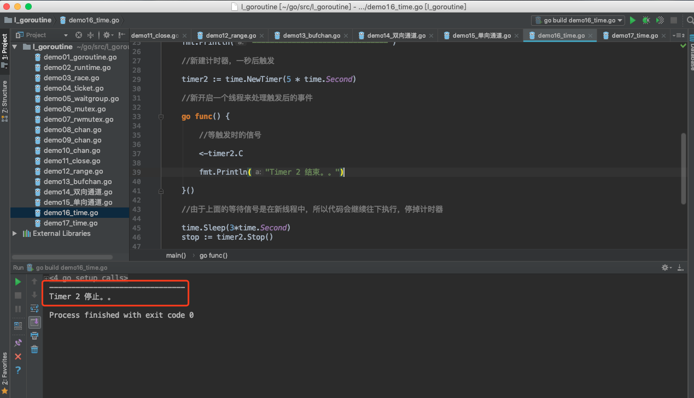


### 9.3、time.After()

在等待持续时间之后，然后在返回的通道上发送当前时间。它相当于NewTimer(d).C。在计时器触发之前，垃圾收集器不会恢复底层计时器。如果效率有问题，使用NewTimer代替，并调用Timer。如果不再需要计时器，请停止。

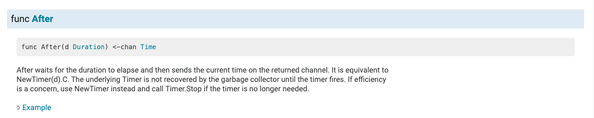


源码：

```go
// After waits for the duration to elapse and then sends the current time
// on the returned channel.
// It is equivalent to NewTimer(d).C.
// The underlying Timer is not recovered by the garbage collector
// until the timer fires. If efficiency is a concern, use NewTimer
// instead and call Timer.Stop if the timer is no longer needed.
func After(d Duration) <-chan Time {
	return NewTimer(d).C
}
```

示例代码：

```go
package main

import (
	"time"
	"fmt"
)

func main() {

	/*
		func After(d Duration) <-chan Time
			返回一个通道：chan，存储的是d时间间隔后的当前时间。
	 */
	ch1 := time.After(3 * time.Second) //3s后
	fmt.Printf("%T\n", ch1) // <-chan time.Time
	fmt.Println(time.Now()) //2019-08-15 09:56:41.529883 +0800 CST m=+0.000465158
	time2 := <-ch1
	fmt.Println(time2) //2019-08-15 09:56:44.532047 +0800 CST m=+3.002662179


}

```

运行结果：

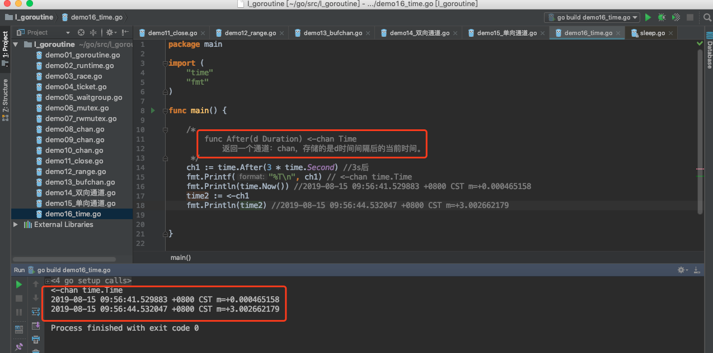


## 十、select语句

select 是 Go 中的一个控制结构。select 语句类似于 switch 语句，但是select会随机执行一个可运行的case。如果没有case可运行，它将阻塞，直到有case可运行。

select语句的语法结构和switch语句很相似，也有case语句和default语句：

```go
select {
    case communication clause  :
       statement(s);      
    case communication clause  :
       statement(s); 
    /* 你可以定义任意数量的 case */
    default : /* 可选 */
       statement(s);
}
```

说明：

- 每个case都必须是一个通信

- 所有channel表达式都会被求值

- 所有被发送的表达式都会被求值

- 如果有多个case都可以运行，select会随机公平地选出一个执行。其他不会执行。 

- 否则：

  如果有default子句，则执行该语句。

  如果没有default字句，select将阻塞，直到某个通信可以运行；Go不会重新对channel或值进行求值。


示例代码：

```go
package main

import (
	"fmt"
	"time"
)

func main() {
	/*
	分支语句：if，switch，select
	select 语句类似于 switch 语句，
		但是select会随机执行一个可运行的case。
		如果没有case可运行，它将阻塞，直到有case可运行。
	 */

	ch1 := make(chan int)
	ch2 := make(chan int)

	go func() {
		time.Sleep(2 * time.Second)
		ch2 <- 200
	}()
	go func() {
		time.Sleep(2 * time.Second)
		ch1 <- 100
	}()

	select {
	case num1 := <-ch1:
		fmt.Println("ch1中取数据。。", num1)
	case num2, ok := <-ch2:
		if ok {
			fmt.Println("ch2中取数据。。", num2)
		}else{
			fmt.Println("ch2通道已经关闭。。")
		}


	}
}

```

运行结果：可能执行第一个case，打印100，也可能执行第二个case，打印200。(多运行几次，结果就不同了)


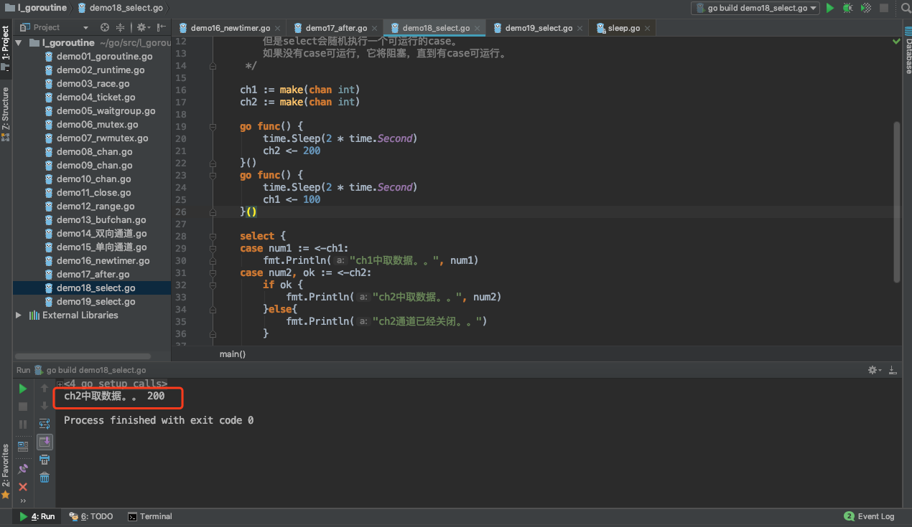


select语句结合time包的和chan相关函数，示例代码：

```go
package main

import (
	"fmt"
	"time"
)

func main() {
	ch1 := make(chan int)
	ch2 := make(chan int)

	//go func() {
	//	ch1 <- 100
	//}()

	select {
	case <-ch1:
		fmt.Println("case1可以执行。。")
	case <-ch2:
		fmt.Println("case2可以执行。。")
	case <-time.After(3 * time.Second):
		fmt.Println("case3执行。。timeout。。")

	//default:
	//	fmt.Println("执行了default。。")
	}
}

```


运行结果：

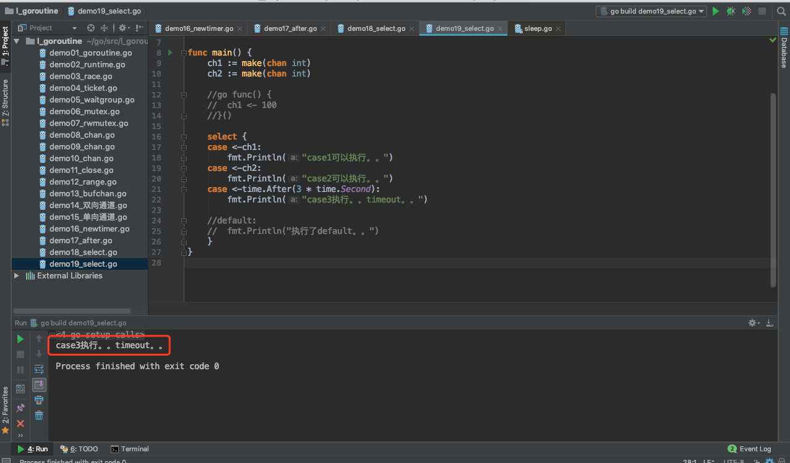


## 十一、Go语言的CSP模型


go语言的最大两个亮点，一个是goroutine，一个就是chan了。二者合体的典型应用CSP，基本就是大家认可的并行开发神器，简化了并行程序的开发难度，我们来看一下CSP。 


### 11.1、CSP是什么

CSP 是 Communicating Sequential Process 的简称，中文可以叫做通信顺序进程，是一种并发编程模型，是一个很强大的并发数据模型，是上个世纪七十年代提出的，用于描述两个独立的并发实体通过共享的通讯 channel(管道)进行通信的并发模型。相对于Actor模型，CSP中channel是第一类对象，它不关注发送消息的实体，而关注与发送消息时使用的channel。

严格来说，CSP 是一门形式语言（类似于 ℷ calculus），用于描述并发系统中的互动模式，也因此成为一众面向并发的编程语言的理论源头，并衍生出了 Occam/Limbo/Golang…

而具体到编程语言，如 Golang，其实只用到了 CSP 的很小一部分，即理论中的 Process/Channel（对应到语言中的 goroutine/channel）：这两个并发原语之间没有从属关系， Process 可以订阅任意个 Channel，Channel 也并不关心是哪个 Process 在利用它进行通信；Process 围绕 Channel 进行读写，形成一套有序阻塞和可预测的并发模型。


### 11.2、Golang CSP

与主流语言通过共享内存来进行并发控制方式不同，Go 语言采用了 CSP 模式。这是一种用于描述两个独立的并发实体通过共享的通讯 Channel（管道）进行通信的并发模型。

Golang 就是借用CSP模型的一些概念为之实现并发进行理论支持，其实从实际上出发，go语言并没有，完全实现了CSP模型的所有理论，仅仅是借用了 process和channel这两个概念。process是在go语言上的表现就是 goroutine 是实际并发执行的实体，每个实体之间是通过channel通讯来实现数据共享。


Go语言的CSP模型是由协程Goroutine与通道Channel实现：

- 
  Go协程goroutine: 是一种轻量线程，它不是操作系统的线程，而是将一个操作系统线程分段使用，通过调度器实现协作式调度。是一种绿色线程，微线程，它与Coroutine协程也有区别，能够在发现堵塞后启动新的微线程。
- 通道channel: 类似Unix的Pipe，用于协程之间通讯和同步。协程之间虽然解耦，但是它们和Channel有着耦合。

 


### 11.3、Channel

Goroutine 和 channel 是 Go 语言并发编程的 两大基石。Goroutine 用于执行并发任务，channel 用于 goroutine 之间的同步、通信。

Channel 在 gouroutine 间架起了一条管道，在管道里传输数据，实现 gouroutine 间的通信；由于它是线程安全的，所以用起来非常方便；channel 还提供 “先进先出” 的特性；它还能影响 goroutine 的阻塞和唤醒。

相信大家一定见过一句话：

> Do not communicate by sharing memory; instead, share memory by communicating.

不要通过共享内存来通信，而要通过通信来实现内存共享。

这就是 Go 的并发哲学，它依赖 CSP 模型，基于 channel 实现。


**channel 实现 CSP**

Channel 是 Go 语言中一个非常重要的类型，是 Go 里的第一对象。通过 channel，Go 实现了通过通信来实现内存共享。Channel 是在多个 goroutine 之间传递数据和同步的重要手段。

使用原子函数、读写锁可以保证资源的共享访问安全，但使用 channel 更优雅。

channel 字面意义是 “通道”，类似于 Linux 中的管道。声明 channel 的语法如下：

```go
chan T // 声明一个双向通道
chan<- T // 声明一个只能用于发送的通道
<-chan T // 声明一个只能用于接收的通道
```

单向通道的声明，用 `<-` 来表示，它指明通道的方向。你只要明白，代码的书写顺序是从左到右就马上能掌握通道的方向是怎样的。

因为 channel 是一个引用类型，所以在它被初始化之前，它的值是 nil，channel 使用 make 函数进行初始化。可以向它传递一个 int 值，代表 channel 缓冲区的大小（容量），构造出来的是一个缓冲型的 channel；不传或传 0 的，构造的就是一个非缓冲型的 channel。

两者有一些差别：非缓冲型 channel 无法缓冲元素，对它的操作一定顺序是 “发送 -> 接收 -> 发送 -> 接收 -> ……”，如果想连续向一个非缓冲 chan 发送 2 个元素，并且没有接收的话，第一次一定会被阻塞；对于缓冲型 channel 的操作，则要 “宽松” 一些，毕竟是带了 “缓冲” 光环。


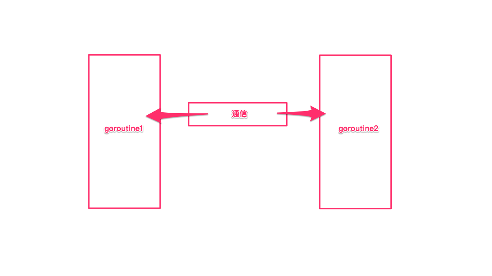


对 chan 的发送和接收操作都会在编译期间转换成为底层的发送接收函数。

Channel 分为两种：带缓冲、不带缓冲。对不带缓冲的 channel 进行的操作实际上可以看作 “同步模式”，带缓冲的则称为 “异步模式”。

同步模式下，发送方和接收方要同步就绪，只有在两者都 ready 的情况下，数据才能在两者间传输（后面会看到，实际上就是内存拷贝）。否则，任意一方先行进行发送或接收操作，都会被挂起，等待另一方的出现才能被唤醒。

异步模式下，在缓冲槽可用的情况下（有剩余容量），发送和接收操作都可以顺利进行。否则，操作的一方（如写入）同样会被挂起，直到出现相反操作（如接收）才会被唤醒。

小结一下：同步模式下，必须要使发送方和接收方配对，操作才会成功，否则会被阻塞；异步模式下，缓冲槽要有剩余容量，操作才会成功，否则也会被阻塞。


简单来说，CSP 模型由并发执行的实体（线程或者进程或者协程）所组成，实体之间通过发送消息进行通信，
这里发送消息时使用的就是通道，或者叫 channel。

CSP 模型的关键是关注 channel，而不关注发送消息的实体。Go 语言实现了 CSP 部分理论，goroutine 对应 CSP 中并发执行的实体，channel 也就对应着 CSP 中的 channel。


### 11.4、Goroutine

Goroutine 是实际并发执行的实体，它底层是使用协程(coroutine)实现并发，coroutine是一种运行在用户态的用户线程，类似于 greenthread，go底层选择使用coroutine的出发点是因为，它具有以下特点：

- 用户空间 避免了内核态和用户态的切换导致的成本
- 可以由语言和框架层进行调度
- 更小的栈空间允许创建大量的实例


可以看到第二条 用户空间线程的调度不是由操作系统来完成的，像在java 1.3中使用的greenthread的是由JVM统一调度的(后java已经改为内核线程)，还有在ruby中的fiber(半协程) 是需要在重新中自己进行调度的，而goroutine是在golang层面提供了调度器，并且对网络IO库进行了封装，屏蔽了复杂的细节，对外提供统一的语法关键字支持，简化了并发程序编写的成本。


### 11.5、Goroutine 调度器

Go并发调度: G-P-M模型

在操作系统提供的内核线程之上，Go搭建了一个特有的两级线程模型。goroutine机制实现了M : N的线程模型，goroutine机制是协程（coroutine）的一种实现，golang内置的调度器，可以让多核CPU中每个CPU执行一个协程。


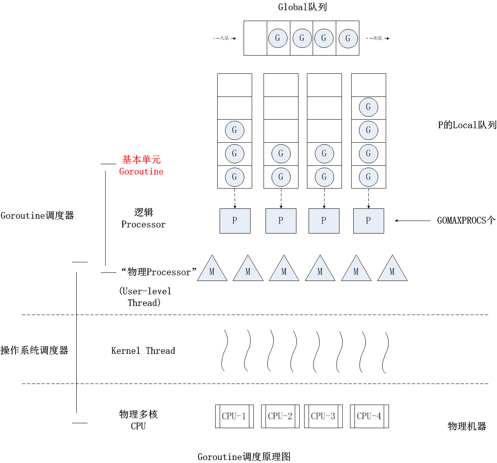


### 11.6、最后

Golang 的 channel 将 goroutine 隔离开，并发编程的时候可以将注意力放在 channel 上。在一定程度上，这个和消息队列的解耦功能还是挺像的。如果大家感兴趣，还是来看看 channel 的源码吧，对于更深入地理解 channel 还是挺有用的。

Go 通过 channel 实现 CSP 通信模型，主要用于 goroutine 之间的消息传递和事件通知。

有了 channel 和 goroutine 之后，Go 的并发编程变得异常容易和安全，得以让程序员把注意力留到业务上去，实现开发效率的提升。

要知道，技术并不是最重要的，它只是实现业务的工具。一门高效的开发语言让你把节省下来的时间，留着去做更有意义的事情，比如写写文章。


> CSP 最早是由 Tony Hoare在 1977 年提出，据说老爷子至今仍在更新这个理论模型，有兴趣的朋友可以自行查阅电子版本：http://www.usingcsp.com/cspbook.pdf。
>
> 


参考文档：https://learnku.com/articles/32142


千锋Go语言的学习群：784190273

github知识库：

https://github.com/rubyhan1314

Golang网址：

https://www.qfgolang.com/

作者B站：

https://space.bilibili.com/353694001

对应视频地址：

https://www.bilibili.com/video/av56018934

https://www.bilibili.com/video/av47467197

源代码：

https://github.com/rubyhan1314/go_goroutine


