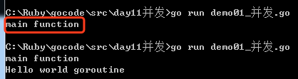
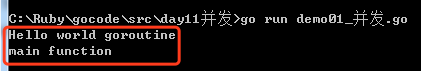
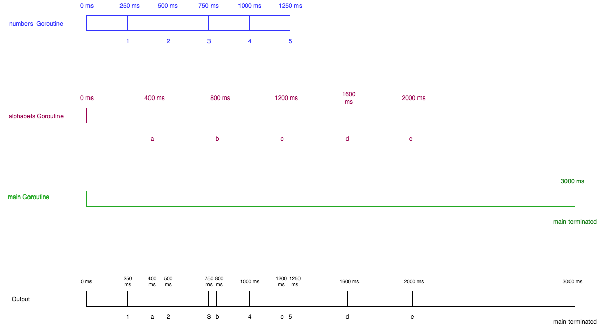

# Go语言的协程——Goroutine

**进程(Process)，线程(Thread)，协程(Coroutine，也叫轻量级线程)**

进程
进程是一个程序在一个数据集中的一次动态执行过程，可以简单理解为“正在执行的程序”，它是CPU资源分配和调度的独立单位。 
进程一般由程序、数据集、进程控制块三部分组成。我们编写的程序用来描述进程要完成哪些功能以及如何完成；数据集则是程序在执行过程中所需要使用的资源；进程控制块用来记录进程的外部特征，描述进程的执行变化过程，系统可以利用它来控制和管理进程，它是系统感知进程存在的唯一标志。 **进程的局限是创建、撤销和切换的开销比较大。**


线程
线程是在进程之后发展出来的概念。 线程也叫轻量级进程，它是一个基本的CPU执行单元，也是程序执行过程中的最小单元，由线程ID、程序计数器、寄存器集合和堆栈共同组成。一个进程可以包含多个线程。 
线程的优点是减小了程序并发执行时的开销，提高了操作系统的并发性能，缺点是线程没有自己的系统资源，只拥有在运行时必不可少的资源，但同一进程的各线程可以共享进程所拥有的系统资源，如果把进程比作一个车间，那么线程就好比是车间里面的工人。不过对于某些独占性资源存在锁机制，处理不当可能会产生“死锁”。


协程
协程是一种用户态的轻量级线程，又称微线程，英文名Coroutine，协程的调度完全由用户控制。人们通常将协程和子程序（函数）比较着理解。 
子程序调用总是一个入口，一次返回，一旦退出即完成了子程序的执行。 

**与传统的系统级线程和进程相比，协程的最大优势在于其"轻量级"，可以轻松创建上百万个而不会导致系统资源衰竭，而线程和进程通常最多也不能超过1万的。这也是协程也叫轻量级线程的原因。**

> 协程的特点在于是一个线程执行，与多线程相比，其优势体现在：协程的执行效率极高。因为子程序切换不是线程切换，而是由程序自身控制，因此，没有线程切换的开销，和多线程比，线程数量越多，协程的性能优势就越明显。

## Goroutine

### 1.1 什么是Goroutine

go中使用Goroutine来实现并发concurrently。

Goroutine是Go语言特有的名词。区别于进程Process，线程Thread，协程Coroutine，因为Go语言的创造者们觉得和他们是有所区别的，所以专门创造了Goroutine。

Goroutine是与其他函数或方法同时运行的函数或方法。Goroutines可以被认为是轻量级的线程。与线程相比，创建Goroutine的成本很小，它就是一段代码，一个函数入口。以及在堆上为其分配的一个堆栈（初始大小为4K，会随着程序的执行自动增长删除）。因此它非常廉价，Go应用程序可以并发运行数千个Goroutines。

>Goroutines在线程上的优势。
>
>1. 与线程相比，Goroutines非常便宜。它们只是堆栈大小的几个kb，堆栈可以根据应用程序的需要增长和收缩，而在线程的情况下，堆栈大小必须指定并且是固定的
>2. Goroutines被多路复用到较少的OS线程。在一个程序中可能只有一个线程与数千个Goroutines。如果线程中的任何Goroutine都表示等待用户输入，则会创建另一个OS线程，剩下的Goroutines被转移到新的OS线程。所有这些都由运行时进行处理，我们作为程序员从这些复杂的细节中抽象出来，并得到了一个与并发工作相关的干净的API。
>3. 当使用Goroutines访问共享内存时，通过设计的通道可以防止竞态条件发生。通道可以被认为是Goroutines通信的管道。

### 1.2 主goroutine

封装main函数的goroutine称为主goroutine。

主goroutine所做的事情并不是执行main函数那么简单。它首先要做的是：设定每一个goroutine所能申请的栈空间的最大尺寸。在32位的计算机系统中此最大尺寸为250MB，而在64位的计算机系统中此尺寸为1GB。如果有某个goroutine的栈空间尺寸大于这个限制，那么运行时系统就会引发一个栈溢出(stack overflow)的运行时恐慌。随后，这个go程序的运行也会终止。

此后，主goroutine会进行一系列的初始化工作，涉及的工作内容大致如下：

1. 创建一个特殊的defer语句，用于在主goroutine退出时做必要的善后处理。因为主goroutine也可能非正常的结束

2. 启动专用于在后台清扫内存垃圾的goroutine，并设置GC可用的标识

3. 执行mian包中的init函数

4. 执行main函数

   执行完main函数后，它还会检查主goroutine是否引发了运行时恐慌，并进行必要的处理。最后主goroutine会结束自己以及当前进程的运行。

### 1.3 如何使用Goroutines

在函数或方法调用前面加上关键字go，您将会同时运行一个新的Goroutine。

实例代码：

```go
package main

import (  
    "fmt"
)

func hello() {  
    fmt.Println("Hello world goroutine")
}
func main() {  
    go hello()
    fmt.Println("main function")
}
```

运行结果：可能会值输出“main function”。



我们开始的Goroutine怎么样了?我们需要了解Goroutine的规则

1. 当新的Goroutine开始时，Goroutine调用立即返回。与函数不同，go不等待Goroutine执行结束。当Goroutine调用，并且Goroutine的任何返回值被忽略之后，go立即执行到下一行代码。
2. main的Goroutine应该为其他的Goroutines执行。如果main的Goroutine终止了，程序将被终止，而其他Goroutine将不会运行。

修改以上代码：

```go
package main

import (  
    "fmt"
    "time"
)

func hello() {  
    fmt.Println("Hello world goroutine")
}
func main() {  
    go hello()
    time.Sleep(1 * time.Second)
    fmt.Println("main function")
}
```

运行结果：




在上面的程序中，我们已经调用了时间包的Sleep方法，它会在执行过程中睡觉。在这种情况下，main的goroutine被用来睡觉1秒。现在调用go hello()有足够的时间在main Goroutine终止之前执行。这个程序首先打印Hello world goroutine，等待1秒，然后打印main函数。


### 1.4 启动多个Goroutines

示例代码：

```go
package main

import (  
    "fmt"
    "time"
)

func numbers() {  
    for i := 1; i <= 5; i++ {
        time.Sleep(250 * time.Millisecond)
        fmt.Printf("%d ", i)
    }
}
func alphabets() {  
    for i := 'a'; i <= 'e'; i++ {
        time.Sleep(400 * time.Millisecond)
        fmt.Printf("%c ", i)
    }
}
func main() {  
    go numbers()
    go alphabets()
    time.Sleep(3000 * time.Millisecond)
    fmt.Println("main terminated")
}
```

运行结果：

```
1 a 2 3 b 4 c 5 d e main terminated  
```

时间轴分析：




千锋Go语言的学习群：784190273

github资源库：https://github.com/rubyhan1314/Golang-100-Days

作者B站：

https://space.bilibili.com/353694001

对应视频：
https://www.bilibili.com/video/av56945376

源代码已上传github：

https://github.com/rubyhan1314/go_goroutine


