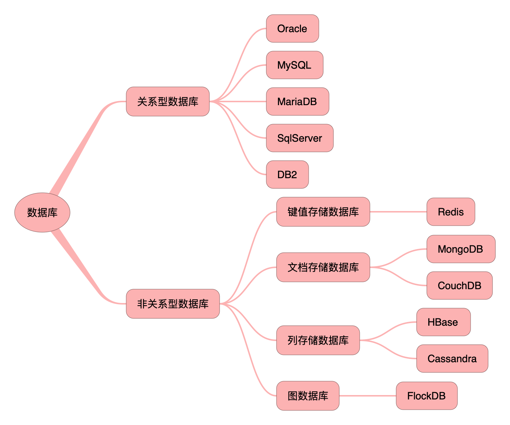
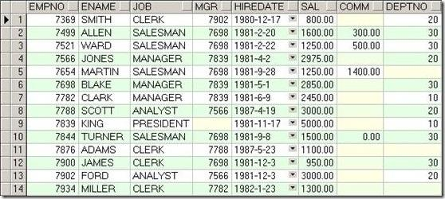
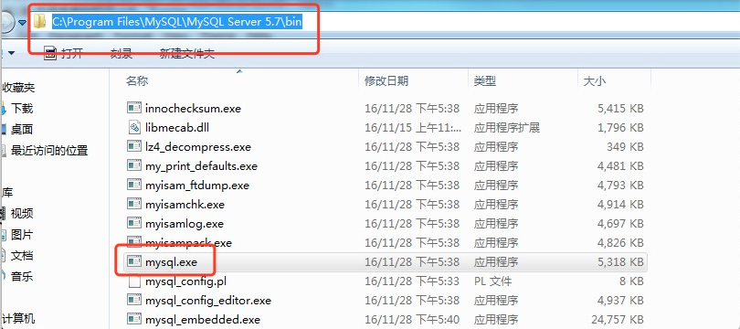
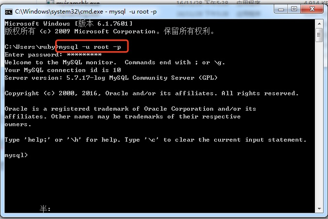
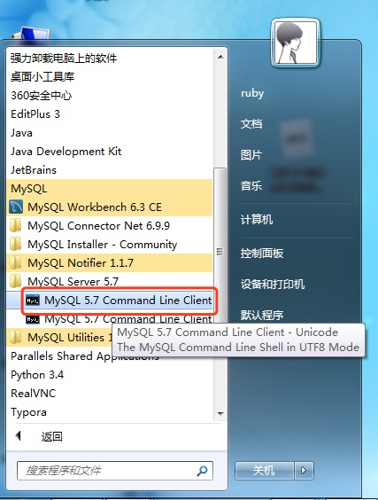
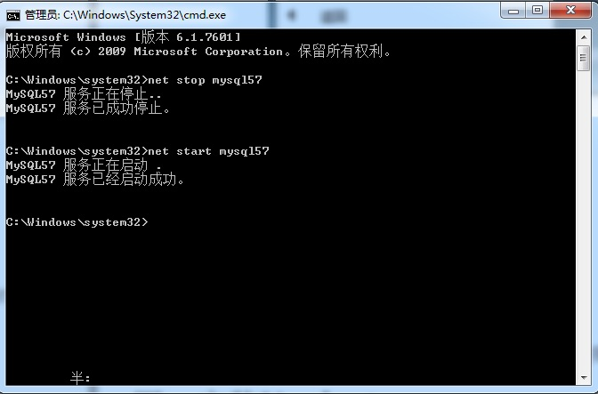
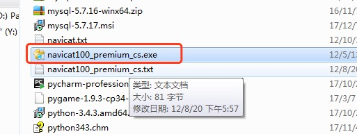
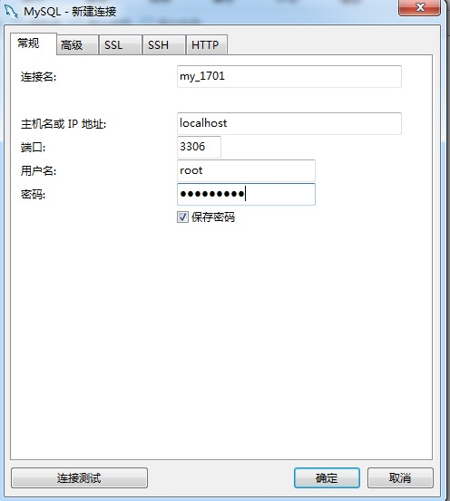

# 数据库基础知识

## 一、数据库简介

### 1.1、为什么需要数据库

人类时刻有记录一些资料的需求, 最初的结绳记事

随着人类的发展, 发明了文字, 数字等符号, 这些符号可以更好的记录生活中发生的各种事件.但是如何使记录更好的保存是个问题. 

从最初的龟壳到后来的纸张, 都用来记录这些信息. 慢慢到更现代化的各种磁盘等,随着信息的增长, 对数据存储的要求越来越高.  如何更加有效和快捷的处理这些信息成为了一个
难题.


**数据库的出现, 很好的解决了数据的存储效率和读取效率.**

------

### 1.2、什么是数据库

数据库(database)就是存储数据的仓库。为了方便数据的存储和管理，将数据按照特定的规律存储在磁盘上。通过数据库管理系统，有效地组织和管理存储在数据库中的数据。

**数据库database**是按照数据结构来组织、存储和管理数据的仓库(通常是一个文件或一组文件)。

理解数据库的一种最简单的办法就是将其想象为一个文件柜，此文件柜是一个存放数据的物理位置。

> 注意：有些人通常使用**数据库**这个术语来代表他们使用的**数据库软件**，这是不正确的。确切的说，数据库软件应称为**DBMS(数据库管理系统)**。**数据库**是通过**DBMS**创建和操纵的容器。**数据库**可以是保存在硬件设备上的文件，但也可以不是。对我们来说**数据库**究竟是文件还是其他什么东西并不重要，因为我们并不直接访问**数据库**，我们使用的是**DBMS**，它替我们访问数据库。


### 1.3、什么是数据库系统

数据库系统和数据库不是一个概念，数据库系统(DBS),比数据库大很多，由数据库、 数据库管理系统、应用开发工具构成。

### 1.4、目前数据库分类

而在当今的互联网中，最常见的数据库模型主要是两种，即**关系型数据库**和**非关系型数据库。**



>其他数据库：
>
>​	层次结构模型
>
>​	网状结构模型
>
>​	关系型数据库(以行和列的结构形式，将数据展示，以二维表的形式存储数据)
>
>​	面向对象数据库

## 二、关系型数据库

### 2.1、关系型数据库的介绍

关系型数据库模型是把复杂的数据结构归结为简单的二元关系(即二维表格形式)。

在关系型数据库中，对数据的操作几乎全部建立在一个或多个关系表格上，通过对这些关联的表格分类、合并、连接或选取等运算来实现数据库的管理。

关系型数据库诞生40多年了，从理论产生发展到现实产品，例如：Oracle和MySQL，Oracle在数据库领域上升到霸主地位，形成每年高达数百亿美元的庞大产业市场。MySql数据库在中小企业和免费市场具有绝对地位.

#### 2.1.1 表

> > **表(table)**是数据库中存储数据的基本单位。
>
> 
>


####  2.1.2 列

> **列(column)**表中的一个字段。所有的表都是由一个或多个列组成。

#### 2.1.3 数据类型

> **数据类型(datatype)**每个列都有相应的数据类型，用来限制该列存储的数据。

#### 2.1.4 行

> 行(row)表中的一个(行)记录。

 表中的数据是按行存储的，所保存的每个记录存储在自己的行内，如果将表想象为网格，网格中垂直的列为表列，水平行为表行。

#### 2.1.5 主键

> 主键(primary key)一列(或一组列)，其值能够唯一区分表中的每一行。

 表中每一行都应该有可以唯一标识自己的一列(或一组列)。一个顾客表中可以使用顾客编码列，而订单表可以使用订单ID等。一个表中没有主键的话，更新或删除表中特定行很困难，因为没有安全的方法保证只涉及相关的行。

**主键的规则**表中的任何列都可以作为主键，只要它满足一下条件：

- 任何两行都不具有相同的主键值(每一行的主键值是唯一的)。

- 每个行都必须具有一个主键值(主键不允许null值)

  **主键的好习惯**除了强制的规则外，应该坚持的几个普遍认可的好习惯：

- 不更新主键列中的值

- 不重用主键列的值

- 不在主键列中使用可能会更改的值


## 三、安装和卸载MySQL

### 3.1安装

详见安装文档

### 3.2卸载

详见卸载文档

​	关闭服务：

### 3.3 配置环境变量



### 3.4 登陆

A：因为配置了环境变量，可以直接使用命令行终端，输入以下内容：

mysql -u root -p

输入密码



>-u：后面跟随用户名
>
>-p：后面跟随密码
>
>-h：后面跟随IP


B：也可以直接使用mysql命令行：




### 3.5 启动和停止mysql服务

dos命令行：(需要以管理员的方式运行cmd.exe)

​	输入：net stop mysql

​	输入：net start mysql



或者通过操作界面：我的电脑-管理-服务-开启和停止mysql服务。

## 四、安装Navicat

### 4.1 安装并注册




### 4.2 创建连接





[扩展]数据库的几个名词

```
DB：是指datebase(数据库)
	数据库是存储数据的一个集合，数据库中通常使用数据表等组成，而数据表是由数据的字段和数据的值等信息组成。
DBMS:是指datebase mangement systerm(数据库管理系统)
	它是操作数据库和管理数据库的一个系统，比如mysql、sqlserver等都是属于数据库管理软件，人们通过这些系统或者工具来管理数据库内的数据。
DBS:是指datebase systerm (数据库系统)
	数据库系统又数据库和数据库管理软件等组成，数据库是一个逻辑上的存储数据的概念，而对应的是实体是数据库管理软件存储存储在硬盘上的数据库，所以数据库系统包含数据库和数据库管理软件。
```
理解数据库：

我们现在所说的数据库泛指关系型数据库管理系统(RDBMS-Relatitonal database management system)，即数据库服务器。

当我们安装了数据库服务器后，就可以在数据库服务器中创建数据库，每个数据库中还可以包含多张表。

数据库表就是一个多行多列的表格。在创建表时，需要制定表的列数，以及列名称，烈性等信息。而不用制定表格的行数，行数是没有上限的。


# 数据库的操作

## 一、SQL语言

### 1.1 什么是SQL

SQL是结构化查询语言(Structured Query Language)

### 1.2 SQL的作用

客户端使用SQL来操作服务器

​	启动mysql，会连接到服务器后，就可以使用sql来操作服务器了

​	将来会使用python程序(也可以是其他程序，比如java)链接服务器，然后使用sql来操作服务器

### 1.3 SQL标准

由国际标准组织(ISO)制定的，对DBMS的统一操作方式(例如相同的语句可以操作：mysql，oracle等)。

例如SQL99，即1999年制定的标准

> SQL99
>
> (1)是操作所有关系型数据库的规则 
> (2)是第四代语言 
> (3)是一种结构化查询语言 
> (4)只需发出合法合理的命令，就有对应的结果显示

注意，某种DBMS不只会支持SQL标准，而且还会有一些自己独有的语法，比如limit语句只在MySQL中可以使用

### 1.4 SQL的语法

1. SQL语句可以在单行或多行书写，以分号结尾

   ​	有些时候可以不以分号结尾，比如代码中

2. 可以使用空格和缩进来增强语句的可读性

3. MySQL不区分大小写，建议使用大写

### 1.5 SQL99标准的四大分类 ： 

1. DDL数据定义语言(data definition language)

   ​	create table,alter table，drop table，truncate table 。。

2. DML数据操作语言(Data Manipulation Language)

   ​	insert,update,delete 

3. DQL数据查询语言(data query language)

   select

   其实DQL也从DML中分离出来的。

4. DCL数据控制语言(Data Control Language)

   ​	grant 权限 to scott，revoke 权限 from scott 。。。 

5. DCL(事务控制语言)：commit，rollback，rollback to savepoint 。。。

   


## 二、 数据库的基本操作

### 2.1 在终端连接`mysql`数据库

在终端输入如下命令:

```shell
mysql -u root -p
```

回车后输入密码.

### 2.2 查看数据库版本

```mysql
select version();
```

注意:输入命令的时候不要忘记后面的分号

### 2.3 查看当前时间

```mysql
select now();
```

### 2.4 退出`mysql`数据库的连接

`exit`或`quit`


------


**以下操作都是在连接数据库之后才能做的操作**

注意命令结束的时候一定要带分号.

### 2.5 显示所有的数据库

```sql
show databases;
```

注意: `databases`后面有个`s`

### 2.6 创建数据库

```mysql
create database [if not exists]数据库名 [default charset utf8 collate utf8_general_ci];
```

可以简写：

```mysql
create database 数据库名 character set utf-8;
```


说明: 

1. 数据库名不要使用中文
2. 由于数据库中将来会存储一些`非ascii`字符, 所以务必指定字符编码, 一般都是指定`utf-8`编码
3. CHARSET 选择 utf8 
   COLLATION 选择 utf8_general_ci 
4. mysql中字符集是utf8，不是utf-8。

### 2.7 切换到要操作的数据库

若要操作数据库中的内容, 需要先切换到要操作的数据库

```mysql
use 数据库名;
```

### 2.8 查看当前选择的数据库

```mysql
select database();
```

### 2.9 删除数据库

```mysql
drop database [if exists]数据库名;
```

------

### 2.10 [扩展]MySQL添加用户、删除用户与授权

DCL数据控制语言(Data Control Language)(了解)

通常一个项目创建一个用户。一个项目对应的数据库只有一个，这个用户只能对这个数据库有权限，无法对其他数据库进行操作。


MySql中添加用户,新建数据库,用户授权,删除用户,修改密码(注意每行后边都跟个;表示一个命令语句结束):

#### 1.创建用户

A：先使用root账户进行登录

登录MYSQL：

@>mysql -u root -p

@>密码:hanru1314

B：创建用户：

```mysql
CREATE USER 'username'@'IP地址' [IDENTIFIED BY 'PASSWORD'] 其中密码是可选项；
	用户只能在指定的IP地址上登录
CREATE USER 'username'@'%' [IDENTIFIED BY 'PASSWORD'] 其中密码是可选项；
	用户可以在任意IP地址上登录
```


例如：

create user "test"@"localhost" identified by "1234";

CREATE USER 'john'@'192.168.189.71' IDENTIFIED BY "123";

C：然后登录一下：

mysql>exit;

@>mysql -u ruby -p

@>输入密码

mysql>登录成功

#### 2.为用户授权

```mysql
授权格式：grant 权限 on 数据库.* to 用户名@登录主机 identified by "密码";
```

2.1 登录MYSQL(有ROOT权限)，这里以ROOT身份登录：

@>mysql -u root -p

@>密码

2.2 首先为用户创建一个数据库(testDB)：

mysql>CREATE DATABASE`testDB`DEFAULT CHARACTER SET utf8 COLLATE utf8_general_ci;

2.3 授权test用户拥有testDB数据库的所有权限(某个数据库的所有权限)：

```sql
格式：grant 权限 on 数据库.* to 用户名@登录主机 identified by "密码";
```

grant all privileges on *.* to 'root'@'%' identified by '123456';

mysql>grant all privileges on testDB.* to test@localhost identified by '1234';

mysql>flush privileges;//刷新系统权限表


2.4 如果想指定部分权限给一用户，可以这样来写:

mysql>grant select,update on testDB.* to test@localhost identified by '1234';

mysql>flush privileges; //刷新系统权限表

2.5 授权test用户拥有所有数据库的某些权限：

mysql>grant select,delete,update,create,drop on_._to test@"%" identified by "1234";

```mysql
 //test用户对所有数据库都有select,delete,update,create,drop 权限。

```

//@"%" 表示对所有非本地主机授权，不包括localhost。(localhost地址设为127.0.0.1，如果设为真实的本地地址，不知道是否可以，没有验证。)

//对localhost授权：加上一句grant all privileges on testDB.* to test@localhost identified by '1234';即可。

**3.撤销权限**

```mysql
revoke 权限1，权限2.。。。on 数据库.* from 用户名@IP地址;
```

撤销指定用户在指定数据库上的执行权限。

**4. 查看权限**

```mysql
show grants for 用户名@IP地址;
```

**5. 删除用户**

@>mysql -u root -p

@>密码

删除账户及权限：>drop user 用户名@'%';

\>drop user 用户名@ localhost;


## 三、MySQL 数据类型

MySQL中定义数据字段的类型对你数据库的优化是非常重要的。 MySQL支持多种类型，大致可以分为三类：数值、日期/时间和字符串(字符)类型。

### 3.1 数值类型

MySQL支持所有标准SQL数值数据类型。 这些类型包括严格数值数据类型(INTEGER、SMALLINT、DECIMAL和NUMERIC)，以及近似数值数据类型(FLOAT、REAL和DOUBLE PRECISION)。 关键字INT是INTEGER的同义词，关键字DEC是DECIMAL的同义词。 BIT数据类型保存位字段值，并且支持MyISAM、MEMORY、InnoDB和BDB表。 作为SQL标准的扩展，MySQL也支持整数类型TINYINT、MEDIUMINT和BIGINT。下面的表显示了需要的每个整数类型的存储和范围。


**在上面表中的类型中, 最常用的是2中类型: int(整数)和decimal(浮点数).**


### 3.2 日期和时间类型

表示时间值的日期和时间类型为DATETIME、DATE、TIMESTAMP、TIME和YEAR。 每个时间类型有一个有效值范围和一个"零"值，当指定不合法的MySQL不能表示的值时使用"零"值。 TIMESTAMP类型有专有的自动更新特性，将在后面描述。


**最常用: datatime类型.**


### 3.3 字符串类型

字符串类型指CHAR、VARCHAR、BINARY、VARBINARY、BLOB、TEXT、ENUM和SET。该节描述了这些类型如何工作以及如何在查询中使用这些类型。 CHAR和VARCHAR类型类似，但它们保存和检索的方式不同。它们的最大长度和是否尾部空格被保留等方面也不同。在存储或检索过程中不进行大小写转换。 BINARY和VARBINARY类类似于CHAR和VARCHAR，不同的是它们包含二进制字符串而不要非二进制字符串。也就是说，它们包含字节字符串而不是字符字符串。这说明它们没有字符集，并且排序和比较基于列值字节的数值值。 BLOB是一个二进制大对象，可以容纳可变数量的数据。有4种BLOB类型：TINYBLOB、BLOB、MEDIUMBLOB和LONGBLOB。它们只是可容纳值的最大长度不同。 有4种TEXT类型：TINYTEXT、TEXT、MEDIUMTEXT和LONGTEXT。这些对应4种BLOB类型，有相同的最大长度和存储需求。


**最常用的: char, varchar和text类型.**

>  总结常用的类型：
>
>  int：整型
>
>  double：浮点型，例如double(5,2)表示最多5位，其中必须有2位小数，即最大值：999.99
>
>  decimal：浮点型，不会出现精度缺失问题，比如金钱。
>
>  char：固定长度字符串类型：最大长度：char(255)
>
>  varchar：可变长度字符串类型：最大长度：varchar(65535)
>
>  text(clob)：字符串类型，存储超大文本。
>
>  blob：字节类型，最大4G
>
>  date：日期类型，格式为：yyyy-MM-dd
>
>  time：时间类型：格式为：hh:mm:ss
>
>  timestamp：时间戳
>
>  datatime


## 四、表的基本操作

MySQL不仅用于表数据操纵，而且还可以用来执行数据库和表的所有操作，包括表本身的创建和处理。

**数据库中存储的是表(table), 表中存储的是一行行的数据.**

### 4.1 查看当前数据库中的所有表

```mysql
show tables;
```

注意: `tables`后面有个`s`

### 4.2 创建表

通用语法：**CREATE TABLE table_****name (column_name column_type);**

```mysql

CREATE TABLE [IF NOT EXISTS] 表名(
	列名 列类型(长度) 约束 默认值,
  	列名 列类型(长度) 约束 默认值,
  	...
); 

例如:
create table student(id int auto_increament primary key, name varchar(16) not null, age int, sex char(1));
```

在这里，一些数据项需要解释：

- 字段使用NOT NULL，是因为我们不希望这个字段的值为NULL。 因此，如果用户将尝试创建具有NULL值的记录，那么MySQL会产生错误。
- 字段的AUTO_INCREMENT属性告诉MySQL自动增加id字段下一个可用编号。
- DEFAULT 设置默认值。
- 关键字PRIMARY KEY用于定义此列作为主键。可以使用逗号分隔多个列来定义主键。


练习：

```mysql
create table test_table( test_id INT NOT NULL AUTO_INCREMENT, test_title VARCHAR(100) NOT NULL, test_author VARCHAR(40) NOT NULL DEFAULT 'larry', test_date DATE, PRIMARY KEY ( test_id ) );
```


### 4.3 查看表结构

通用语法：**desc 表名;**

>describe tableName

```mysql
desc 表名;
```


### 4.4 查看表的创建语句

```mysql
show create table 表名;
```


### 4.5 修改表

通用语法：**ALTER TALBE 表名....**

**1.添加字段** :add

```mysql
alter table 表名 add(
	列名 列类型,
  	列名 列类型,
  	...
);
```

**修改表** 

**2.修改列类型**:modify

```mysql
alter table 表名 modify 
	列名 列类型;
```

注意：如果被修改的列已经存在数据，那么新的类型可能会影响到已存在的数据

**3.修改列名**:change

```mysql
alter table 表名 change 
	原列名 新列名 列类型;
```

**4.删除列**:drop

```mysql
alter table 表名 drop 
	列名;
```

**5.更改表的名称**:rename to

```mysql
rename table 原表名 to 新表名;
alter table 原表名 rename to 新表名;
```

### 4.6 删除表

```mysql
drop table [if exists] 表名;
```

### 4.7 [扩展]复制表中的数据(仅复制数据不复制表的结构)

```mysql
create table 表名2 as select * from 表名1;
```


## 五、操纵表中的数据

对于数据表进行增伤改查(也叫CRUD)。

DML语言：增删改

DQL语言：查

> crud是指在做计算处理时的增加(Create)、读取查询(Retrieve)、更新(Update)和删除(Delete)几个单词的首字母简写。crud主要被用在描述软件系统中数据库或者持久层的基本操作功能。

### 5.1 查询数据

查询数据的操作是最复杂, 后面专门细讲.
今天只使用最简单的.

```mysql
select * from 表名;
```

------

### 5.2 添加数据

增加数据的方式有多种:

> 注意：在数据库中所有的字符串类型，必须使用单引，不能使用双引。日期类型也要使用单引。

#### 5.2.1 全列插入

```mysql
insert into 表名 values(值1, 值2,...);
```

说明:

1. 全列插入的时候需要每一列的数据都要添加上去.
2. 对自动增长的数据, 在全列插入的时候需要占位处理, 一般使用0来占位.但是最终的值以实际为准.


#### 5.2.2 缺省插入

```mysql
insert into 表名(列1, 列2, ...) values(值1, 值2, ...);
```

说明:

1. 插入的时候,`not null`和`primary key`的列必须赋值, 其他的列根据情况来赋值.如果没有赋值则会使用默认值.


#### 5.2.3 同时插入多条数据

```mysql
insert into 表名 values(值1, 值2,...), (值1, 值2,...),...;
```

或者

```mysql
insert into 表名(列1, 列2, ...) values(值1, 值2, ...), (值1, 值2, ...), ...;
```


------

### 5.3 修改数据(更新数据)

```mysql
update 表名 set 列1=值1,列2=值2,... [where 条件]
例如: 
update stus set sex='男',age=100 where sex is null;
```

>条件(条件是可选的)
>
>1. 条件必须是boolean类型的值或者表达式
>2. 运算符：=,!=,<>,>,<,>=,<=,between..and, in(...),or ,and ,not, is null，is not null
>3. is null 不是 = null(永远是false)


### 5.4 删除数据

```mysql
delete from 表名 [where 条件]
```


------

## 六、约束(constraint)

当创建数据表的时候，为某一个字段设置约束，表示限定该列的数值内容。也可以通过修改表结构添加约束

### 6.1 默认值：default

### 6.2 非空约束：not null

  如果某个字段添加了非空约束，那么该字段的数值不能为null，对于mysql而言，表示什么都没有，未知的。不是0，也不是空""，更不是"NULL"。

NUll

​	0,"","NULL"

```mysql
create table stu (
	sid int ,  
	sname varchar(20) not null, # 定义sname字段值不能为空
	age int,
	gender varchar(10)
);
```

删除非空约束：

```mysql
alter table stu modify sname varchar(20);
```

添加非空约束：

```mysql
alter table stu modify sname  varchar(20) not null;
```

> 该列已有的数据不能有null数值。


### 6.3 唯一性约束：unique

  唯一性约束强调所在的字段所有的数值都是唯一的。不允许重复。允许空值(多个)。

```mysql
create table stu (
	sid int primary key auto_increment,  
	sname varchar(20) unique, # 定义sname字段值必须唯一
	age int,
	gender varchar(10)
);
或者,使用constraint 约束名 unique 字段。
create table stu (
	sid int auto_increment,
	sname varchar(20),
	age int,
	gender varchar(10),
  	[constraint ] unique (sname)  # 指明name字段唯一
);
```

删除唯一约束：

```mysql
alter table stu modify sname varchar(20);
```

添加唯一约束：

```mysql
alter table stu modify sname  varchar(20) not null;
```

> 该列已有的数据不能有null数值。

  为已有的字段设置约束
  alter table 表名 modify 字段 约束

  添加新的字段，带约束
```mysql
alter table 表名 add 字段 数据类型 约束
```

  先将已有的字段删除，重新添加带约束的。
  alter table 表名 drop column 列名
  alter table 表名 add 列名 数据类型 约束

### 6.4 主键约束：primary key。

主键约束：要求该字段数值不允许空，而且数值唯一。(not null+unique)

主键约束用于唯一的标识表中的每一个行记录的。一个表中最多只能有一个主键约束。

  ```mysql
create table stu (
	sid int primary key auto_increment,  # 定义sid作为stu表的主键
	sname varchar(20),
	age int,
	gender varchar(10)
);
或者,使用constraint 约束名 primary key 字段。
create table stu (
	sid int auto_increment,
	sname varchar(20),
	age int,
	gender varchar(10),
  	[constraint [sid_pk]] primary key (sid)  # 指明sid作为stu表的主键
);
  ```

删除主键：

```mysql
alter table stu drop primary key;
```

添加主键：

```mysql
alter table teachers add primary key(id);
```


**主键自增：** auto_increment

要求该字段数值不允许空，而且数值唯一。所以我们通常会指定主键类型为整型，然后设置其自动增长，这样可以保证在插入数据时主键列的唯一和非空特性。

修改表时设置主键自动增长：

```mysql
alter table stu modify sid  int auto_increment;
```

修改表时删除主键自动增长：

```mysql
alter table stu modify sid  int;
```


### 6.5 外键约束：foreign key，

#### 6.5.1外键

- 思考：怎么保证关系列数据的有效性呢？任何整数都可以吗？比如一个班级表中有班级编号，班级名称，班级位置。还有一个学生表，有学生编号，学生姓名，学生 性别，以及班级编号等。

- 答：必须是学生表中班级编号列存在的数据，可以通过外键约束进行数据的有效性验证

**外键作用数据完整性。**

班级表可以叫做父表(主表)：class，字段classno，该表的主键

学生表可以叫做子表(从表)：student，字段sid是该表的主键，classno是该表的外键

  父表：department，字段deptno，该表的主键
  子表：employee，字段empno，该表的主键，deptno，该表的外键

**子表的外键是父表的主键。** 

1. 当对于子表插入数据，外键字段的数值不能随便插入，而取决于父表的主键数值。
2. 对于父表的删除操作，要看子表中是否有记录引用该数值。


#### 6.5.2 外键的设置 

方法一：在创建子表的时候，直接标明外键。

```mysql
设置外键语法：
  references 父表(主键);
  constraint classno_FK  foreign key (classno) references class(classno);

创建数据表
create table scores(
	sid int(4) primary key auto_increment,
	sname varchar(20),
	sage int(3),
	classno int(4),
	constraint stu_classno foreign key(classno) references class(classno) on delete cascade,
);
```

方法二：使用alter语句今天添加外键


```mymysql
alter table student add constraint stu_classno foreign key(classno) references class(classno);
```

```mysql
alter table student add constraint stu_classno foreign key(classno) references class(classno) on delete cascade;
```

- 此时插入或者修改数据时，如果classno的值在student表中不存在则会报错

删除外键：

```mysql
alter table student drop foreign key stu_classno;
```


#### 6.5.3外键的级联操作

- 在删除class表的数据时，如果这个classno值在student中已经存在，则会抛异常

- 推荐使用逻辑删除，还可以解决这个问题

- 可以创建表时指定级联操作，也可以在创建表后再修改外键的级联操作

```mysql
  语法：

  on delete cascade,删除父表的时候，子表的数据直接删除，级联删除

  on delete set null，删除父表的时候，子表的数据置null。
```


- 级联操作的类型包括：
  - restrict(限制)：默认值，抛异常
  - cascade(级联)：如果主表的记录删掉，则从表中相关联的记录都将被删除
  - set null：将外键设置为空
  - no action：什么都不做


