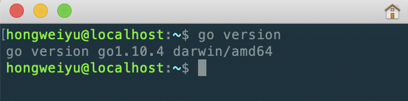
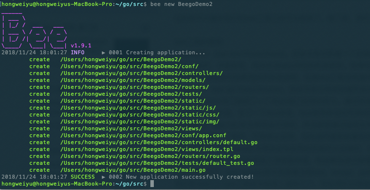
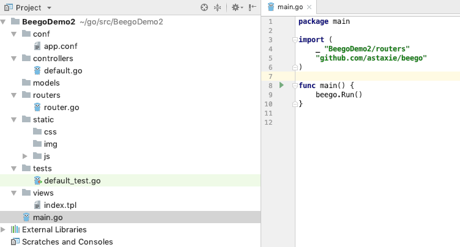
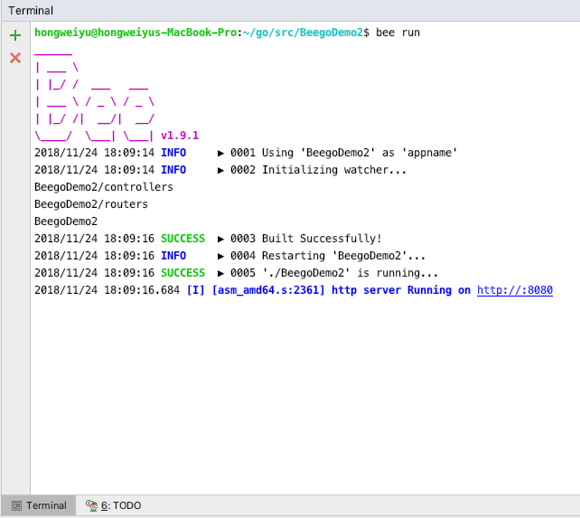
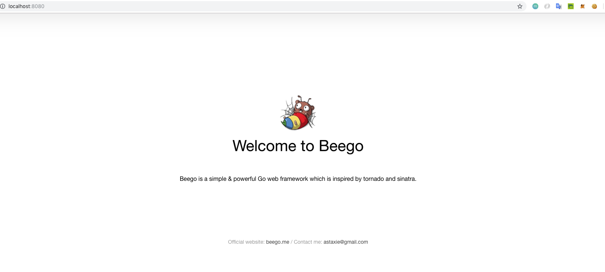
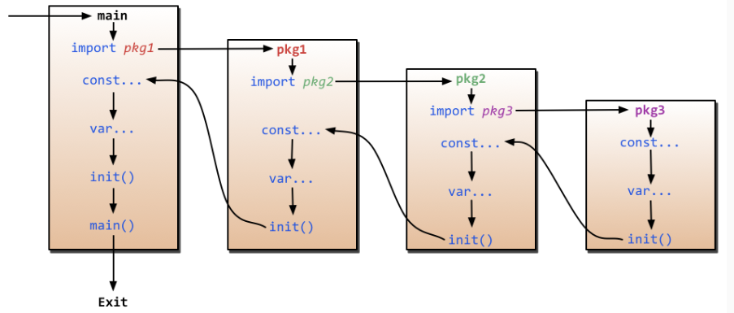
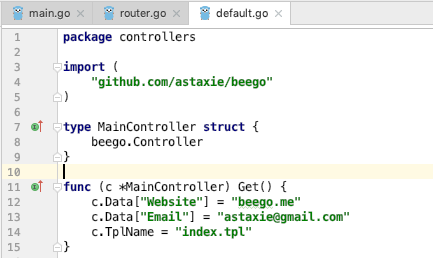

# beego框架介绍和流程分析

**@author：Davie**
**版权所有：北京千锋互联科技有限公司**

从今天开始，我们开始进入一个新的阶段的学习。从今天开始我们开始一个新的框架知识的学习--GoWeb开发之Beego实战项目。

* beego官方文档：[https://beego.me/](https://beego.me/)

# 一、beego框架介绍
## 1.1 beego框架介绍--beego简介
#### 1.1.1 什么是beego
beego是一个使用Go语言来开发WEB引用的GoWeb框架，该框架起始于2012年，由一位中国的程序员编写并进行公开，其目的就是为大家提供一个高效率的web应用开发框架。该框架采用模块封装，使用简单，容易学习。方便技术开发者快速学习并进行实际开发。对程序员来说，beego掌握起来非常简单，只需要关注业务逻辑实现即可，框架自动为项目需求提供不同的模块功能。

在对beego框架有了一个简单基本的了解之后，我们给大家介绍一下beego的一些特性。

#### 1.1.2 beego框架特性
Beego框架的主要特性：

**1）简单化：**RESTful支持，MVC模型；可以使用bee工具来提高开发效率，比如监控代码修改进行热编译，自动化测试代码，以及自动化打包部署等丰富的开发调试功能。

**2）智能化：**beego框架封装了路由模块，支持智能路由，智能监控，并可以监控内存消耗，CPU使用以及goroutine的运行状况，方便开发者对线上应用进行监控分析。

**3）模块化：**beego根据功能对代码进行节耦封装，形成了Session，Cache，Log，配置解析，性能监控，上下文操作，ORM等独立的模块，方便开发者进行使用。

**4）高性能：**beego采用Go原生的http请求，goroutine的并发效率应付大流量的Web应用和API应用。

大家需要记住beego的几个特性，一方面在面试过程中，如果有面试官问起大家关于goweb开发的相关知识的时候，有可能问beego框架有优势或者有什么特点，这个时候需要大家能够对beego框架这些特点做一个介绍；另一方面，咱们在后面实际的学习和编码过程中，大家感受一下这些特性在实际项目中为我们带来的便利和高效。

## 1.2 beego框架介绍--beego安装
在对beego的特点做了简单了解之后，我们就真正开始来搭建beego的环境，开始进入实际的编码阶段。

首先我们进行beego源码的安装。说到beego的源码安装，这里需要我们使用一个命令，这个命令之前大家应该都接触过吧？我们使用go get命令来进行beego的安装。

#### 1.2.1 Go语言版本要求
**【注意】：**在安装的时候，有一点大家要注意，beego框架要求Go 语言版本1.1+以上，这个我们大家的版本应该至少也是1.9的吧，应该都没有。或者大家现在在命令行中，执行go version查看一下自己的go语言版本，如下所示：


上图显示，本地环境go语言版本就是1.10.4版本。

#### 1.2.2 beego安装命令
现在，我们来执行安装命令：
```go
go get github.com/astaxie/beego
```
等待go将源代码下载安装完毕，我们就可以在我们自己设置的GOPATH下面的src目录下找到beego框架源码。

#### 1.2.3 编写第一个beego程序

那么，我们首先来看一个最最简单的例子beego项目的例子，这个例子就一句话：
* 1、编写第一个beego示例项目

    ```
    package main
    import "github.com/astaxie/beego"
    func main() {
        beego.Info("第一个beego案例")
        beego.Run("localhost:8080")
    }
    ```
* 2、编译
    ```
    go build -o hello hello.go
    ```
    
* 3、执行
    ```
    ./hello
    ```
* 4、效果查询
    ```
    访问浏览器http://localhost:8080
    ```
我们在浏览器当中进行访问:[http://localhost:8080](http://localhost:8080)，可以看到，在我们的浏览器当中出现了404，代表着页面没找到；这个很好理解，因为没有指定默认的页面，所以后台项目就不知道默认指向哪个页面路径，因此就提示404。但是，看后台打出了日志，这就说明，前端的请求确实到了后台main方法里面进行执行。

## 1.3 beego框架介绍--命令行工具Bee
现在，尝试来进行对代码进行修改，就简单的添加一行打印日志：beego.Info("代码修改")。这个时候，如果我们要想让代码生效，必须把原来正在执行的程序停止，然后重新执行编码和运行命令，我们来实际尝试一下。

经过我们的尝试，我们可以发现，确实第二次的重新启动的程序打印出了两条后台日志，这说明我们修改的代码生效了。

现在向大家引出beego的一个工具：**bee**。

#### 1.3.1 什么是bee
bee是一个开发工具，是协助Beego框架开发项目时进行创建项目，运行项目，热部署等相关的项目管理的工具。beego是源码，负责开发，bee是工具，负责构建和管理项目。介绍beego的特性的时候说过其中一点beego支持代码热部署吧。所谓热部署就是，当修改代码的时候，可以不用停止服务重新启动，内置的beego就能够实时感知源代码程序编码，并进行实时生效，这就是热部署，这样就大大方便了开发人员和维护人员要频繁的进行服务停止，服务重启的过程。现在，来看看bee都有哪些功能，如何进行操作？

#### 1.3.2 bee安装
如同beego一样，如果要使用bee，首先要进行安装，同样的道理，先使用go get命令安装bee工具。bee安装命令：
```
go get github.com/beego/bee
```

#### 1.3.3 bee常用功能命令
安装结束以后，进入到**GOPATH**对应的目录中，然后进入到bin目录下，可以看到有bee这个可执行文件，这就是安装的bee工具的可执行文件，在该目录中，我们在终端中执行以下bee命令，然后回车，会发现列出很多关于bee的用法，如下图：
* new命令：  
```
bee new ProjectName
```
该命令表示新建一个全新的web项目，有一点需要注意：该命令必须在src目录下执行，才能生效，自动生成web项目的目录结构。如果在其他目录下面执行bee new命令，也同样会是在src目录下面生成对应新项目的目录结构，这是bee工具在构建项目的时候默认寻找创建的目录。
    
* api命令：  
```
bee api ProjectNames
```
该命令表示用来创建开发API应用。很多用户写前端的后台接口也是通过go来写，因此bee专门提供了一个写api接口应用的命令。通过目录结构可以看到，和Web项目相比，API项目少了static和views目录，多了一个test目录，test是用来进行写测试用例代码的。
        
* run命令：  
```
bee run 
```
命令用来运行项目，并且能够通过监控文件系统，实时进行代码的热部署更新。也就是，我们代码逻辑进行了修改，不用停止应用，在前端页面就能看到改变。
        
* pack命令：
```
bee pack
```
pack命令用来发布应用的时候的大包操作，该命令会把项目大包成zip包，然后我们就可以在部署的时候直接把大包后的项目上传到服务器，然后解压进行部署。
    
* version命令：
```
bee version
```
version命令来查看当前bee，beego，go的版本。

## 1.4 beego框架介绍--使用Bee工具

常见的几个bee工具命令就是上面的几个，立即来练习使用一下。打开命令行终端，进入到GOPATH所对应的目录，然后进入到src目录中。

#### 1.4.1 使用bee创建项目
使用bee run命令来新建一个案例项目，比如我们新建一个BeegoDemo2的项目，我们执行命令：
```go
bee new BeegoDemo2
```
命令执行效果如下：

可以看到，终端中输出了bee的图标和版本，并且打印出了很多日志，创建了很多文件和目录。这就是bee new命令的执行效果，表示新建一个项目。

#### 1.4.2 查看项目结构
使用我们的开发公局goland来打开新建的BeegoDemo2项目，并查看一下项目目录组织结构：


#### 1.4.3 运行新建项目
现在使用bee命令来运行一下案例，看一下效果。在开发工具下方的terminal中，打开terminal，输入命令：
```go
bee run
```

#### 1.4.4 项目运行效果
运行效果如下：


可以看到输出日志说，http服务已经在[http://localhost:8080](http://localhost:8080)端口运行，现在我们去浏览器中验证一下，效果如下：


# 二、beego程序流程分析
## 2.1 beego程序流程分析--beego程序入口

Go语言执行的时候是执行main包下面的init函数，main函数依次执行。因此，先找到main.go文件。


如上图就是main.go文件内容，那么代码如何执行呢？首先，import导入了两个包，一个是routers，一个是beego。而在routers包前面，可以看到有一个“_”，这表明是引入routers包，并执行init方法。

## 2.2 beego程序流程分析--Go语言程序执行顺序
这里涉及一个知识点，就是Go语言的执行过程，这里给大家一张程序执行流程图：


## 2.3 beego程序流程分析--请求拦截与路由分发

根据上图，可以得知程序首先到routers包下执行init方法。到router.go里面看一下具体的代码：


可以看到在router.go文件中有一个init方法，看到beego.Router()这句代码。

## 2.4 beego程序流程分析--控制器处理

router表示的是路由的意思，这个函数的功能是映射 URL 到 controller，第一个参数是 URL (用户请求的地址)，这里注册的是 /，也就是访问的不带任何参数的 URL，第二个参数是对应的 Controller，即将把请求分发到那个控制器来执行相应的逻辑，现在去这里设置的MainController中去看一下有什么方法：



MainController结构体及函数声明在default.go文件中。而这里就看到一个Get方法，方法中有三行代码。

上文在浏览器中访问的是：[http://localhost:8080](http://localhost:8080)，这是一个get请求，请求到了后台以后，什么请求参数都没有，因此，就会被“/”拦截，执行到MainController中的代码，因为是get请求，所以这里自动找到Get函数并进行执行。

在get函数里面，有三句代码，前两句c.Data[]= ""表示设置返回的数据字段及内容，最后一句c.TplName表示设置处理该请求指向某个模板文件，这里指向了index.tpl，那么index.tpl文件在哪里呢？可以查看项目目录结构，在views下面，views下面存放一些模板文件。

* **模板文件**  

    简单解释一下，通常的页面都是使用静态的html+css+js等这些静态代码来进行页面的布局，页面效果控制等，而把页面的数据使用变量表示，这样，在进行页面展示的时候，就能够自动的填充页面里面的变量的值；这些静态的代码文件统称为模板文件。每个模板文件就是像一个模板一样，样式效果都固定，只是根据数据不一样进行渲染和展示。
    
## 2.4 beego程序流程分析--beego.Run()逻辑
init方法分析完毕后，程序会继续往下执行，就到了main函数，在main函数中执行：beego.Run()代码。分析一下Run代码的逻辑，在Run方法内部，主要做了几件事：

* 解析配置文件，也就是我们的app.conf文件，比如端口，应用名称等信息。

* 检查是否开启session，如果开启session，就会初始化一个session对象。

* 是否编译模板，beego框架会在项目启动的时候根据配置把views目录下的所有模板进行预编译，然后存放在map中，这样可以有效的提高模板运行的效率，不需要进行多次编译。

* 监听服务端口。根据app.conf文件中的端口配置，启动监听。
