# beego框架总结及数据库连接配置
**@author：Davie**
**版权所有：北京千锋互联科技有限公司**

## 一、beego框架总结
### 1.1 Beego项目组织架构
上节课程内容对beego的案例代码进行了一个简单的分析，总结一下beego项目的组织结构，总结如下：

#### 1.1.1 项目配置：conf
项目配置文件所在的目录，项目中有一些全局的配置都可以放在此目录下。默认的app.conf文件中默认指定了三个配置：

* appname = BeegoDemo2：** 指定项目名称。

* httpport = 8080：** 指定项目服务监听端口。

* runmode = dev：** 指定执行模式。
    
#### 1.1.2 控制器：controllers
该目录是存放控制器文件的目录，所谓控制器就是控制应用调用哪些业务逻辑，由controllers处理完http请求以后，并负责返回给前端调用者。

#### 1.1.3 数据层：models
models层可以解释为实体层或者数据层，在models层中实现和用户和业务数据的处理，主要和数据库表相关的一些操作会在这一目录中实现，然后将执行后的结果数据返回给controller层。比如向数据库中插入新数据，删除数据库表数据，修改某一条数据，从数据库中查询业务数据等都是在models层实现。

#### 1.1.4 路由层：routers：
该层是路由层。所谓路由就是分发的意思，当前端浏览器进行一个http请求达到后台web项目时，必须要让程序能够根据浏览器的请求url进行不同的业务处理，从接收到前端请求到判断执行具体的业务逻辑的过程的工作，就由routers来实现。

#### 1.1.5 静态资源目录：static
在static目录下，存放的是web项目的静态资源文件，主要有：css文件，img，js，html这几类文件。html中会存放应用的静态页面文件。

#### 1.1.6 视图模板：views
views中存放的就是应用中存放html模版页面的目录。所谓模版，就是页面框架和布局是已经使用html写好了的，只需要在进行访问和展示时，将获取到的数据动态填充到页面中，能够提高渲染效率。因此，模版文件是非常常见的一种方式。

综上，这个整个的项目架构就是MVC的运行模式。常见的架构模式大家应该熟悉比如：MVC，MVP，MVVM等架构。这里我们采用MVC，比较清晰易懂。

### 1.2 beego框架路由设置
在beego框架中，支持四种路由设置，他们分别是：**基础路由**，**固定路由**，**正则路由**和**自动路由**。

#### 1.2.1 基础路由：
直接通过beego.Get,beego.POST,beego.Head,beego.Delete等方法来进行路由的映射，我们通过代码给大家来进行演示。我们知道，常见的http请求方法操作有：GET，HEAD，PUT，POST，DELETE，OPTIONS等。
* GET路由
首先是基础的GET路由。下面我们通过例子来向大家进行展示。

    ```go
    beego.GET("",func)
    ```

* POST路由：

    ```go
    beego.POST("",func)
    ```

* 除此之外，还支持Patch，Head，Delete等基础路由。

以上这种请求和对应找到请求方法类型的方式就是RESTful形式，我们最常用的也是RESTful形式
RESTful是目前开发API中非常常用的一种形式，其实就是RESTful形式就是用户是get请求时就自动执行Get方法，Post请求就执行Post方法。
    
#### 1.2.2 固定路由：
诸如以下此种代码形式：
    
```
beego.Router("/",controller);
```

Get请求就会对应到Get方法，Post就会对应到Post方法，Delete就会对应到Delete方法，Header方法就会对应Header方法。

#### 1.2.3 正则路由：
正则路由是指可以在进行固定路由的基础上，支持匹配一定格式的正则表达式。比如:id,:username,自定义正则,file的路径和后缀切换以及全匹配等操作。
    
#### 1.2.4 自定义路由
上面两种路由都是默认的根据请求的类型，Get就执行Get方法，Post执行Post方法，比较局限。因为在开发的时候大部分都是使用固定匹配想要直接执行对应的逻辑控制方法，因此beego提供给我们了可以自定义的自定义路由配置。方式如下：
```
beego.Router("/",&IndexController{},"")
```
可以用的HTTP Method：
* "*"：包含以下所有的函数
* "get"：GET 请求
* "post"：POST 请求
* "put"：PUT 请求
* "delete"：DELETE 请求
* "patch"：PATCH 请求
* "options"：OPTIONS 请求
* "head"：HEAD 请求

上面这些对应的请求方法，在beego.Controller中，定义了很多的方法，比如Init，Prepare，Post，Get，Head，Delete等方法。以上分析的是beego框架的Router以及Controller运行逻辑。

### 1.3 model层分析
在Web开发过程中，开发者操作数据，存储数据最常用的就是数据库操作，数据库操作是独立的一个模块，这个在后面具体的项目中会带着大家实现。

### 1.4 view编写
这里的实战项目静态的html模版文件以及一些其他的静态资源，是已经写好提供给开发者直接可以拿来放在项目中进行使用。在实际的开发过程中，要求大家需要掌握html，js语法以及简单的css语法要能看懂，能够时间简单的使用。更加复杂的前端页面或者静态页面，需要和前端开发人员进行对接。开发重心是在后台服务端，因此，只需要学会使用和调用调试即可。

### 1.5 静态文件的设置
在goweb项目中，上面说过是有一些静态资源文件的，如果用户要访问静态资源文件，我们应该也是能够访问的，这需要在我们的项目中进行静态资源设置。
设置方式为：
```
beego.SetStaticPath("/down1","download1")
```
这里的download目录是指的非goweb项目的static目录下目录，而是开发者重新新建的另外的目录。

### 1.6 实战项目介绍
在本系列课程中，我们一起使用Beego框架开发实现一个博客系统。如下图所示：

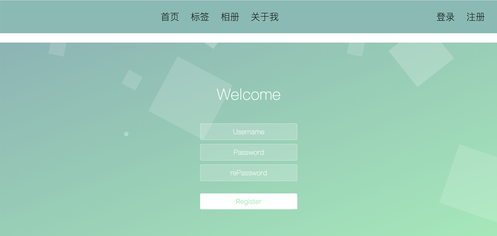

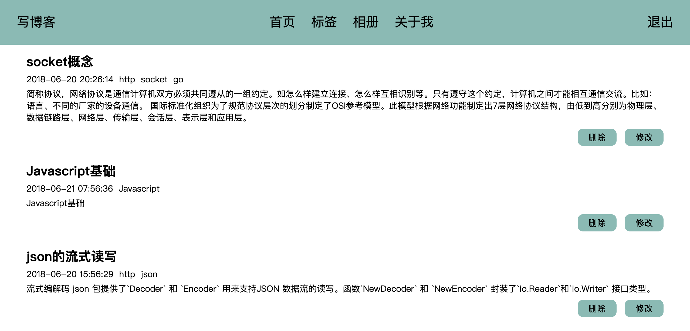

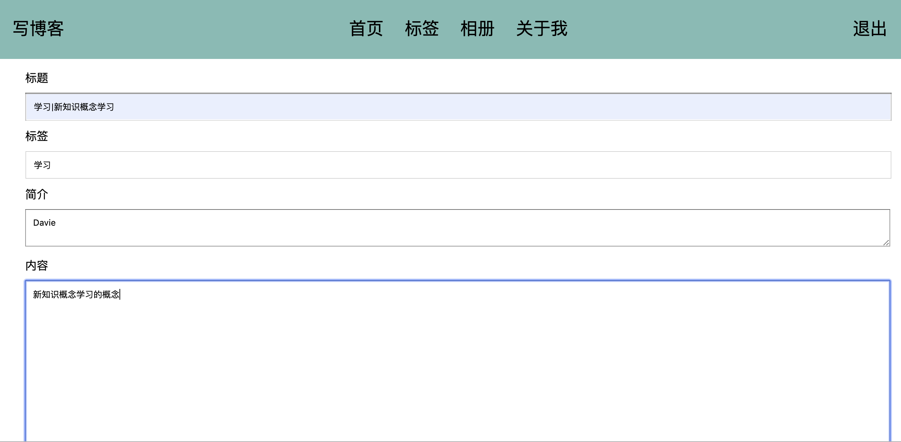

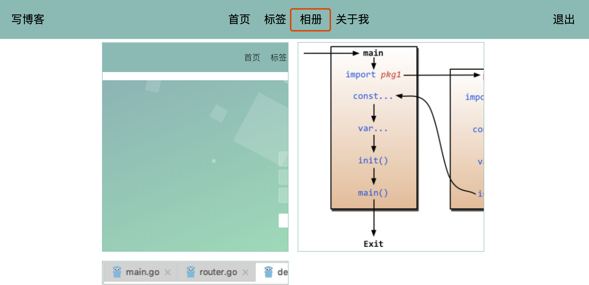

# 二、数据库配置及连接测试
### 2.1 mysql数据库安装
mysql官方下载网站：[https://dev.mysql.com/downloads/](https://dev.mysql.com/downloads/)
我们使用的是5.7版本，下载链接：[https://dev.mysql.com/downloads/mysql/5.7.html#downloads](https://dev.mysql.com/downloads/mysql/5.7.html#downloads)

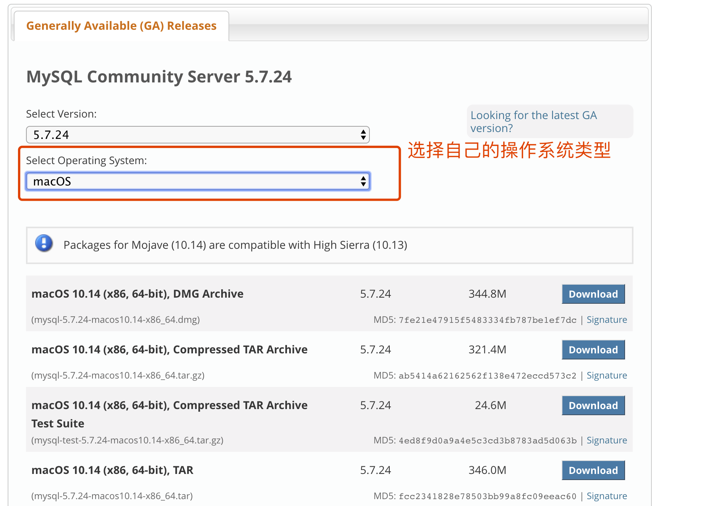

选择下载安装文件，并在本地进行安装。
安装过程中，若出现初始密码，要记住该密码，首次登陆时要使用。

**【注意】windows安装说明：[https://jingyan.baidu.com/article/09ea3ededa53b7c0aede39b5.html](https://jingyan.baidu.com/article/09ea3ededa53b7c0aede39b5.html)**

安装完毕后，将mysql的bin目录路径添加配置到环境变量，以便能够在终端命令行中进行使用登陆mysql。

在终端中登陆mysql的命令：
```
mysql -u root -p
```

输入安装时或者自己设置的密码即可登陆成功。如下所示：
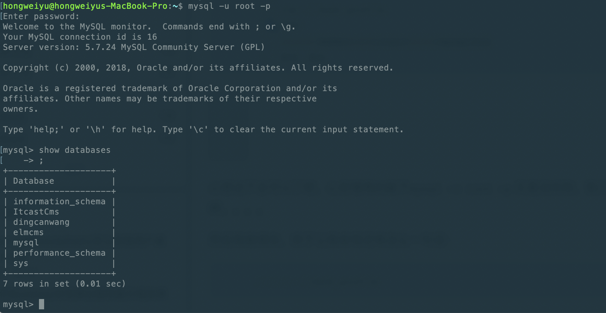
如上图所示表示登陆成功。为了使用自己的密码，可以自己设置一个自己熟悉的密码，方便自己记忆。

### 2.2 mysql数据库常用命令
mysql数据库的一些命令使用：
* 查看数据库：

    ```
    show databases;
    ```
* 使用某个数据库：

    ```
    use databaseName;
    ```

* 展示某个数据库表格列表：

    ```
    show tables;
    ```
    
* mysql中的一些其他命令：

    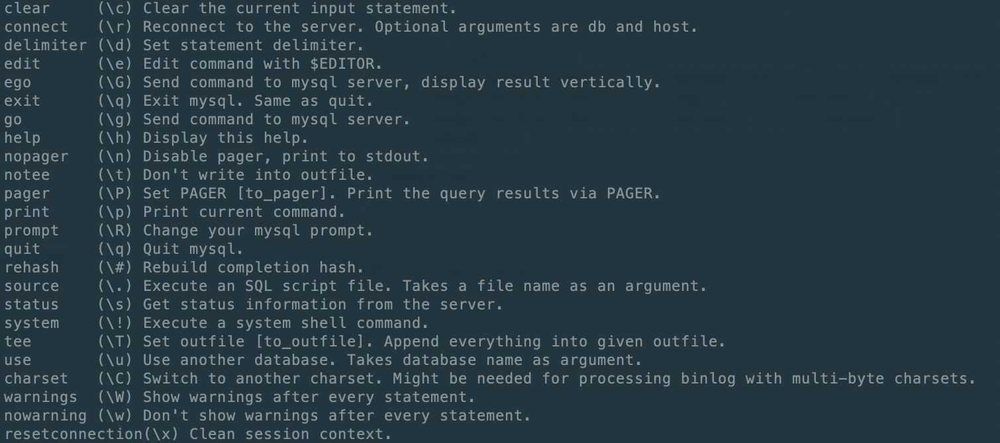
    
以上mysql数据操作都是命令行终端形式，为了方便我们日常操作，我们可以使用图形化界面工具，在这里我们使用的是navicat工具。我们现在来看如何进行安装。

### 2.3 Navicat安装
navicat工具下载地址：[https://www.navicat.com/en/download/navicat-for-mysql](https://www.navicat.com/en/download/navicat-for-mysql)

在上面的链接中，选择自己的系统版本，然后下载安装文件，进行安装，一直默认选下一步即可，最后安装成功。

安装好了以后，在mysql数据库中创建一个新的数据库，比如名字为：**myblog**;创建完数据库以后，我们来看一看在beego项目中如何使用mysql数据库。

### 2.4 数据库驱动

我们之前给大家说过，数据库编程属于beego中的Models层，也称ORM模块。

在beego中，目前支持三种数据库驱动，分别是：

* **MySQL：** [github.com/go-sql-driver/mysql](github.com/go-sql-driver/mysql)
* **PostgreSQL：**[github.com/lib/pq](github.com/lib/pq)
* **Sqlite3：**[github.com/mattn/go-sqlite3](github.com/mattn/go-sqlite3)

beego中的ORM所具备的几个特性：

* **支持Go语言的所有类型存储**

* **CRUD操作简单**

* **自动Join关联表**

* **允许直接使用SQL查询**


### 2.5 beego项目中使用mysql

#### 2.5.1 导入对应的数据库驱动
比如mysql：
```
import _ "github.com/go-sql-driver/mysql"
```
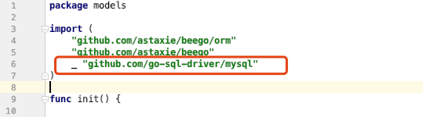

#### 2.5.2 注册驱动，连接数据库
通过如下两句话注册数据库驱动，以及连接数据库的操作：
```
orm.RegisterDriver("mysql",orm.DRMySQL)
orm.RegisterDataBase(aliasName,driverName,dbConn)
```
详细代码如下：
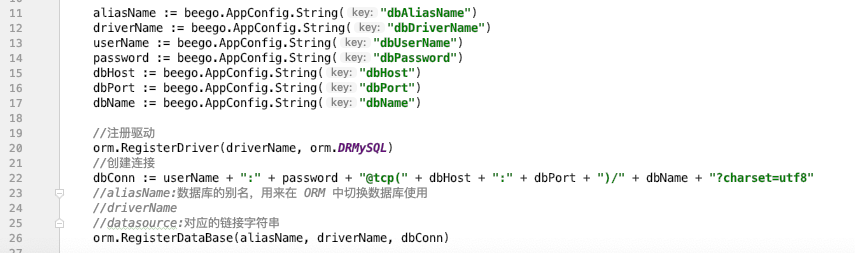

#### 2.5.3 创建数据库并执行程序
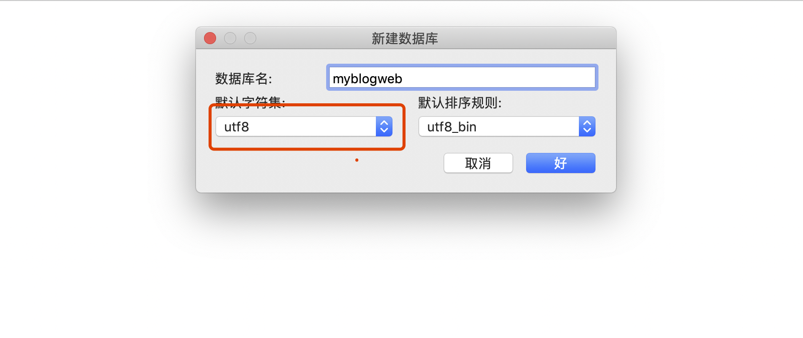

连接数据库代码如下：

```
package models
    
import (
	"github.com/astaxie/beego"
	"github.com/astaxie/beego/orm"
	"BlogProject/MysqlDemo/util"
	//切记：导入驱动包
	_ "github.com/go-sql-driver/mysql"
)
    
func init() {
	driverName := beego.AppConfig.String("driverName")
    
	//注册数据库驱动
	orm.RegisterDriver(driverName, orm.DRMySQL)
    
	//数据库连接
	user := beego.AppConfig.String("mysqluser")
	pwd := beego.AppConfig.String("mysqlpwd")
	host := beego.AppConfig.String("host")
	port := beego.AppConfig.String("port")
	dbname := beego.AppConfig.String("dbname")
    
	//dbConn := "root:yu271400@tcp(127.0.0.1:3306)/cmsproject?charset=utf8"
	dbConn := user + ":" + pwd + "@tcp(" + host + ":" + port + ")/" + dbname + "?charset=utf8"
    
	err := orm.RegisterDataBase("default", driverName, dbConn)
	if err != nil {
		util.LogError("连接数据库出错")
		return
	}
	util.LogInfo("连接数据库成功")  
}
```

#### 2.5.4 程序执行结果
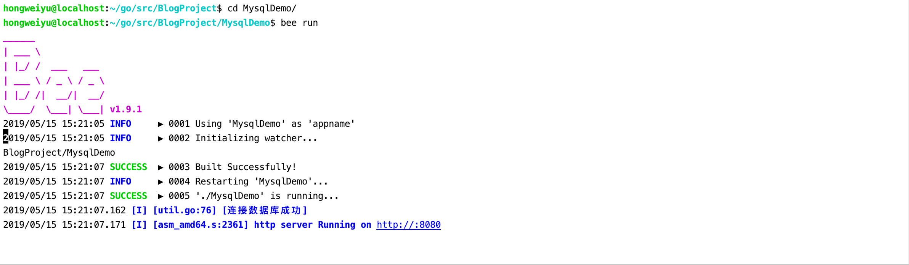
    


注：文章采用了部分外部网页链接，内容均来自公开内容。侵删除。