# 项目搭建、登录注册和Session功能开发  
**@author：Davie**  
**版权所有：北京千锋互联科技有限公司**

## 一 项目搭建和注册用户功能
### 1.1 项目搭建
#### 1.1.1 创建项目
首先打开终端进入gopath下的src目录，然后执行以下命令，创建一个beego项目：

```shell
bee new myblog
```

运行效果如下：

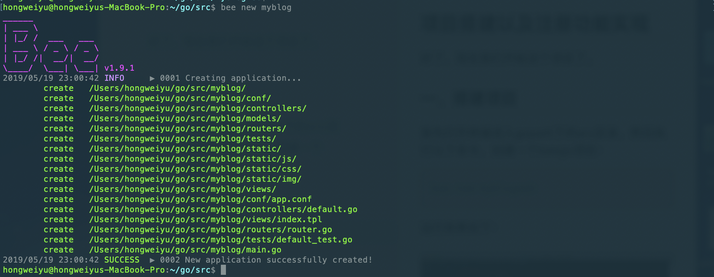

然后通过goland打开该项目：
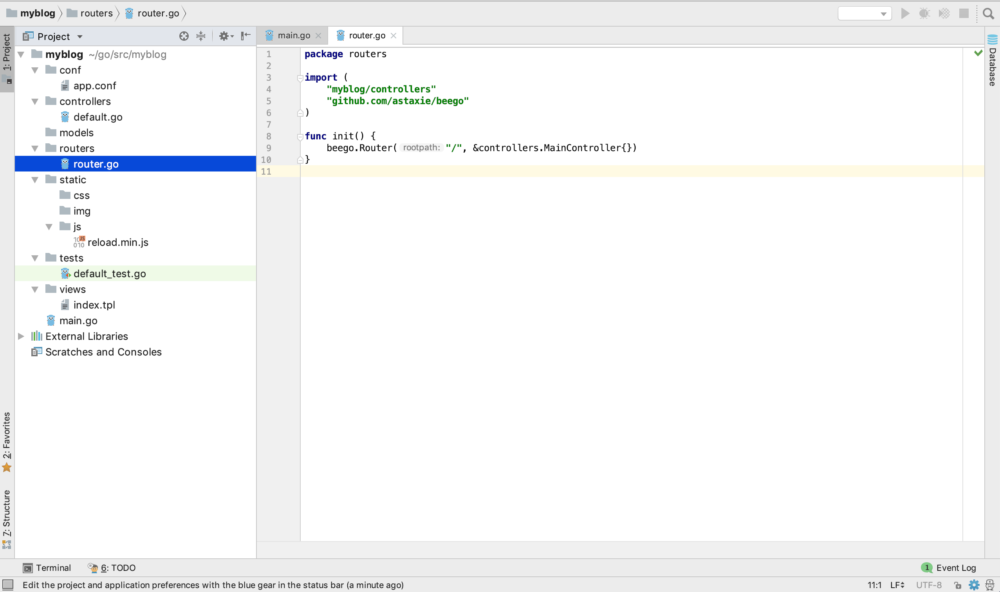

#### 1.1.2 修改端口配置
我们打开conf包下的配置文件：app.conf文件，修改端口号为8080：

```go
appname = myblog
httpport = 8080
runmode = dev
```

#### 1.1.3 项目运行和效果
然后在终端中进入该项目目录，然后运行项目：
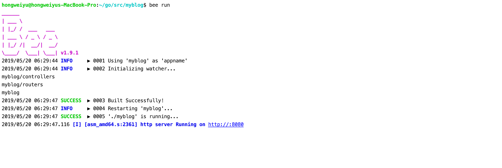

我们可以看到，项目已经运行了，并且监听在8080的端口上。接下来我们打开浏览器输入网址：[http://127.0.0.1:8080/](http://127.0.0.1:8080/)，然后可以看到欢迎界面：
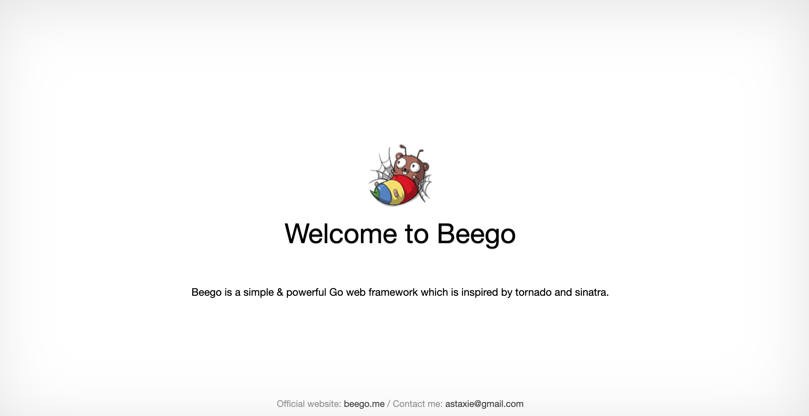

### 1.2 用户注册功能

#### 1.2.1 数据库创建及连接

首先我们先在创建一个数据库：
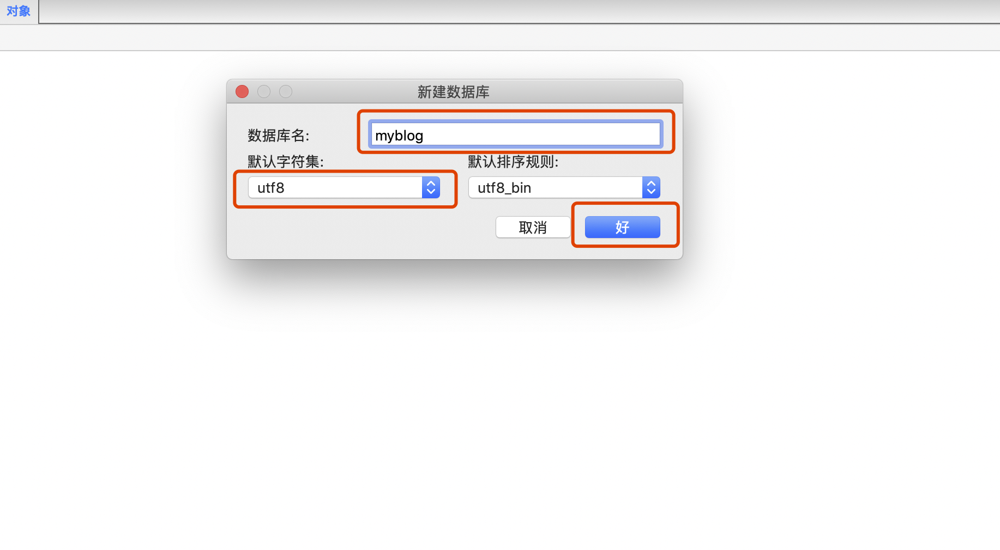

我们先创建一个工具包utils，然后创建一个go文件，用于做mysql的工具类，里面提供连接数据库和创建表的功能。

首先提供一个初始化方法：
```
func InitMysql() {

	fmt.Println("InitMysql....")
	driverName := beego.AppConfig.String("driverName")

	//注册数据库驱动
	orm.RegisterDriver(driverName, orm.DRMySQL)

	//数据库连接
	user := beego.AppConfig.String("mysqluser")
	pwd := beego.AppConfig.String("mysqlpwd")
	host := beego.AppConfig.String("host")
	port := beego.AppConfig.String("port")
	dbname := beego.AppConfig.String("dbname")

	//dbConn := "root:yu271400@tcp(127.0.0.1:3306)/cmsproject?charset=utf8"
	dbConn := user + ":" + pwd + "@tcp(" + host + ":" + port + ")/" + dbname + "?charset=utf8"

	//dbConn := "root:yu271400@tcp(127.0.0.1:3306)/cmsproject?charset=utf8"
	dbConn := user + ":" + pwd + "@tcp(" + host + ":" + port + ")/" + dbname + "?charset=utf8"

	db, _ = sql.Open(driverName, dbConn)
```

#### 1.2.2 数据库表设计
然后设计一下数据表，我们需要用户的id，并且作为主键，用户名username和密码password，还有状态status，这个用于标记该用户是否被删除，0表示正常状态，1表示删除。还要就是注册时间，我们用整型的时间戳来表示即可，所以sql语句如下：可以直接操作数据库创建，也可以通过代码进行创建：

```go
//创建用户表
func CreateTableWithUser() {
	sql := `CREATE TABLE IF NOT EXISTS users(
		id INT(4) PRIMARY KEY AUTO_INCREMENT NOT NULL,
		username VARCHAR(64),
		password VARCHAR(64),
		status INT(4),
		createtime INT(10)
		);`

	ModifyDB(sql)
}
```

#### 1.2.3 数据库操作方法
然后再提供一个方法，用于执行sql语句：

```go
//操作数据库
func ModifyDB(sql string, args ...interface{}) (int64, error) {
	result, err := db.Exec(sql, args...)
	if err != nil {
		log.Println(err)
		return 0, err
	}
	count, err := result.RowsAffected()
	if err != nil {
		log.Println(err)
		return 0, err
	}
	return count, nil
}
```

再提供一个方法，用于之后的数据库操作：

```go

//查询
func QueryRowDB(sql string) *sql.Row{
	return db.QueryRow(sql)
}
```

#### 1.2.4 定义User和数据库操作方法
然后再models中创建一个model文件：

```go
package models

import (
	"myblogweb/utils"
	"fmt"
)

type User struct {
	Id         int
	Username   string
	Password   string
	Status     int // 0 正常状态， 1删除
	Createtime int64
}

//--------------数据库操作-----------------

//插入
func InsertUser(user User)(int64, error){
	return utils.ModifyDB("insert into users(username,password,status,createtime) values (?,?,?,?)",
		user.Username,user.Password,user.Status,user.Createtime)
}

//按条件查询
func QueryUserWightCon(con string)int{
	sql := fmt.Sprintf("select id from users %s",con)
	fmt.Println(sql)
	row:=utils.QueryRowDB(sql)
	id :=0
	row.Scan(&id)
	return id
}

//根据用户名查询id
func QueryUserWithUsername(username string) int{
	sql := fmt.Sprintf("where username='%s'",username)
	return QueryUserWightCon(sql)
}

//根据用户名和密码，查询id
func QueryUserWithParam(username ,password string)int{
	sql:=fmt.Sprintf("where username='%s' and password='%s'",username,password)
	return QueryUserWightCon(sql)
}
```

#### 1.2.5 创建register.html注册文件
我们先在views包下，创建一个html页面：register.html。
```html
<!DOCTYPE html>
<html lang="en">
<head>
    <meta charset="UTF-8">
    <title>注册</title>
    <link rel="stylesheet" type="text/css" href="../static/css/lib/login.css">
    <link rel="stylesheet" type="text/css" href="../static/css/blogsheet.css">
    <script src="../static/js/lib/jquery-3.3.1.min.js"></script>
    <script src="../static/js/lib/jquery.url.js"></script>
    <script src="../static/js/blog.js"></script>
</head>
<body>
    <div id="nav">
        <div id="nav-login">
            <ul>
                <li><a href="/login">登录</a></li>
                <li><a href="/register">注册</a></li>

            </ul>

        </div>
    </div>


    <div class="htmleaf-container">
        <div class="wrapper">
            <!--注册表单-->
            <div class="container">
                <h1>Welcome</h1>
                <form id="register-form" class="form">
                    <input type="text" name="username" placeholder="Username">
                    <input type="password" name="password" placeholder="Password" id="register-password">
                    <input type="password" name="repassword" placeholder="rePassword">
                    <br>
                    <button type="submit" id="login-button">Register</button>
                </form>
            </div>

            {{/*背景动画*/}}
            <ul class="bg-bubbles">
                <li></li>
                <li></li>
                <li></li>
                <li></li>
                <li></li>
                <li></li>
                <li></li>
                <li></li>
                <li></li>
                <li></li>
            </ul>
        </div>
    </div>
</body>
</html>
```

#### 1.2.6 添加用户注册逻辑验证
添加表单验证：我们使用jquery来实现js部分，在js目录下，创建子目录lib，在里面放jquery框架文件，并在页面中引入。

然后重新创建一个js文件：blog.js
首先添加表单验证：
```js
$(document).ready(function () {
    //注册表单验证
    $("register-from").validate({
        rules:{
            username:{
                required:true,
                rangelength:[5,10]
            },
            password:{
                required:true,
                rangelength:[5,10]
            },
            repassword:{
                required:true,
                rangelength:[5,10],
                equalTo:"#register-password"
            }
        },
        messages:{
            username:{
                required:"请输入用户名",
                rangelength:"用户名必须是5-10位"
            },
            password:{
                required:"请输入密码",
                rangelength:"密码必须是5-10位"
            },
            repassword:{
                required:"请确认密码",
                rangelength:"密码必须是5-10位",
                equalTo:"两次输入的密码必须相等"
            }
        },
        submitHandler:function (form) {
            var urlStr = "/register";
            // alert("urlStr:"+urlStr)
            $(form).ajaxSubmit({
                url:urlStr,
                type:"post",
                dataType:"json",
                success:function (data,status) {
                    alert("data:"+data.message)
                    if (data.code == 1){
                        setTimeout(function () {
                            window.location.href="/login"
                        },1000)
                    }
                },
                err:function (data,status) {
                    alert("err:"+data.message+":"+status)
                }
            })
        }
    })
})
```
当用户点击表单的submit按钮，会跳转到/register路径，而因为设置为post请求，所以我们可以在post中完成表单的注册。如果注册成功，再跳转到/login路径。

#### 1.2.7 控制器开发(controller)
我们在controllers包下创建一个新的controller，用来处理用户的注册：

```go
package controllers

import "github.com/astaxie/beego"

type RegisterController struct {
	beego.Controller
}

func (this *RegisterController) Get(){
	this.TplName = "register.html"
}

```

#### 1.2.8 添加路由解析
接下来，我们需要新注册一个路由，修改router.go文件：
```go
func init() {
    beego.Router("/", &controllers.MainController{})
    beego.Router("/register", &controllers.RegisterController{})
}
```

#### 1.2.9 Post方法编码实现
我们创建一个Post()方法，用于处理post的请求：
```go

//处理注册
func (this *RegisterController) Post() {
	//获取表单信息
	username := this.GetString("username")
	password := this.GetString("password")
	repassword := this.GetString("repassword")
	fmt.Println(username, password, repassword)

	//注册之前先判断该用户名是否已经被注册，如果已经注册，返回错误
	id := models.QueryUserWithUsername(username)
	fmt.Println("id:",id)
	if id > 0 {
		this.Data["json"] = map[string]interface{}{"code":0,"message":"用户名已经存在"}
		this.ServeJSON()
		return
	}

	//注册用户名和密码
	//存储的密码是md5后的数据，那么在登录的验证的时候，也是需要将用户的密码md5之后和数据库里面的密码进行判断
	password = utils.MD5(password)
	fmt.Println("md5后：",password)

	user := models.User{0,username,password,0,time.Now().Unix()}
	_,err :=models.InsertUser(user)
	if err != nil{
		this.Data["json"] = map[string]interface{}{"code":0,"message":"注册失败"}
	}else{
		this.Data["json"] = map[string]interface{}{"code":1,"message":"注册成功"}
	}
	this.ServeJSON()
}
```
思路就是先接收表单信息，然后判断数据库中是否已经存在了该用户名，如果已经存在，那么无法进行注册，我们可以通过json返回信息：用户名已经存在。

否则再进行注册，出于对密码安全的考虑，我们可以在数据库中存储密码的md5加密数据。

#### 1.2.10 工具方法
所以在工具包中，再添加一个工具类：myUtils.go

```go
package utils

import (
	"fmt"
	"crypto/md5"
)

//传入的数据不一样，那么MD5后的32位长度的数据肯定会不一样
func MD5(str string) string{
	md5str:=fmt.Sprintf("%x",md5.Sum([]byte(str)))
	return md5str
}

```

#### 1.2.11 项目运行
我们打开终端，进入项目所在的目录，执行命令：  
```
bee run
```

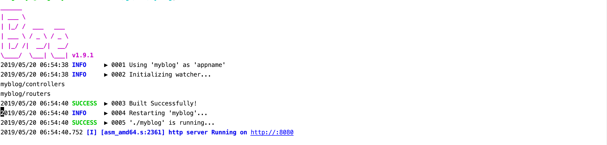

项目启动后，监听在8080端口上。

并且执行了InitMysql()方法，初始化数据库，我们打开数据库进行刷新，已经创建好了一张数据表user：

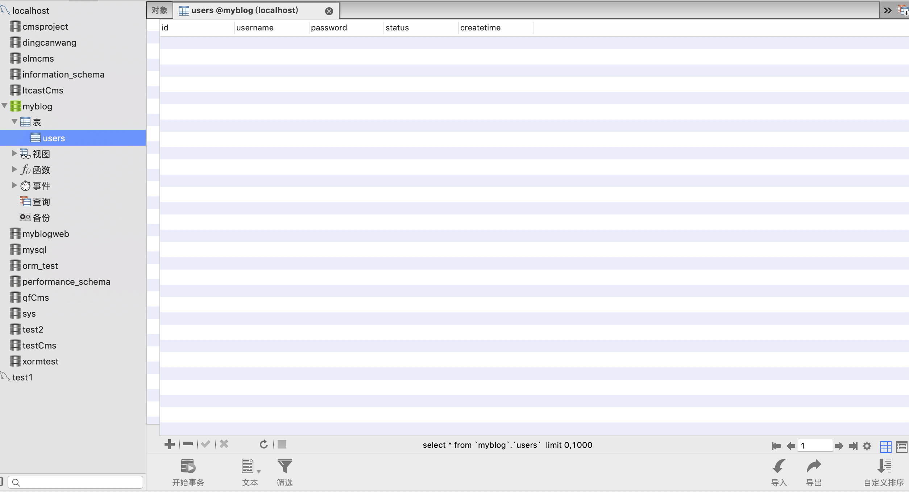

打开浏览器，输入以下网址：[http://localhost:8080/register](http://localhost:8080/register) ,然后输入用户名和密码进行注册。

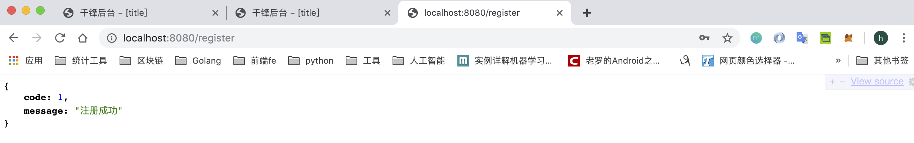

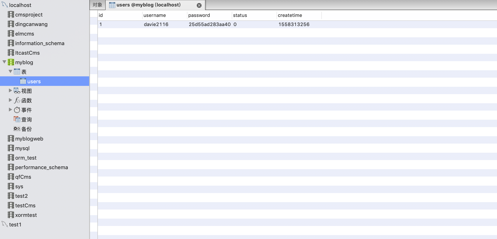

此处，大家可以反复的试验，比如用户名长度不够，重复密码不一致，相同用户名等。

## 二 用户登录功能
上一章节我们已经实现了注册用户名和密码。接下来我们实现登录。
### 2.1 定义LoginController
先创建一个新的go文件，用来定义新的Controller：
```go
type LoginController struct {
	beego.Controller
}
func (this *LoginController) Get() {
	this.TplName = "login.html"
}
```
### 2.2 注册登录功能路由
然后注册一个新的路由：
```go
func init() {
    beego.Router("/", &controllers.MainController{})
    beego.Router("/register", &controllers.RegisterController{})
    beego.Router("/login", &controllers.LoginController{})
}
```
### 2.3 新增Post方法处理登录请求
然后添加一个Post方法：
```go
func (this *LoginController) Post() {
	username := this.GetString("username")
	password := this.GetString("password")
	fmt.Println("username:", username, ",password:", password)
	id := models.QueryUserWithParam(username, utils.MD5(password))
	fmt.Println("id:",id)
	if id > 0 {
		this.Data["json"] = map[string]interface{}{"code": 1, "message": "登录成功"}
	} else {
		this.Data["json"] = map[string]interface{}{"code": 0, "message": "登录失败"}
	}
	this.ServeJSON()
}
```

### 2.4 用户登录的model操作

在之前的Post方法中，我们已经接收页面传来的用户名和密码，然后user_model.go中添加一个方法，用于根据用户名和密码来查询id，表示用户登录的用户名和密码是否正确。
```go
//根据用户名和密码，查询id
func QueryUserWithParam(username ,password string)int{
	sql:=fmt.Sprintf("where username='%s' and password='%s'",username,password)
	return QueryUserWightCon(sql)
}
```
### 2.5 视图层开发
#### 2.5.1 新建login.html文件
我们重新再views包下创建一个html页面，login.html，内容如下：
```html
<!DOCTYPE html>
<html lang="en">
<head>
    <meta charset="UTF-8">
    <title>登录</title>
    <link rel="stylesheet" type="text/css" href="../static/css/lib/login.css">
    <link rel="stylesheet" type="text/css" href="../static/css/blogsheet.css">
    <script src="../static/js/lib/jquery-3.3.1.min.js"></script>
    <script src="../static/js/lib/jquery.url.js"></script>
    <script src="../static/js/blog.js"></script>
</head>
<body>
<div id="nav">
    <div id="nav-login">
        <ul>
            <li><a href="/login">登录</a></li>
            <li><a href="/register">注册</a></li>
        </ul>

    </div>
</div>

<div class="htmleaf-container">
    <div class="wrapper">
    {{/*注册表单*/}}
        <div class="container">
            <h1>Welcome</h1>
            <form id="login-form" class="form">
                <input type="text" name="username" placeholder="请输入用户名">
                <input type="password" name="password" placeholder="请输入密码" id="login-password">
                <br>
                <button type="submit" id="login-button">登录</button>
            </form>
        </div>

    {{/*背景动画*/}}
        <ul class="bg-bubbles">
            <li></li>
            <li></li>
            <li></li>
            <li></li>
            <li></li>
            <li></li>
            <li></li>
            <li></li>
            <li></li>
            <li></li>
        </ul>
    </div>
</div>
</body>
</html>
```
> 因为内容和注册页类似，可以将注册页的内容复制过来，但是要注意标签id等的不同。

#### 2.5.2 js实现登录逻辑验证
接下来我们实现js部分，在blog.js中添加代码，实现登录部分：

```js
    //登录
    $("#login-form").validate({
        rules:{
            username:{
                required:true,
                rangelength:[5,10]
            },
            password:{
                required:true,
                rangelength:[5,10]
            }
        },
        messages:{
            username:{
                required:"请输入用户名",
                rangelength:"用户名必须是5-10位"
            },
            password:{
                required:"请输入密码",
                rangelength:"密码必须是5-10位"
            }
        },
        submitHandler:function (form) {
            var urlStr ="/login"
            alert("urlStr:"+urlStr)
            $(form).ajaxSubmit({
                url:urlStr,
                type:"post",
                dataType:"json",
                success:function (data,status) {
                    alert("data:"+data.message+":"+status)
                    if(data.code == 1){
                        setTimeout(function () {
                            window.location.href="/"
                        },1000)
                    }
                },
                error:function (data,status) {
                    alert("err:"+data.message+":"+status)
                }
            });
        }
    });
```

### 2.6 项目运行
启动项目后，打开浏览器输入以下访问路径：[http://127.0.0.1:8080/login](http://127.0.0.1:8080/login) 然后输入用户名和密码，并且登录，页面返回信息依次如下：

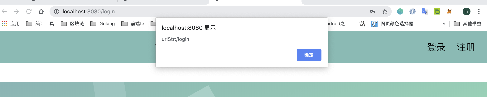

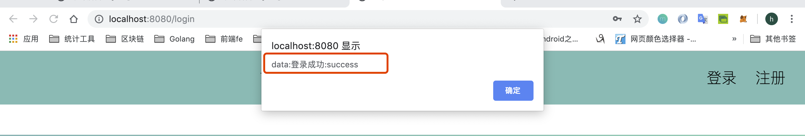

## 三 项目Session处理
### 3.1 Session使用场景介绍
我们希望用户登录后可以有写博客的功能，当然也允许用户退出：
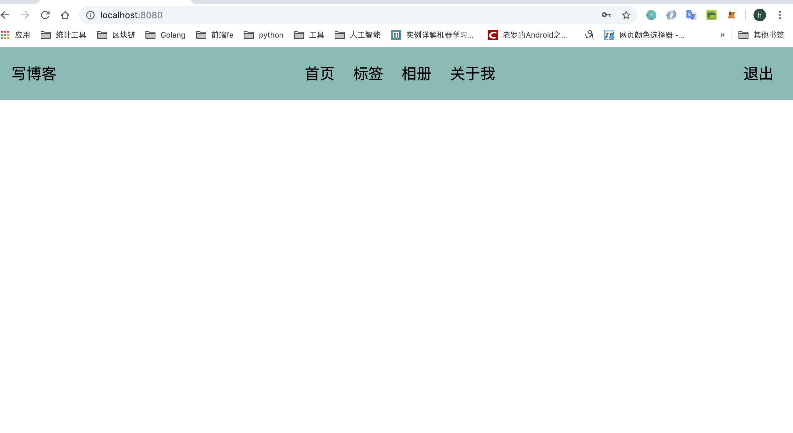

如果用户没有登录，直接访问首页，只可以查看文章，标签，相册等，但是没有写博客的功能：
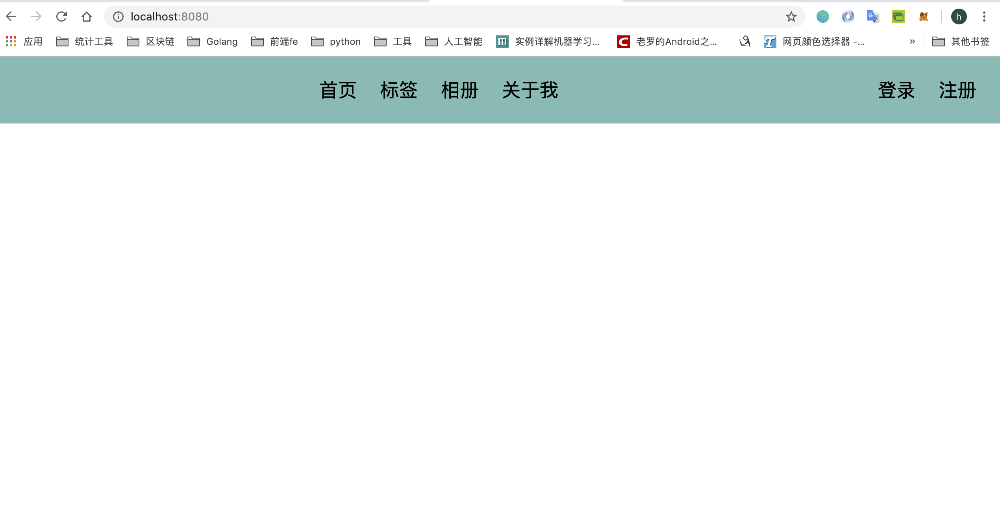

实现该功能的操作需要使用session。

### 3.2 Sesion功能添加
#### 3.2.1 启用Sesion功能
首先我们在登录的时候添加session。
先修改配置文件打开session，打开conf包下的app.conf文件，添加一行：

```go
appname = myblog
httpport = 8080
runmode = dev

sessionon = true
```

或者在main.go中打开session：
```go
func main() {
	utils.InitMysql()
	beego.BConfig.WebConfig.Session.SessionOn = true // 打开session
	beego.Run()
}
```

> 以上两个操作，选择一个即可。

#### 3.2.2 登录功能添加Session处理
然后修改登录的Post方法，在登录的时候，我们设置session：
```go
func (this *LoginController) Post() {
	...
	if id > 0 {
		/*
		设置了session后悔将数据处理设置到cookie，然后再浏览器进行网络请求的时候回自动带上cookie
		因为我们可以通过获取这个cookie来判断用户是谁，这里我们使用的是session的方式进行设置
		 */
		this.SetSession("loginuser", username)
		this.Data["json"] = map[string]interface{}{"code": 1, "message": "登录成功"}
	} else {
		this.Data["json"] = map[string]interface{}{"code": 0, "message": "登录失败"}
	}
	this.ServeJSON()
}
```

#### 3.2.3 添加首页路由
接下来，我们新添加一个路由：
```go
func init() {
    beego.Router("/", &controllers.HomeController{})
    beego.Router("/register", &controllers.RegisterController{})
    beego.Router("/login", &controllers.LoginController{})
}
```

当访问/，这个根路径的时候，我们表示访问首页。

#### 3.2.4 添加首页控制器
接下来创建一个新的Controller，HomeController，用于控制首页。但是在这之前，我们先设置一个父Controller用于获取session，查看用户是否登录。

先创建一个go文件：base_controller.go
```go
type BaseController struct {
	beego.Controller
	IsLogin   bool
	Loginuser interface{}
}
```

先定义个BaseController，里面额外设置两个字段，IsLogin表示用户是否登录，Loginuser表示用户名。

```go
//判断是否登录
func (this *BaseController) Prepare() {
	loginuser := this.GetSession("loginuser")
	fmt.Println("loginuser---->", loginuser)
	if loginuser != nil {
		this.IsLogin = true
		this.Loginuser = loginuser
	} else {
		this.IsLogin = false
	}
	this.Data["IsLogin"] = this.IsLogin
}
```

接下类，重写Prepare()方法，用于获取session。

```go
//判断是否登录
func (this *BaseController) Prepare() {
	loginuser := this.GetSession("loginuser")
	fmt.Println("loginuser---->", loginuser)
	if loginuser != nil {
		this.IsLogin = true
		this.Loginuser = loginuser
	} else {
		this.IsLogin = false
	}
	this.Data["IsLogin"] = this.IsLogin
}
```

这个函数主要是为了用户扩展用的，这个函数会在下面定义的这些 Method 方法之前执行，用户可以重写这个函数实现类似用户验证之类。然后再创建一个home_controller.go文件。

```go
type HomeController struct {
	//beego.Controller
	BaseController
}
```

在Get()方法 中，渲染home页面即可。

```go
func (this *HomeController)Get(){
	fmt.Println("IsLogin:",this.IsLogin,this.Loginuser)
	this.TplName="home.html"
}
```

#### 3.2.5 视图层开发
我们需要如下几个功能：

后续的每个页面都有这几个功能。所以我们可以让页面嵌套。
##### 3.2.5.1 导航栏布局
现在views目录下创建一个子目录block，里面创建一个html页面：nav.html，内容如下：
```html
<div id="nav">
    <div id="nav-write-article">
        <ul>
        {{/*如果已经登录，才会显示"写博客"*/}}
        {{if .IsLogin}}
            <li><a href="/article/add">写博客</a></li>
        {{end}}
        </ul>
    </div>


    <div id="nav-menu">
        <ul>
            <li><a href="/">首页</a></li>
            <li><a href="/tags">标签</a></li>
            <li><a href="/album">相册</a></li>
            <li><a href="/#">关于我</a></li>
        </ul>
    </div>


    <div id="nav-login">
        <ul>
        {{if .IsLogin}}
            <li><a href="">退出</a></li>
        {{else}}
            <li><a href="/login">登录</a></li>
            <li><a href="/register">注册</a></li>
        {{end}}
        </ul>
    </div>

</div>
```

当然这里需要判断用户是否登录，如果登录，显示写博客功能，以及可以退出。否则显示登录或注册。
##### 3.2.5.2 首页视图home.html
接下来，我们创建一个新的页面：**home.html**，内容如下：
```html
<!DOCTYPE html>
<html lang="en">
<head>
    <meta charset="UTF-8">
    <title>首页</title>
    <link href="../static/css/blogsheet.css" rel="stylesheet">
</head>
<body>
{{template "block/nav.html" .}}
</body>
</html>
```

通过页面的嵌套，我们可以将标签显示到home页面上。

> 特别注意，{{template "block/nav.html" .}}，后面的`.`，这是传递当前参数到子模板

##### 3.2.5.3 适配已有视图文件
同样，我们将之前的login.html页面和register.html页面，也将nav嵌套进来，代码如下：

login.html
```html
<!DOCTYPE html>
<html lang="en">
<head>
    <meta charset="UTF-8">
    <title>登录</title>
    <link rel="stylesheet" type="text/css" href="../static/css/lib/login.css">
    <link rel="stylesheet" type="text/css" href="../static/css/blogsheet.css">
    <script src="../static/js/lib/jquery-3.3.1.min.js"></script>
    <script src="../static/js/lib/jquery.url.js"></script>
    <script src="../static/js/blog.js"></script>
</head>
<body>
<!--
<div id="nav">
    <div id="nav-login">
        <ul>
            <li><a href="/login">登录</a></li>
            <li><a href="/register">注册</a></li>
        </ul>

    </div>
</div>
-->
{{template "block/nav.html"}}

<div class="htmleaf-container">
    <div class="wrapper">
    {{/*注册表单*/}}
        <div class="container">
            <h1>Welcome</h1>
            <form id="login-form" class="form">
                <input type="text" name="username" placeholder="请输入用户名">
                <input type="password" name="password" placeholder="请输入密码" id="login-password">
                <br>
                <button type="submit" id="login-button">登录</button>
            </form>
        </div>

    {{/*背景动画*/}}
        <ul class="bg-bubbles">
            <li></li>
            <li></li>
            <li></li>
            <li></li>
            <li></li>
            <li></li>
            <li></li>
            <li></li>
            <li></li>
            <li></li>
        </ul>
    </div>
</div>
</body>
</html>
```

register.html
```html
<!DOCTYPE html>
<html lang="en">
<head>
    <meta charset="UTF-8">
    <title>注册</title>
    <link rel="stylesheet" type="text/css" href="../static/css/lib/login.css">
    <link rel="stylesheet" type="text/css" href="../static/css/blogsheet.css">
    <script src="../static/js/lib/jquery-3.3.1.min.js"></script>
    <script src="../static/js/lib/jquery.url.js"></script>
    <script src="../static/js/blog.js"></script>
</head>
<body>
<!--
<div id="nav">
    <div id="nav-login">
        <ul>
            <li><a href="/login">登录</a></li>
            <li><a href="/register">注册</a></li>

        </ul>

    </div>
</div>
-->

{{template "block/nav.html"}}

<div class="htmleaf-container">
    <div class="wrapper">
    {{/*注册表单*/}}
        <div class="container">
            <h1>Welcome</h1>
            <form id="register-form" class="form">
                <input type="text" name="username" placeholder="Username">
                <input type="password" name="password" placeholder="Password" id="register-password">
                <input type="password" name="repassword" placeholder="rePassword">
                <br>
                <button type="submit" id="login-button">Register</button>
            </form>
        </div>

    {{/*背景动画*/}}
        <ul class="bg-bubbles">
            <li></li>
            <li></li>
            <li></li>
            <li></li>
            <li></li>
            <li></li>
            <li></li>
            <li></li>
            <li></li>
            <li></li>
        </ul>
    </div>
</div>

</body>
</html>
```

#### 3.2.6 添加退出脚本
我们先在nav.html页面中，添加退出的脚本：
```html
    <div id="nav-login">
        <ul>
        {{if .IsLogin}}
            <li><a href='javascript:if(confirm("确定退出吗？")){location="/exit"}'>退出</a></li>
        {{else}}
            <li><a href="/login">登录</a></li>
            <li><a href="/register">注册</a></li>
        {{end}}
        </ul>
    </div>
```

#### 3.2.6 添加退出路由
然后重新注册一个路由，用于处理退出：
```go
func init() {
    beego.Router("/", &controllers.HomeController{})
    //注册
    beego.Router("/register", &controllers.RegisterController{})
    //登录
    beego.Router("/login", &controllers.LoginController{})
    //退出
	beego.Router("/exit", &controllers.ExitController{})

}
```

#### 3.2.7 添加退出功能控制器
然后再创建一个go文件：exit_controller.go
```go
package controllers

type ExitController struct {
	BaseController
}

func (this *ExitController)Get(){
	//清除该用户登录状态的数据
	this.DelSession("loginuser")
	this.Redirect("/",302)
}
```
清除session后，重定位到/路径上。

#### 3.2.8 项目运行
我们重启项目后，打来浏览器输入网址：[http://127.0.0.1:8080/](http://127.0.0.1:8080/)

浏览器如下：
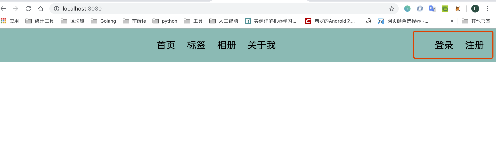

服务器端运行如下：
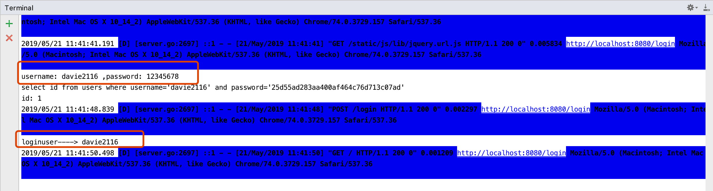

点击退出按钮，后台程序执行效果：
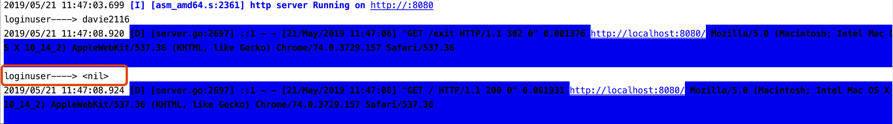
