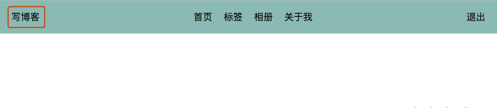
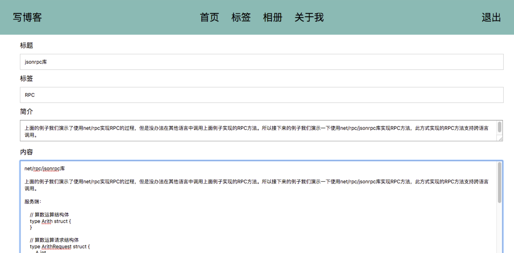
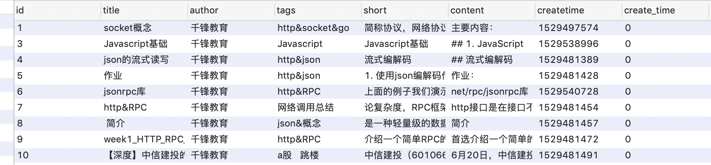
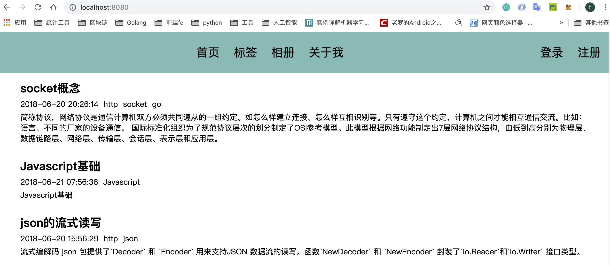
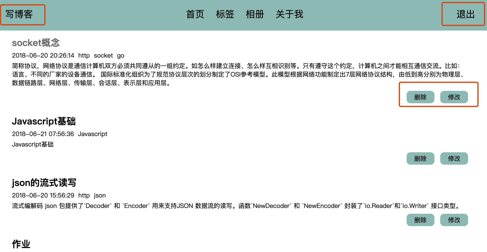
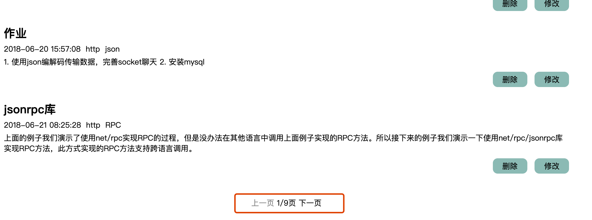
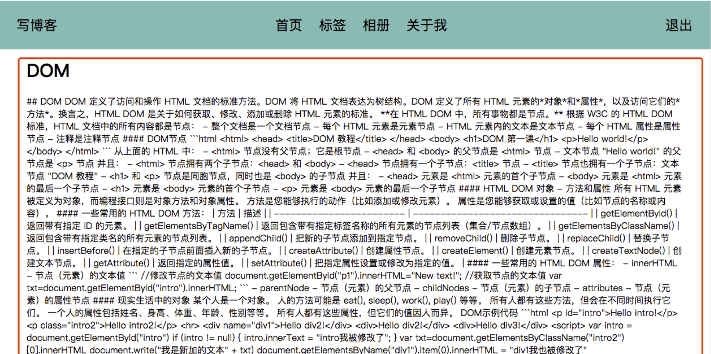
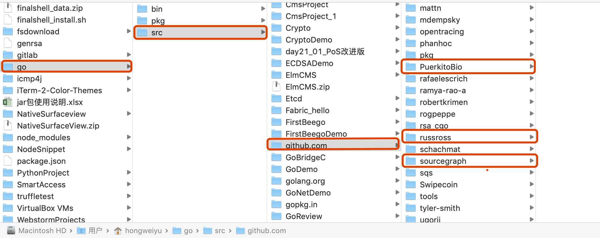
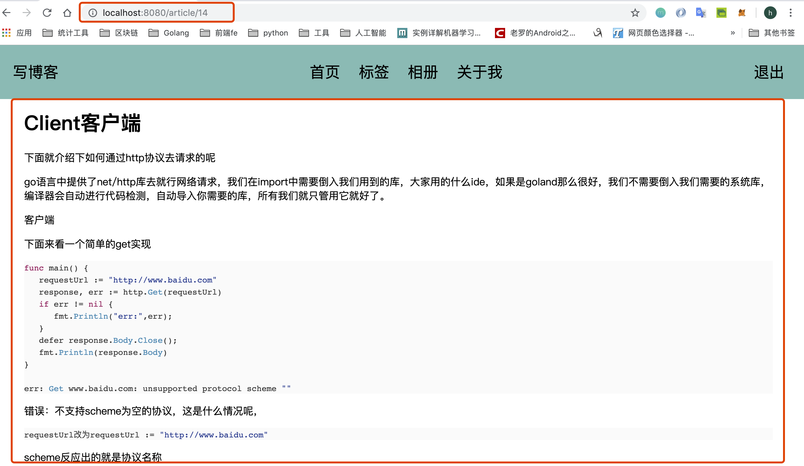

# 写文章、项目首页和查看文章详情功能开发
**@author：Davie**  
**版权所有：北京千锋互联科技有限公司**

点击写文章，我们进入写文章的页面，当用户点击按钮进行提交后，应该将文章的数据存入到数据库中。

## 一 写文章功能开发
### 1.1 数据库表设计
首先我们先设计数据库，用户提交的文章，包含标题，标签，简介，内容， 创建时间等。
在mysqlUtils.go文件中，添加article表的操作：

```go
//创建文章表
func CreateTableWithArticle(){
	sql:=`create table if not exists article(
		id int(4) primary key auto_increment not null,
		title varchar(30),
		author varchar(20),
		tags varchar(30),
		short varchar(255),
		content longtext,
		createtime int(10)
		);`
	ModifyDB(sql)
}
```
### 1.2 model层实现
#### 1.2.1 文章结构体定义
在model目录下创建一个go文件：article_model.go
```go
package models

import "myblog/utils"

type Article struct {
	Id         int
	Title      string
	Tags       string
	Short      string
	Content    string
	Author     string
	Createtime int64
	//Status int //Status=0为正常，1为删除，2为冻结
}
```
#### 1.2.2 添加文章及数据库操作
```go
//---------数据处理-----------
func AddArticle(article Article) (int64, error) {
	i, err := insertArticle(article)
	return i, err
}

//-----------数据库操作---------------
//插入一篇文章
func insertArticle(article Article) (int64, error) {
	return utils.ModifyDB("insert into article(title,tags,short,content,author,createtime) values(?,?,?,?,?,?)",
		article.Title, article.Tags, article.Short, article.Content, article.Author, article.Createtime)
}
```
目前我们只是写文章，所以需要的是添加数据。

### 1.3 控制器层
#### 1.3.1 添加文章控制器定义
首先创建一个controller文件，add_article_controller.go。

```go
package controllers
import (
	"fmt"
	"myblog/models"
	"time"
)
type AddArticleController struct {
	BaseController
}
/*
当访问/add路径的时候回触发AddArticleController的Get方法
响应的页面是通过TpName
 */
func (this *AddArticleController) Get() {
	this.TplName = "write_article.html"
}
```
#### 1.3.2 控制器实现添加文章逻辑处理
```go
//通过this.ServerJSON()这个方法去返回json字符串
func (this *AddArticleController) Post() {

	//获取浏览器传输的数据，通过表单的name属性获取值
	title := this.GetString("title")
	tags := this.GetString("tags")
	short := this.GetString("short")
	content := this.GetString("content")
	fmt.Printf("title:%s,tags:%s\n", title, tags)

	//实例化model，将它出入到数据库中
	art := models.Article{0, title, tags, short, content, "千锋教育", time.Now().Unix()}
	_, err := models.AddArticle(art)

	//返回数据给浏览器
	var response map[string]interface{}
	if err == nil {
		//无误
		response = map[string]interface{}{"code": 1, "message": "ok"}
	} else {
		response = map[string]interface{}{"code": 0, "message": "error"}
	}

	this.Data["json"] = response
	this.ServeJSON()
}
```

如果用户请求写文章路径，会展示write_article.html页面。添加完信息后，点击提交按钮，进行提交数据。

### 1.4 注册添加文章路由
然后注册一个新的路由：
```go
//写文章
beego.Router("/article/add", &controllers.AddArticleController{})
```

### 1.5 视图层开发
#### 1.5.1 新建write_article.html文件
我们在views目录下创建一个html文件(write_article.html)，用于写文章。
```html
<!DOCTYPE html>
<html lang="en">
<head>
    <meta charset="UTF-8">
    <title>写文章</title>
    <link href="../static/css/blogsheet.css" rel="stylesheet">
    <script src="../static/js/lib/jquery-3.3.1.min.js"></script>
    <script src="../static/js/lib/jquery.url.js"></script>
    <script src="../static/js/blog.js"></script>
</head>
<body>

{{template "block/nav.html" .}}

<div id="main">
    <form id="write-art-form" method="post">
        <div>标题</div>
        <input type="text" placeholder="请输入标题" name="title" >
        <div>标签</div>
        <input type="text" placeholder="请输入标签" name="tags" >
        <div>简介</div>
        <textarea placeholder="请输入简介" name="short"></textarea>
        <div>内容</div>
        <textarea id="content" placeholder="请输入内容" name="content"></textarea>
        <input id="write-article-id" hidden name="id" >
        <br>
        <button type="button" onclick="history.back()">返回</button>
        <button type="submit" id="write-art-submit">提交</button>
    </form>
</div>

</body>
</html>
```

#### 1.5.2 编写js文件实现添加文章功能
接下来写js脚本文件，打开static/js目录下的blog.js文件。

```js
	//添加文章的表单
    $("#write-art-form").validate({
        rules: {
            title: "required",
            tags: "required",
            short: {
                required: true,
                minlength: 2
            },
            content: {
                required: true,
                minlength: 2
            }
        },
        messages: {
            title: "请输入标题",
            tags: "请输入标签",
            short: {
                required: "请输入简介",
                minlength: "简介内容最少两个字符"
            },
            content: {
                required: "请输入文章内容",
                minlength: "文章内容最少两个字符"
            }
        },
        submitHandler: function (form) {
            var urlStr = "/article/add";
            alert("urlStr:" + urlStr);
            $(form).ajaxSubmit({
                url: urlStr,
                type: "post",
                dataType: "json",
                success: function (data, status) {
                    alert(":data:" + data.message);
                    setTimeout(function () {
                        window.location.href = "/"
                    }, 1000)
                },
                error: function (data, status) {
                    alert("err:" + data.message + ":" + status)
                }
            });
        }
    })
```

### 1.6 项目运行
运行项目后，打开浏览器，登录后进入首页，点击写文章：


然后进入写文章页面：


点击按钮进行提交，然后查询数据库，数据已经被插入进去了。

## 二 项目首页功能实现
在上节课内容中，我们学习实现了写文章的功能。本节课，我们要实现首页功能的开发。首页是用户登录后要展示的页面。最终想实现的功能是：点击首页，就会自动查询数据库，显示文章；如果文章较多，我们可以实现分页。
### 2.1 查询文章功能
#### 2.1.1 查询文章控制器
我们首先修改home_controller.go文件，在Get()方法中，先查询所有的文章，并显示到页面上。因为文章可能很多，为了更好的用户体验，我们需要分页查询。默认查询第一页。
```go
func (this *HomeController) Get() {
	page, _ := this.GetInt("page")
	if page <= 0 {
		page = 1
	}
	var artList []models.Article
	artList, _ = models.FindArticleWithPage(page)
	this.Data["PageCode"] = 1
	this.Data["HasFooter"] = true
	fmt.Println("IsLogin:", this.IsLogin, this.Loginuser)
	this.Data["Content"] = models.MakeHomeBlocks(artList, this.IsLogin)
	this.TplName = "home.html"
}
```
#### 2.1.2 model层处理
我们先在article_model.go文件中，添加文章的查询，而且要分页查询：

```go

//-----------查询文章---------

//根据页码查询文章
func FindArticleWithPage(page int) ([]Article, error) {
	//从配置文件中获取每页的文章数量
	num, _ := beego.AppConfig.Int("articleListPageNum")
	page--
	fmt.Println("---------->page", page)
	return QueryArticleWithPage(page, num)
}

/**
分页查询数据库
limit分页查询语句，
	语法：limit m，n

	m代表从多少位开始获取，与id值无关
	n代表获取多少条数据

注意limit前面咩有where
 */
func QueryArticleWithPage(page, num int) ([]Article, error) {
	sql := fmt.Sprintf("limit %d,%d", page*num, num)
	return QueryArticlesWithCon(sql)
}

func QueryArticlesWithCon(sql string) ([]Article, error) {
	sql = "select id,title,tags,short,content,author,createtime from article " + sql
	rows, err := utils.QueryDB(sql)
	if err != nil {
		return nil, err
	}
	var artList []Article
	for rows.Next() {
		id := 0
		title := ""
		tags := ""
		short := ""
		content := ""
		author := ""
		var createtime int64
		createtime = 0
		rows.Scan(&id, &title, &tags, &short, &content, &author, &createtime)
		art := Article{id, title, tags, short, content, author, createtime}
		artList = append(artList, art)
	}
	return artList, nil
}
```
#### 2.1.3 首页显示内容结构体定义
在models目录下创建一个go文件，用来控制首页显示内容：

```go
type HomeBlockParam struct {
	Id         int
	Title      string
	Tags       [] TagLink
	Short      string
	Content    string
	Author     string
	CreateTime string
	//查看文章的地址
	Link string

	//修改文章的地址
	UpdateLink string
	DeleteLink string

	//记录是否登录
	IsLogin bool
}
//标签链接
type TagLink struct {
	TagName string
	TagUrl  string
}
```
我们需要将从数据库中查询出来的数据，转为对应的结构体对象，所以先设计结构体，这里我们需要考虑如果用户是登录状态，那么是可以修改或删除某一篇文章。当然，如果没有登录，那么只能查看。所以在设计结构体的时候，我们直接创建了修改和删除的链接字段。

#### 2.1.4 首页内容显示功能
接下来，我们添加一个方法，用于将文章中的内容，显示到页面上：

```go
//----------首页显示内容---------
func MakeHomeBlocks(articles []Article, isLogin bool) template.HTML {
	htmlHome := ""
	for _, art := range articles {
		//将数据库model转换为首页模板所需要的model
		homeParam := HomeBlockParam{}
		homeParam.Id = art.Id
		homeParam.Title = art.Title
		homeParam.Tags = createTagsLinks(art.Tags)
		fmt.Println("tag-->", art.Tags)
		homeParam.Short = art.Short
		homeParam.Content = art.Content
		homeParam.Author = art.Author
		homeParam.CreateTime = utils.SwitchTimeStampToData(art.Createtime)
		homeParam.Link = "/article/" + strconv.Itoa(art.Id)
		homeParam.UpdateLink = "/article/update?id=" + strconv.Itoa(art.Id)
		homeParam.DeleteLink = "/article/delete?id=" + strconv.Itoa(art.Id)
		homeParam.IsLogin = isLogin

		//处理变量
		//ParseFile解析该文件，用于插入变量
		t, _ := template.ParseFiles("views/block/home_block.html")
		buffer := bytes.Buffer{}
		//就是将html文件里面的比那两替换为穿进去的数据
		t.Execute(&buffer, homeParam)
		htmlHome += buffer.String()
	}
	fmt.Println("htmlHome-->",htmlHome)
	return template.HTML(htmlHome)
}
```

额外还需要一个方法：

```go

//将tags字符串转化成首页模板所需要的数据结构
func createTagsLinks(tags string) []TagLink {
	var tagLink [] TagLink
	tagsPamar := strings.Split(tags, "&")
	for _, tag := range tagsPamar {
		tagLink = append(tagLink, TagLink{tag, "/?tag=" + tag})
	}
	return tagLink
}
```

#### 2.1.4 视图层开发
接下来我们设计一下页面，刚刚在model的MakeHomeBlocks()方法中，就是需要使用模板填充格式化html页面内容，所以我们在views/block下再创建一个html页面：home_block.html，内容如下：

```html
<div id="home-block-item">
    <h2><a href="{{.Link}}">{{.Title}}</a></h2>
    <div>
        <span>{{.CreateTime}}</span>
        <span>
        {{range .Tags}}
            <a href="{{.TagUrl}}">&nbsp{{.TagName}}</a>
        {{end}}
        </span>
    </div>
    <p><a href={{.Link}}>{{.Short}}</a></p>
{{if .IsLogin}}
    <div class="home-block-item-udpate">
        <a href='javascript:if(confirm("确定删除吗？")){location="{{.DeleteLink}}"}'>删除</a>
        <a href={{.UpdateLink}}>修改</a>
    </div>
{{end}}
</div>
```
我们现实了从数据中查询出的文章的数据，如果用户是登录状态，那么我们现实删除和修改，因为用户有这两个权限，否则就不显示。

#### 2.1.5 项目运行
##### 2.1.5.1 准备测试数据
我们在数据库中插入10条数据：

##### 2.1.5.1 页面显示数据条数配置
接下来我们设置一下配置文件，每页显示6条(也可以8条，10条。。)，
修改conf目录下的app.conf文件：
```
appname = myblog
httpport = 8080
runmode = dev

#mysql配置
driverName = mysql
mysqluser = root
mysqlpwd = yu271400
host = 127.0.0.1
port = 3306
dbname = myblog

#Session
sessionon = true
sessionprovider = "file"
sessionname = "qianfengjiaoyumyblog"
sessiongcmaxlifetime = 1800
sessionproviderconfig = "./tmp"
sessioncookielifetime = 1800

articleListPageNum = 6
```

然后启动项目，打开浏览器输入网址：[http://127.0.0.1:8080/](http://127.0.0.1:8080/)



用户虽然没有登录，但是也是可以查看的，接下来我们点击登录按钮进行登录：

登录后，用户就可以有删除和修改的功能了。

### 2.2 文章分页展示功能
截止，我们已经已经能够显示出第一页的内容了，接下来我们添加上一页和下一页的功能。
#### 2.2.1 分页结构体定义
首先在home_model.go中添加一个分页的结构体对象：
```go
type HomeFooterPageCode struct {
	HasPre bool
	HasNext bool
	ShowPage string
	PreLink string
	NextLink string
}
```

#### 2.2.2 查询文章及修改方法
接下来添加方法：
```go
//-----------翻页-----------
//page是当前的页数
func ConfigHomeFooterPageCode(page int) HomeFooterPageCode {
	pageCode := HomeFooterPageCode{}
	//查询出总的条数
	num := GetArticleRowsNum()
	//从配置文件中读取每页显示的条数
	pageRow, _ := beego.AppConfig.Int("articleListPageNum")
	//计算出总页数
	allPageNum := (num-1)/pageRow + 1
	pageCode.ShowPage = fmt.Sprintf("%d/%d", page, allPageNum)
	//当前页数小于等于1，那么上一页的按钮不能点击
	if page <= 1 {
		pageCode.HasPre = false
	} else {
		pageCode.HasPre = true
	}
	//当前页数大于等于总页数，那么下一页的按钮不能点击
	if page >= allPageNum {
		pageCode.HasNext = false
	} else {
		pageCode.HasNext = true
	}
	pageCode.PreLink = "/?page=" + strconv.Itoa(page-1)
	pageCode.NextLink = "/?page=" + strconv.Itoa(page+1)
	return pageCode
}
```
这段代码需要查询出数据库中所有文章的总量，所以我们要先在article_model.go文件中，加入查询总数据量的方法：

```go
//------翻页------
//存储表的行数，只有自己可以更改，当文章新增或者删除时需要更新这个值
var artcileRowsNum = 0
//只有首次获取行数的时候采取统计表里的行数
func GetArticleRowsNum() int {
	if artcileRowsNum == 0 {
		artcileRowsNum = QueryArticleRowNum()
	}
	return artcileRowsNum
}

//查询文章的总条数
func QueryArticleRowNum() int {
	row := utils.QueryRowDB("select count(id) from article")
	num := 0
	row.Scan(&num)
	return num
}
```

我们还要考虑一个问题，就是当新增或删除文章的时候，数据总量会发生改变，所以还要修改增加文章的方法：

先新增一个方法用于设置总页数：
```go
//设置页数
func SetArticleRowsNum(){
	artcileRowsNum = QueryArticleRowNum()
}
```
然后修改增加文章的方法：
```go
//---------添加文章-----------
func AddArticle(article Article) (int64, error) {
	i, err := insertArticle(article)
	SetArticleRowsNum()
	return i, err
}
```

#### 2.2.3 首页控制器添加分页处理逻辑
修改home_controller.go的Get()方法：
```go
func (this *HomeController) Get() {
	...
	artList, _ = models.FindArticleWithPage(page)
	this.Data["PageCode"] = models.ConfigHomeFooterPageCode(page)
	this.Data["HasFooter"] = true
	...
}
```

#### 2.2.4 修改首页视图添加分页控件
修改home.html页面：
```html
<!DOCTYPE html>
<html lang="en">
<head>
    <meta charset="UTF-8">
    <title>首页</title>
    <link href="../static/css/blogsheet.css" rel="stylesheet">
</head>
<body>
{{template "block/nav.html" .}}
<div id="main">
{{.Content}}
{{if .HasFooter}}
    <div id="home-footer">
        <a {{if .PageCode.HasPre}}href="{{.PageCode.PreLink}}" {{else}} class="disable" {{end}}>上一页</a>
        <span>{{.PageCode.ShowPage}}页</span>
        <a {{if .PageCode.HasNext}}href="{{.PageCode.NextLink}}" {{else}} class="disable" {{end}}>下一页</a>
    </div>
{{end}}
</div>
</body>
</html>
```
增添上一页，下一页的链接。

#### 2.2.5 项目运行
首先我们再向数据库中插入5条数据，然后修改配置文件，每页显示5条。

接下来，我们新增加一篇文章，点击写博客：

最后一页显示为我们刚刚增加的一篇文章，截止到现在我们可以很完美的显示页码了。

## 三 文章详情功能开发
上节课内容我们实现了项目主页的文章列表功能和分页功能。本节课继续进行开发实现，当点击文章的时候，应该显示文章的详细内容。
### 3.1 查看文章详情
#### 3.1.1 添加路由设置
首先先设置路由：
```go
func init() {
    ...
	//写文章
	beego.Router("/article/add", &controllers.AddArticleController{})
	//显示文章内容
	beego.Router("/article/:id", &controllers.ShowArticleController{})
}
```

#### 3.1.2 添加控制器和逻辑实现
然后再controllers目录下创建一个go文件，show_article_controller.go：
```go
type ShowArticleController struct {
	//beego.Controller
	BaseController
}

func (this *ShowArticleController) Get() {
	idStr := this.Ctx.Input.Param(":id")
	id, _ := strconv.Atoi(idStr)
	fmt.Println("id:", id)
	//获取id所对应的文章信息
	art := models.QueryArticleWithId(id)
	this.Data["Title"] = art.Title
	this.Data["Content"] = art.Content
	//this.Data["Content"] = utils.SwitchMarkdownToHtml(art.Content)
	this.TplName="show_article.html"
}
```

#### 3.1.3 修改model，添加查询方法
接下来在article_model.go文件中，添加方法，根据id查询文章：

```go
//----------查询文章-------------
func QueryArticleWithId(id int) Article {
	row := utils.QueryRowDB("select id,title,tags,short,content,author,createtime from article where id=" + strconv.Itoa(id))
	title := ""
	tags := ""
	short := ""
	content := ""
	author := ""
	var createtime int64
	createtime = 0
	row.Scan(&id, &title, &tags, &short, &content, &author, &createtime)
	art := Article{id, title, tags, short, content, author, createtime}
	return art
}
```

#### 3.1.4 创建文章详情视图
接下来我们创建view，在views目录下，新建html页面文件，show_article.html：
```html
<!DOCTYPE html>
<html lang="en">
<head>
    <meta charset="UTF-8">
    <title>{{.Title}}</title>
    <link href="../static/css/blogsheet.css" rel="stylesheet">
</head>
<body>
{{template "block/nav.html" .}}
<div id="main">
    <h1>{{.Title}}</h1>
    <div>{{.Content}}</div>
</div>
</body>
</html>
```

#### 3.1.5 项目运行
接下来我们重启项目，并刷新页面,并点击一篇文章：


### 3.2 开发支持Markdown格式
虽然页面能够显示文章内容，但是看着很不舒服，一锅粥一样，我们通过markdown语法格式显示。
#### 3.2.1 markdown语法功能相关库
我们先了解一下，在进行项目开发前先熟悉下我们需要用到的库。包括：

- 转换Markdown语法：russross/blackfriday
- 查找Document的内容：PuerkitoBio/goquery
- 语法高亮：sourcegraph/syntaxhighlight
- 插入模块：html/template
- 执行外部命令：os/exec
- 文件操作：path/filepath
- 创建Web服务器：SimpleHTTPServer
- 解析.yml配置文件：gopkg.in/yaml.v2

首先需要安装markdown的安装包：
打开终端输入以下命令：
```shell
go get github.com/russross/blackfriday
go get github.com/PuerkitoBio/goquery
go get github.com/sourcegraph/syntaxhighlight
```

#### 3.2.2 工具库源码
安装之后也可以到src目录下查看:


### 3.3 语法介绍
#### 3.3.1 russross/blackfriday包
第三方库russross/blackfriday用于在golang中使用markdown语法。
**markdown**: 是一种可以使用普通文本编辑器编写的标记语言，通过简单的标记语法，它可以使普通文本内容具有一定的格式。 
Markdown具有一系列衍生版本，用于扩展Markdown的功能（如表格、脚注、内嵌HTML等等），这些功能原初的Markdown尚不具备，它们能让Markdown转换成更多的格式，例如LaTeX，Docbook。Markdown增强版中比较有名的有Markdown Extra、MultiMarkdown、 Maruku等。这些衍生版本要么基于工具，如Pandoc；要么基于网站，如GitHub和Wikipedia，在语法上基本兼容，但在一些语法和渲染效果上有改动。
test.md：
```markdown
## 一、russross/blackfriday包
```
示例代码：
```go
func main() {
	fileread, _ := ioutil.ReadFile("extra/blackfriday转换markdown/test.md")
	//转换Markdown语法，如将"#"转换为"<h1></h1>"
	subHtml := blackfriday.MarkdownCommon(fileread)
	subHtmlStr := string(subHtml)
	fmt.Println(subHtmlStr)
}
```
输出：
```
<h2>一、russross/blackfriday包</h2>
```

#### 3.3.2 PuerkitoBio/goquery包
做过 Web 开发的，应该都用过或听过 jQuery，它提供了方便的操作 DOM 的 API。使用 Go 语言做服务器端开发，有时候需要解析 HTML 文件，比如抓取网站内容、写一个爬虫等。这时候如果有一个类似 jQuery 的库可以使用，操作 DOM 会很方便，而且，上手也会很快。`PuerkitoBio/goquery` 这个库就实现了类似 jQuery 的功能，让你能方便的使用 Go 语言操作 HTML 文档。
该库提供的类型很少，但方法却很多，我们不可能一个个方法讲解。这里通过模拟几个使用场景来讲解该库的使用。
##### 3.3.2.1 Document
Document 代表一个将要被操作的 HTML 文档，不过，和 jQuery 不同，它装载的是 DOM 文档的一部分。
```go
type Document struct {
	*Selection
	Url *url.URL
	rootNode *html.Node // 文档的根节点
}
```
因为 Document 中内嵌了一个 Selection 类型，因此，Document 可以直接使用 Selection 类型的方法。提供有五种方法获取一个 Document 实例。
##### 3.3.2.1.2 Selection
Selection 代表符合特定条件的节点集合。
```go
type Selection struct {
	Nodes []*html.Node
	document *Document
	prevSel *Selection
}
```
一般地，得到了 Document 实例后，通过 Dcoument.Find 方法获取一个 Selection 实例，然后像 jQuery 一样使用链式语法和方法操作它。
Selection 类型提供的方法可以分为如下几大类
- 类似函数的位置操作
- 扩大 Selection 集合（增加选择的节点）
- 过滤方法，减少节点集合
- 循环遍历选择的节点
- 修改文档
- 检测或获取节点属性值
- 查询或显示一个节点的身份
- 在文档树之间来回跳转（常用的查找节点方法）

##### 3.3.2.1.3. 基本用法：
1、创建文档
```go
d,e := goquery.NewDocumentFromReader(reader io.Reader)
d,e := goquery.NewDocument(url string)
```

2、查找内容
```go
ele.Find("#title") //根据id查找
ele.Find(".title") //根据class查找
ele.Find("h2").Find("a") //链式调用
```

3、获取内容
```go
ele.Html()
ele.Text()
```

4、获取属性
```go
ele.Attr(“href”)
ele.AttrOr(“href”, “”)
```

5、遍历

```go
ele.Find(“.item”).Each(func(index int, ele *goquery.Selection){
})
```

示例：
```go
func main() {
	doc, err := goquery.NewDocument("http://studygolang.com/topics")
	if err != nil {
		log.Fatal(err)
	}

	doc.Find(".topic").Each(func(i int, contentSelection *goquery.Selection) {
		title := contentSelection.Find(".title a").Text()
        //Find(".title a")与Find(".title").Find("a")一样
		fmt.Println("第", i+1, "个帖子的标题：", title)
		//ret,_ := contentSelection.Html()
		//fmt.Printf("\n\n\n%v", ret)
		//fmt.Println(contentSelection.Text())
	})
    //最终输出为 html 文档：
	//new, err := doc.Html()
}
```

其中Find中的输入字符串是CSS selector，其语法风格参照 http://www.w3school.com.cn/cssref/css_selectors.asp 。如：

| 语法            | 表述                                              |
| --------------- | ------------------------------------------------- |
| #firstname      | 选择 id="firstname" 的所有元素。                  |
| *               | 选择所有元素。                                    |
| p               | 选择所有 <p> 元素。                               |
| div,p           | 选择所有 <div> 元素和所有 <p> 元素。              |
| div p           | 选择 <div> 元素内部的所有 <p> 元素。              |
| div>p           | 选择父元素为 <div> 元素的所有 <p> 元素。          |
| div+p           | 选择紧接在 <div> 元素之后的所有 <p> 元素。        |
| [target]        | 选择带有 target 属性所有元素。                    |
| [target=_blank] | 选择 target="_blank" 的所有元素。                 |
| a[src*=”abc”]   | 选择其 src 属性中包含 “abc” 子串的每个 <a> 元素。 |
| a[src$=”.pdf”]  | 选择其 src 属性以 “.pdf” 结尾的所有 <a> 元素。    |

#### 3.3.3 sourcegraph/syntaxhighlight包
syntaxhighlight包提供代码的语法高亮显示。 它目前使用独立于语言的词法分析器，并在JavaScript，Java，Ruby，Python，Go和C上表现出色。主要的AsHTML(src []byte) ([]byte, error)函数，输出就是HTML与google-code-prettify相同的CSS类，因此任何样式表也应该适用于此包。
```go
func main() {
   src := []byte(`
/* hello, world! */
var a = 3;

// b is a cool function
function b() {
  return 7;
}`)
   highlighted, err := syntaxhighlight.AsHTML(src)
   if err != nil {
      fmt.Println(err)
      os.Exit(1)
   }
   fmt.Println(string(highlighted))
}
```

输出
```
<span class="com">/* hello, world! */</span>
<span class="kwd">var</span> <span class="pln">a</span> <span class="pun">=</span> <span class="dec">3</span><span class="pun">;</span>
<span class="com">// b is a cool function</span>
<span class="kwd">function</span> <span class="pln">b</span><span class="pun">(</span><span class="pun">)</span> <span class="pun">{</span>
  <span class="kwd">return</span> <span class="dec">7</span><span class="pun">;</span>
<span class="pun">}</span>
```
通过如下规则就行的转换
```go
var DefaultHTMLConfig = HTMLConfig{
	String:        "str",
	Keyword:       "kwd",
	Comment:       "com",
	Type:          "typ",
	Literal:       "lit",
	Punctuation:   "pun",
	Plaintext:     "pln",
	Tag:           "tag",
	HTMLTag:       "htm",
	HTMLAttrName:  "atn",
	HTMLAttrValue: "atv",
	Decimal:       "dec",
	Whitespace:    "",
}
```

### 3.4 修改项目代码
#### 3.4.1 导入样式
首先在show_article.html页面上导入样式包：
```html
<!DOCTYPE html>
<html lang="en">
<head>
    ...
    <link href="../static/css/lib/highlight.css" rel="stylesheet">
</head>
```
#### 3.4.2 添加Markdown语法转换方法
接下来在utils目录下，myUtils.go文件中添加方法：

```go
func SwitchMarkdownToHtml(content string) template.HTML {
	markdown := blackfriday.MarkdownCommon([]byte(content))

	//获取到html文档
	doc, _ := goquery.NewDocumentFromReader(bytes.NewReader(markdown))
	/**
	对document进程查询，选择器和css的语法一样
	第一个参数：i是查询到的第几个元素
	第二个参数：selection就是查询到的元素
	 */
	doc.Find("code").Each(func(i int, selection *goquery.Selection) {
		light, _ := syntaxhighlight.AsHTML([]byte(selection.Text()))
		selection.SetHtml(string(light))
		fmt.Println(selection.Html())
		fmt.Println("light:", string(light))
		fmt.Println("\n\n\n")
	})
	htmlString, _ := doc.Html()
	return template.HTML(htmlString)
}
```
#### 3.4.3 修改控制器程序
最后修改controller中的Get()方法：

```go
func (this *ShowArticleController) Get() {
	...
	this.Data["Title"] = art.Title
	//this.Data["Content"] = art.Content
	this.Data["Content"] = utils.SwitchMarkdownToHtml(art.Content)
	this.TplName="show_article.html"
}
```

### 3.5 项目运行效果
重启项目后，然后刷新页面：

可以看到，效果就比较好看了，这就实现了我们对页面的美化效果。
