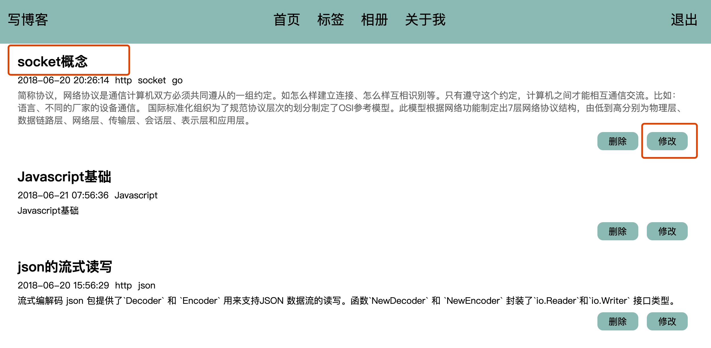
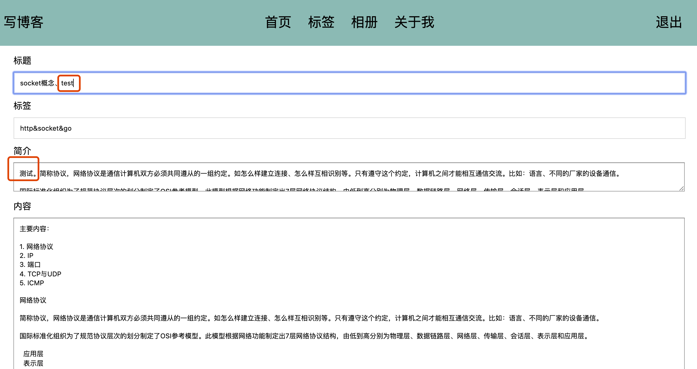
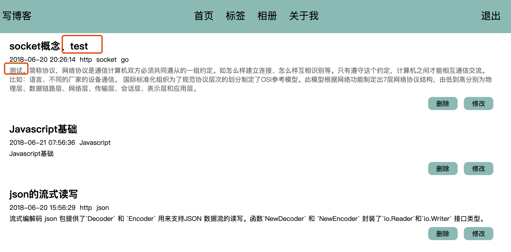
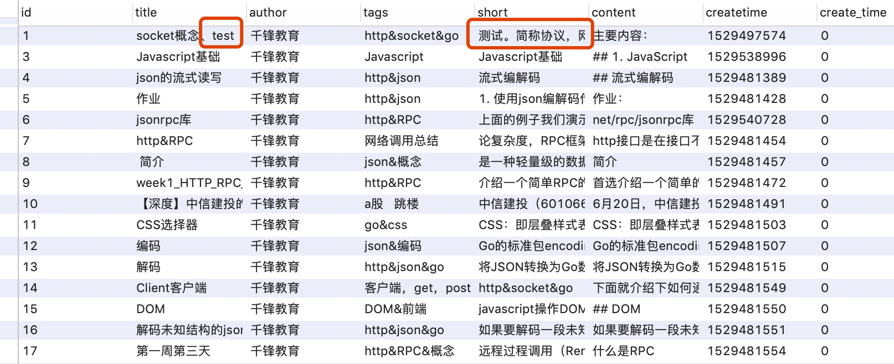
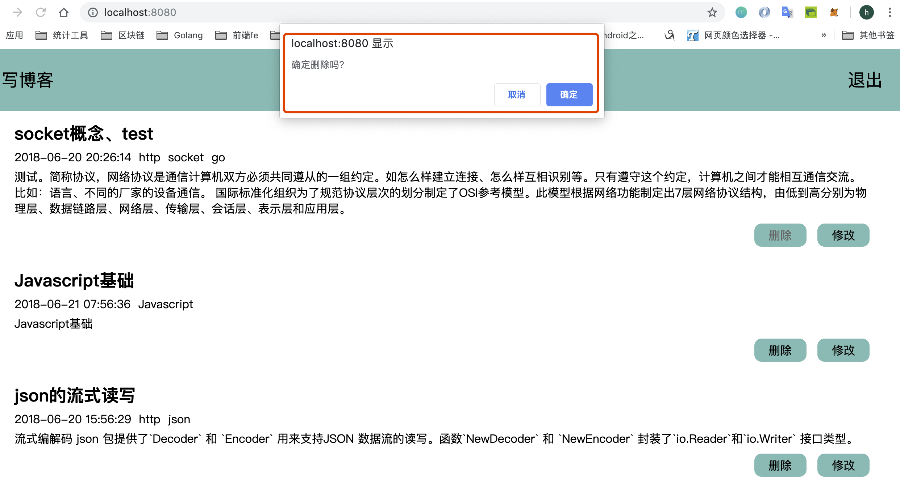
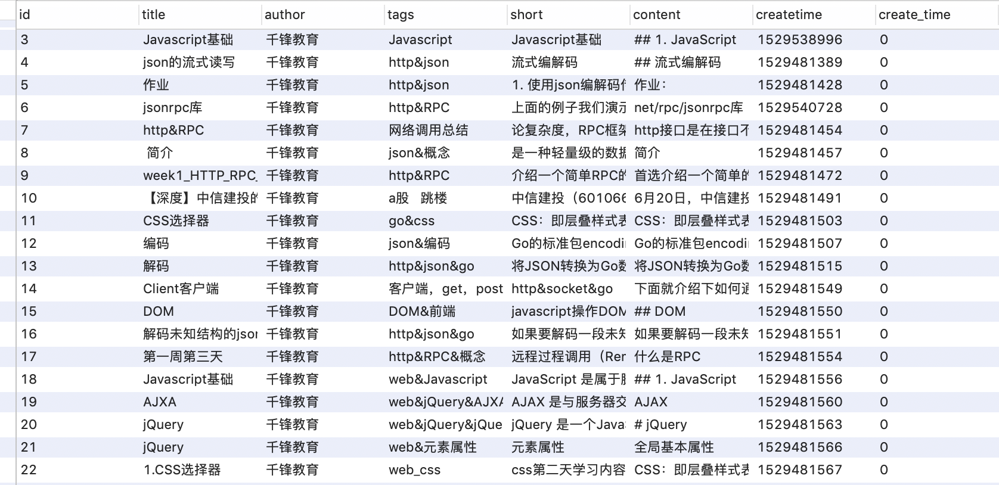
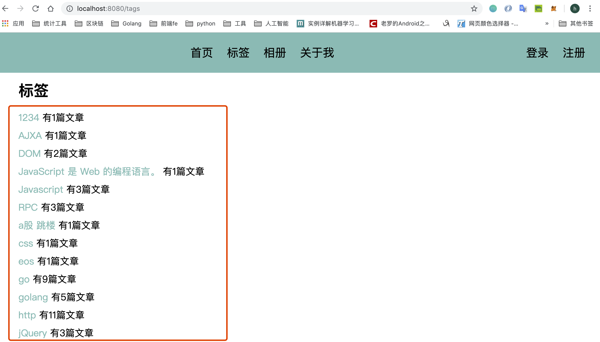

# 修改文章、删除文章和标签功能开发
**@author：Davie**  
**版权所有：北京千锋互联科技有限公司**

上节课内容我们学习了查看文章详情的功能开发。本节课我们事先修改文章的功能。

## 一 修改文章功能开发
### 1.1 添加修改文章功能路由
首先我们先添加一个路由：
```go
func init() {
    ...
	//写文章
	beego.Router("/article/add", &controllers.AddArticleController{})
	//显示文章内容
	beego.Router("/article/:id", &controllers.ShowArticleController{})
	//更新文章
	beego.Router("/article/update", &controllers.UpdateArticleController{})
}
```
### 1.2 添加修改文章功能的控制器
#### 1.2.1 定义修改文章控制器
然后新创建一个Controller(update_article_controller.go)，用于控制更新操作：
```go
type UpdateArticleController struct {
	BaseController
}
```

#### 1.2.2 添加get方法
```go
//当访问/update路径的时候回触发Get()方法，响应的页面是通过TplName这个属性指定返回给客户端的页面
func (this *UpdateArticleController) Get() {
	id, _ := this.GetInt("id")
	fmt.Println(id)
	//获取id所对应的文章信息
	art := models.QueryArticleWithId(id)
	this.Data["Title"] = art.Title
	this.Data["Tags"] = art.Tags
	this.Data["Short"] = art.Short
	this.Data["Content"] = art.Content
	this.Data["Id"] = art.Id
	this.TplName = "write_article.html"
}
```
当点击修改按钮触发路由之后，通过get请求，进入Get()方法，其实还是现实写文章的页面，只不过里面已经填好了要修改的数据。
要想在页面上显示要修改的文章的数据，就需要根据id查询这篇文章，然后将数据传入到前端页面。
当用户点击提交按钮，触发post请求，进入Post()方法：
```go
//修改文章
func (this *UpdateArticleController) Post() {
	id, _ := this.GetInt("id")
	fmt.Println("postid:", id)
	//获取浏览器传输的数据，通过表单的name属性获取值
	title := this.GetString("title")
	tags := this.GetString("tags")
	short := this.GetString("short")
	content := this.GetString("content")
	//实例化model，修改数据库
	art := models.Article{id, title, tags, short, content, "", 0}
	_, err := models.UpdateArticle(art)
	//返回数据给浏览器
	if err == nil {
		this.Data["json"] = map[string]interface{}{"code": 1, "message": "更新成功"}
	} else {
		this.Data["json"] = map[string]interface{}{"code": 0, "message": "更新失败"}
	}
	this.ServeJSON()
}
```

### 1.3 视图层（views）
修改文章和写文章，我们用同一个页面即可，只不过需要修改write_article.html页面的数据：
```html
<!DOCTYPE html>
<html lang="en">
<head>
    <meta charset="UTF-8">
    <title>写文章</title>
    <link href="../static/css/blogsheet.css" rel="stylesheet">
    <script src="../static/js/lib/jquery-3.3.1.min.js"></script>
    <script src="../static/js/lib/jquery.url.js"></script>
    <script src="../static/js/blog.js"></script>
</head>
<body>

{{template "block/nav.html" .}}

<div id="main">
    <form id="write-art-form" method="post">
        <div>标题</div>
        <input type="text" placeholder="请输入标题" name="title" value="{{.Title}}">
        <div>标签</div>
        <input type="text" placeholder="请输入标签" name="tags" value="{{.Tags}}">
        <div>简介</div>
        <textarea placeholder="请输入简介" name="short">{{.Short}}</textarea>
        <div>内容</div>
        <textarea id="content" placeholder="请输入内容" name="content">{{.Content}}</textarea>
        <input id="write-article-id" hidden name="id" value="{{.Id}}">
        <button type="button" onclick="history.back()">返回</button>
        <button type="submit" id="write-art-submit">提交</button>
    </form>
</div>
</body>
</html>
```
之前点击提交按钮，是为了添加文章。现在也有可能是修改文章。到底是修改还是添加，其实要看页面上id的值，如果是添加使用默认值0，如果是修改是从数据库中查询出的真实数值，所以需要修改js脚本文件：
```js
submitHandler: function (form) {
    alert("hello")
    var urlStr = "/article/add";
    //判断文章id确定提交的表单的服务器地址
    //若id大于零，说明是修改文章
    var artId = $("#write-article-id").val();
    alert("artId:" + artId);
    if (artId > 0) {
        urlStr = "/article/update"
    }
    alert("urlStr:" + urlStr);
    $(form).ajaxSubmit({
        url: urlStr,
        type: "post",
        dataType: "json",
        success: function (data, status) {
            alert(":data:" + data.message);
            setTimeout(function () {
                window.location.href = "/"
            }, 1000)
        },
        error: function (data, status) {
            alert("err:" + data.message + ":" + status)
        }
    });
```

### 1.4 model层添加修改数据方法
然后我们就可以去修改数据库了，在article_model.go文件中，添加方法：
```go
//----------修改数据----------
func UpdateArticle(article Article) (int64, error) {
	//数据库操作
	return utils.ModifyDB("update article set title=?,tags=?,short=?,content=? where id=?",
		article.Title, article.Tags, article.Short, article.Content, article.Id)
}
```

### 1.5 项目运行
重启项目后，我们打来浏览器输入网址：[http://127.0.0.1:8080/](http://127.0.0.1:8080/)



我们就修改第一篇文章：


提交修改效果：


也可以查询数据库，也已经更新完毕：



## 二 删除文章功能开发
当用户登录后，是可以有删除功能的，点击删除，就可以删除一篇文章。删除文章功能不需要view页面，直接弹框确认即可，现在我们来实现model和controller部分。

### 2.1 model添加删除方法
在article_model.go文件中，添加 删除文章的方法：
```go
//----------删除文章---------
func DeleteArticle(artID int) (int64, error) {
	i, err := deleteArticleWithArtId(artID)
	SetArticleRowsNum()
	return i, err
}
func deleteArticleWithArtId(artID int) (int64, error) {
	return utils.ModifyDB("delete from article where id=?", artID)
}
```
删除的时候，肯定是根据文章的ID来删除，当点击删除按钮的时候，可以传过来文章ID。

```html
{{if .IsLogin}}
    <div class="home-block-item-udpate">
        <a href='javascript:if(confirm("确定删除吗？")){location="{{.DeleteLink}}}"}'>删除</a>
        <a href={{.UpdateLink}}>修改</a>
    </div>
{{end}}
```

### 2.2 添加删除文章控制器
接下来，我们实现controller部分，在controllers目录下，创建一个新的go文件：delete_article_controller.go
```go
package controllers
import (
	"fmt"
	"myblogweb/models"
	"log"
)

type DeleteArticleController struct {
	BaseController
}
//点击删除后重定向到首页
func (this *DeleteArticleController) Get() {
	artID, _ := this.GetInt("id")
	fmt.Println("删除 id:", artID)
	_, err := models.DeleteArticle(artID)
	if err != nil {
		log.Println(err)
	}
	this.Redirect("/", 302)
}
```
先接收要删除的文章ID，然后操作sql语句进行删除数据，自后重定向到首页上。

### 2.3 添加删除文章路由
接下来注册个新的路由：
```go
// 删除文章
beego.Router("/article/delete", &controllers.DeleteArticleController{})
```

### 2.4 项目运行
重启项目后，打开浏览器输入：[http://127.0.0.1:8080/](http://127.0.0.1:8080/)，并且要登录，才能有删除功能。

我们删除第一篇文章，点击删除按钮。然后弹出确认框，选择确定。就会删除第一篇文章。然后跳转到首页。

我们发现首页已经没有第一篇文章了，此时也可以查询一下数据库：

我们发现数据库中id为1的文章已经被删除。

## 三 标签功能开发
上节课内容我们实现了删除文章的操作，本节课我们继续进行相关功能开发。当我们点击标签按钮的时候，应该要显示每个标签对应了多少篇文章。

### 3.1 model层
#### 3.1.1 article_model添加查询方法
当点击标签的时候，需要查询出数据库中所有的标签，然后再统计出每个标签的文章总量，显示到前端页面上。

所以我们应该先查询出数据库中所有的标签。
在article_model.go文件中，加入以下代码，先查询出所有的标签。
```go
//查询标签，返回一个字段的列表
func QueryArticleWithParam(param string) []string {
	rows, err := utils.QueryDB(fmt.Sprintf("select %s from article", param))
	if err != nil {
		log.Println(err)
	}
	var paramList []string
	for rows.Next() {
		arg := ""
		rows.Scan(&arg)
		paramList = append(paramList, arg)
	}
	return paramList
}
```

#### 3.1.2 新增model结构体定义
然后再models目录下，创建一个新的model文件：tags_model.go
```go
package models
import "strings"
func HandleTagsListData(tags []string) map[string]int {
	var tagsMap = make(map[string]int)
	for _, tag := range tags {
		tagList := strings.Split(tag, "&")
		for _, value := range tagList {
			tagsMap[value]++
		}
	}
	return tagsMap
}
```

### 3.2 添加控制器层
接下来，我们在controllers目录下新建一个controller的go文件，tags_controller.go。
```go
package controllers

import (
	"myblogweb/models"
	"fmt"
)
type TagsController struct {
	BaseController
}
func (this *TagsController) Get() {
	tags := models.QueryArticleWithParam("tags")
	fmt.Println(models.HandleTagsListData(tags))
	this.Data["Tags"] = models.HandleTagsListData(tags)
	this.TplName = "tags.html"
}
```
### 3.3 添加标签功能路由
并且在router.go中注册新的路由：
```go
//标签
beego.Router("/tags", &controllers.TagsController{})
```

### 3.4 添加视图层文件
最后我们去写前端页面，来接收数据。在views包下，新建一个html文件，tags.html：
```html
<!DOCTYPE html>
<html lang="en">
<head>
    <meta charset="UTF-8">
    <title>标签</title>
    <link href="../static/css/blogsheet.css" rel="stylesheet">
</head>
<body>
{{template "block/nav.html" .}}
<div id="main">
    <h1>标签</h1>
    <div id="tags-list">
    {{range $k,$v := .Tags}}
        <div><a href="/?tag={{$k}}"><span class="global-color">{{$k}}</span> 有{{$v}}篇文章</a></div>{{end}}
    </div>
</div>
</body>
</html>
```

### 3.5 项目运行
重新启动项目后，在浏览器中点击标签按钮：

