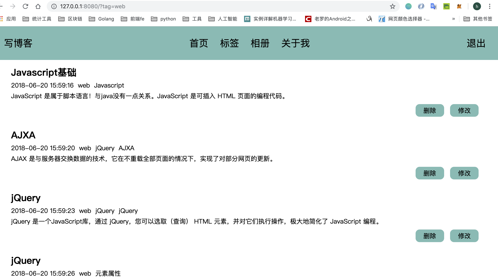
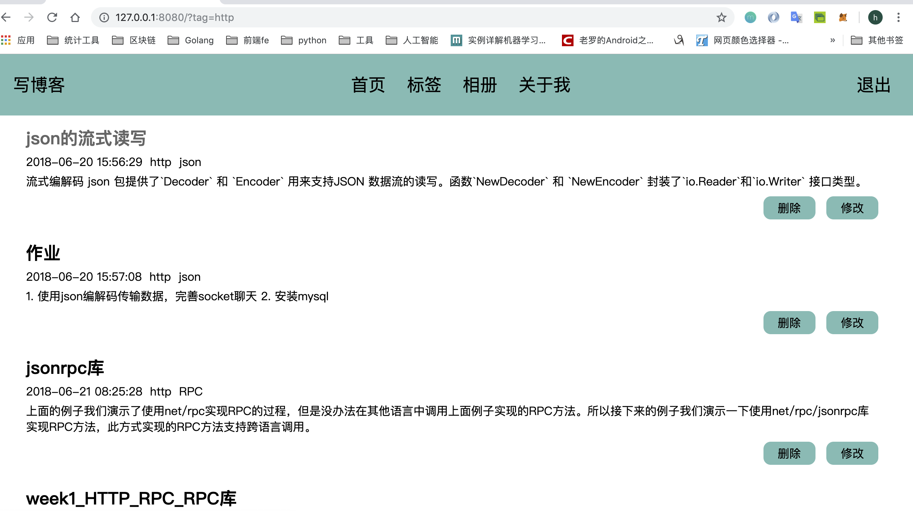
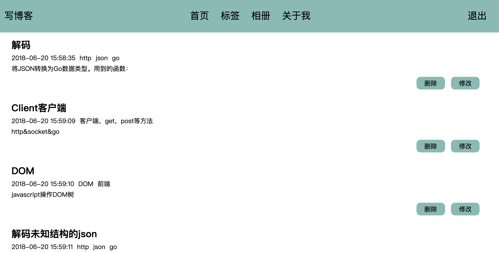
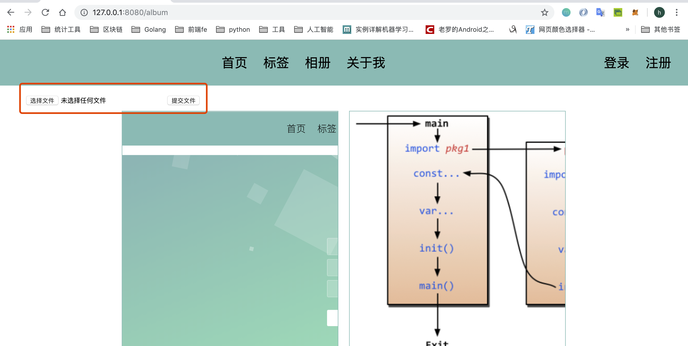
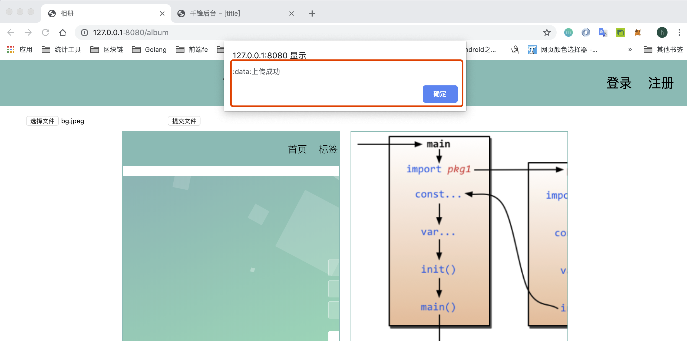
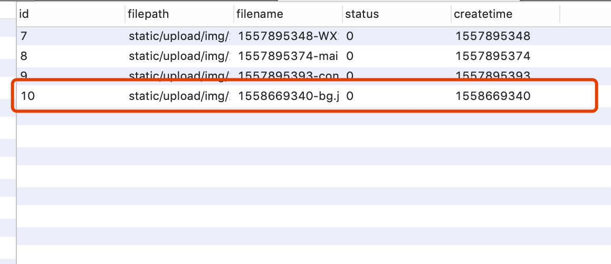
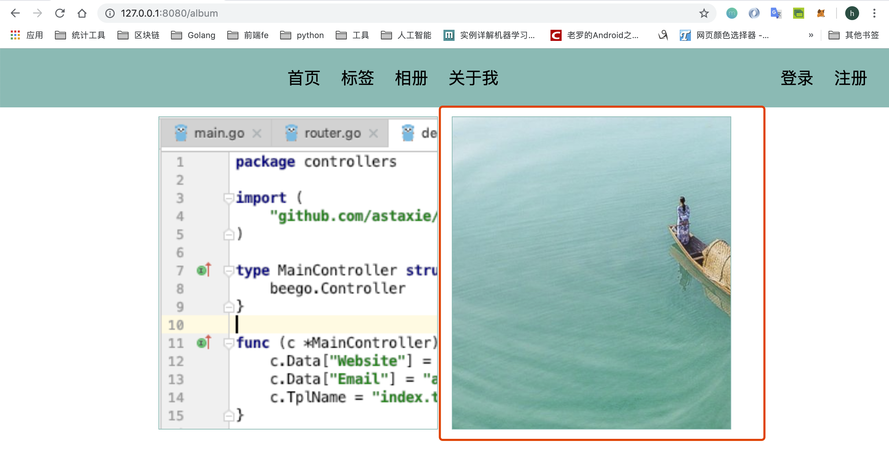
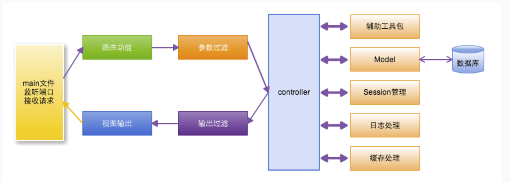

## 首页功能扩展、图片上传和关于我功能开发
**@author：Davie**  
**版权所有：北京千锋互联科技有限公司**

我们最初只是让首页显示第一页的文章数据，如果在访问首页的时候，后面传入相应的参数，那么我们应该根据参数显示对应的内容。

如果浏览器输入首页网址：[http://127.0.0.1:8080/](http://127.0.0.1:8080/)，那么我们显示第一页的文章数据

如果浏览器输入网址是：[http://127.0.0.1:8080/?page=3](http://127.0.0.1:8080/?page=3)，那么我们直接显示第三页的文章数据

如果浏览器输入网址是：[http://127.0.0.1:8080/?tag=go](http://127.0.0.1:8080/?tag=go)，那么我们应该显示所有标签为go的文章，同理如果tag=web，我们应该显示所有标签为web的文章。

接下来我们就去改进首页的功能。
## 一 首页功能扩展开发
### 1.1 修改首页逻辑
#### 1.1.1 修改控制器逻辑
我们首先修改home_controller.go文件中的处理，修改代码如下：

```go
package controllers
import (
	"fmt"
	"myblogweb/models"
)
type HomeController struct {
	//beego.Controller
	BaseController
}

func (this *HomeController) Get() {
	tag := this.GetString("tag")
	fmt.Println("tag:", tag)
	page, _ := this.GetInt("page")
	var artList []models.Article
	if len(tag) > 0 {
		//按照指定的标签搜索
		artList, _ = models.QueryArticlesWithTag(tag)
		this.Data["HasFooter"] = false
	} else {
		if page <= 0 {
			page = 1
		}
		artList, _ = models.FindArticleWithPage(page)
		this.Data["PageCode"] = models.ConfigHomeFooterPageCode(page)
		this.Data["HasFooter"] = true
	}
	fmt.Println("IsLogin:", this.IsLogin, this.Loginuser)
	this.Data["Content"] = models.MakeHomeBlocks(artList, this.IsLogin)
	this.TplName = "home.html"
}
```

#### 1.1.2 功能扩展逻辑分析
我们先接收tag的值和page的值：
那么有三种情况：
 	1. 如果tag有值，page就不会有值。比如：[http://127.0.0.1:8080/?pag=web](http://127.0.0.1:8080/?pag=web)
 	2. 如果page有值，那么tag就不会有值。比如：[http://127.0.0.1:8080/?page=3](http://127.0.0.1:8080/?page=3)
 	3. 就是用户直接访问首页，没有传入tag也没有传入page：[http://127.0.0.1:8080](http://127.0.0.1:8080)
如果是第一种情况，那么我们应该按照tag进行搜索。如果是第二种情况就按照页数查询。如果是第三种就默认按照分页查询，只是查询第一页。

### 1.2 model层逻辑实现
#### 1.2.1 逻辑分析
接下来我们去实现按照tag进行查询，这里有个复杂的地方，就是我们在写文章的手，标签可能有一个，也肯能有多个，如果是多个，我们是按照&连接的，比如：go&socket。那么在按照标签查询的时候，就要分为4种情况：
```
通过标签查询首页的数据
有四种情况
   1.左右两边有&符和其他符号
   2.左边有&符号和其他符号，同时右边没有任何符号
   3.右边有&符号和其他符号，同时左边没有任何符号
   4.左右两边都没有符号
通过%去匹配任意多个字符，至少是一个
```

#### 1.2.2 添加model方法
我们在article_model.go文件中，添加一个方法：
```go
//--------------按照标签查询--------------
func QueryArticlesWithTag(tag string) ([]Article, error) {

	sql := " where tags like '%&" + tag + "&%'"
	sql += " or tags like '%&" + tag + "'"
	sql += " or tags like '" + tag + "&%'"
	sql += " or tags like '" + tag + "'"
	fmt.Println(sql)
	return QueryArticlesWithCon(sql)
}
```

### 1.3 项目运行
前端页面不用修改，我们打开浏览器输入以下网址：[http://127.0.0.1:8080?tag=web](http://127.0.0.1:8080?tag=web)



可以看到查询出web标签的三篇文章，重新输入网址：[http://127.0.0.1:8080?tag=http](http://127.0.0.1:8080?tag=http)http标签下的三篇文章也被查询出来了。



下面我们输入以下页码：[http://127.0.0.1:8080?page=3](http://127.0.0.1:8080?page=3)



## 二 文件上传和图片展示功能
上节内容我们学习了首页扩功能，本节课我们继续开发实现新的功能--文件上传和图片展示功能。在实际案例中，提供有相册展示功能，相册功能展示的图片需要用到文件上传，我们来实际开发实现。

### 2.1 创建数据表
首先我们要在数据库中创建数据表，要想存储图片，我们需要图片的id，图片的路径位置，图片的名字等等。所在在utils工具包下的mysqlUtil.go文件中，添加创建数据表的方法：

```go
//--------图片--------
func CreateTableWithAlbum() {
	sql := `create table if not exists album(
		id int(4) primary key auto_increment not null,
		filepath varchar(255),
		filename varchar(64),
		status int(4),
		createtime int(10)
		);`
	ModifyDB(sql)
}
```

并且在初始化数据库的方法中进行调用：
```go
func InitMysql() {
	fmt.Println("InitMysql....")
	if db == nil {
		db, _ = sql.Open("mysql", "root:hanru1314@tcp(127.0.0.1:3306)/myblogweb")
		CreateTableWithUser()
		CreateTableWithArticle()
		CreateTableWithAlbum()
	}
}
```

### 2.2 实现文件上传功能
#### 2.2.1 新增AlbumController控制器
然后我们创建一个新的go文件，album_controller.go
```go
package controllers
import (
	"myblog/models"
	"github.com/opentracing/opentracing-go/log"
)
type AlbumController struct {
	BaseController
}
func (this *AlbumController) Get() {
	this.TplName="album.html"
}
```

#### 2.2.2 视图层实现
##### 2.2.2.1 添加html文件
接下来我们去写html页面，在views目录下创建一个新的html页面：
```html
<!DOCTYPE html>
<html lang="en">
<head>
    <meta charset="UTF-8">
    <title>相册</title>
    <script src="../static/js/lib/jquery-3.3.1.min.js"></script>
    <script src="../static/js/lib/jquery.url.js"></script>
    <script src="../static/js/blog.js"></script>
    <link href="../static/css/blogsheet.css" rel="stylesheet">
</head>
<body>
{{template "block/nav.html" .}}
<div id="main">
    <form method="post">
        <input type="file" id="album-upload-file" name="upload">
        <input type="button" id="album-upload-button" value="提交文件">
    </form>
</div>
</body>
</html>
```

##### 2.2.2.2 js实现文件上传逻辑
然后我们需要编写点击按钮之后的脚本代码，在blog.js文件中继续添加脚本：
```go
//文件
    $("#album-upload-button").click(function () {
        var filedata = $("#album-upload-file").val();
        if (filedata.length <= 0) {
            alert("请选择文件!");
            return
        }
        //文件上传通过Formdata去储存文件的数据
        var data = new FormData()
        data.append("upload", $("#album-upload-file")[0].files[0]);
        alert(data)
        var urlStr = "/upload"
        $.ajax({
            url: urlStr,
            type: "post",
            dataType: "json",
            contentType: false,
            data: data,
            processData: false,
            success: function (data, status) {
                alert(":data:" + data.message);
                if (data.code == 1) {
                    setTimeout(function () {
                        window.location.href = "/album"
                    }, 1000)
                }
            },
            error: function (data, status) {
                alert("err:" + data.message + ":" + status)
            }
        })
    })
```

#### 2.2.3 添加文件上传控制器
此时我们需要新建一个文件上传的controller，upload_controller.go
```go
package controllers

import (
	"fmt"
	"time"
	"path/filepath"
	"os"
	"io"
	"myblog/models"
)
type UploadController struct {
	BaseController
}
func (this *UploadController) Post() {
	fmt.Println("fileupload...")
	fileData, fileHeader, err := this.GetFile("upload")
	if err != nil {
		this.responseErr(err)
		return
	}
	fmt.Println("name:", fileHeader.Filename, fileHeader.Size)
	fmt.Println(fileData)
	now := time.Now()
	fmt.Println("ext:", filepath.Ext(fileHeader.Filename))
	fileType := "other"
	//判断后缀为图片的文件，如果是图片我们才存入到数据库中
	fileExt := filepath.Ext(fileHeader.Filename)
	if fileExt == ".jpg" || fileExt == ".png" || fileExt == ".gif" || fileExt == ".jpeg" {
		fileType = "img"
	}
	//文件夹路径
	fileDir := fmt.Sprintf("static/upload/%s/%d/%d/%d", fileType, now.Year(), now.Month(), now.Day())
	//ModePerm是0777，这样拥有该文件夹路径的执行权限
	err = os.MkdirAll(fileDir, os.ModePerm)
	if err != nil {
		this.responseErr(err)
		return
	}
	//文件路径
	timeStamp := time.Now().Unix()
	fileName := fmt.Sprintf("%d-%s", timeStamp, fileHeader.Filename)
	filePathStr := filepath.Join(fileDir, fileName)
	desFile, err := os.Create(filePathStr)
	if err != nil {
		this.responseErr(err)
		return
	}
	//将浏览器客户端上传的文件拷贝到本地路径的文件里面
	_, err = io.Copy(desFile, fileData)
	if err != nil {
		this.responseErr(err)
		return
	}
	if fileType == "img" {
		album := models.Album{0, filePathStr, fileName, 0, timeStamp}
		models.InsertAlbum(album)
	}
	this.Data["json"] = map[string]interface{}{"code": 1, "message": "上传成功"}
	this.ServeJSON()
}

func (this *UploadController) responseErr(err error) {
	this.Data["json"] = map[string]interface{}{"code": 0, "message": err}
	this.ServeJSON()
}
```

#### 2.2.4 添加相册、文件上传路由
最后要注册路由：
```go
//相册
beego.Router("/album", &controllers.AlbumController{})
//文件上传
beego.Router("/upload", &controllers.UploadController{})
```

#### 2.2.5 添加相册model
##### 2.2.5.1 相册结构体定义
接下来我们创建一个新的model，album_model.go文件：
```go
type Album struct {
	Id         int
	Filepath   string
	Filename   string
	Status     int
	Createtime int64
}
```

##### 2.2.5.2 添加方法
我们需要在album_model.go文件中，添加插入数据的方法：
```go
//-------插入图片---------------
func InsertAlbum(album Album) (int64, error) {
	return utils.ModifyDB("insert into album(filepath,filename,status,createtime)values(?,?,?,?)",
		album.Filepath, album.Filename, album.Status, album.Createtime)
}
```

#### 2.2.6 项目运行
重启项目后，点击图片按钮，然后选择一张图片：


点击提交文件按钮后，可以上传图片了。



我们可以查询一下数据库：


### 2.3 查看图片
通过上面的操作已经能够上传文件了，那么如何显示文件呢？当点击图片标签的时候，除了有上传操作，还应该可以显示已经存储的图片。

#### 2.3.1 Model层添加方法
我们现在album_model.go文件中，添加查找图片数据的方法：
```go
//--------查询图片----------
func FindAllAlbums() ([]Album, error) {
	rows, err := utils.QueryDB("select id,filepath,filename,status,createtime from album")
	if err != nil {
		return nil, err
	}
	var albums []Album
	for rows.Next() {
		id := 0
		filepath := ""
		filename := ""
		status := 0
		var createtime int64
		createtime = 0
		rows.Scan(&id, &filepath, &filename, &status, &createtime)
		album := Album{id, filepath, filename, status, createtime}
		albums = append(albums, album)
	}
	return albums, nil
}
```

#### 2.3.2 修改控制器方法
接下来，我们修改album_controller.go文件中的Get()方法，
```go
func (this *AlbumController) Get() {
	albums,err := models.FindAllAlbums()
	if err !=nil{
		log.Error(err)
	}
	this.Data["Album"] = albums
	this.TplName="album.html"
}
```

#### 2.3.3 修改视图层
最后我们还要修改一下html页面，在album.html中，添加以下内容：
```html
<div id="album-box">
    {{range .Album}}
        <div class="album-item" style='background-image: url("{{.Filepath}}");'></div>
    {{end}}
</div>
```

#### 2.3.4 项目运行
我们上传几张图片后，刷新页面：


## 三 关于我功能开发及项目总结
本节课内容我们来开发完成本系列课程的最后一个功能--关于我页面的功能开发，同时对本系列课程内容做一个回顾与总结。
### 3.1 关于我功能开发
#### 3.1.1 添加"关于我"控制器
首先创建一个新的go文件，aboutme_controller.go
```go
package controllers
type AboutMeController struct {
	BaseController
}
func (c *AboutMeController) Get() {
	c.Data["wechat"] = "微信：13167582311"
	c.Data["qq"] = "QQ：861574834"
	c.Data["tel"] = "Tel：13167582311"
	c.TplName = "aboultme.html"
}
```
#### 3.1.2 注册关于我路由解析
然后不要忘记注册路由：
```go
//关于我
beego.Router("/aboutme", &controllers.AboutMeController{})
```

#### 3.1.3 关于我视图层
然后我们要写一个html页面，aboultme.html：
```html
<!DOCTYPE html>
<html lang="en">
<head>
    <meta charset="UTF-8">
    <title>{{.Title}}</title>
    <link href="../static/css/blogsheet.css" rel="stylesheet">
    <link href="../static/css/lib/highlight.css" rel="stylesheet">
</head>
<body>

{{template "block/nav.html" .}}

<div id="aboutme">
    <div>
        

        <div id="myt">
            <p class="myp">
                <a href="http://{{.wechat}}">{{.wechat}}</a>
            </p>
            <p class="myp">
                <a href="http://{{.qq}}">{{.qq}}</a>
            </p>
            <p class="myp">
                <a href="http://{{.tel}}">{{.tel}}</a>
            </p>
        </div>
    </div>
</div>
</body>
</html>
```

### 3.2 课程总结
经过了16节的课程内容，我们完成了使用Beego框架开发完成了一个博客系统。通过该项目，以期大家能够掌握Beego框架的使用方法。现在我们来回顾一下Beego框架开发一个web项目所需要掌握的一些重要知识点。
#### 3.2.1 beego框架组成
Beego框架的八大模块分别是**cache，config，context，httplibs，logs，orm，session，toolbox**等模块组合而成。模块之间高度解耦，依赖性低。

#### 3.2.2 beego框架调试工具
Beego框架的项目管理工具Bee工具的使用，可以方便开发者管理、调试、打包项目，自动生成项目目录结构等。

#### 3.2.3 beego程序执行流程
**Beego框架执行流程：**Beego框架的程序执行流程如下图所示。


#### 3.2.4 数据库操作
* 数据库连接：
    * 驱动：beego中的orm支持MySQL，Sqlite3、PostgreSQL。
    * 用户名、密码、主机、端口号、数据库名称等的配置。
* 数据库操作：
    * sql语句
    * 条件查询
    * 统计功能
    * 增加（insert）、删除（delete）、修改（update）、查询（select）
    * 模糊查询
    * 表关联

#### 3.2.5 beego项目架构
* **mvc模式：**m（model）模型层，v（view）视图层，c（controller）控制器层。
    
* **路由解析：**
    * 默认路由：beego模块自带Post、Put、Delete、Head、Options、Patch等网络请求类型的对应方法
    * 自动路由（自动映射到Get、Post、Put、Delete、Head、Options、Patch等方法。
    * 正则表达式路由（支持正则表达式及变量）
    * 自定义路由：开发者自己指定路由解析方法

* **Session处理：**
    * 两种管理方式：
        * 配置文件配置session相关配置项
        * 在程序中通过SessionConfig中进行配置
    
    * 操作方法：
        * SetSession：设置session值
        * GetSession：获取session值
        * DelSession：删除session值

* **Views视图模板：**
    * views目录存放视图模板文件
    
    * controller.TplName 指定渲染的页面模板文件全称
    
    * 模板文件中通过**{{.param}}**实现变量的使用
    
    * controller.Data["param"]为模板页面的变量赋值


