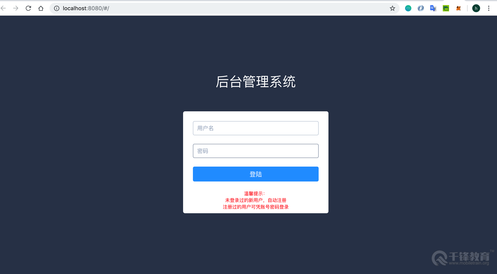
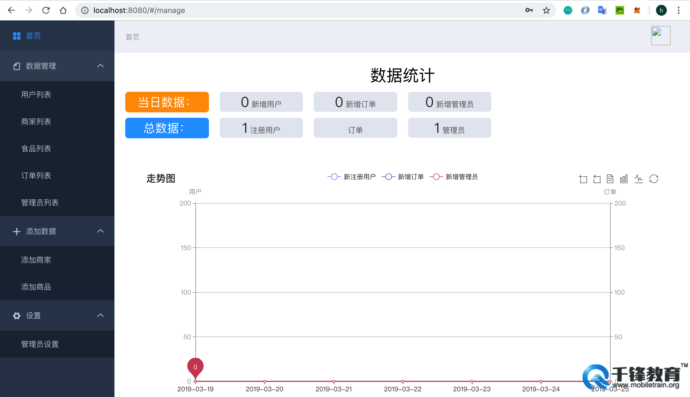
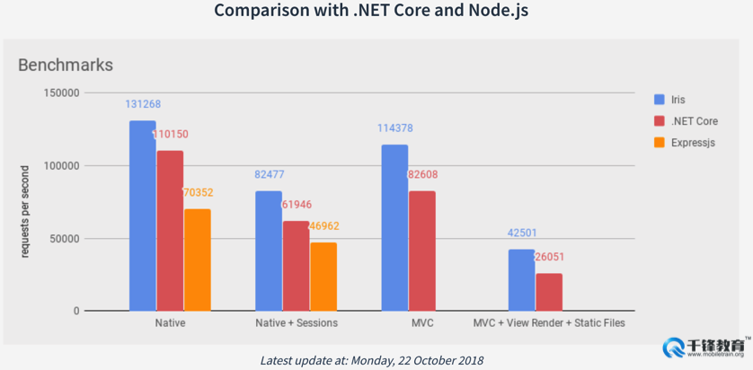
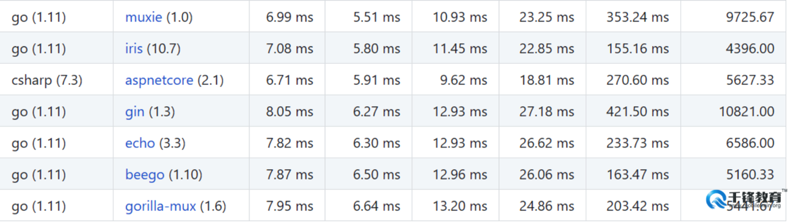
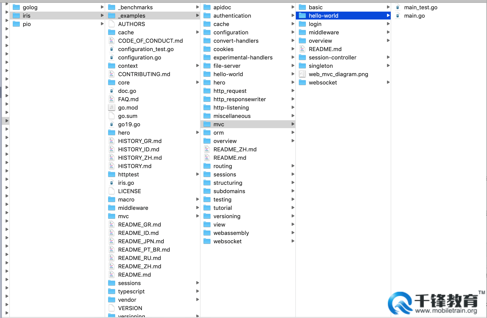

# web开发介绍、iris框架安装、HTTP请求和返回、Iris路由处理
**@author：Davie**  
**版权所有：北京千锋互联科技有限公司**

## 一 Web项目开发介绍及实战项目介绍
### 1.1 引言
本系列课程我们将学些Golang语言中的Web开发框架Iris的相关知识和用法。通过本系列视频课程，大家能够从零到一经历一个完整项目的开发，并在课程中了解实战项目开发的流程和项目设涉及的各个模块。

### 1.2 Web项目开发介绍
#### 1.2.1项目架构  
web项目从大的功能上可以分为前台和后台两个部分。前台主要是我们在浏览器中或者桌面应用、Android、iOS移动应用等直接面向用户的程序，直接接受用户的操作和使用，我们称之为前台，也称之为客户端；为前台应用提供数据和功能调用的部署运行在服务器上的程序，用于操作处理前端应用的数据，我们称之为后台，也称之为服务端。类似于上述这种客户端和服务端的架构，我们通常称之为CS模式，C为client的缩写，S为server的缩写。 
#### 1.2.2 开发流程  
##### 1.2.2.1 需求确定 
在需求确定阶段，主要由产品经理进行确定系统的功能与性能。确认了具体需求后，产品经理会将产品功能进行设计，通常称该阶段为产品原型设计过程。在该阶段，核心目标是确定开发需求，完成产品原型设计。
##### 1.2.2.2 分析与设计  
在需求确定以后，接下来进入到分析与设计阶段。在该阶段中，又分为几个小阶段，分别为：架构分析与设计、业务逻辑分析、业务逻辑设计和界面设计等四个阶段。  
	架构分析与设计： 逻辑架构、物理架构（服务器配置、数据库配置）、技术选型等 
	业务逻辑分析：系统用户、使用目的、操作步骤、用户体验与反馈等  
	业务逻辑设计：数据库详细设计、对象关系字段映射等   
	界面设计：UI风格、用户体验等
##### 1.2.2.3 开发环境搭建
当需求和设计阶段都确定以后，就正式进入开发阶段。首先就是开发环境的搭建，这里面包含硬件环境和软件环境两种。硬件环境是指的开发机器，服务器等硬件设施。软件环境包含开发工具，项目管理平台，软件支持等软件支持。开发环境的搭建一般情况下只有在项目刚刚开始和在项目进行大的架构调整时才需要进行，通常的情况下和日常的迭代开发，可以免去此步骤，直接使用已有的开发环境。
##### 1.2.2.4 开发与测试
在实际的项目开发周期中，进行代码开发的周期往往较短。同时，在代码功能开发结束以后，还需要对系统功能进行测试，此时由项目测试人员进行专业的白盒测试、黑盒测试、性能测试、压力测试等全方位、多角度的系统测试。该阶段的开发与测试是交替进行，在实际的开发过程中会反复进行多轮，以此来保证开发人员开发的功能的正确性，保证系统的稳定性。  
当系统开发测试阶段结束以后，会对代码进行封版进行最终测试。如果最终测试通过，则会进行部署上线。
##### 1.2.2.5 文档编纂
在系统设计、项目开发与测试过程中，我们要遵循一套适用于团队使用和可执行可接受的标准化开发步骤。在项目开发过程中，我们需要将项目开发，操作说明，项目架构说明等文档性的内容进行编写并妥善保存，以便在后续项目维护和对接过程中，相关人员对项目能够正确快速的了解和熟悉。  
  
### 1.3 实战项目功能介绍
在本系列课程中，我们将带大家进行一个后台管理平台项目的实战开发，以帮助大家学习Iris框架的相关用法和项目开发流程。
#### 1.3.1 项目效果
首先我们来看一下项目整体运行后的效果：  



#### 1.2.2 项目架构
* 前端：vue框架
* 后端：Go语言Iris框架 + mysql数据库、redis缓存数据库
* 接口文档工具：  
	小幺鸡：[http://www.xiaoyaoji.cn/doc/yvnmPtdKK](http://www.xiaoyaoji.cn/doc/yvnmPtdKK)
* 接口调试工具：Postman

#### 1.2.3 项目开发周期
一周

## 二 Iris框架
### 2.1 Golang介绍
Go语言是谷歌推出的一种全新的编程语言，可以在不损失应用程序性能的情况下降低代码的复杂性。谷歌首席软件工程师罗布派克(Rob Pike)说：我们之所以开发Go，是因为过去10多年间软件开发的难度令人沮丧。  
谷歌资深软件工程师罗布·派克(Rob Pike)表示，“Go让我体验到了从未有过的开发效率。”派克表示，和今天的C++或C一样，Go是一种系统语言。他解释道，“使用它可以进行快速开发，同时它还是一个真正的编译语言，我们之所以现在将其开源，原因是我们认为它已经非常有用和强大。”  
Golang语言的一些的功能：
* 具有现代的程序语言特色，如垃圾回收，帮助程序设计师处理琐碎和重要的内存管理等问题。Go的速度也非常快，几乎和C或C++程序一样快，且能够快速制作程序。
* 该软件是专为构建服务器软件所设计（如Google的Gmail），Google认为Go还可应用到其他领域，包括在浏览器内执行软件，取代JavaScript的角色。  
* Go也可解决现今的一大挑战：多核心处理器。一般电脑程序通常依序执行，一次进行一项工作，但多核心处理器更适合并行处理许多工作。
相较于其他语言，Golang之所以发展迅速，与该语言特有的特色密不可分：  
* 简洁 快速 安全
* 并行 有趣 开源
* 内存管理，数组安全，编译迅速

### 2.2 Iris简介
Iris是一款Go语言中用来开发web应用的框架，该框架支持编写一次并在任何地方以最小的机器功率运行，如Android、ios、Linux和Windows等。该框架只需要一个可执行的服务就可以在平台上运行了。  
Iris框架以简单而强大的api而被开发者所熟悉。iris除了为开发者提供非常简单的访问方式外，还同样支持MVC。另外，用iris构建微服务也很容易。  
在iris框架的官方网站上，被称为速度最快的Go后端开发框架。在Iris的网站文档上，列出了该框架具备的一些特点和框架特性，列举如下：
1）聚焦高性能   
2）健壮的静态路由支持和通配符子域名支持  
3）视图系统支持超过5以上模板  
4）支持定制事件的高可扩展性Websocket API  
5）带有GC, 内存 & redis 提供支持的会话  
6）方便的中间件和插件  
7）完整REST API  
8）能定制HTTP错误  
9）源码改变后自动加载  
等等还有很多特性，大家可以参考Iris官方文档。在GoWeb开发的诸多框架中，各个维度的性能比较如下： 
 
 
 
### 2.3 Iris框架学习渠道
在学习Iris框架过程时，我们需要有相应的配套资料才能够完成我们的学习。下面是学习Iris框架过程中可能会用到的资料。  
#### 2.3.1 官方网站
Iris官网：[https://iris-go.com/](https://iris-go.com/)  
#### 2.3.2 框架源码
Iris框架源码地址：[https://github.com/kataras/iris](https://github.com/kataras/iris)  
#### 2.3.3 框架学习文档
Iris框架中文学习文档： [https://studyiris.com/doc/](https://studyiris.com/doc/) 
当然，还有其他相关资料，比如说xorm框架等，这些我们在后面的课程文档中学习到以后再做解释和说明。  

### 2.4 Iris框架安装
#### 2.4.1 Go版本限制
**环境要求：**iris框架要求golang版本至少为1.8。各位同学可以通过打开终端，执行：go version 命令来查看自己机器的go环境版本。 
#### 2.4.2 命令安装
安装Iris框架非常简单，使用go语言的全局安装第三方代码的命令get即可。安装Iris框架的命令如下：    
```  
go get -u github.com/kataras/iris
```
在本地终端中执行如上的安装命令，等待命令执行成功，即表示Iris源码下载安装完成。安装完成Iris框架以后，能够在本地机器的GoPath环境目录中的src/github.com/目录下找到iris框架对应的包名，如下图所示：  

如图所示的kataras/iris所在的目录就是iris框架的源码，如上图所示即是安装成功。  

### 2.5 源码案例
在iris源码安装完成以后，iris框架为开发者提供了自己学习的实战案例，供开发者自行学习。iris提供的案例在iris框架目录中的_example目录下，在学习时可以进行参考。
接下来我们就可以开始学习iris的相关内容，进行代码开发了。

### 2.6 Iris构造服务实例  
在安装完成Iris的源码后，我们就开始来编写最简单的一个Iris的服务。在Iris中，构建并运行一个服务实例需要两步：  

* 1、通过iris.New()方法可以实例化一个应用服务对象app  
* 2、通过Run方法开启端口监听服务，运行服务实例

如下是一个最简单的服务案例Demo
```go
package main
import "github.com/kataras/iris"
func main() {
	//1.创建app结构体对象
	app := iris.New()
	//2.端口监听
	app.Run(iris.Addr(":7999"), iris.WithoutServerError(iris.ErrServerClosed))
	////application.Run(iris.Addr(":8080"))//第一种
	//application.Run(iris.Addr(":8080"), iris.WithoutServerError(iris.ErrServerClosed)) //第二种
}
```

## 三 Get、Post、Put等请求及数据返回格式
### 3.1 数据请求方式的分类
所有的项目中使用的请求都遵循HTTP协议标准，HTTP协议经过了1.0和1.1两个版本的发展。
#### 3.1.1 HTTP1.0 
HTTP1.0定义了三种请求方法： GET, POST 和 HEAD方法。
#### 3.1.2 HTTP1.1
HTTP1.1新增了五种请求方法：OPTIONS, PUT, DELETE, TRACE 和 CONNECT 方法。

因此，我们可以说，HTTP协议一共定义了八种方法用来对Request-URI网络资源的不同操作方式，这些操作具体为：GET、POST、PUT、DELETE、HEAD、OPTIONS、TRACE、CONNECT等八种操作方式。

### 3.2 Iris框架的请求处理方式
#### 3.2.1 默认请求处理
Iris框架中服务实例app中包含多个方法，用来支持对上述HTTP多种请求类型的直接处理，直接定义为get方法、post方法、put方法等，app中包含的自动处理路由请求的方法与http请求类型的分类一致。
```go
app := iris.New()
//url: http://localhost:8000/getRequest
//type：GET请求
app.Get("/getRequest", func(context context.Context) {
		path := context.Path()
		app.Logger().Info(path)
})
```
#### 3.2.2  Handle自定义处理
除了上述1中自动处理各类别的请求外，框架还支持使用通用的Handle方法来自定义编写自己的请求处理类型及对应的方法。
```go
//url: http://localhost:/user/info
//type：POST请求
app.Handle("POST", "/user/info", func(context context.Context) {
		context.WriteString(" User Info is Post Request , Deal is in handle func ")
})
//启动端口监听服务
app.Run(iris.Addr(":8000"))
```

#### 3.2.3 GET请求
向特定的网络资源数据发起请求。GET请求可以携带请求数据，携带的请求数据会以？分割URL和传输数据，参数之间以&相连，比如http://localhost:3000?name=davie&pwd=123。  
如下是一个http的get类型的请求：  
```
http://localhost:8000/userpath
```
服务端的路由处理方式如下：  
```go
//url：http://localhost:8000/userpath
//type：GET请求、用GET方法处理
app.Get("/userpath", func(context context.Context) {
		//获取Path
		path := context.Path()
		//日志输出
		app.Logger().Info(path)
		//写入返回数据：string类型
		context.WriteString("请求路径：" + path)
})
```
上述为使用已经封装的默认的app.Get方式来处理请求，使用Handle方法来进行处理，如下所示：  
```go
//url：http://localhost:8000/hello
//type：GET请求、Handle方法第一个参数为GET，表明是GET请求方式
app.Handle("GET", "/hello", func(context context.Context) {
		context.HTML("<h1> Hello world. </h1>")
})
```

#### 3.2.4 POST请求
POST请求在进行请求时会将请求数据放在请求body中进行请求，请求数据大小没有限制。在开发过程中，我们使用postman工具来进行POST请求的调试。  
POST请求的示例如下所示：  
```
http://localhost:8000/postLogin
```
服务端的路由处理方式如下：
```go
//type：POST请求
//携带数据：name、pwd命名的请求数据
app.Post("/postLogin", func(context context.Context) {
		//获取请求path
		path := context.Path()
		//日志
		app.Logger().Info(path)
		//获取请求数据字段
		name := context.PostValue("name")
		pwd, err := context.PostValueInt("pwd")
		if err != nil {
			panic(err.Error())
		}
		app.Logger().Info(name, "  ", pwd)
		//返回
		context.HTML(name)
})
```
上述为使用默认路由请求方法Post方法来进行处理，同时，还可以使用Handle方法来进行处理，如下图： 
```go
//url：http://localhost:8000/user/info
//type：POST请求，Handle方法第一个参数为POST，表明是Post请求
app.Handle("POST", "/user/info", func(context context.Context) {
		context.WriteString(" User Info is Post Request , Deal is in handle func ")
})
```

#### 3.2.5 PUT、DELETE、OPTIONS、HEAD等其他类型请求  
除了上述GET、POST最为常见的两种请求方式以外，还有PUT、DELETE、OPTIONS、HEAD等其他类型请求，对于其他类型的请求，如同GET和POST请求一样，都是可以通过两种方式来进行处理：  
* 1、iris框架提供的自动识别请求类型的处理请求方法，如put方法、head方法、options方法、delete方法等
* 2、使用通用的Handle方法对路由请求进行处理，开发者自己选择具体的请求类型以、对应url和要进行处理的func。  

如下是put和delete的请求处理：   
PUT请求
```go
//type：PUT类型请求
app.Put("/putinfo", func(context context.Context) {
		path := context.Path()
		app.Logger().Info("请求url：", path)
})
```

DELETE请求
```go
//type：DELETE类型请求  
app.Delete("/deleteuser", func(context context.Context) {
		path := context.Path()
		app.Logger().Info("Delete请求url：", path)
})
```

### 3.3 请求处理的数据格式返回  
在本节课程中，我们已经学习了如何对不同类型的请求进行处理以及如何获取请求所携带的数据，当后台接收到请求后，将会对请求进行处理，处理完毕后将数据返回给请求的客户端。接下来，我们看一看如何将数据进行返回，以及都有哪些形式。
在进行请求处理时，处理方法func有一个参数context。Context是用于处理请求的上下文环境变量，用于处理http请求及相关数据返回。iris框架支持多种数据格式的返回，此处我们学习掌握返回string、json、xml以及html格式的数据。
#### 3.3.1 返回string类型数据   
```
context.WriteString("hello world")
``` 
#### 3.3.2 返回json格式的数据  
```
context.JSON(iris.Map{"message": "hello word", "requestCode": 200})
```
#### 3.3.3 返回xml格式的数据  
```
context.XML(Person{Name: "Davie", Age: 18})
```
#### 3.3.4 返回html格式数据  
```
context.HTML("<h1> Davie, 12 </h1>")
```
通过本节课的内容，我们学习了iris框架中的不同类型的数据请求以及返回不同的数据格式。

## 四 路由功能处理方式
### 4.1 Context概念
Context是iris框架中的一个路由上下文对象，在iris框架中的源码路径定义为：{$goPath}\github.com\kataras\iris\context\context.go。以下是Context的声明和定义：
```
package context
type Context interface {
	BeginRequest(http.ResponseWriter, *http.Request)
	EndRequest()
	ResponseWriter() ResponseWriter
	ResetResponseWriter(ResponseWriter)
	Request() *http.Request
	SetCurrentRouteName(currentRouteName string)
	GetCurrentRoute() RouteReadOnly
	Do(Handlers)
	AddHandler(...Handler)
	SetHandlers(Handlers)
	Handlers() Handlers
	HandlerIndex(n int) (currentIndex int)
	Proceed(Handler) bool
	HandlerName() string
	Next()
	NextOr(handlers ...Handler) bool
	NextOrNotFound() bool
	NextHandler() Handler
	Skip()
	StopExecution()
	IsStopped() bool
	Params() *RequestParams
	Values() *memstore.Store
	Translate(format string, args ...interface{}) string
	Method() string
	Path() string
	RequestPath(escape bool) string
	Host() string
	Subdomain() (subdomain string)
	IsWWW() bool
	RemoteAddr() string
	GetHeader(name string) string
	IsAjax() bool
	IsMobile() bool
	Header(name string, value string)
	ContentType(cType string)
	GetContentType() string
	GetContentLength() int64
	StatusCode(statusCode int)
	GetStatusCode() int
	Redirect(urlToRedirect string, statusHeader ...int)
	URLParamExists(name string) bool
	URLParamDefault(name string, def string) string
	URLParam(name string) string
	URLParamTrim(name string) string
	URLParamEscape(name string) string
	View(filename string, optionalViewModel ...interface{}) error
	Text(text string) (int, error)
	HTML(htmlContents string) (int, error)
	JSON(v interface{}, options ...JSON) (int, error)
	JSONP(v interface{}, options ...JSONP) (int, error)
	XML(v interface{}, options ...XML) (int, error)
	Markdown(markdownB []byte, options ...Markdown) (int, error)
	......
```  
在该Context的接口定义中，我们可以发现，包含很多处理请求及数据返回的操作。在iris框架内，提供给开发者一个ContextPool，即存储上下文变量Context的管理池，该变量池中有多个context实例，可以进行复用。每次有新请求，就会获取一个新的context变量实例，来进行请求的路由处理。我们在实际的案例学习中，会向大家展示关于Context的相关用法。

### 4.2 正则表达式路由
Iris框架在进行处理http请求时，支持请求url中包含正则表达式。  
正则表达式的具体规则为：  
* 1、使用{}对增则表达式进行包裹，url中出现类似{}样式的格式，即识别为正则表达式  
* 2、支持自定义增则表达式的变量的命名，变量名用字母表示。比如：{name}  
* 3、支持对自定义正则表达式变量的数据类型限制，变量名和对应的数据类型之间用“:”分隔开。比如：{name:string}表示增则表达式为name，类型限定为string类型
* 4、通过context.Params()的Get()和GetXxx()系列方法来获取对应的请求url中的增则表达式的变量
* 5、增则表达式支持变量的数据类型包括：string、int、uint、bool等。

如下是正则表达式的请求示例：  

```go
app.Get("/api/users/{isLogin:bool}", func(context context.Context) {
	isLogin, err := context.Params().GetBool("isLogin")
	if err != nil {
		context.StatusCode(iris.StatusNonAuthoritativeInfo)
		return
	}
	if isLogin {
		context.WriteString(" 已登录 ")
	} else {
		context.WriteString(" 未登录 ")
	}
})
```

  


