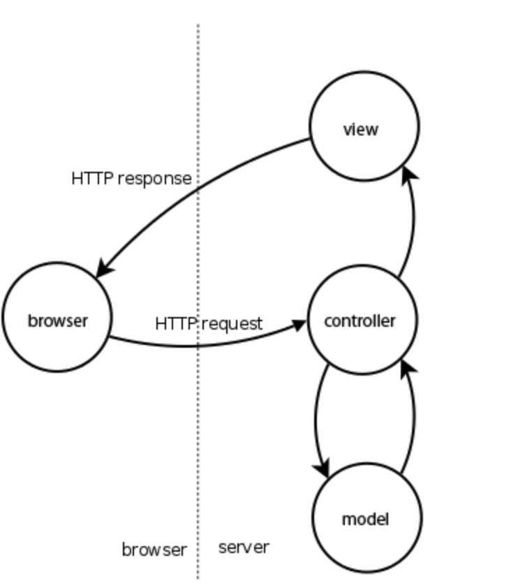
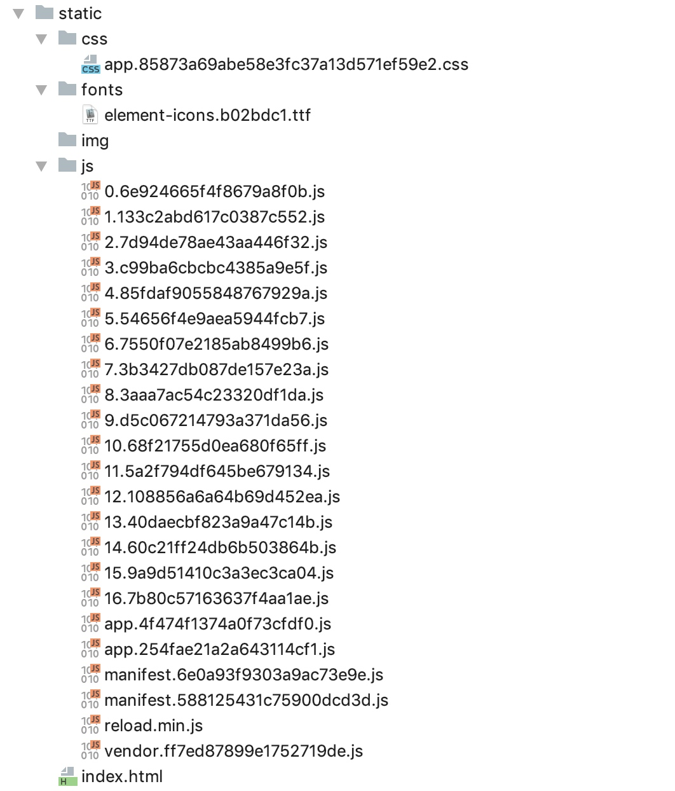

# Iris框架设置、mvc包、session使用、项目搭建和资源导入
**@author:Davie**  
**版权所有：北京千锋互联科技有限公司** 

## 一 iris框架设置
### 1.1 路由组的使用  
在实际开发中，我们通常都是按照模块进行开发，同一模块的不同接口url往往是最后的一级url不同，具有相同的前缀url。因此，我们期望在后台开发中，可以按照模块来进行处理我们的请求，对于这种需求，iris框架也是支持的。
```
usersRouter := app.Party("/admin", userMiddleware)
```
如上述代码所示，iris框架中使用app.Party方法来对请求进行分组处理，第二个参数是处理路由组的中间件方法，通常情况下我们会在中间件中写context.Next()方法。
### 1.2 应用程序内代码配置
在iris框架开发中，初始化应用程序时已经使用了默认的配置值。作为开发者，我们可以不需要其他额外的配置就启动我们的应用程序。
如果开发者想要自己根据自己的需求进行配置，iris框架也是支持的，本节课我们来学习一下iris框架所支持的配置方式。
现在主流的配置文件格式有：xml、yaml、 cnf、toml、json等等格式。xml现在使用的已经不多，cnf格式的配置文件适合数据库的配置文件，在本节内容中，我们将带大家学习多种配置文件的使用方法。
在iris程序的全局app实例中，支持通过多种方式进行代码配置，途径是多样的：
#### 1.2.1 app.Configure
通过app.Configure(iris.WithConfiguration(iris.Configuration{DisableStartuplog:false}))来对整体应用进行配置项配置。
#### 1.2.2 app.Run
通过app.Run方法的第二个参数来进行相关的自定义配置项的配置，第二个参数的类型同1一致。  
以上两种方式，无论哪种方式，都是对app服务应用进行Configuration配置，提供应用配置的Configuration结构体定义所支持的配置项分别为：
* DisableInterruptHandler：如果设置为true，当人为中断程序执行时，则不会自动正常将服务器关闭。如果设置为true，需要自己自定义处理。默认为false。  
* DisablePathCorrection： 该配置项表示更正并将请求的路径重定向到已注册的路径。比如：如果请求/home/ 但找不到此Route的处理程序，然后路由器检查/home处理程序是否存在，如果是，（permant）将客户端重定向到正确的路径/home。默认为false。 
* EnablePathEscape：该配置选项用于配置是否支持路径转义。适用于请求url中包含转义字符时进行配置。默认为false。  
* FireMethodNotAllowed： 默认为false。 
* DisableBodyConsumptionOnUnmarshal：该设置选项用于配置读取请求数据的方法是否使用，如果设置为true，则表示禁用context.UnmarshalBody，context. ReadJSON以及context.ReadXML。默认为false。
* DisableAutoFireStatusCode：该配置变量为控制是否处理错误自动执行，如果为true，则不会进行错误自动执行。该配置项默认为false。
* TimeFormat：时间格式。默认格式为："Mon, 02 Jan 2006 15:04:05 GMT"  
* Charset：字体格式选项。默认字体为："UTF-8"

### 1.3 通过TOML配置文件进行配置  
#### 1.3.1 什么是toml？
toml是Tom’s Obvious, Minimal Language的缩写， toml是一种配置文件。TOML是前GitHub CEO， Tom Preston-Werner，于2013年创建的语言，其目标是成为一个小规模的易于使用的语义化配置文件格式。TOML被设计为可以无二义性的转换为一个哈希表(Hash table)。
#### 1.3.2 toml文件配置
具体的项目配置使用中，我们需要创建config.tml类型的配置文件，并在程序中明确使用toml文件进行读取配置内容。如下图所所示：
```
app.Configure(iris.WithConfiguration(iris.TOML("./configs/iris.tml")))
```
### 1.4 通过YAML配置文件  
YAML 是专门用来写配置文件的语言，写法简洁、功能强大，比JSON格式还要方便。Yaml实质上是一种通用的数据串行化格式。Yaml的主要语法格式有以下几项：
* 大小写敏感。
* 使用缩进表示层级关系。
* 缩进时不允许使用Tab键，只允许使用空格。
* 缩进的空格数目不受限制，相同层级的配置元素	左侧对齐即可。
在本节内容中，我们可以通过yaml配置文件来对应用进行简单选项的的配置：

```
app.Configure(iris.WithConfiguration(iris.))
```

### 1.5 通过读取自定义配置文件
这里我们给大家演示如何使用json格式的配置文件来进行应用的配置，然后从应用程序中进行读取。
#### 1.5.1 自定义json文件
首先创建json格式的配置文件，并编写配置项，如下图：

```
{
  "appname": "IrisDemo",
  "port": 8000
}
```

#### 1.5.2 配置文件读取
在应用程序内，编程实现对配置文件的读取和解析，如下图：

```go
file, _ := os.Open("/Users/hongweiyu/go/src/irisDemo/5-路由组及Iris配置/config.json")
defer file.Close()
decoder := json.NewDecoder(file)
conf := Coniguration{}
err := decoder.Decode(&conf)
if err != nil {
	fmt.Println("Error:", err)
}
fmt.Println(conf.Port)
```

本节课我们带大家学习了在iris框架中如何使用路由组和对应用进行相关的配置的内容，本节课学习的内容我们在实战项目中都能能够用到。

## 二 MVC包使用
在Iris框架中，封装了mvc包作为对mvc架构的支持，方便开发者遵循mvc的开发原则进行开发。
iris框架支持请求数据、模型、持久数据分层处理，并支持各层级模块代码绑定执行。
MVC即：model、view、controller三个部分，分别代表数据层、视图层、控制层。控制器层负责完成页面逻辑、实体层负责完成数据准备与数据操作、视图层负责展现UI效果。
在iris框架中，用一张图表示前端请求、服务端处理请求、服务端返回数据到前端的请求过程图，描述如下：


### 2.1 mvc.Application
iris框架中的mvc包中提供了Application结构体定义。开发者可以通过注册自定义的controller来使用对应提供的API，其中包含路由组router.Party,以此用来注册layout、middleware以及相应的handlers等。

### 2.2 iris.mvc特性
iris框架封装的mvc包，支持所有的http方法。比如，如果想要提供GET，那么控制器应该有一个名为Get（）的函数，开发者可以定义多个方法函数在同一个Controller中提供。这里的Get、Post方法是指的直接和八种请求类型同名的方法，mvc模块会自动执行到Get()、Post()等八种对应的方法。如下所示：
```go
//自定义的控制器
type CustomController struct{}
//注册自定义控制器处理请求
mvc.New(app).Handle(new(CustomController))
//自动处理基础的Http请求
//Url： http://localhost:8000
//Type：GET请求
func (cc *CustomController) Get() mvc.Result{
    //todo
    return mvc.Response{
        ContentType:"text/html",
    }
}
/**
 * Url：http://localhost:8000
 * Type：POST
 **/
func (cc *CustomController) Post() mvc.Result{
    //todo
    return mvc.Response{}
}
```
### 2.3 根据请求类型和请求URL自动匹配处理方法
在iris框架中的mvc设计包中，设定了自定义的控制器以后，支持根据请求类型和对应的URL自动匹配对应的处理方法。具体案例如下：
```go
/**
 * url：http://localhost:8000/info
 * type：GET请求
 **/
func (cc *CustomController) GetInfo() mvc.Result{
    //todo
}

/**
 * url：http://localhost:8000/login
 * type：POST
 **/
func (cc *CustomController) PostLogin() mvc.Result{
    //todo
}
```
如上案例，当我们发起请求时，iris框架就能够自动匹配对应的控制器的处理方法。除了上述get和post两个方法之外，http请求的八种类型中的其他请求类型，也支持自动匹配。

### 2.4 BeforeActivation方法
在通过Configure和Handle进行了自定义Controller绑定以后，就可以使用自己自定义的Controller来进行自定义处理处理请求方法。开发者可以在BeforeActivation方法中来处理请求定义。如下所示，我们给出案例说明：
```go
func （m *CustomController） BeforeActivation(a mvc.BeforeActivation){
    a.Handle("GET","/users/info","QueryInfo")
}
//对应处理请求的方法
func (m *CustomController) QueryInfo() mvc.Result{
    //todo
}
```

### 2.5 使用mvc.Configure配置路由组和控制器
除了使用mvc.new(app)来构建mvc.Application结构体对象和Handle方法来配置处理请求的控制器外，iris框架还支持使用mvc.Configure来配置路由组和控制器的设置。具体使用方法如下：
```
mvc.Configure(app.Party("/user"), func(mvc *mvc.Application) {
		mvc.Handle(new(UserController))
})
```
本节课中我们学习了mvc包中控制器极其处理方法的基本用法，在实战项目中，我们会在本节课学习内容的基础上，继续深入学习更详细的操作。

## 三 Session的使用和控制
在实际的项目开发中，我们会经常有业务场景使用到Session功能。在iris框架中，也为我们提供了方便使用，功能齐全的Session模块。Session模块的源码目录为kataras/iris/sessions包。
### 3.1 Session与Cookie的区别
在学习web开发过程中，我们总会和session和cookie打交道。本节课我们学习sesion相关的知识，因此有必要先通过讲解对比一下session和cookie的区别：
* 首先是两者的相同点。session和cookie两者都是用来存储客户的状态信息的手段。在登录、注册等动作后，可以存储相关账户的状态信息，方便程序后续跟踪及使用。
* 其次是不同点，讨论两者的不同点我们从几个角度来总结。首先是两者的存储位置。Cookie是存储在客户端浏览器上，方便客户端请求时使用；Session存储的相关信息存储在服务器端，用于存储客户端连接的状态信息。
* 其次，从可以存储的数据类型来看。Cookie仅仅支持存储字符串string一种数据类型，Session支持int、string、bool等多种数据类型，Session支持的数据类型更全更多。

### 3.2 Session对象创建
在实际的程序开发中，iris框架中可以非常方便的创建一个新的session对象。如下所示，即是session的创建：
```go
...
sessionID := "mySession"
//session的创建
sess := sessions.New(sessions.Config{
		Cookie: sessionID,
})
```
### 3.3 支持的数据类型
在上文中，我们说过session支持的数据类型要比cookie多，我们来看一下iris框架中的session所支持存储的数据类型：
```go
//String：字符串类型
session.GetString()
//Int：无符号整形 及系列相关单位的同类型
session.GetInt()
//Boolean：布尔值类型
session.GetBoolean()
//Float：单精度数值类型 及系列相关单位的同类型
session.GetFloat()
//interface{}：接口 即任意数据结构类型
session.GetFlash()
```
上述代码块，即列出了iris框架中所支持存储的数据类型。我们在接下来的本节课程内容中，将会演示如何进行具体使用。

### 3.4 Session的使用
```go
...
session := sess.Start(ctx)
session.Set("key", "helloworld")
...
```

## 四 实战项目资源导入和项目框架搭建
从本节内容开始，我们将利用我们所学习的Iris框架的相关知识，进行实战项目开发。

### 4.1 实战项目框架搭建
我们的实战项目是使用Iris框架开发一个关于本地服务平台的后台管理平台。平台中可以管理用户、商品、商铺等相关的信息，平台可以实时展示用户、商品等相关监测数据的变化情况。通过此项目，旨在能够将Iris框架相关的知识得到巩固和练习。
如下是项目框架搭建后的说明：
* config：项目配置文件及读取配置文件的相关功能
* controller：控制器目录、项目各个模块的控制器及业务逻辑处理的所在目录
* datasource：实现mysql连接和操作、封装操作mysql数据库的目录。
* model：数据实体目录，主要是项目中各业务模块的实体对象的定义
* service：服务层目录。用于各个模块的基础功能接口定义及实现，是各个模块的数据层。
* static：配置项目的静态资源目录。
* util：提供通用的方法封装。
* main.go：项目程序主入口
* config.json：项目配置文件。

### 4.2 项目资源导入
因为我们实战的项目开发主要是实现服务器端的功能开发和Iris框架的知识练习，因此我们将注重在后台功能开发上，对于前端的页面和一些布局效果，我们不做深入研究，只需要会使用，会调试即可。
因此，在该项目中，我们从外部导入的资源主要是前端的一些资源。前端框架采用Vue编写，我们在此项目中直接将编译后的js文件、css文件等相关的文件导入到实战项目中，全部存放于static目录中，如下图所示：
