# 微服务特性
**@author：Davie**
**版权所有：北京千锋互联科技有限公司**

## 一、微服务简介-构建单体应用

互联网技术发展迅速的今天，微服务倍受关注：文章、博客、社交媒体讨论和会议演讲都在谈论。与此同时，也有持怀疑态度的软件社区人员认为微服务没什么新鲜可言。反对者声称它的思想只是面向服务架构的重塑。然而，无论是炒作还是怀疑，不可否认，微服务架构模式具有非常明显的优势 —- 特别是在实施敏捷开发和复杂的企业应用迭代开发方面。

从本篇文章开始，我们来开学了解学习微服务的相关知识。

### 1.1、单体应用

我们先不问微服务是什么？微服务该如何实现？让我们从我们原本最熟悉的创建一个应用和一个普通的项目开始说起。

#### 1.1.1、打车系统

我们假设要开始开发一个打车应用，目标是与Uber和DiDi竞争。经过讨论和技术选型，我们开始手动开发生成一个新项目，该新应用有一个模块化的六边形架构，如下图所示：

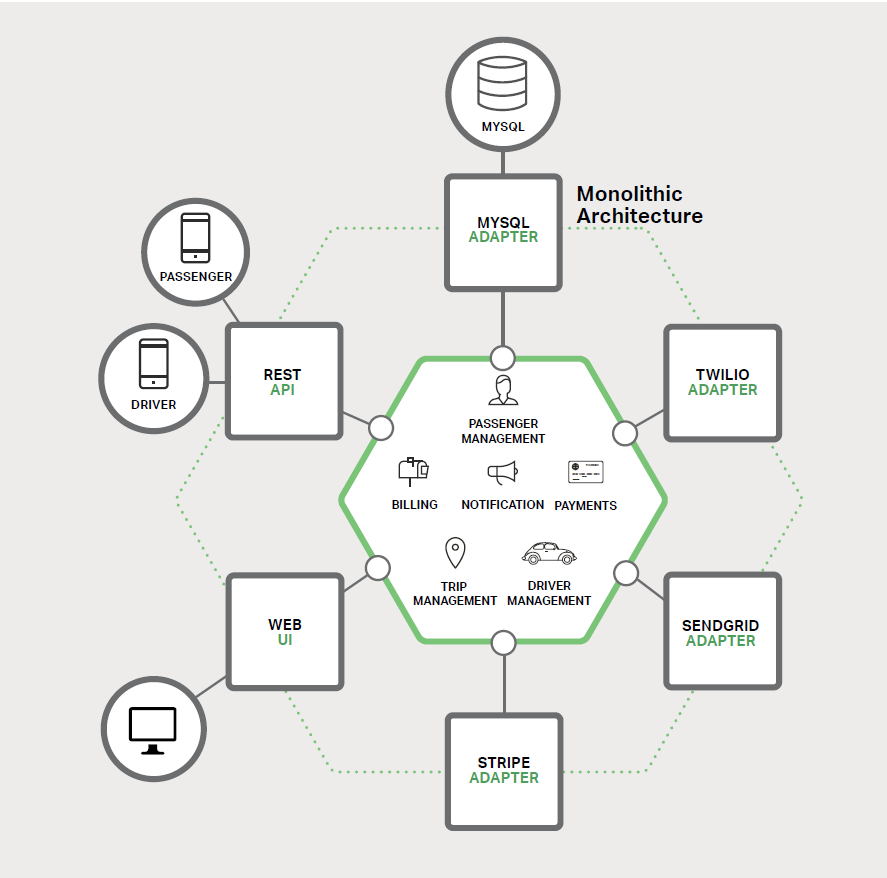

该应用的核心是由**模块**实现的业务逻辑。它定义了**服务、领域对象和事件**。围绕核心的是与外部世界接口对接的适配器。适配器示例包括数据库访问组件、生产和消费消息的消息组件和暴露了 API 或实现了一个 UI 的 web 组件。

* **单体应用：**所谓的单体应用就是指一个war包包含了项目的所有功能。比如上述举例的打车应用，尽管有一个逻辑模块化架构，但应用程序被作为一个单体进行打包和部署。例如，我们所熟知的许多Java应用程序被打包成WAR文件部署在如Tomcat或者Jetty之类的应用服务器上。其他Java应用程序被打包成可执行JAR包。

* **单体应用的特点：**
    * **容易开发：**开发者只需要在专用的开发工具上比如（Eclipse，myEclipse)等就可以管理整个项目代码，完成代码开发工作。
    
    * **容易运行和测试：**既然我们能够在本地开发工具上完成整个项目的功能开发和调试，自然也就很容易在我们本地环境上进行测试调试。
    
    * **容易部署：**正如我们在举例单体应用构建项目时所说，当应用程序开发，调试，测试完成以后，我们只需要将代码进行打包，然后将打包好的应用程序拷贝到服务器上进行部署即可。
    
#### 1.1.2、互联网公司架构

再比如，我们拿一个常见的互联网公司的静态逻辑架构来举例，我们通过如下的架构图将系统切分成五层，如下图所示：

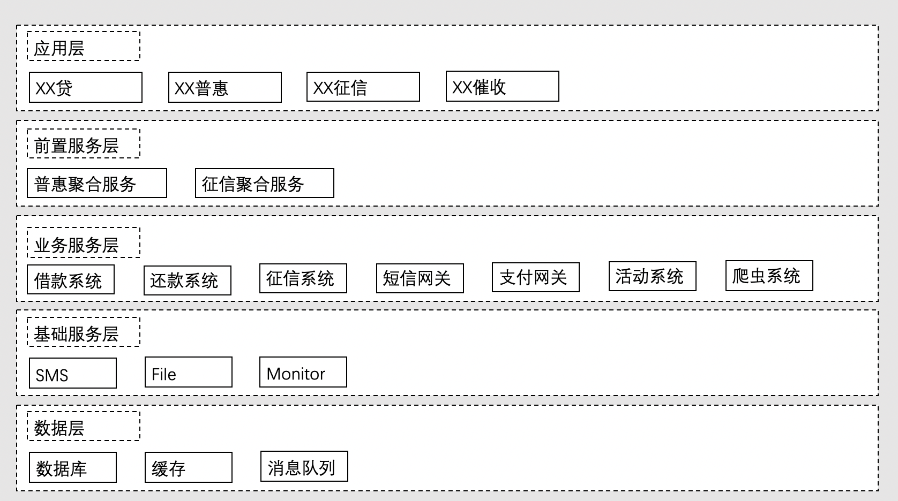

* **应用层：**面向客户的最终软件产品，直接暴露给互联网的各种App、Web站点以及Wap站点。

* **前置服务层：**各种重业务的聚合入口，对具体引用层做大量工作，实现业务调用链条的封装，达成业务逻辑的强实现。

* **业务服务层：**包含各种基础的业务服务单元，比如借款系统、还款系统、征信系统、活动系统、爬虫系统、引流系统、文件系统等。

* **基础服务层：**不包含状态的基础业务服务，包括但不限于短信网关、文件网关、服务监控等。

* **数据层：**包括各种形态的数据存储层，但不限于各种数据库、缓存、消息队列等。

如上我们从传统的构建项目应用和项目架构拆解的角度来给大家解释了什么是单体应用，单体的特点以及传统的应用的架构设计。类似的单体应用在我们以往的互联网发展和企业应用中使用的非常普遍，现在也仍然很多企业都是类似的单体应用。

但是，随着需求的增长，业务的变化，单体应用在慢慢发展和迭代后，也会遇到一些问题，单体应用的瓶颈会逐步显现。

【注：】以上文档，部分内容摘抄自《Docker微服务架构实践》，作者蒋彪

## 二、微服务简介--走向单体地狱

上节课我们讲了，我们在进行开发一个新的应用时，可以构建一个整体的应用系统，我们称之为单体应用。当我们的应用刚开始起步，业务功能少，代码量可控时，我们还能正常的开发。

### 2.1、局限性
但是，随着系统业务的不断增长，代码量不断增加，我们维护创建的单体应用系统的性能和维护成本都会受到限制，限制了我们继续新增新业务的能力。

### 2.2、单体应用发展趋势
成功的应用有一个趋势，整个项目随着时间推移会变得越来越臃肿。而开发团队在每个迭代开发周期中都要实现更多的用户需求，这意味着需要添加许多行代码。当原来的单体引用运行维护几年之后，小而简单的应用将会逐渐成长成一个庞大的应用。

### 2.3、问题与困境
一旦应用程序成为了一个庞大、复杂的单体应用，整个开发团队可能就会陷入一个痛苦的境地，可能会遇到很多很多的问题，比如说：

* **敏捷开发受挫**

    **主要问题是：应用程序实在非常复杂，其对于任何一个开发人员来说显得过于庞大**。最终，正确修复 bug 和实现新功能变得非常困难而耗时。
    
    就拿应用启动时间这一项指标来说，应用程序越大，启动时间越长。曾经听说过某应用程序启动需要 40 分钟以上的怪事。如果开发人员经常要重启应用服务器，那么很大一部分时间都是在等待中度过，这将极大的影响我们的工作效率。
    
* **持续部署受挫**
    
    另一个大问题是，复杂的单体应用本身就是持续部署的障碍。如今，SaaS（Software-as-a-Service软件即服务）应用发展到了可以每天多次将变更推送到生产环境。这对于复杂的单体来说非常困难，因为这需要重新部署整个应用程序才能更新其中任何一部分。联想到之前提到的漫长启动时间，这也不会是什么好事。

    此外，因变更所产生的影响通常不是很明确，开发者很可能需要做大量的手工测试。比如，我们仅仅是修改某个部分的代码，但是因为是全部部署，因此我们必须要重新将整个系统进行全链路测试，这样将耗费非常多额外的时间。
    
    因此，持续部署是不可能做到的。
    
* **应用难以扩展**

    当不同模块存在资源需求冲突时，单体应用可能难以扩展。例如，一个模块可能会进行密集型图像处理逻辑，理想情况下是部署在云服务器A实例中；另一个模块可能是一个内存数据库，最适合部署到云服务器B实例中。但是，由于这些模块是属于同一个应用，只能被部署在一起，此时就要求运维人员必须在硬件选择上做出妥协和让步，因此就使得原本我们设计的系统处理业务的能力会受到硬件环境的限制。

* **可靠性低**

    单体应用的另一个问题是可靠性低。因为所有模块都运行在同一进程中。任何模块的一个 bug，比如内存泄漏，可能会拖垮整个进程。
    
    此外，由于应用程序的所有实例都是相同的，该错误将影响到整个应用的可用性，对整个应用都造成影响。

* **技术升级困难**

    单体应用因为提及庞大，使得采用新框架和语言变得非常困难。假设有50万行代码使用了某个框架编写。如果使用较新的一个框架来重写整个应用，这将非常昂贵（在时间和成本方面）。因此，这对于团队采用新技术，对系统进行技术升级来说是一个非常大的障碍。

最后，经过了上面几个方面的问题的罗列，我们总结一下：当我们开发个业务量小，功能适量的一个项目应用时，通过单体应用的开发，就可以满足我们的开发需求，实现业务功能。当业务量快速增长，系统持续开发迭代时，我们的应用体积和业务复杂程度会越来越高，以至于影响开发人员的开发效率，提高了项目的维护成本，我们的项目会遇到各种瓶颈问题，应用程序的持续扩展能力受到限制，性能也因此受到影响。

既然实际生产环境中遇到了这样的难题，作为项目管理者和项目开发者，就必须想办法解决出现的这些问题。

我们如何做才能解决项目持续迭代后遇到的扩展能力受限和各种瓶颈问题呢？答案是**微服务**。

【注：】本文以上文档，部分内容摘抄自《Docker微服务架构实践》，作者蒋彪。

### 三、微服务简介--解决复杂问题
许多大公司如阿里巴巴，腾讯，微博，滴滴等，已经采用现在所谓的微服务架构模式解决了我们前文所提到的单体应用遇到的种种问题。主要的思路：**将应用程序分解成一套较小的互连服务。**

#### 3、1微服务解决方案 

**一个服务通常实现了一组不同的特性或功能，例如订单管理、客户管理等。每一个微服务都是一个小型迷你应用，在需要依赖的地方，通过REST API连接其他所需要的服务之星业务逻辑。**

* **微服务架构**

    一些微服务会向外暴露一组供其他模块访问和使用的API。其他微服务实现了自己的业务逻辑，在必要时，可以通过API进行业务逻辑访问。比如，之前提到的单体应用，通过拆解后，可以变成如下的架构：

    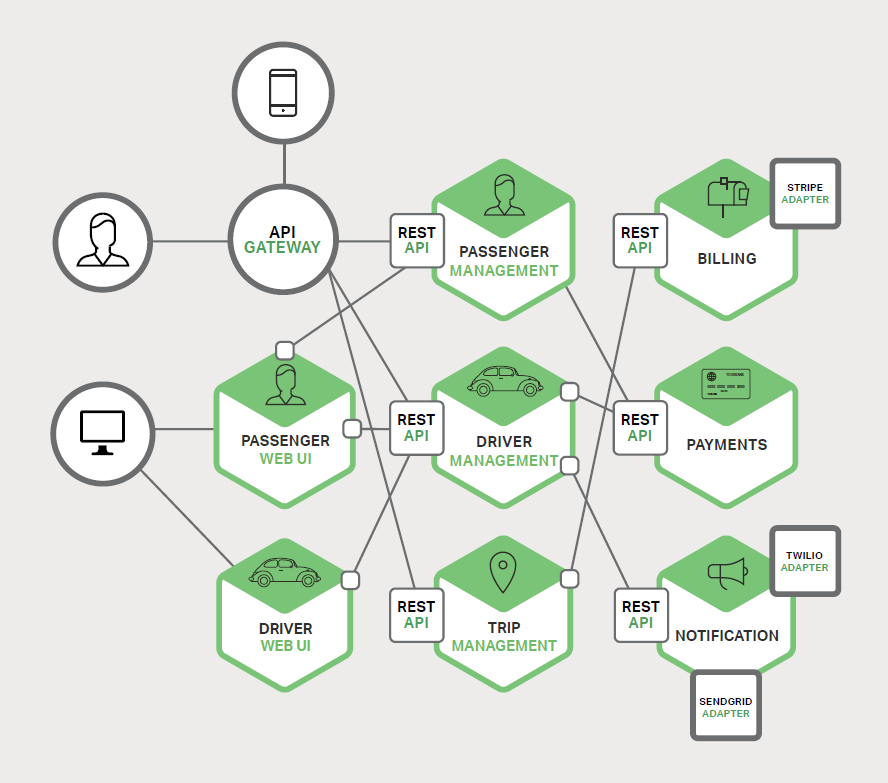

    具体的表现为：**应用程序的每个功能区域现在都由自己的微服务实现。**例如，以我们的出租车系统为例，一个是乘客的应用，一个是司机的应用。这使得它更容易地为特定的用户、司机、设备或者专门的用例部署不同的场景。每个后端服务暴露一个REST API，大部分服务消费的API由其他服务提供。例如，Driver Management 使用了 Notification 服务器来通知可用司机一个可选路程。UI服务调用了其他服务来渲染页面。

* **微服务与数据库的关系**

    既然我们将微服务架构模式明显影响到了应用程序与数据库之间的关系，与其他共享单个数据库模式服务有所不同，其每一个服务都有自己的数据库模式。一方面，这种做法与企业级数据库数据模型的想法相背，此外，它经常导致部分数据冗余。对于微服务架构而言，每一个服务都应该有自己的数据库模式，因为它能实现松耦合。如下图所示：

    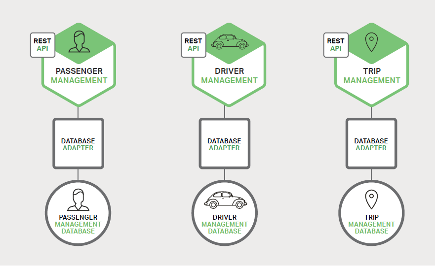

    这种模式下设计架构的特点是每个服务都拥有各自的数据库。而且，服务可以使用一种最适合其需求、号称多语言持久架构的数据库。比如，Driver Management要找到与潜在乘客接近的司机，就必须使用支持高效地理查询的数据库。

**【补充：伸缩立方】**

无论是单体应用还是微服务架构的应用，在实际的生产环境和数据量增加时，都会面临着应用扩展的需要，用以来提高处理能力。在进行系统伸缩性的探索上，有不同的方法。通常，我们常见的提高系统伸缩性能的方法有以下几种：

* 通过负载均衡器后运行的多个拷贝构成，有N份拷贝，则没份负责处理1/N的负载。比如，当我们的系统流量过大时，我们常常会部署到多个Tomcat上，这些Tomcat均挂载在同一台负载均衡器上，这样每一台Tomcat所处理的业务量就降低为原来的一部分。如下图所示：
    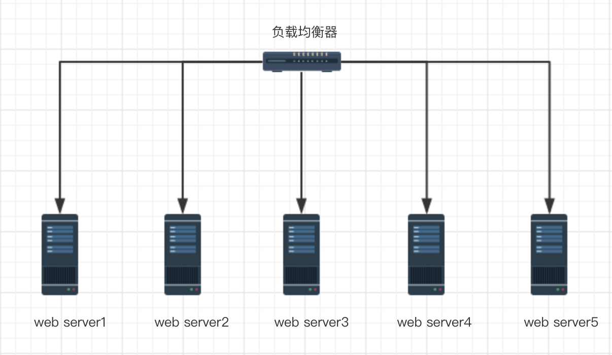

* 对数据库进行分解。原来是所有的业务和功能都存放在统一的数据库中，比如叫db1。为了提高系统性能，提高处理数据的能力，可以将原本是耦合，依赖在同一个系统中的业务模块拆分为小规模的多个业务模块，也就是我们说的微服务的实现架构，每个微服务都只实现核心功能，比如订单模块拆分为一个微服务，支付模块拆分为一个微服务。在拆分的过程中，因为每个微服务是独立部署的，所以订单模块对应的订单表存在于一个数据库db1中，支付模块所对应的支付表存在于另外一个数据库db2中。这样就完成了由一个数据库到多个数据库的拆分。如下图所示：

    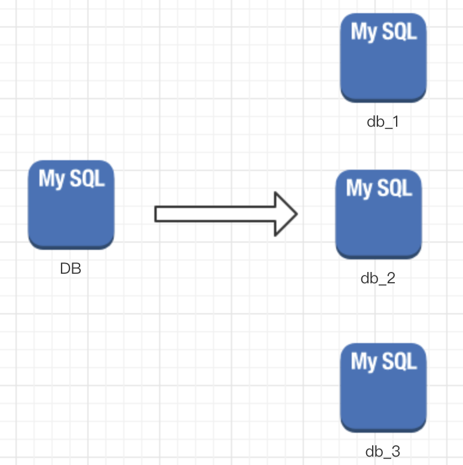

* 对数据表进行拆分。数据库中，同一张表格的数据量过大时，我们的查询等业务在操作数据库时会变得效率下降，我们需要通过其他的方式来提高数据库操作的效率。解决这种同一张表数据的数据量过大的问题，通过拆表来解决。比如我们将0-10000000的数据存放在第1个表中，将10000001-20000000数据存放在第2个表中，依次类推。当我们操作数据库时，到对应的数据库中查询就可以了。如下图所示：
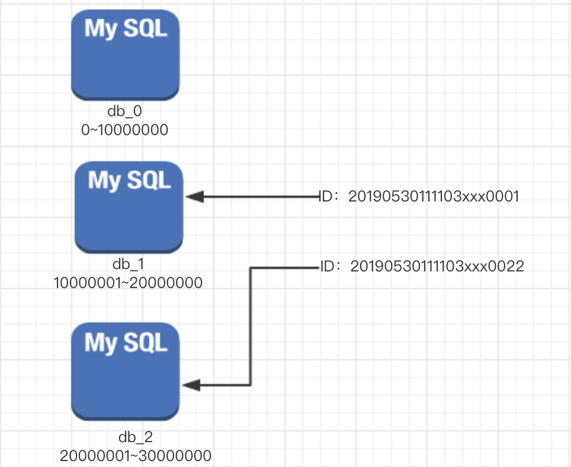

##### **伸缩立方**
伸缩立方是一本技术书籍中提出的概念，这本书的名称为《The Art of Scalability》。
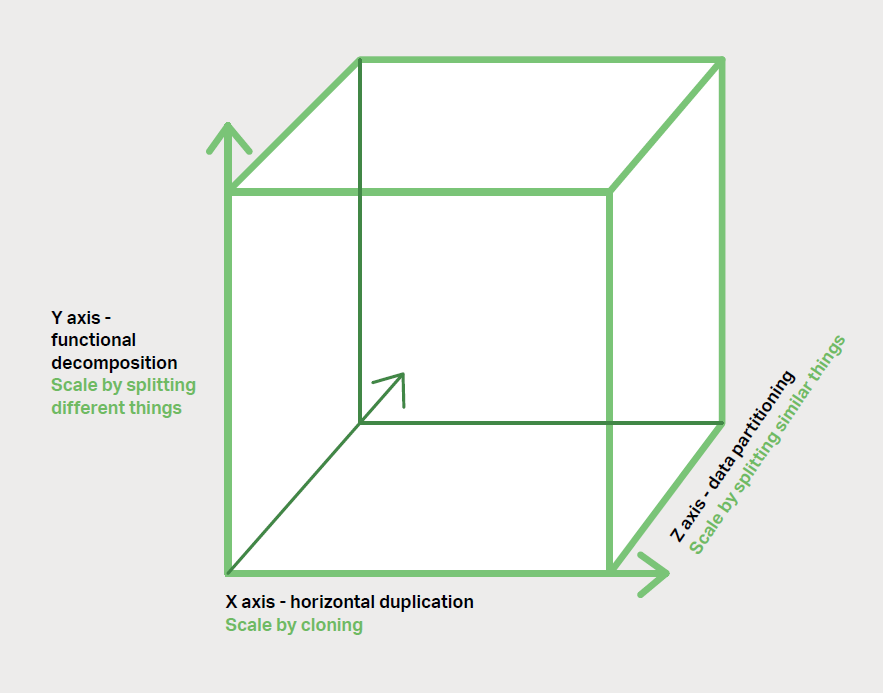

经过上述我们给大家介绍的系统伸缩性解决方案，进而解释一下伸缩立方。在上述伸缩立方的表当中，分为X轴，Y轴，Z轴。具体轴的方案如下：

* **X轴：**运行多个负载均衡器后的多个实例。

* **Y轴：**对应用进一步分解为微服务（分库）

* **Z轴：**大数据量时，对数据进行分区（分表）

####  3、2 微服务的优缺点
* **微服务优点**
    * **解决复杂问题。**微服务架构把可能会变得庞大的单体应用程序分解成一套服务。虽然功能数量不变，但是应用程序已经被分解成可管理的块或者服务。每个服务都有一个明确定义边界的方式，如远程过程调用（RPC）驱动或API。微服务架构模式强制一定程度的模块化，实际上，使用单体代码来实现是极其困难的。因此，使用微服务架构模式，个体服务能被更快地开发，并更容易理解与维护。

    * **团队分工协作更容易。**微服务这种架构使得每个服务都可以由一个团队独立专注开发。开发者可以自由选择任何符合服务API的技术。当然，更多的组织是希望通过技术选型限制来避免完全混乱的状态。然而，这种自由意味着开发人员不再有可能在这种自由的新项目开始时使用过时的技术。当编写一个新服务时，他们可以选择当前的技术。此外，由于微服务体积较小，使用当前技术重写旧服务将变得更加可行。

    * **独立部署。**微服务架构模式可以实现每个微服务独立部署。开发人员根本不需要去协调部署本地变更到服务。这些变更一经测试即可立即部署。比如，UI团队可以经过自己的开发和测试，并快速迭代UI变更。微服务架构模式使每个聚焦于自己核心业务的团队有了更多的自主权。
    
    * **程序扩展能力强。**微服务架构模式使得每个服务能够独立扩展。开发者可以仅部署满足每个服务的容量和可用性约束的实例数目，另外每个开发团队还可以使用与服务资源要求最匹配的硬件。比如，我们可以在云服务器A实例上部署一个图像处理服务，而在云服务器B实例上部署一个内存数据库服务。微服务架构下使得我们分开部署实例变成了现实。
    
以上几点是，我们描述了微服务的优点。和单体应用相比，微服务有其优点，当然也会有不足。

* **微服务缺点**
    
    * **规模难以界定。**如同微服务的名字一样，以微服务架构为主的设计模式重点过于强调拆分和微型，以至于会导致一个大型项目会被拆分出很多的微服务实例。在拆分的过程中，如何定义微服务迷你应用的规模，往往存在着不同的标准，有人是以核心功能为标准，有人主张以代码量为标准。总之，衡量标准不一。我们需要强调的是：**微服务仅仅是一种技术手段，而不是主要目标。**微服务的目标在于充分分解应用程序以方便应用敏捷开发和部署。

    * **增加系统复杂度。**因为微服务是独立部署，拆分成各个功能服务实例。因此，原本的单体应用就变成了一个分布式系统，如何管理这个分布式系统，无形之中增加了原有应用程序的复杂度。在分布式系统中，要实现各个微服务实例之间的通信和业务调用，开发者需要选择和实现基于消息或者RPC框架的进程间通信机制来实现微服务间通信。另外，多个微服务调用之间的请求，调试，协调等问题，也会增加团队间的沟通成本，相比起单体应用来说，微服务架构在这一点上也要更复杂。
    
    * **分区数据库架构难题。**当我们在进行正常的业务开发时，往往需要涉及到多个模块之间的数据调用和数据更新。在原来的单体应用下，比较容易实现，我们只需要操作不同的实体表就可以实现，但是在微服务架构中，因为数据存储是独立存储和部署，这导致我们在某个业务中更新多个模块数据时，我们需要调用不同的微服务接口API依次更新。在实际的开发和实践过程中，这个问题也会成为开发人员的主要困扰之一。

    * **项目测试难度增加。**在原来的单体应用中，开发者可以通过在统一的测试目录下统一编写测试用例和测试方法，然后启动应用服务，进行测试系统功能，对开发人员来说这是常见的做法也是比较熟悉的做法。相比较而言，如果我们要进行微服务的功能测试，就需要将所依赖的所有的微服务都要启动起来才能执行。虽然这个工作难度不大，但是要知道，一旦我们的某个微服务实例依赖的其他实例数量较多时，对开发者调试的工作量来说，是直线上升的。
    
    * **多服务修改更加困难。**比如在原本的单体应用中存在三个模块，分别为：模块A、模块B和模块C。当我们有业务逻辑需要进行修改时，我们只需要在同一个应用程序中协作修改三个模块，完成业务功能的调整，然后测试并上线。但是在微服务中，当我们需要横框多个微服务实例间进行业务调整时，就需要仔细认真规划和协调，以便完成整个业务的调整。这样对开发者来说，迭代维护的成本也会增加。

    * **微服务需要进行多次部署。**原来的单体应用在部署时，可以通过将所有的项目模块打包到一个整体的部署包内，然后部署到一台或者一组服务器上。相比较之下，将程序改为微服务架构以后，应用程序的数量就变多了，这样在整体运行时就需要部署多次，这是一个不小的工作量。
    
以上几点是微服务架构不足的地方。我们必须要辩证的看待和使用微服务，本质上它是一项技术，我们要利用微服务技术解决现实项目中的问题。

## 四、微服务的概念与微服务架构实践的问题
前面几节课程我们向大家讲了从单体应用如何发展到微服务架构的项目架构的转变，以及单体应用和微服务架构各自的优缺点。本节课，我们来看一看微服务的定义和标准，以及在实践中解决的问题。

### 4、1 微服务的定义
结合我们之前所了解到的文章和相关知识，并结合相关资料。我们借鉴微服务之父Martin先生给微服务的定义：**将一个单体应用拆分成一组微小的服务组件，每个微小的服务组件运行在自己的进程上，组件之间通过如RESTful API这样的轻量级机制进行交互，这些服务以业务能力为核心，用自动化部署机制独立部署，另外，这些服务可以用不同的语言进行研发，用不同技术来存储数据。**通过以上的定义描述，我们可以基本确定给出微服务的节特征，如下所示：

* 在分布式环境中，将单体应用拆分为一系列服务，共同组成整个系统。

* 每个服务都轻量级，单独部署，运行在自己的进程中。

* 每个微服务注重自己的核心能力的开发，微服务组件之间采用轻量级通信方式进行通信，包括但不限于RESTful API。

* 按照业务边界进行划分。

* 微服务是一种编程架构思想，有不同的语言实现。

### 4、2 微服务实践要解决的问题
用微服务来进行实践到生产项目中，首先要解决一些问题。比如下图的微服务业务架构：

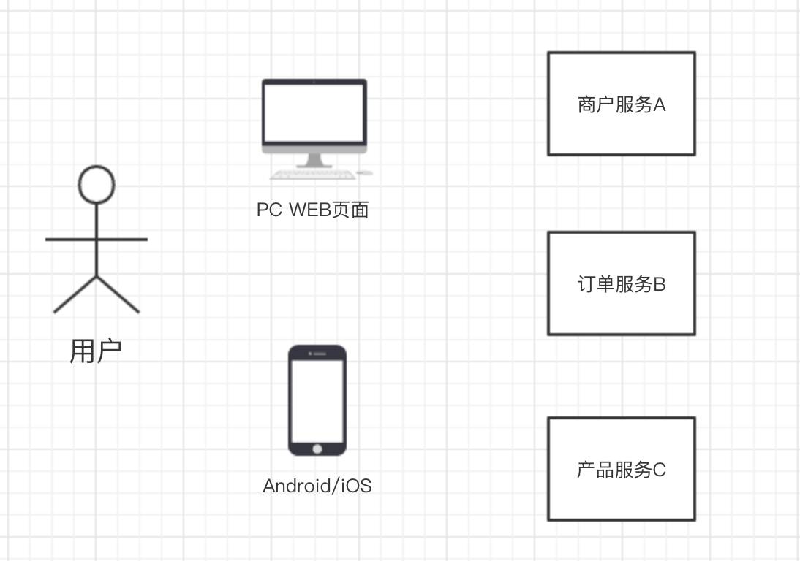

在上图图表展示的架构图中，我们假设将业务商户服务A、订单服务B和产品服务C分别拆分为一个微服务应用，单独进行部署。此时，我们面临很多要可能出现的问题要解决，比如：

* **1、客户端如何访问这些服务？**

* **2、每个服务之间如何进行通信？**

* **3、多个微服务，应如何实现？**

* **4、如果服务出现异常宕机，该如何解决？**

以上这些都是问题，需要一个个解决。

#### 4.2.1、客户端如何访问服务

在单体应用开发中，所有的服务都是本地的，前端UI界面，移动端APP程序可以直接访问后端服务器程序。

现在按功能拆分成独立的服务，跑在独立的进程中。如下图所示：

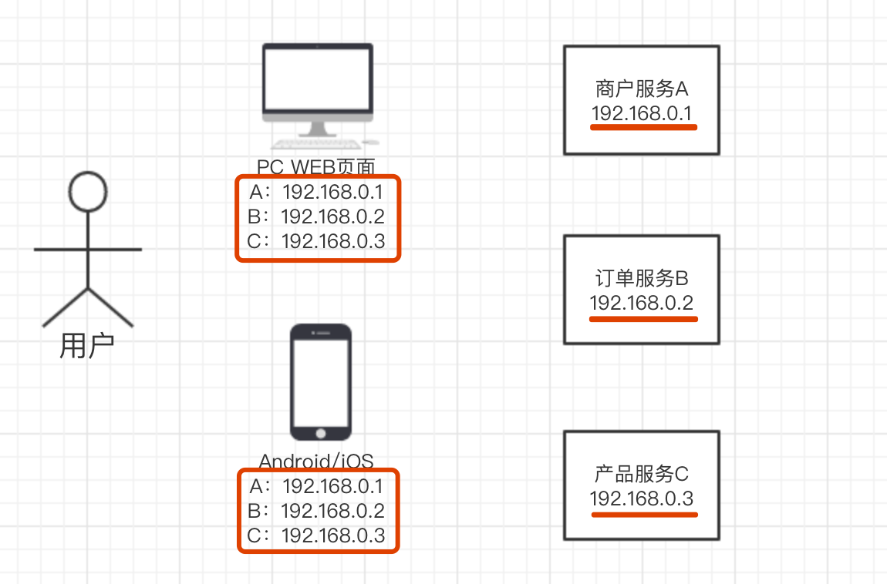

此时，后台有N个服务，前台就需要记住管理N个服务，一个服务**下线**、**更新**、**升级**，前台和移动端APP就要重新部署或者重新发包，这明显不服务我们拆分的理念。尤其是对当下业务需求的飞速发展，业务的变更是非常频繁的。

除了访问管理出现困难以外，N个小服务的调用也是一个不小的网络开销。另外，一般微服务在系统内部，通常是无状态的，而我们的用户在进行业务操作时，往往是跨业务模块进行操作，且需要是有状态的，在此时的这个系统架构中，也无法解决这个问题。传统的用来解决用户登录信息和权限管理通常有一个统一的地方维护管理（OAuth），我们称之为授权管理。

基于以上列出的问题，我们采用一种叫做网关（英文为API Gateway）的技术方案来解决这些问题，网关的作用主要包括：

* **提供统一服务入口，让微服务对前台透明**

* **聚合后台的服务，节省流量，提升性能**

* **提供安全，过滤，流控等API管理功能**

网关(API Gateway)可以有很多广义的实现办法，可以是一个软硬一体的盒子，也可以是一个简单的MVC框架，甚至是一个Node.js的服务端。他们最重要的作用是为前台（通常是移动应用）提供后台服务的聚合，提供一个统一的服务出口，解除他们之间的耦合，不过API Gateway也有可能成为**单点故障**点或者性能的瓶颈。

最终，添加了网关(API Gateway)的业务架构图变更为如下所示：

#### 4.2.2、服务之间如何通信
所有的微服务都是独立部署，运行在自己的进程容器中，所以微服务与微服务之间的通信就是IPC（Inter Process Communication），翻译为进程间通信。进程间通信的方案已经比较成熟了，现在最常见的有两大类：**同步调用、异步消息调用**。

##### **同步调用**
同步调用比较简单，一致性强，但是容易出调用问题，性能体验上也会差些，特别是调用层次多的时候。同步调用的有两种实现方式：分别是**REST**和**RPC**
* **REST：**REST基于HTTP，实现更容易，各种语言都支持，同时能够跨客户端，对客户端没有特殊的要求，只要具备HTTP的网络请求库功能就能使用。
* **RPC：**rpc的特点是传输效率高，安全性可控，在系统内部调用实现时使用的较多。

基于REST和RPC的特点，我们通常采用的原则为：**向系统外部暴露采用REST，向系统内部暴露调用采用RPC方式。**

##### **异步消息调用**
异步消息的方式在分布式系统中有特别广泛的应用，他既能减低调用服务之间的耦合，又能成为调用之间的缓冲，确保消息积压不会冲垮被调用方，同时能保证调用方的服务体验，继续干自己该干的活，不至于被后台性能拖慢。需要付出的代价是一致性的减弱，需要接受数据**最终一致性**，所谓的最终一致性就是只可能不会立刻同步完成，会有延时，但是最终会完成数据同步；还有就是后台服务一般要实现**幂等性**，因为消息送出于性能的考虑一般会有重复（保证消息的被收到且仅收到一次对性能是很大的考验）。最后就是必须引入一个独立的 Broker，作为中间代理池。

常见的异步消息调用的框架有：Kafaka、Notify、MessageQueue。

最终，大部分的服务间的调用架构实现如下所示：

#### 4.2.3、如何实现众多微服务
在微服务架构中，一般每一个服务都是有多个拷贝，来做负载均衡。一个服务随时可能下线，也可能应对临时访问压力增加新的服务节点。这就出现了新的问题：

* **服务之间如何相互感知？**例如有新的服务实例上线，已上线的实例如何知道并与之通信。

* **服务如何管理？**服务实例数量多了，也面临着如何管理的问题。

这就是服务的发现、识别与管理问题。解决多服务之间的识别，发现的问题一般是通过注册的方式来进行。

具体来说：当服务上线时，服务提供者将自己的服务注册信息注册到某个专门的框架中，并通过心跳维持长链接，实时更新链接信息。服务调用者通过服务管理框架进行寻址，根据特定的算法，找到对应的服务，或者将服务的注册信息缓存到本地，这样提高性能。当服务下线时，服务管理框架会发送服务下线的通知给其他服务。

常见的服务管理框架有：Zookeeper等框架。

如上的问题解决方案有两种具体的实现，分别是：**基于客户端的服务注册与发现**、**基于服务端的服务注册与发现**。

##### 基于客户端的服务注册与发现
优点是架构简单，扩展灵活，只对服务注册器依赖。缺点是客户端要维护所有调用服务的地址，有技术难度，一般大公司都有成熟的内部框架支持。

##### 基于服务端的服务注册与发现

优点是简单，所有服务对于前台调用方透明，一般在小公司在云服务上部署的应用采用的比较多。

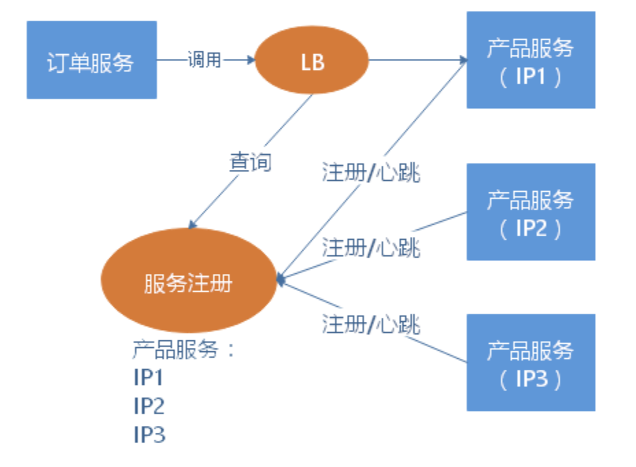

#### 4.2.4、服务宕机等异常情况的处理
前面提到，单体应用开发一个很大的风险是，把所有鸡蛋放在一个篮子里，一荣俱荣，一损俱损。而分布式最大的特性就是网络是不可靠的。通过微服务拆分能降低这个风险，不过如果没有特别的保障，结局肯定是噩梦。

因此，当我们的系统是由一系列的服务调用链组成的时候，我们必须确保任一环节出问题都不至于影响整体链路。相应的手段有很多，比如说：

* 重试机制

* 限流

* 熔断机制

* 负载均衡

* 降级（本地缓存）