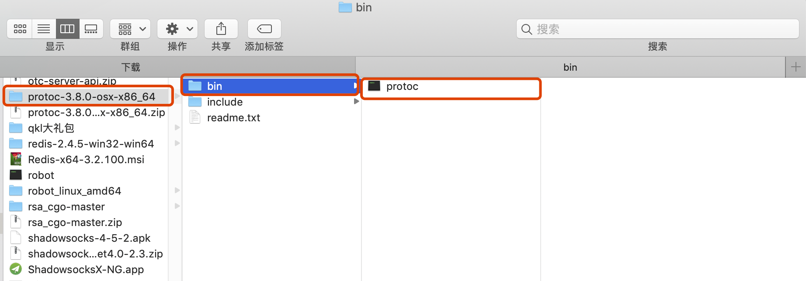
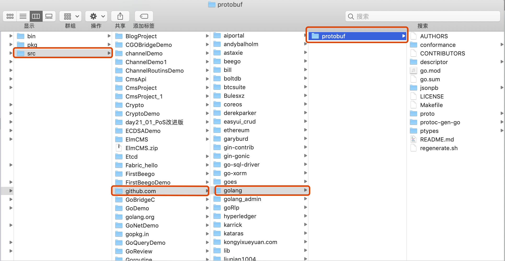
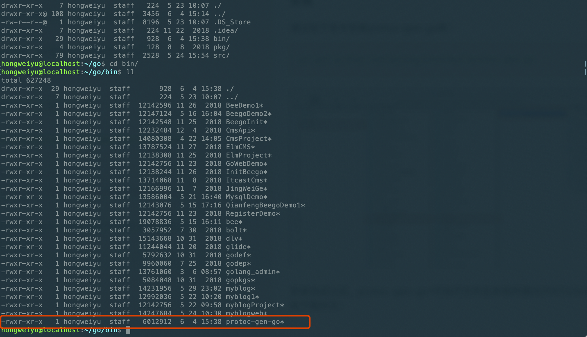
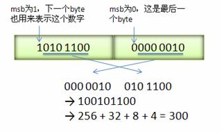
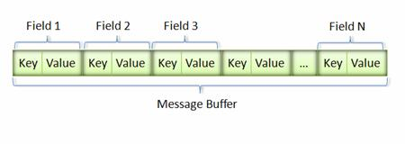
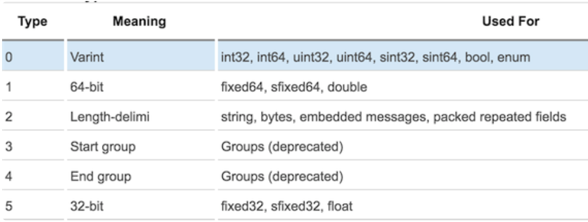

# Protocol buffer
**@author：Davie**
**版权所有：北京千锋互联科技有限公司**

## 一、Protobuf简介

### 1.1、RPC 通信
对于单独部署，独立运行的微服务实例而言，在业务需要时，需要与其他服务进行通信，这种通信方式是进程之间的通讯方式（inter-process communication，简称IPC）。

前文已经描述过，IPC有两种实现方式，分别为：**同步过程调用、异步消息调用**。在同步过程调用的具体实现中，有一种实现方式为RPC通信方式，远程过程调用（英语：Remote Procedure Call，缩写为 RPC）。

远程过程调用（英语：Remote Procedure Call，缩写为RPC）是一个计算机通信协议。该协议允许运行于一台计算机的程序调用另一台计算机的子程序，而程序员无需额外地为这个交互作用编程。如果涉及的软件采用面向对象编程，那么远程过程调用亦可称作远程调用或远程方法调用，例：Java RMI。**简单地说就是能使应用像调用本地方法一样的调用远程的过程或服务。**很显然，这是一种client-server的交互形式，调用者(caller)是client,执行者(executor)是server。典型的实现方式就是request–response通讯机制。

### 1.2、RPC 实现步骤
一个正常的RPC过程可以分为一下几个步骤：

* 1、client调用client stub，这是一次本地过程调用。

* 2、client stub将参数打包成一个消息，然后发送这个消息。打包过程也叫做marshalling。

* 3、client所在的系统将消息发送给server。

* 4、server的的系统将收到的包传给server stub。

* 5、server stub解包得到参数。 解包也被称作 unmarshalling。

* 6、server stub调用服务过程。返回结果按照相反的步骤传给client。

在上述的步骤实现远程接口调用时，所需要执行的函数是存在于远程机器中，即函数是在另外一个进程中执行的。因此，就带来了几个新问题：
* **1、Call ID映射。**远端进程中间可以包含定义的多个函数，本地客户端该如何告知远端进程程序调用特定的某个函数呢？因此，在RPC调用过程中，所有的函数都需要有一个自己的ID。开发者在客户端（调用端）和服务端（被调用端）分别维护一个{函数<-->Call ID}的对应表。两者的表不一定完全相同，但是相同的函数对应的Call ID必须相同。当客户端需要进行远程调用时，调用者通过映射表查询想要调用的函数的名称，找到对应的Call ID，然后传递给服务端，服务端也通过查表，来确定客户端所需要调用的函数，然后执行相应函数的代码。

* **2、序列化与反序列化。**客户端如何把参数传递给远程调用的函数呢？在本地调用中，我们只需要把参数压到栈里，然后让函数自己去栈里读就行。但是在远程过程调用时，客户端跟服务端是不同的进程，不能通过内存来传递参数。甚至有时候客户端和服务端使用的都不是同一种语言（比如服务端用C++，客户端用Java或者Python）。这时候就需要客户端把参数先转成一个字节流，传给服务端后，再把字节流转成自己能读取的格式。这个过程叫序列化和反序列化。同理，从服务端返回的值也需要序列化反序列化的过程。

* **3、网络传输。**远程调用往往用在网络上，客户端和服务端是通过网络连接的。所有的数据都需要通过网络传输，因此就需要有一个网络传输层。网络传输层需要把Call ID和序列化后的参数字节流传递给服务端，然后在把序列化后的调用结果传回给客户端，完成这种数据传递功能的被成为传输层。大部分的网络传输成都使用TCP协议，属于长连接。

在上述步骤实现中，可以看到其中有对传递的数据进行序列化和反序列化的操作，这就是我们本节内容开始要学习的内容：**Protobuf**。

### 1.3、Protobuf简介
Google Protocol Buffer( 简称 Protobuf)是Google公司内部的混合语言数据标准，他们主要用于RPC系统和持续数据存储系统。

### 1.4、Protobuf应用场景
Protocol Buffers 是一种轻便高效的结构化数据存储格式，可以用于结构化数据串行化，或者说序列化。它很适合做数据存储或RPC数据交换格式。可用于通讯协议、数据存储等领域的语言无关、平台无关、可扩展的序列化结构数据格式。

简单来说，Protobuf的功能类似于XML，即负责把某种数据结构的信息，以某种格式保存起来。主要用于数据存储、传输协议等使用场景。

为什么已经有了XLM，JSON等已经很普遍的数据传输方式，还要设计出Protobuf这样一种新的数据协议呢？

### 1.5、Protobuf 优点

* **性能好/效率高**
    * 时间维度：采用XML格式对数据进行序列化时，时间消耗上性能尚可；对于使用XML格式对数据进行反序列化时的时间花费上，耗时长，性能差。
    * 空间维度：XML格式为了保持较好的可读性，引入了一些冗余的文本信息。所以在使用XML格式进行存储数据时，也会消耗空间。
    
    整体而言，Protobuf以高效的二进制方式存储，比XML小3到10倍，快20到100倍。

* **代码生成机制**
    
    * **代码生成机制的含义**

        在Go语言中，可以通过定义结构体封装描述一个对象，并构造一个新的结构体对象。比如定义Person结构体，并存放于Person.go文件：
        ```go
        type Person struct{
            Name string
            Age int
            Sex int
        }
        ```
        在分布式系统中，因为程序代码时分开部署，比如分别为A、B。A系统在调用B系统时，无法直接采用代码的方式进行调用，因为A系统中不存在B系统中的代码。因此，A系统只负责将调用和通信的数据以二进制数据包的形式传递给B系统，由B系统根据获取到的数据包，自己构建出对应的数据对象，生成数据对象定义代码文件。这种利用编译器，根据数据文件自动生成结构体定义和相关方法的文件的机制被称作代码生成机制。
    
    * **代码生成机制的优点**
        首先，代码生成机制能够极大解放开发者编写数据协议解析过程的时间，提高工作效率；其次，易于开发者维护和迭代，当需求发生变更时，开发者只需要修改对应的数据传输文件内容即可完成所有的修改。

* **支持“向后兼容”和“向前兼容”**
    
    * **向后兼容：**在软件开发迭代和升级过程中，"后"可以理解为新版本，越新的版本越靠后；而“前”意味着早起的版本或者先前的版本。向“后”兼容即是说当系统升级迭代以后，仍然可以处理老版本的数据业务逻辑。
    
    * **向前兼容：**向前兼容即是系统代码未升级，但是接受到了新的数据，此时老版本生成的系统代码可以处理接收到的新类型的数据。

    支持前后兼容是非常重要的一个特点，在庞大的系统开发中，往往不可能统一完成所有模块的升级，为了保证系统功能正常不受影响，应最大限度保证通讯协议的向前兼容和向后兼容。

* **支持多种编程语言**
Protobuf不仅仅Google开源的一个数据协议，还有很多种语言的开源项目实现。在Google官方发布的Protobuf的源代码中包含了C++、Java、Python三种语言。本系列课程中，我们学习如何实现Golang语言中的功能实现。

### 1.6、Protobuf 缺点
* **可读性较差**
    为了提高性能，Protobuf采用了二进制格式进行编码。二进制格式编码对于开发者来说，是没办法阅读的。在进行程序调试时，比较困难。

* **缺乏自描述**
    诸如XML语言是一种自描述的标记语言，即字段标记的同时就表达了内容对应的含义。而Protobuf协议不是自描述的，Protobuf是通过二进制格式进行数据传输，开发者面对二进制格式的Protobuf，没有办法知道所对应的真实的数据结构，因此在使用Protobuf协议传输时，必须配备对应的proto配置文件。
    
## 二、Protobuf在Go语言中的编程实现
Go语言中有对应的实现Protobuf协议的库，Github地址：[https://github.com/golang/protobuf](https://github.com/golang/protobuf)

### 2.1、环境准备
使用Go语言的Protobuf库之前，需要相应的环境准备：
* **1、安装protobuf编译器。**
可以在如下地址：[https://github.com/protocolbuffers/protobuf/releases](https://github.com/protocolbuffers/protobuf/releases)选择适合自己系统的Proto编译器程序进行下载并解压，如图：


* **2、配置环境变量**
protoc编译器正常运行需要进行环境变量配置，将protocke执行文件所在目录添加到当前系统的环境变量中。windows系统下可以直接在Path目录中进行添加；macOS系统下可以将protoc可执行文件拷贝至**/usr/local/include**目录下。具体的对应的系统的环境变量配置可以阅读解压后与bin目录同级的readme.txt的文件内容。

### 2.2、安装
通过如下命令安装protoc-gen-go库：
```
go get github.com/golang/protobuf/protoc-gen-go
```


安装完成以后，protoc-gen-go*可执行文件在本地环境GOPATH/bin目录下，如下图所示：


### 2.3、Protobuf 协议语法

* **Protobuf 协议的格式**
Protobuf协议规定：使用该协议进行数据序列化和反序列化操作时，首先定义传输数据的格式，并命名为以**".proto"**为扩展名的消息定义文件。

* **message 定义一个消息**
先来看一个非常简单的例子。假设想定义一个“订单”的消息格式，每一个“订单"都含有一个订单号ID、订单金额Num、订单时间TimeStamp字段。可以采用如下的方式来定义消息类型的.proto文件：

    ```
    message Order{
        required string order_id = 1;
        required int64 num = 2;
        optional int32 timestamp = 3;
    }
    ```
Order消息格式有3个字段，在消息中承载的数据分别对应每一个字段。其中每个字段都有一个名字和一种类型。
    * **指定字段类型：**在proto协议中，字段的类型包括字符串（string)、整形（int32、int64...）、枚举（enum）等数据类型
    * **分配标识符：**在消息字段中，每个字段都有唯一的一个标识符。最小的标识号可以从1开始，最大到536870911。不可以使用其中的[19000－19999]的标识号， Protobuf协议实现中对这些进行了预留。如果非要在.proto文件中使用这些预留标识号，编译时就会报警。
    * **指定字段规则：**字段的修饰符包含三种类型，分别是：
        * **required：**一个格式良好的消息一定要含有1个这种字段。表示该值是必须要设置的；
        * **optional：**消息格式中该字段可以有0个或1个值（不超过1个）。
        * **repeated：**在一个格式良好的消息中，这种字段可以重复任意多次（包括0次）。重复的值的顺序会被保留。表示该值可以重复，相当于Go中的slice。
    
    **【注意：】使用required弊多于利；在实际开发中更应该使用optional和repeated而不是required。**
    * 添加更多消息类型
    在同一个.proto文件中，可以定义多个消息类型。多个消息类型分开定义即可。
    
### 2.4、使用Protobuf的步骤
* 1、创建扩展名为**.proto**的文件，并编写代码。比如创建person.proto文件，内容如下：
    ```
    syntax = "proto2";
    package example;

    message Person {
        required string Name = 1;
        required int32 Age = 2;
        required string From = 3;
    }
    ```
    
* 2、编译.proto文件，生成Go语言文件。执行如下命令：
    
    ```
    protoc --go_out = . test.proto
    ```
执行 protoc --go_out=. test.proto 生成对应的 person.pb.go 文件。并构建对应的example目录，存放生成的person.pb.go文件。


* 3、在程序中使用Protobuf
在程序中有如下代码：

    ```go
    package main
    import (
    	"fmt"
    	"ProtocDemo/example"
    	"github.com/golang/protobuf/proto"
    	"os"
    )
func main() {
	fmt.Println("Hello World. \n")

	msg_test := &example.Person{
		Name: proto.String("Davie"),
		Age:  proto.Int(18),
		From: proto.String("China"),
	}

	//序列化
	msgDataEncoding, err := proto.Marshal(msg_test)
	if err != nil {
		panic(err.Error())
		return
	}

	msgEntity := example.Person{}
	err = proto.Unmarshal(msgDataEncoding, &msgEntity)
	if err != nil {
		fmt.Println(err.Error())
		os.Exit(1)
		return
	}

	fmt.Printf("姓名：%s\n\n", msgEntity.GetName())
	fmt.Printf("年龄：%d\n\n", msgEntity.GetAge())
	fmt.Printf("国籍：%s\n\n", msgEntity.GetFrom())
}
    ```
    
* **3、执行程序**


## 三、Protobuf 协议语法与原理实现

### 3.1、Protobuf 协议语法
* **message：**
Protobuf中定义一个数据结构需要用到关键字message，这一点和Java的class，Go语言中的struct类似。

* **标识号：**
在消息的定义中，每个字段等号后面都有唯一的标识号，用于在反序列化过程中识别各个字段的，一旦开始使用就不能改变。标识号从整数1开始，依次递增，每次增加1，标识号的范围为1~2^29 - 1，其中[19000-19999]为Protobuf协议预留字段，开发者不建议使用该范围的标识号；一旦使用，在编译时Protoc编译器会报出警告。

* **字段规则：**
字段规则有三种：
    * 1、required：该规则规定，消息体中该字段的值是必须要设置的。
    * 2、optional：消息体中该规则的字段的值可以存在，也可以为空，optional的字段可以根据defalut设置默认值。
    * repeated：消息体中该规则字段可以存在多个（包括0个），该规则对应java的数组或者go语言的slice。
    
* **数据类型：**
常见的数据类型与protoc协议中的数据类型映射如下：

    | \.proto类型 | Java类型    | C\+\+类型 | Go语言类型  | 备注                                       |
|-----------|-----------|---------|---------|------------------------------------------|
| double    | double    | double  | float64 |                                          |
| float     | float     | float   | float32 |                                          |
| int32     | int       | int     | int32   | 可变长编码方式。编码负数时不够高效，如果字段可能包含负数，可以使用sint32  |
| int64     | long      | int64   | int64   | 可变长编码方式。编码负数时不够高效，如果字段可能包含负数，使用sint64。   |
| uint32    | int\[1\]  | uint32  | uint32  |                                          |
| uint64    |           | uint64  | uint64  |                                          |
| sint32    | int       | int32   | int32   | 可变长编码方式，有符号的整形值。编码时比int32效率高。            |
| sint64    | long      | int64   | int64   | 可变长编码方式，有符号的整形值，编码时比int64效率高。            |
| fixed32   | int\[1\]  | uint32  | uint32  | 总是4个字节。如果所有数值均比（2^28\)大，该种编码方式比uint32高效。 |
| fixed64   | long\[1\] | uint64  | uint64  | 总是8个字节。如果所有数值均比（2^56\)大，此种编码方式比uint64高效。 |
| sfixed32  | int       | uint32  | int32   | 总是4个字节。                                  |
| sfixed64  | long      | uint64  | int64   | 总是8个字节。                                  |
| bool      | boolean   | bool    | bool    |                                          |
| string    | String    | String  | string  |                                          |

* **枚举类型：**
proto协议支持使用枚举类型，和正常的编程语言一样，枚举类型可以使用enum关键字定义在.proto文件中：
    ```go
    enum Age{
        male=1;
        female=2;
    }
    ```
    
* **字段默认值：**
.proto文件支持在进行message定义时设置字段的默认值，可以通过**default**进行设置，如下所示：
```
message Address {
        required sint32 id = 1 [default = 1];
        required string name = 2 [default = '北京'];
        optional string pinyin = 3 [default = 'beijing'];
        required string address = 4;
        required bool flag = 5 [default = true];
    }
```

* **导入：**
如果需要引用的message是写在别的.proto文件中，可以通过import "xxx.proto"来进行引入：


* **嵌套：**
message与message之间可以嵌套定义，比如如下形式：

    ```
    syntax = "proto2";
    package example;
    message Person {
        required string Name = 1;
        required int32 Age = 2;
        required string From = 3;
        optional Address Addr = 4;
        message Address {
            required sint32 id = 1;
            required string name = 2;
            optional string pinyin = 3;
            required string address = 4;
        }
    }
    ```
    
* **message更新规则：**
message定义以后如果需要进行修改，为了保证之前的序列化和反序列化能够兼容新的message，message的修改需要满足以下规则：
    * 不可以修改已存在域中的标识号。
    
    * 所有新增添的域必须是 optional 或者 repeated。
    
    * 非required域可以被删除。但是这些被删除域的标识号不可以再次被使用。
    
    * 非required域可以被转化，转化时可能发生扩展或者截断，此时标识号和名称都是不变的。
    
    * sint32和sint64是相互兼容的。
    
    * fixed32兼容sfixed32。 fixed64兼容sfixed64。
    
    * optional兼容repeated。发送端发送repeated域，用户使用optional域读取，将会读取repeated域的最后一个元素。

Protobuf 序列化后所生成的二进制消息非常紧凑，这得益于 Protobuf 采用的非常巧妙的 Encoding 方法。接下来看一看Protobuf协议是如何实现高效编码的。

### 3.2、Protobuf序列化原理
之前已经做过描述，Protobuf的message中有很多字段，每个字段的格式为：**修饰符 字段类型 字段名 = 域号; **

#### 3.2.1、Varint
Varint是一种紧凑的表示数字的方法。它用一个或多个字节来表示一个数字，值越小的数字使用越少的字节数。这能减少用来表示数字的字节数。

Varint中的每个byte的最高位bit有特殊的含义，如果该位为1，表示后续的byte也是该数字的一部分，如果该位为0，则结束。其他的7个bit都用来表示数字。因此小于128的数字都可以用一个byte表示。大于128的数字，比如300，会用两个字节来表示：1010 1100 0000 0010。下图演示了 Google Protocol Buffer 如何解析两个bytes。注意到最终计算前将两个byte的位置相互交换过一次，这是因为 Google Protocol Buffer 字节序采用little-endian的方式。


在序列化时，Protobuf按照TLV的格式序列化每一个字段，T即Tag，也叫Key；V是该字段对应的值value；L是Value的长度，如果一个字段是整形，这个L部分会省略。 

序列化后的Value是按原样保存到字符串或者文件中，Key按照一定的转换条件保存起来，序列化后的结果就是 KeyValueKeyValue…依次类推的样式，示意图如下所示：


采用这种Key-Pair结构无需使用分隔符来分割不同的Field。对于可选的Field，如果消息中不存在该field，那么在最终的Message Buffer中就没有该field，这些特性都有助于节约消息本身的大小。比如，我们有消息order1:

```
Order.id = 10;
Order.desc = "bill";
```

则最终的 Message Buffer 中有两个Key-Value对，一个对应消息中的id；另一个对应desc。Key用来标识具体的field，在解包的时候，Protocol Buffer根据Key就可以知道相应的Value应该对应于消息中的哪一个field。

Key 的定义如下：
```
(field_number << 3) | wire_type
```
可以看到 Key 由两部分组成。第一部分是 field_number，比如消息lm.helloworld中field id 的field_number为1。第二部分为wire_type。表示 Value的传输类型。而wire_type有以下几种类型：

