# 微服务管理（下）
**@author：Davie**
**版权所有：北京千锋互联科技有限公司**

## 一、微服务管理--服务注册与查询
 
### 1.1、定义一个服务
服务的定义通过一个.json的json文件来进行定义，该文件中使用json格式定义所要注册服务的相关内容，以下为服务的json格式示例：

```
{
  "service": {
    "id": "firstservice",
    "name": "firstservice",
    "tags": ["dev"],
    "port": 80,
  }
}
```

### 1.2、服务注册
#### 1.2.1、创建服务文件所存放的文件夹
```
sudo mkdir /etc/consul.d
```

说明：.d做后缀，表示一系列配置文件的存放目录

#### 1.2.2、编写如章节一中的服务内容，并保存为文件
```
vim firstservice.json
```
内容是章节一部分的json中的内容。

说明：每一个服务都是以json文件格式的形式被单独声明在一个文件中，然后集中放到一个目录下。供consul启动时读取。

#### 1.2.3、保存firstservice.json文件到指定目录
```
mv firstservice.json /etc/consul.d/
```
通过如上命令将自定义的firstservice.json服务文件移动至集中存放consul集群启动时要启动的服务目录中，即/etc/consul.d

### 1.3、服务查询

#### 1.3.1、启动consul
由于我们添加了服务，启动的服务是以配置文件的形式进行配置的，因此，在启动时有必要指定服务配置文件所对应的目录，如下所示：

```
consul agent -dev -config-dir /etc/consul.d/
```

如上的命令表示：根据-config-dir指定的服务注册的目录中的文件来启动服务。

#### 1.3.2、服务查询
服务的查询支持两种方式的查询，分别为：**DNS**和**HTTP**

* **a、第一种：DNS**

```
dig @127.0.0.1 -p 8600 dev.firstservice.service.consul
```

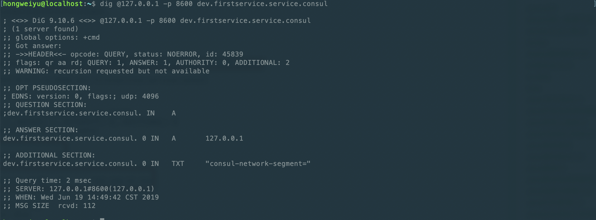

【说明：】
* 1、dev.firstservice.service.consul是固定的格式组合，具体格式为:**tag.servicename.service.consul**，即**tag**和**servicename**为服务创建时自定义配置内容。
* 2、DNS访问的端口是8600

* **b、第二种：HTTP**

```
curl http://localhost:8500/v1/catalog/service/firstservice
```

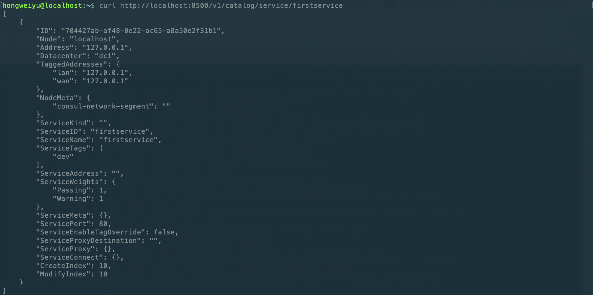

【说明:】
* 1、HTTP访问路径：host:port/版本号/service/服务名。
* 2、Address：用于指定一个特定的Service的IP地址，默认情况下，使用的是该service使用的agent。

### 1.4、注册多个服务
#### 1.4.1、每一个服务分别写一个json文件
例如，新建第二个服务sendservice，将新建secondservice.json文件，如下：

```
{
  "service": {
    "id": "secondservice",
    "name": "secondservice",
    "tags": ["dev"],
    "port": 80,
  }
}
```

* 使用http格式访问：

    ```
    curl http://localhost:8500/v1/catalog/service/secondservice
    ```

#### 1.4.2、将多个服务写到一个json文件中
除了将每一个服务单独定义为一个json配置文件外，consul还允许将多个服务组合定义在一个json文件中，具体的方式是对json文件的格式稍作修改，将原来的service修改为sevices，将原来service对应的对象类型，修改为数组类型。举例如下：

```
{
  "services": [
  {
    "id": "firstservice",
    "name": "firstservice",
    "tags": ["dev"],
    "port": 80
  },
  {
    "id": "secondservice",
    "name": "secondservice",
    "tags": ["dev"],
    "port": 80
  }
  ]
}
```

说明：
* 1、放在多个services中而不是原来的service
* 2、多个服务放在一个数组中，起名为services

在实际的开发过程中，微服务数量众多。如果每个文件都放在一个文件里，文件会非常多；而如果所有服务都放在一个文件里，文件太大，也不合适。因此，在实践中，往往二者结合使用。例如，假设有100个微服务，则，放在10json文件中，每个文件中放10个微服务。

## 二、微服务管理--Docker安装及运行consul节点

### 2.1、搭建集群
在真实的生产环境中，需要真实的部署consul集群。在一台机器上想要模拟多台集群部署的效果，有两种方案：一种是借助虚拟机，另一种是借助容器技术。

在本系列课程中，使用后者容器技术来实现集群的搭建。

### 2.2、Docker简介
Docker是一个开源的应用容器引擎，基于Go语言并遵从Apache2.0协议开源。

Docker可以让开发者打包他们的应用以及依赖包到一个轻量级、可移植的容器中，然后发布到任何流行的Linux机器上，也可以实现虚拟化。

容器是完全使用沙箱机制，相互之间不会有任何的接口，更重要的是容器性能开销很低。

### 2.3、Docker安装
#### 2.3.1、Windows系统下安装
window系统下的安装可以参考如下的链接文档：[https://www.runoob.com/docker/windows-docker-install.html](https://www.runoob.com/docker/windows-docker-install.html)

可以按照如上的链接在window系统下安装Docker。

#### 2.3.2、MacOS系统下安装
MacOS系统下的安装，有两种方式。同样可以参考如下链接：[https://www.runoob.com/docker/macos-docker-install.html](https://www.runoob.com/docker/macos-docker-install.html)

### 2.4、Docker测试
Docker安装完成以后，可以进行测试。可以通过终端命令的形式查看Docker是否安装成功：

```
docker version
```

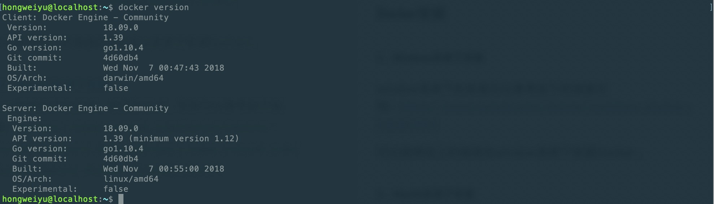

### 2.5、Docker中安装consul
Docker仅仅是一个容器，是搭建集群的一个环境。如果想要搭建多个集群，还必须安装consul环境。Docker中安装consul环境，可以使用指令实现。Docker安装consul指令如下：

* **docker search**

```
docker search consul
```
使用如上命令查看consul的镜像文件，在终端输出如下所示内容：
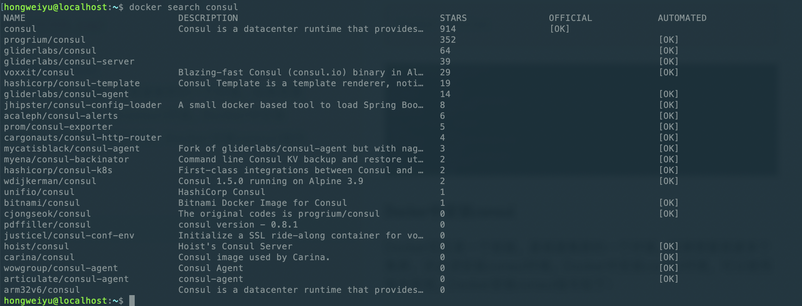

* **docker pull**

```
docker pull consul
```
通过search查询了consul镜像的相关内容后，可以使用如上的docker pull命令安装consul环境。
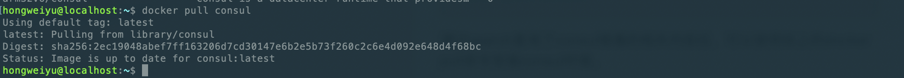

### 2.6、检验Docker安装Consul成功
在Docker中安装consul可以，可以通过如下命令查看docker中安装consul是否成功：

```
docker images
```

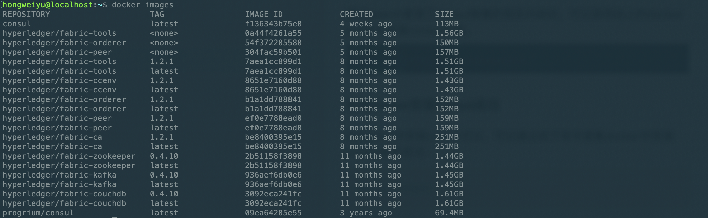

或者

```
docker run consul version
```

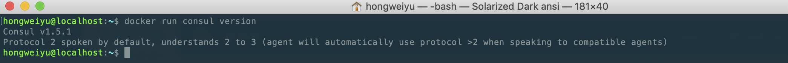

### 2.7、Docker中启动一个单独节点consul agent
Docker中安装好了consul以后，首先尝试启动一个server节点，可以通过如下命令来启动docker中的单个节点：

```
$ docker run -p 8500:8500/tcp consul agent -server -ui -bootstrap-expect=1 -client=0.0.0.0
```
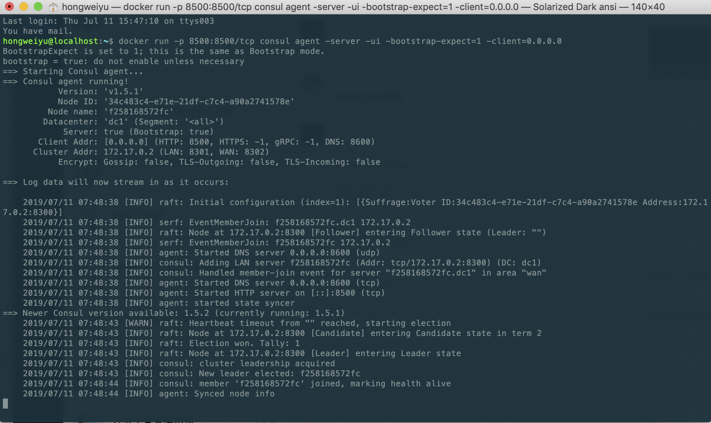

如上的命令中，参数说明如下：

* 暴露了端口，分别是：HTTP端口：8500

* -h：对应的node1为节点的名称

* -server：表示启动的节点类型为server类型

* -bootstrap-expect：用于server节点选举leader的参数,表示达到几个server节点时开始选举

在暴露的http端口中，还对应的映射到了主机的端口上，因此，我们可以通过在主机中访问server的信息。比如：

* curl访问HTTP接口：
    ```
    curl localhost:8500/v1/catalog/nodes
    ```
    
    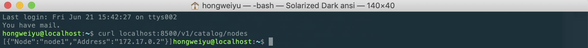
    
* dig来和DNS接口进行交互：

    ```
    dig @0.0.0.0 -p 8600 node1.node.consul
    ```
    
    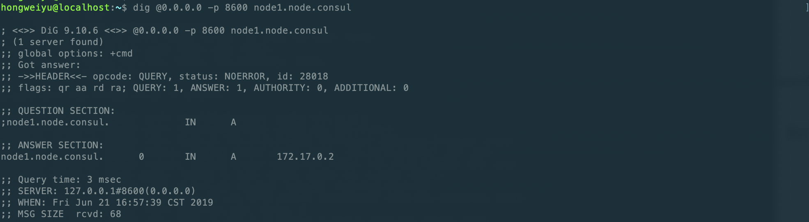
    
另外，我们还可以浏览器来进行访问，在主机的浏览器中键入：[http://127.0.0.1:8500](http://127.0.0.1:8500) 进行访问，可以查看到server节点的相关信息。

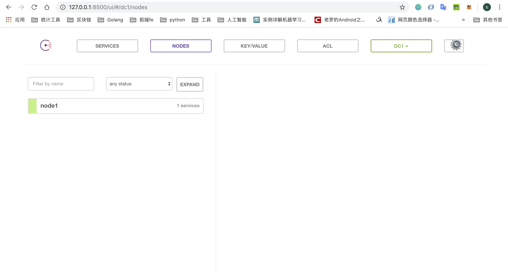

* 宿主机上查看节点数量
在宿主机上已经安装了Consul， 可以用命令行来和容器里的Consul Agent进行交互：

```
consul members
```

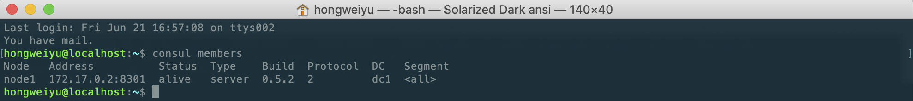

## 三、微服务管理--Docker搭建Consul集群
### 3.1、一台主机上搭建Consul集群并测试
借助Docker容器，已经启动了一个server节点，并能够与之通信。
接下来，希望借助Docker来搭建consul集群。以启动3个consul集群节点为例：

#### 3.1.1、启动第一个节点
启动第一个节点的时候没有使用了 -bootstrap 参数， 而是使用了 -bootstrap-expect 3, 使用这个参数节点会等到所有三个端都连接到一起了才会启动并且成为一个可用的cluster。

```go
$ docker run -d -p 8500:8500 -e CONSUL_BIND_INTERFACE='eth0' --name=consul_server_1 consul agent -server -bootstrap -ui -node=1 -client='0.0.0.0'
```
对如上的参数做如下说明：
* ui：表示启动 Web UI 管理器，默认开放端口 8500，可以在浏览器进行访问。
* --name

#### 3.1.2、查看节点IP
我们需要知道这个container的内部IP， 使用下面的命令我们吧这个IP放到了环境变量 JOIN_IP 里。
```go

$ JOIN_IP="$(docker inspect -f '{{ .NetworkSettings.IPAddress }}' node1)"
```
也可以直接查看container的IP，如下命令：
```go
$docker inspect -f '{{ .NetworkSettings.IPAddress }}' node1
```

#### 3.1.3、启动第二个节点
启动 node2并且告诉他通过 $JOIN_IP 加入到 node1：

```go
$ docker run -d -e CONSUL_BIND_INTERFACE='eth0' --name=consul_server_2 consul agent -server -node=2  -join='172.17.0.2'
```
这里需要对参数作一下说明：
* CONSUL_BIND_INTERFACE是consul镜像提供给我们的几个常用的环境变量，该常量与-bind作用相同。
* name：为启动的节点命名
* node：为起订的节点赋值一个id
* agent：表示启动 Agent 进程。
* server：表示启动Consul Server 模式。
* join：表示加入到某一个集群中去。

#### 3.1.4、启动第三个节点
按照同样的方法我们启动 node3：

```go
$ docker run -d -e CONSUL_BIND_INTERFACE='eth0' --name=consul_server_3 consul agent -server -node=3  -join='172.17.0.2'
```

现在我们就有了一个拥有3个节点的运行在一台机器上的集群。注意，根据Consul Agent的名字给container起了名字。

我们没有暴露出任何一个端口用以访问这个集群， 但是我们可以使用第四个agent节点以client的模式（不是用 -server参数）。这意味着他不参与选举但是可以和集群交互。而且这个client模式的agent也不需要磁盘做持久化。

```go
$ docker run -d -e CONSUL_BIND_INTERFACE='eth0' --name=consul_server_4 consul agent -client -node=4 -join='172.17.0.2' -client='0.0.0.0'

$ docker run -d -e CONSUL_BIND_INTERFACE='eth0' --name=consul_server_5 consul agent -client -node=5 -join='172.17.0.2' -client='0.0.0.0'

$ docker run -d -e CONSUL_BIND_INTERFACE='eth0' --name=consul_server_6 consul agent -client -node=5 -join='172.17.0.2' -client='0.0.0.0'

```
如果上述命令都能执行成功，就意味着我们的集群搭建成功了。

### 3.2、查看集群的状态
集群搭建完成以后，我们可以通过浏览器或者终端命令行的形式来查看，集群里面的节点的状态。
#### 3.2.1、浏览器：
我们可以在浏览器中访问localhost:8500端口,可以看到如下效果:

* 三个serve类型的节点集群节点：
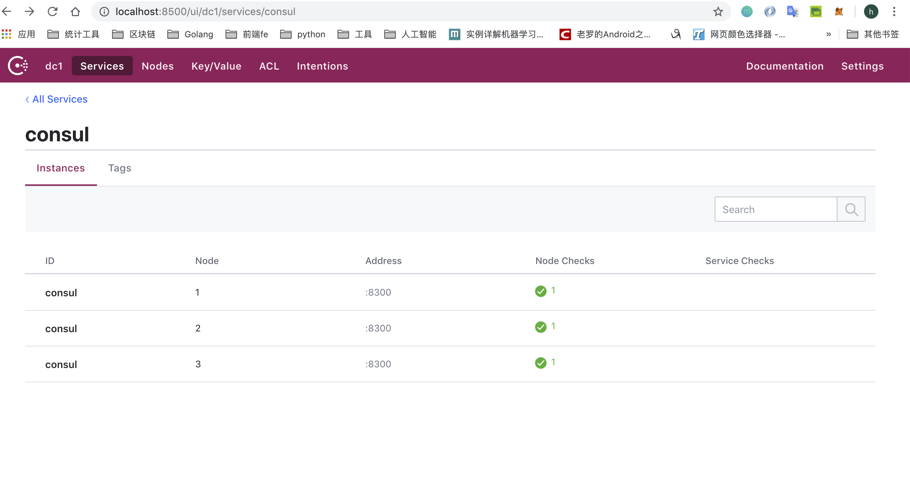

* 所有的Node节点（server和client）：
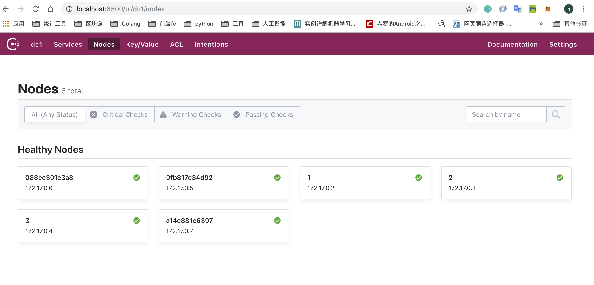

#### 3.2.2、命令行查看节点状态：
在终端下执行如下命令：
```go
$consul members
```
或者是：
```go
$docker exec consul_server_1 consul members
```

均可以看到如下输出效果：
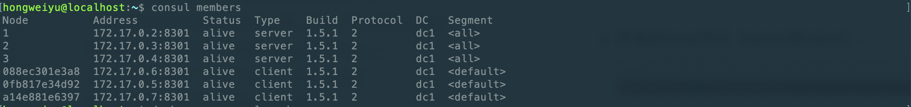

### 3.3、停止节点
* 活动容器状态查看
使用docker ps命令可以输出当前运行活动中的容器：
```go
$docker ps
```
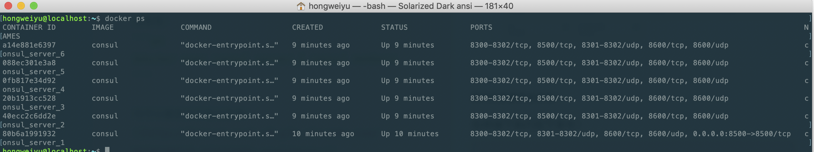

* 停止容器活动
可以使用如下命令将目前正处于活动中的容器停止：
```go
$docker stop containerID 
```
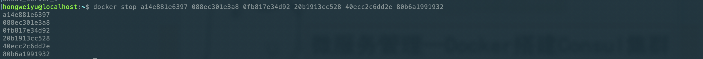
如果要停止多个，可以用空格隔开。

* 移除容器
如果想要彻底移除启动的节点容器，可以通过rm命令来实现：
```go
$docker rm containerID
```


## 四、微服务管理--微服务定义
### 4.1、consul常用命令及选项

#### 4.1.1、常用命令：command
consul命令的使用形式为：

```go
consul command [option]
```
* agent：consul的节点分为client和server两类，这两类节点统称为agent节点。
* join：该命令的作用是将agent加入到consul的集群当中。当新启动一个agent节点后，往往需要指定节点需要加入到特定的consul集群中，此时使用join命令进行指定。
* members：列出consul集群中的所有的成员节点信息，包括ip，端口，状态，类型等信息。

#### 4.1.2、常用选项：option
除command命令外，还有option选项供开发者使用，常见的和常使用的option有：
* -data-dir：该选项用于指定agent储存状态的数据目录，这是所有agent都必须的，对于server尤其重要，因为他们必须持久化集群的状态。
* -config-dir：该选项用于指定service的配置文件和检查定义所在的位置。通常会指定为"某一个路径/consul.d"（通常情况下，.d表示一系列配置文件存放的目录）
* -config-file：指定一个要装载的配置文件。该选项可以配置多次，进而配置多个配置文件。
* -dev：该选项用于创建一个开发环境下的server节点，该参数配置下，不会有任何持久化操作，即不会有任何数据写入到磁盘。dev模式仅仅是在开发和测试环境中使用，不能用于生产环境。
* -bootstrap-expect：该选项用于通知consul server类型节点，指定集群的server节点个数，该参数是为了延迟选举启动，直到全部的节点启动完毕以后再进行启动。
* -node：该node选项用于指定节点在集群中的名称，该名称在集群中需要是唯一的，推荐直接使用机器的IP。
* -bind：该选项用于指定节点所在的IP地址。
* -server：该选项用于指明consul节点类型为server类型。每个数据中心（DC）的server数量推荐3到5个。所有的server节点加入到集群后要经过选举，采用raft一致性算法来确保数据操作的一致性。
* -client：该参数用于指定consul界定为client节点类型。
* -join：英文为加入的意思，join选项用于指定要将节点添加到具体哪个集群中。
* -dc：dc是datacenter的简称，该选项用于指定节点加入的dc实例。

### 4.2、微服务定义标准及选项
除了命令行选项，微服务的定义和配置也可以放入文件中。在某些情况下，这可能更容易，比如当使用配置管理系统配置时。配置文件是JSON格式的，使得它们易于被人和计算机读取和编辑。配置被格式化为单个JSON对象，其中包含配置。

配置文件不仅用于设置代理，还用于提供检查和服务定义。这些配置文件同样可以被其他软件和功能所识别。它们分别记录在检查配置和服务配置下。服务和检查定义支持在重新加载期间更新。

例如，如下的JSON格式配置文件：

```go
{
  "datacenter": "east-aws",
  "data_dir": "/opt/consul",
  "log_level": "INFO",
  "node_name": "foobar",
  "server": true,
  "watches": [
    {
        "type": "checks",
        "handler": "/usr/bin/health-check-handler.sh"
    }
  ],
  "telemetry": {
     "statsite_address": "127.0.0.1:2180"
  }
}
```

上述的json文件格式是一个案例，consul的json文件配置可选项有很多，比如：
* addresses：该配置选项用于设置绑定地址。在Consul 1.0和更高版本中，可以将这些设置为要绑定到的地址列表。支持绑定设置多种类型的地址，包括：dns、http、https、grpc等共四种类型。
* bootstrap：该配置相当于在命令行中添加了-bootstrap命令行标志。
* bootstrap_expect：该配置相当于在命令行中添加了-bootstrap_expect命令行标志。
* bind_addr：该配置相当于在命令行中添加-bind指令操作。
* ca_file：该配置用于指定ca证书文件的目录。
* ca_path：该配置用于指定ca证书的整体目录。
* client_addr：该配置与命令行中-client指令功能相同。
* config_entries：在该配置项下，通过配置二级配置项来进行，二级配置项可以配置bootstrap选项。
* connect：关于连接的一些配置项通过该配置进行设置，同样是通过二级配置项来完成，可支持的二级配置项有：enabled、ca_provider、ca_config。
* datacenter：该配置项与命令行中-datacenter指令作用相同。
* data_dir：该配置项与命令行中-data-dir指令作用相同，用于指定微服务json定义文件所在的目录。
* dns_config：该选项用于配置dns相关参数。
* domain：该配置项与命令行中的-domain指令作用相同。
* node_id：该配置项与命令行中的-node-id指令作用相同，用于自定义设定node-id。
* node_name：该配置项与命令行中的-node指令作用相同，用于为node指定名称。
* ports：该配置项用于配置节点的端口号，通过二级配置选项可以配置：dns、http、https、grpc、serf_lan、serf_wan、server等不同类型的端口。
* protocol：该配置选项与命令行中的-protocol指令功能相同。


如上，只是列出了部分json配置文件的配置项，全部的配置选项在consul的官方网站有相关的说明，可以访问如下链接进行查看：[https://www.consul.io/docs/agent/options.html](https://www.consul.io/docs/agent/options.html)

