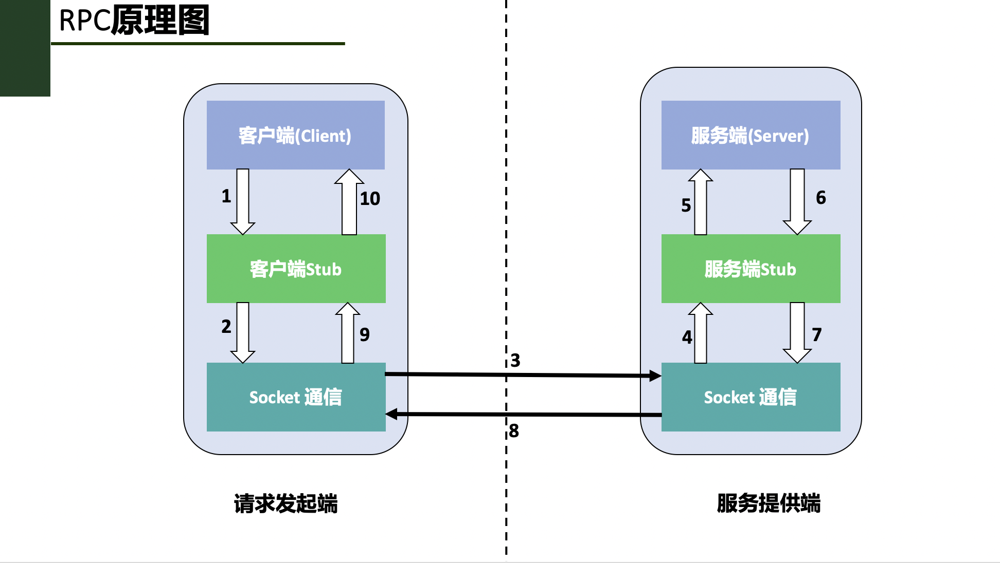
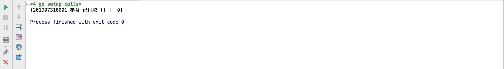

# RPC远程过程调用
**@author：Davie**
**版权所有：北京千锋互联科技有限公司**

## 一、RPC简介及原理介绍

### 1.1、背景
在前面的课程《Go语言微服务理论与实践课程》课程中，我们已经学习了微服务的理论知识，了解了微服务实践中需要解决哪些问题。
从本篇技术文档开始，我们进入新的微服务内容的学习。在本系列课程中，我们会着重讲框架的内容，主要包括两个：gRPC框架、go-micro框架。

首先来学习gRPC框架相关的内容。

### 1.2、本地过程调用
让我们先来看看正常情况下程序的执行和调用情况。例如有如下go语言代码：
```go
func main() {
	var a, b int
	a = 1
	b = 2
	c := Add(a, b)
	fmt.Println("计算结果:", c)
}
func Add(a int, b int) int {
	return a + b
}
```
在上述的Go语言代码中，我们定义了一个Add方法用于实现两个数相加的功能，在main方法中通过调用Add方法实现了计算两个变量之和的操作。整个过程涉及到变量值入栈，出栈，赋值等操作，最后将出栈的计算结果返回并赋值给c变量。

总结说来，本地程序调用的过程大致可以分为几个步骤和阶段：
* 开发者开发好的程序，并进行编译，编译成机器认可的可执行文件。
* 运行可执行文件，调用对应的功能方法，期间会读取可执行文件中国的机器指令，进行入栈，出栈赋值等操作。此时，计算机由可执行程序所在的进程控制。
* 调用结束，所有的内存数据出栈，程序执行结束。计算机继续由操作系统进行控制。

### 1.3、问题及解决方法
上文我们已经说过，远程过程调用是在两台或者多台不同的物理机器上实现的调用，其间要跨越网络进行调用。因此，我们再想通过前文本地方法调用的形式完成功能调用，就无法实现了，因为编译器无法通过编译的可执行文件来调用远程机器上的程序方法。因此需要采用RPC的方式来实现远端服务器上的程序方法的调用。

RPC技术内部原理是通过两种技术的组合来实现的：**本地方法调用 和 网络通信技术。**

### 1.4、RPC简介
在上述本地过程调用的例子中，我们是在一台计算机上执行了计算机上的程序，完成调用。随着计算机技术的发展和需求场景的变化，有时就需要从一台计算机上执行另外一台计算机上的程序的需求，因此后来又发展出来了RPC技术。特别是目前随着互联网技术的快速迭代和发展，用户和需求几乎都是以指数式的方式在高速增长，这个时候绝大多数情况下程序都是部署在多台机器上，就需要在调用其他物理机器上的程序的情况。

RPC是Remote Procedure Call Protocol单词首字母的缩写，简称为：RPC，翻译成中文叫远程过程调用协议。所谓远程过程调用，通俗的理解就是可以在本地程序中调用运行在另外一台服务器上的程序的功能方法。这种调用的过程跨越了物理服务器的限制，是在网络中完成的，在调用远端服务器上程序的过程中，本地程序等待返回调用结果，直到远端程序执行完毕，将结果进行返回到本地，最终完成一次完整的调用。

需要强调的是：**远程过程调用指的是调用远端服务器上的程序的方法整个过程。**

### 1.5、RPC设计组成
RPC技术在架构设计上有四部分组成，分别是：**客户端、客户端存根、服务端、服务端存根。**

这里提到了**客户端**和**服务端**的概念，其属于程序设计架构的一种方式，在现代的计算机软件程序架构设计上，大方向上分为两种方向，分别是：**B/S架构**、**C/S架构**。B/S架构指的是浏览器到服务器交互的架构方式，另外一种是在计算机上安装一个单独的应用，称之为客户端，与服务器交互的模式。

由于在服务的调用过程中，有一方是发起调用方，另一方是提供服务方。因此，我们把服务发起方称之为客户端，把服务提供方称之为服务端。以下是对RPC的四种角色的解释和说明：

* **客户端(Client)：**服务调用发起方，也称为服务消费者。

* **客户端存根(Client Stub)：**该程序运行在客户端所在的计算机机器上，主要用来存储要调用的服务器的地址，另外，该程序还负责将客户端请求远端服务器程序的数据信息打包成数据包，通过网络发送给服务端Stub程序；其次，还要接收服务端Stub程序发送的调用结果数据包，并解析返回给客户端。

* **服务端(Server)：**远端的计算机机器上运行的程序，其中有客户端要调用的方法。

* **服务端存根(Server Stub)：**接收客户Stub程序通过网络发送的请求消息数据包，并调用服务端中真正的程序功能方法，完成功能调用；其次，将服务端执行调用的结果进行数据处理打包发送给客户端Stub程序。

### 1.6、RPC原理及调用步骤
了解完了RPC技术的组成结构我们来看一下具体是如何实现客户端到服务端的调用的。实际上，如果我们想要在网络中的任意两台计算机上实现远程调用过程，要解决很多问题，比如：

* 两台物理机器在网络中要建立稳定可靠的通信连接。
* 两台服务器的通信协议的定义问题，即两台服务器上的程序如何识别对方的请求和返回结果。也就是说两台计算机必须都能够识别对方发来的信息，并且能够识别出其中的请求含义和返回含义，然后才能进行处理。这其实就是通信协议所要完成的工作。

让我们来看看RPC具体是如何解决这些问题的，RPC具体的调用步骤图如下：



在上述图中，通过1-10的步骤图解的形式，说明了RPC每一步的调用过程。具体描述为：

* 1、客户端想要发起一个远程过程调用，首先通过调用本地客户端Stub程序的方式调用想要使用的功能方法名；

* 2、客户端Stub程序接收到了客户端的功能调用请求，**将客户端请求调用的方法名，携带的参数等信息做序列化操作，并打包成数据包。**

* 3、客户端Stub查找到远程服务器程序的IP地址，调用Socket通信协议，通过网络发送给服务端。

* 4、服务端Stub程序接收到客户端发送的数据包信息，并**通过约定好的协议将数据进行反序列化，得到请求的方法名和请求参数等信息。**

* 5、服务端Stub程序准备相关数据，**调用本地Server对应的功能方法进行，并传入相应的参数，进行业务处理。**

* 6、服务端程序根据已有业务逻辑执行调用过程，待业务执行结束，将执行结果返回给服务端Stub程序。

* 7、服务端Stub程序**将程序调用结果按照约定的协议进行序列化，**并通过网络发送回客户端Stub程序。

* 8、客户端Stub程序接收到服务端Stub发送的返回数据，**对数据进行反序列化操作，**并将调用返回的数据传递给客户端请求发起者。

* 9、客户端请求发起者得到调用结果，整个RPC调用过程结束。

### 1.7、RPC涉及到的相关技术
通过上文一系列的文字描述和讲解，我们已经了解了RPC的由来和RPC整个调用过程。我们可以看到RPC是一系列操作的集合，其中涉及到很多对数据的操作，以及网络通信。因此，我们对RPC中涉及到的技术做一个总结和分析：

* **1、动态代理技术：** 上文中我们提到的Client Stub和Sever Stub程序，在具体的编码和开发实践过程中，都是使用动态代理技术自动生成的一段程序。

* **2、序列化和反序列化：** 在RPC调用的过程中，我们可以看到数据需要在一台机器上传输到另外一台机器上。在互联网上，所有的数据都是以字节的形式进行传输的。而我们在编程的过程中，往往都是使用数据对象，因此想要在网络上将数据对象和相关变量进行传输，就需要对数据对象做序列化和反序列化的操作。
    
    * **序列化：**把对象转换为字节序列的过程称为对象的序列化，也就是编码的过程。
    
    * **反序列化：**把字节序列恢复为对象的过程称为对象的反序列化，也就是解码的过程。
    
我们常见的Json,XML等相关框架都可以对数据做序列化和反序列化编解码操作。同时，在之前的《Go语言微服务理论与实践》课程中，我们已经学习过Protobuf协议，这也是一种数据编解码的协议，在RPC框架中使用的更广泛。

## 二、Go语言实现RPC编程

上节课我们对RPC知识做了介绍，讲解了RPC的原理，通过图示方式讲解了RPC的内部执行过程。本节课，我们继续来学习RPC相关的内容。

### 2.1、RPC官方库
在Go语言官方网站的pkg说明中，提供了官方支持的rpc包，具体链接如下：[https://golang.org/pkg/net/rpc/](https://golang.org/pkg/net/rpc/)。官方提供的rpc包完整的包名是：**net/rpc**。根据官方的解释，rpc包主要是提供通过网络访问一个对象方法的功能。

本节课，我们就来学习如何使用go语言官方提供的RPC包实现RPC调用编码。

### 2.2、net/rpc库实现RPC调用编程
前文我们已经讲过rpc调用有两个参与者，分别是：**客户端（client）和服务器（server）**。

首先是提供方法暴露的一方--服务器。

#### 2.2.1、服务定义及暴露
在编程实现过程中，服务器端需要注册结构体对象，然后通过对象所属的方法暴露给调用者，从而提供服务，该方法称之为**输出方法**，此输出方法可以被远程调用。当然，在定义输出方法时，能够被远程调用的方法需要遵循一定的规则。我们通过代码进行讲解：

```go
func (t *T) MethodName(request T1,response *T2) error
```

上述代码是go语言官方给出的对外暴露的服务方法的定义标准，其中包含了主要的几条规则，分别是：
* 1、对外暴露的方法有且只能有两个参数，这个两个参数只能是输出类型或内建类型，两种类型中的一种。
* 2、方法的第二个参数必须是指针类型。
* 3、方法的返回类型为error。
* 4、方法的类型是可输出的。
* 5、方法本身也是可输出的。

我们举例说明：假设目前我们有一个需求，给出一个float类型变量，作为圆形的半径，要求通过RPC调用，返回对应的圆形面积。具体的编程实现思路如下：

```go
type MathUtil struct{
}
//该方法向外暴露：提供计算圆形面积的服务
func (mu *MathUtil) CalculateCircleArea(req float32, resp *float32) error {
	*resp = math.Pi * req * req //圆形的面积 s = π * r * r
	return nil //返回类型
}
```

在上述的案例中，我们可以看到：
* 1、Calculate方法是服务对象MathUtil向外提供的服务方法，该方法用于接收传入的圆形半径数据，计算圆形面积并返回。
* 2、第一个参数req代表的是调用者（client）传递提供的参数。
* 3、第二个参数resp代表要返回给调用者的计算结果，必须是指针类型。
* 4、正常情况下，方法的返回值为是error，为nil。如果遇到异常或特殊情况，则error将作为一个字符串返回给调用者，此时，resp参数就不会再返回给调用者。

至此为止，已经实现了服务端的功能定义，接下来就是让服务代码生效，需要将服务进行注册，并启动请求处理。

#### 2.2.2、注册服务及监听请求
**net/rpc包**为我们提供了注册服务和处理请求的一系列方法,结合本案例实现注册及处理逻辑，如下所示：

```go
//1、初始化指针数据类型
mathUtil := new(MathUtil) //初始化指针数据类型

//2、调用net/rpc包的功能将服务对象进行注册
err := rpc.Register(mathUtil)
if err != nil {
	panic(err.Error())
}

//3、通过该函数把mathUtil中提供的服务注册到HTTP协议上，方便调用者可以利用http的方式进行数据传递
rpc.HandleHTTP()

//4、在特定的端口进行监听
listen, err := net.Listen("tcp", ":8081")
if err != nil {
	panic(err.Error())
}
go http.Serve(listen, nil)
```

经过服务注册和监听处理，RPC调用过程中的服务端实现就已经完成了。接下来需要实现的是客户端请求代码的实现。

#### 2.2.3、客户端调用
在服务端是通过Http的端口监听方式等待连接的，因此在客户端就需要通过http连接，首先与服务端实现连接。

* 客户端连接服务端
    
    ```go
    client, err := rpc.DialHTTP("tcp", "localhost:8081")
    	if err != nil {
    		panic(err.Error())
    	}
    ```

* 远端方法调用
客户端成功连接服务端以后，就可以通过方法调用调用服务端的方法，具体调用方法如下：

    ```go
    var req float32 //请求值
	req = 3
    
	var resp *float32 //返回值
	err = client.Call("MathUtil.CalculateCircleArea", req, &resp)
	if err != nil {
		panic(err.Error())
	}
	fmt.Println(*resp)
    ```
    
    上述的调用方法核心在于client.Call方法的调用，该方法有三个参数，第一个参数表示要调用的远端服务的方法名，第二个参数是调用时要传入的参数，第三个参数是调用要接收的返回值。
    上述的Call方法调用实现的方式是同步的调用，除此之外，还有一种异步的方式可以实现调用。异步调用代码实现如下：
    
    ```go
    var respSync *float32
	//异步的调用方式
	syncCall := client.Go("MathUtil.CalculateCircleArea", req, &respSync, nil)
	replayDone := <-syncCall.Done
	fmt.Println(replayDone)
	fmt.Println(*respSync)
    ```
    
#### 2.2.4、多参数的请求调用参数传递
上述内容演示了单个参数下的RPC调用，对于多参数下的请求该如何实现。我们通过另外一个案例进行演示。

假设现在需要实现另外一个需求：通过RPC调用实现计算两个数字相加功能并返回计算结果。此时，就需要传递两个参数，具体实现如下：

将参数定义在一个新的结构体中，存放在param包中：
```go
type AddParma struct {
	Args1 float32 //第一个参数
	Args2 float32 //第二个参数
}
```
在server.go文件中，实现两数相加的功能，并实现服务注册的逻辑：

```go
func (mu *MathUtil) Add(param param.AddParma, resp *float32) error {
	*resp = param.Args1 + param.Args2 //实现两数相加的功能
	return nil
}
mathUtil := new(MathUtil)

	err := rpc.RegisterName("MathUtil", mathUtil)
	if err != nil {
		panic(err.Error())
	}

	rpc.HandleHTTP()

	listen, err := net.Listen("tcp", ":8082")
	http.Serve(listen, nil)
```

在本案例中，我们通过新的注册方法rpc.RegisterName实现了服务的注册和调用。

至此，我们已经完成了net/rpc包的最基础的使用。

## 三、RPC与Protobuf结合使用
上节课我们使用Golang提供的核心net/rpc库实现了RPC调用编程。本节课继续来看一下RPC和之前所学的Protobuf在编程中的结合实现。

需求：假设在一个系统中，有订单模块（Order），其他模块想要实现RPC的远程工程调用，根据订单ID和时间戳可以获取订单信息。如果获取成功就返回相应的订单信息；如果查询不到返回失败信息。现在，我们来进行需求的编程实现。

### 3.1、传输数据格式定义
在《Go语言微服务理论实践课程》中，学习过关于Protobuf的相关知识。可以利用Protobuf相关规则定义相应的数据格式,文件扩展名是.proto。

* **数据定义**
根据需求，定义message.proto文件，详细定义如下：

    ```
    syntax = "proto3";
    package message;
    
    //订单请求参数
    message OrderRequest {
        string orderId = 1;
        int64 timeStamp = 2;
    }
    
    //订单信息
    message OrderInfo {
        string OrderId = 1;
        string OrderName = 2;
        string OrderStatus = 3;
    }
    ```

    在上述文件中，定义了客户端发起RPC调用时的请求数据结构OrderRequest和服务端查询后返回的数据结构OrderInfo。数据定义采用proto3语法实现，整个数据定义被定义在message包下。
    
* **编译proto文件**
通过proto编译命令对.proto文件进行编译，自动生成对应结构体的Go语言文件。编译命令如下：

    ```go
    protoc ./message.proto --go_out=./
    ```
执行上述命令是在message包下。编译命令结束后，会在message包下生成message.pb.go文件，其中自动生成了OrderRequest和OrderInfo在Go语言中结构体的定义和相关的方法。

### 3.2、Protobuf格式数据与RPC结合

* **服务的定义**
进行RPC远程过程调用，实现调用远程服务器的方法，首先要有服务。在本案例中，定义提供订单查询功能的服务，取名为OrderService，同时提供订单信息查询方法供远程调用。详细的服务和方法定义如下：

    ```go
    //订单服务
    type OrderService struct {
    }
    func (os *OrderService) GetOrderInfo(request message.OrderRequest, response *message.OrderInfo) error {
    	//201907310003
    	orderMap := map[string]message.OrderInfo{
    		"201907300001": message.OrderInfo{OrderId: "201907300001", OrderName: "衣服", OrderStatus: "已付款"},
    		"201907310001": message.OrderInfo{OrderId: "201907310001", OrderName: "零食", OrderStatus: "已付款"},
    		"201907310002": message.OrderInfo{OrderId: "201907310002", OrderName: "食品", OrderStatus: "未付款"},
    	}

	   current := time.Now().Unix()
	   if (request.TimeStamp > current) {
		  *response = message.OrderInfo{OrderId: "0", OrderName: "", OrderStatus: "订单信息异常"}
	   } else {
		  result := orderMap[request.OrderId]//201907310003
		  if result.OrderId != "" {
			 *response = orderMap[request.OrderId]
		  } else {
			 return errors.New("server error")
		  }
	   }
	   return nil
    }
    ```
在服务的方法定义中，使用orderMap模拟初始订单数据库，方便案例查询展示。GetOrderInfo方法有两个参数，第一个是message.OrderRequest，作为调用者传递的参数，第二个是message.OrderInfo，作为调用返回的参数，通过此处的两个参数，将上文通过.proto定义并自动生成的Go语言结构体数据结合起来。

* **服务的注册和处理**
服务定义好以后，需要将服务注册到RPC框架，并开启http请求监听处理。这部分代码与之前的RPC服务端实现逻辑一致，具体实现如下：

    ```go
    func main() {
    
    	orderService := new(OrderService)
    
    	rpc.Register(orderService)
    
    	rpc.HandleHTTP()
    
    	listen, err := net.Listen("tcp", ":8081")
    	if err != nil {
    		panic(err.Error())
    	}
    	http.Serve(listen, nil)
    }
    ```

* **RPC客户端调用实现**
在客户端，除了客户端正常访问远程服务器的逻辑外，还需要准备客户端需要传递的请求数据message.OrderInfo。具体实现如下：

    ```go
    client, err := rpc.DialHTTP("tcp", "localhost:8081")
    	if err != nil {
    		panic(err.Error())
    	}
    
    	timeStamp := time.Now().Unix()
    	request := message.OrderRequest{OrderId: "201907310001", TimeStamp: timeStamp}
    
    	var response *message.OrderInfo
    	err = client.Call("OrderService.GetOrderInfo", request, &response)
    	if err != nil {
    		panic(err.Error())
    	}
    
    	fmt.Println(*response)
    ```
    
### 3.3、运行结果
分别依次运行server.go和client.go程序。运行结果如下：



