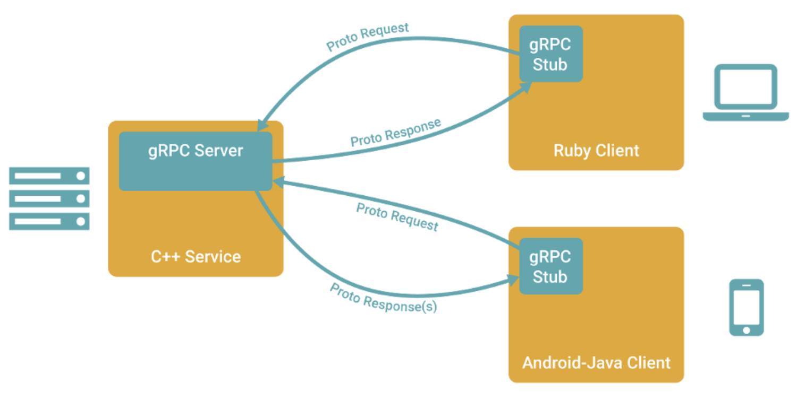
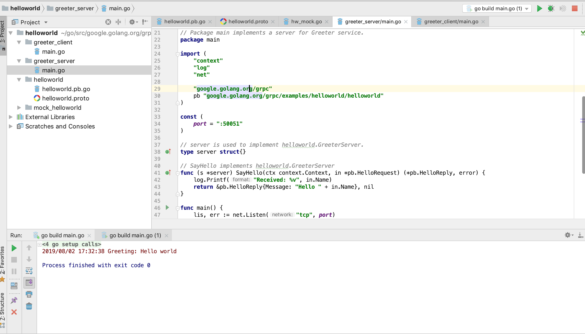

# gRPC远程过程调用机制
**@author：Davie**
**版权所有：北京千锋互联科技有限公司**

## 一、gRPC介绍和安装
### 1.1、什么是gRPC
#### 1.1.1、 gRPC介绍
gRPC是由Google公司开源的一款高性能的远程过程调用(RPC)框架，可以在任何环境下运行。该框架提供了负载均衡，跟踪，智能监控，身份验证等功能，可以实现系统间的高效连接。另外，在分布式系统中，gRPC框架也有有广泛应用，实现移动社会，浏览器等和服务器的连接。

#### 1.1.2、gRPC官方网站
gRPC官方网站：[https://grpc.io/](https://grpc.io/)。

#### 1.1.3、gRPC源码
gRPC的官方源码库存放于github网站，可以公开访问。gRPC源码库主页链接如下：[https://github.com/grpc/grpc](https://github.com/grpc/grpc)

gRPC开源库支持诸如：C++，C#，Dart，Go，Java，Node，Objective-C，PHP，Python，Ruby，WebJS等多种语言，开发者可以自行在gRPC的github主页库选择查看对应语言的实现。

#### 1.1.4、gRPC调用执行过程
因为gRPC支持多种语言的实现，因此gRPC支持客户端与服务器在多种语言环境中部署运行和互相调用。多语言环境交互示例如下图所示：



gRPC中默认采用的数据格式化方式是protocol buffers。关于protocol buffers相关的知识和联系，在前面的课程内容中已经有涉及，此处不再赘述。

### 1.2、grpc-go介绍
#### 1.2.1 grpc-go是什么
grpc-go库是gRPC库的Golang语言实现版本。可以通过github主页访问grpc-go库的源码并下载。grpc-go主页的Github地址如下：[https://github.com/grpc/grpc-go](https://github.com/grpc/grpc-go)

#### 1.2.2 grpc-go安装

##### 1.2.2.1 go get命令安装
在网络环境通畅的情况下，可以使用go get命令安装grpc-go库：

```go
go get -u google.golang.org/grpc
```

需要注意，很多开发者在使用上述的命令进行安装grpc-go库时，往往会遇到网络环境的问题导致下载失败，链接超时报错。经常遇到的错误是：
```go
package google.golang.org/grpc: unrecognized import path "google.golang.org/grpc" (https fetch: Get https://google.golang.org/grpc?go-get=1: dial tcp 216.239.37.1:443: i/o timeout)
```
如果遇到类似上文中的timeout的链接服务器超时的错误，说明是网络环境问题，此时可以通过第二种方案进行安装。

##### 1.2.2.2 下载方式安装
可以使用git工具中的git clone命令，将代码从github上下载到本地。clone命令：
```go
git clone https://github.com/grpc/grpc-go.git $GOPATH/src/google.golang.org/grpc
```

上述命令后半部分$GOPATH/src/google.golang.org/grpc是指定将grpc-go代码库下载到特定目录。

##### 1.2.2.3 依赖配置
如果采用2.2.2中的clone方式下载安装，因为grpc-go库中调用了其他外部库内容，因此，需要额外准备相关的代码库环境。需要准备的库主要是golang.org包下的一些库。golang.org包下的库也可以从github上下载，然后放到对应的golang.org目录下。

##### 1.2.3.4 grpc-go案例
刚刚搭建完grpc-go库环境后，还暂时不会写grpc的程序。可以通过官方提供的案例进行grpc的学习。在下载的grpc-go库的根目录中，存在有examples目录，存放了官方提供的演示案例。开发者可以通过开发工具进行学习和运行调试。

##### 1.2.3.5 案例演示
通过查看examples目录下的helloworld项目，并分别依次执行greeter_server中的main.go程序和greeter_client中的main.go程序。可以查看到运行结果。项目目录和运行效果如下所示：


## 二、gRPC框架使用
上节课已经学习了gRPC基本知识，对gRPC有了初步的认识。本节课通过编程实现gRPC编程。

### 2.1、定义服务
我们想要实现的是通过gRPC框架进行远程服务调用，首先第一步应该是要有服务。利用之前所掌握的内容，gRPC框架支持对服务的定义和生成。
gRPC框架默认使用protocol buffers作为接口定义语言，用于描述网络传输消息结构。除此之外，还可以使用protobuf定义服务接口。

```proto
syntax = "proto3";
package message;

//订单请求参数
message OrderRequest {
    string orderId = 1;
    int64 timeStamp = 2;
}

//订单信息
message OrderInfo {
    string OrderId = 1;
    string OrderName = 2;
    string OrderStatus = 3;
}

//订单服务service定义
service OrderService{
    rpc GetOrderInfo(OrderRequest) returns (OrderInfo);
}
```
我们通过proto文件定义了数据结构的同时，还定义了要实现的服务接口，GetOrderInfo即是具体服务接口的定义，在GetOrderInfo接口定义中，OrderRequest表示是请求传递的参数，OrderInfo表示处理结果返回数据参数。

### 2.2、编译.proto文件
#### 2.2.1、环境准备
定义的proto文件需要通过编译，生成go语言代码文件，供客户端程序和服务端程序使用。可以安装go语言环境中的关于proto的插件。
```go
go get -a github.com/golang/protobuf/protoc-gen-go
```
-a 参数标示下载好后直接做 go install

#### 2.2.2、编译.proto文件
##### 2.2.2.1、基本用法
可以通过基本编译命令完成对.proto文件的编译.基础编译命令如下：
```proto
protoc --go_out=. *.proto
```
##### 2.2.2.2、gRPC编译支持
如果定义的.proto文件，如本案例中所示，定义中包含了服务接口的定义，而我们想要使用gRPC框架实现RPC调用。开发者可以采用protocol-gen-go库提供的插件编译功能，生成兼容gRPC框架的golang语言代码。只需要在基本编译命令的基础上，指定插件的参数，告知protoc编译器即可。具体的编译生成兼容gRPC框架的服务代码的命令如下：
```protoc
protoc --go_out=plugins=grpc:. *.proto
```

### 2.3、gRPC实现RPC编程
#### 2.3.1、服务接口实现
在.proto定义好服务接口并生成对应的go语言文件后，需要对服务接口做具体的实现。定义服务接口具体由OrderServiceImpl进行实现，并实现GetOrderInfo详细内容，服务实现逻辑与前文所述内容相同。不同点是服务接口参数的变化。详细代码实现如下：
```go
type OrderServiceImpl struct {
}

//具体的方法实现
func (os *OrderServiceImpl) GetOrderInfo(ctx context.Context, request *message.OrderRequest) (*message.OrderInfo, error) {
	orderMap := map[string]message.OrderInfo{
		"201907300001": message.OrderInfo{OrderId: "201907300001", OrderName: "衣服", OrderStatus: "已付款"},
		"201907310001": message.OrderInfo{OrderId: "201907310001", OrderName: "零食", OrderStatus: "已付款"},
		"201907310002": message.OrderInfo{OrderId: "201907310002", OrderName: "食品", OrderStatus: "未付款"},
	}

	var response *message.OrderInfo
	current := time.Now().Unix()
	if (request.TimeStamp > current) {
		*response = message.OrderInfo{OrderId: "0", OrderName: "", OrderStatus: "订单信息异常"}
	} else {
		result := orderMap[request.OrderId]
		if result.OrderId != "" {
			fmt.Println(result)
			return &result, nil
		} else {
			return nil, errors.New("server error")
		}
	}
	return response, nil
}
```
#### 2.3.2、gRPC实现服务端
使用gRPC框架，首先实现服务端的程序。既然使用gRPC框架来实现，就需要调用gRPC进行服务方法的注册以及监听的处理。服务注册和监听处理实现如下：
```go
func main() {

	server := grpc.NewServer()

	message.RegisterOrderServiceServer(server, new(OrderServiceImpl))

	lis, err := net.Listen("tcp", ":8090")
	if err != nil {
		panic(err.Error())
	}
	server.Serve(lis)
}
```
#### 2.3.3、gRPC实现客户端
实现完服务端以后，实现客户端程序。和服务端程序关系对应，调用gRPC框架的方法获取相应的客户端程序，并实现服务的调用，具体编程实现如下：
```go
func main() {

	//1、Dail连接
	conn, err := grpc.Dial("localhost:8090", grpc.WithInsecure())
	if err != nil {
		panic(err.Error())
	}
	defer conn.Close()

	orderServiceClient := message.NewOrderServiceClient(conn)

	orderRequest := &message.OrderRequest{OrderId: "201907300001", TimeStamp: time.Now().Unix()}
	orderInfo, err := orderServiceClient.GetOrderInfo(context.Background(), orderRequest)
	if orderInfo != nil {
		fmt.Println(orderInfo.GetOrderId())
		fmt.Println(orderInfo.GetOrderName())
		fmt.Println(orderInfo.GetOrderStatus())
	}
}
```

### 2.4、运行程序
经过上述步骤后，程序及逻辑全部开发完成。程序运行，打印如下结果：
```go
201907300001
衣服
已付款
```