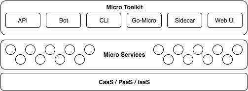
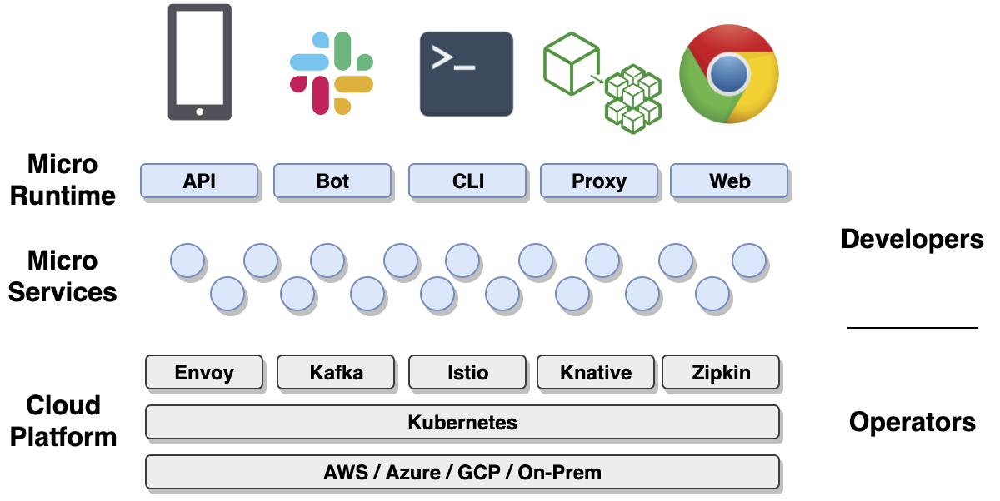
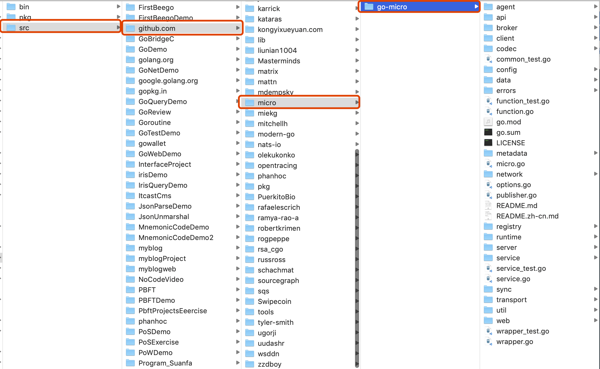
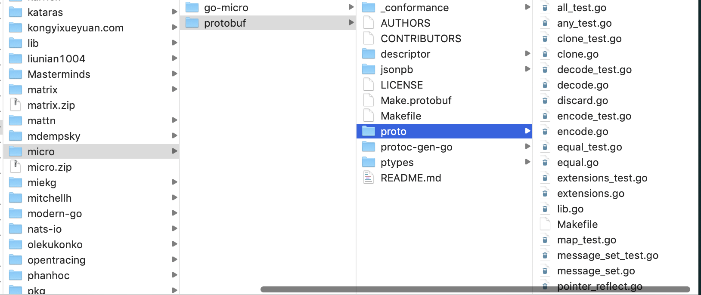
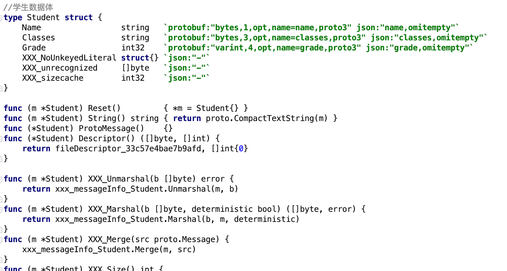
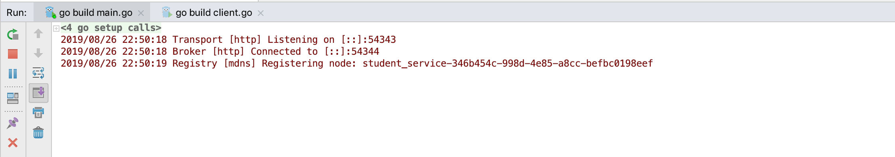
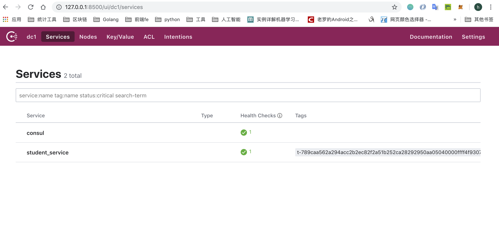

# go-micro介绍及环境搭建
**@author：Davie**
**版权所有：北京千锋互联科技有限公司**

## 一、micro框架介绍
### 1.1、背景
在本课程的前面的内容中，已经学习了微服务之间通信采用的通信协议，如何实现服务的注册和发现，搭建服务管理集群，以及服务与服务之间的RPC通信方式。具体的内容包括：protobuf协议，consul及docker部署consul集群，gRPC框架的使用等具体的实现方案。

以上这些具体的方案都是为了解决微服务实践过程中具体的某个问题而提出的，实现微服务架构的项目开发。但是，在具体的项目开发过程中，开发者聚焦的是业务逻辑的开发和功能的实现，大量的环境配置，调试搭建等基础性工作会耗费相当一部分的精力，因此有必要将微服务架构中所涉及到的，相关的解决方案做集中管理和维护。这就是我们要学习的Micro。

### 1.2、概述
Micro是一个简化分布式开发的微服务生态系统，该系统为开发分布式应用程序提供了高效，便捷的模块构建。主要目的是简化分布式系统的开发。

学习完该框架以后，可以方便开发者们非常简单的开发出微服务架构的项目，并且随着业务模块的增加和功能的增加，Micro还能够提供管理微服务环境的工具和功能。

### 1.3、micro组成
micro是一个微服务工具包，是由一系列的工具包组成的，如下图所示：



* **Go Micro：**用于在Go中编写微服务的插件式RPC框架。它提供了用于服务发现，客户端负载平衡，编码，同步和异步通信库。

* **API：** API主要负责提供将HTTP请求路由到相应微服务的API网关。它充当单个入口点，可以用作反向代理或将HTTP请求转换为RPC。

* **Sidecar：**一种对语言透明的RPC代理，具有go-micro作为HTTP端点的所有功能。虽然Go是构建微服务的伟大语言，但您也可能希望使用其他语言，因此Sidecar提供了一种将其他应用程序集成到Micro世界的方法。

* **Web：**用于Micro Web应用程序的仪表板和反向代理。我们认为应该基于微服务建立web应用，因此被视为微服务领域的一等公民。它的行为非常像API反向代理，但也包括对web sockets的支持。

* **CLI：**一个直接的命令行界面来与你的微服务进行交互。它还使您可以利用Sidecar作为代理，您可能不想直接连接到服务注册表。

* **Bot：**Hubot风格的bot，位于您的微服务平台中，可以通过Slack，HipChat，XMPP等进行交互。它通过消息传递提供CLI的功能。可以添加其他命令来自动执行常见的操作任务。

### 1.4、工具包介绍

#### 1.4.1、API
启用API作为一个网关或代理，来作为微服务访问的单一入口。它应该在您的基础架构的边缘运行。它将HTTP请求转换为RPC并转发给相应的服务。


#### 1.4.2、Web
UI是go-micro的web版本，允许通过UI交互访问环境。在未来，它也将是一种聚合Micro Web服务的方式。它包含一种Web应用程序的代理方式。将/[name]通过注册表路由到相应的服务。Web UI将前缀“go.micro.web。”（可以配置）添加到名称中，在注册表中查找它，然后将进行反向代理。


#### 1.4.3、Sidecar
该Sidecar是go-micro的HTTP接口版本。这是将非Go应用程序集成到Micro环境中的一种方式。


#### 1.4.4、Bot
Bot是一个Hubot风格的工具，位于您的微服务平台中，可以通过Slack，HipChat，XMPP等进行交互。它通过消息传递提供CLI的功能。可以添加其他命令来自动执行常用操作任务。


#### 1.4.5、CLI
Micro CLI是go-micro的命令行版本，它提供了一种观察和与运行环境交互的方式。

#### 1.4.6、Go-Micro
Go-micro是微服务的独立RPC框架。它是该工具包的核心，并受到上述所有组件的影响。在这里，我们将看看go-micro的每个特征。


### 1.5、Go-Micro特性
* Registry：主要负责服务注册和发现功能。我们之前学习过的consul，就可以和此处的Registry结合起来，实现服务的发现功能。

* Selector：selector主要的作用是实现服务的负载均衡功能。当某个客户端发起请求时，将首先查询服务注册表，返回当前系统中可用的服务列表，然后从中选择其中一个节点进行查询，保证节点可用。

* Broker：Broker是go-micro框架中事件发布和订阅的接口，主要是用消息队列的方式实现信息的接收和发布，用于处理系统间的异步功能。

* Codec：go-micro中数据传输过程中的编码和解码接口。go-micro中有多重编码方式，默认的实现方式是protobuf，除此之外，还有json等格式。

* Transport：go-micro框架中的通信接口，有很多的实现方案可以选择，默认使用的是http形式的通信方式，除此以外，还有grpc等通信方式。

* Client和Server：分别是go-micro中的客户端接口和服务端接口。client负责调用，server负责等待请求处理。

### 1.6、环境安装
#### 1.6.1、安装consul
consul环境是go-micro默认使用的服务发现方式。在之前的课程中已经安装过。

#### 1.6.2、安装protobuf和依赖
关于protobuf相关知识，我们之前也已经安装并学习过，此处不再赘述。

#### 1.6.3、micro工具包安装（可选择）
前面说过，micro是一个微服务系统，提供了很多工具包，可以帮助我们进行开发和调试。


可以使用如下命令安装micro的一系列的工具包：
```go
go get -u github.com/micro/micro
```

#### 1.6.4、1Go-micro安装
使用go-micro框架之前，首先需要安装go-micro框架，使用如下命令：

```go
go get github.com/micro/go-micro
```

安装完毕后，能够在$GOPATH目录下面找到go-micro的源码，如下图所示：


go-micro的源码在github上可以找到，链接如下：[https://github.com/micro/go-micro](https://github.com/micro/go-micro)

## 二、创建微服务
### 2.1、服务的定义
在micro框架中，服务用接口来进行定义，服务被定义为Service，完整的接口定义如下：
```go
type Service interface {
	Init(...Option)
	Options() Options
	Client() client.Client
	Server() server.Server
	Run() error
	String() string
}
```

在该接口中，定义了一个服务实例具体要包含的方法，分别是：Init、Options、Client、Server、Run、String等6个方法。

### 2.2、初始化服务实例
micro框架，除了提供Service的定义外，提供创建服务实例的方法供开发者调用：

```go
service := micro.NewService()
```

如上是最简单一种创建service实例的方式。NewService可以接受一个Options类型的可选项参数。NewService的定义如下：

```go
func NewService(opts ...Option) Service {
	return newService(opts...)
}
```

#### 2.2.1、Options可选项配置
关于Options可配置选项，有很多可以选择的设置项。micro框架包中包含了options.go文件，定义了详细的可选项配置的内容。最基本常见的配置项有：服务名称，服务的版本，服务的地址，服务：

```go
//服务名称
func Name(n string) Option {
	return func(o *Options) {
		o.Server.Init(server.Name(n))
	}
}

//服务版本
func Version(v string) Option {
	return func(o *Options) {
		o.Server.Init(server.Version(v))
	}
}

//服务部署地址
func Address(addr string) Option {
	return func(o *Options) {
		o.Server.Init(server.Address(addr))
	}
}

//元数据项设置
func Metadata(md map[string]string) Option {
	return func(o *Options) {
		o.Server.Init(server.Metadata(md))
	}
}
```

完整的实例化对象代码如下所示：
```go
func main() {
	//创建一个新的服务对象实例
	service := micro.NewService(
		micro.Name("helloservice"),
		micro.Version("v1.0.0"),
	)
}
```

开发者可以直接调用micro.Name为服务设置名称，设置版本号等信息。在对应的函数内部，调用了server.Server.Init函数对配置项进行初始化。

### 2.3、定义服务接口,实现服务业务逻辑
在前面的课程中，已经学习掌握了使用protobuf定义服务接口，并对服务进行具体实现。使用protobuf定义服务接口并自动生成go语言文件,需要经过以下几个步骤，我们通过示例进行说明：

> <font size=2 color='gray'>我们依然通过案例来讲解相关的知识点：在学校的教务系统中，有学生信息管理的需求。学生信息包含学生姓名，学生班级，学习成绩组成；可以根据学生姓名查询学生的相关信息，我们通过rpc调用和学生服务来实现该案例。</font>

#### 2.3.1、定义.proto文件
使用proto3语法定义数据结构体和服务方法。具体定义内容如下：
```go
syntax = 'proto3';
package message;

//学生数据体
message Student {
    string name = 1; //姓名
    string classes = 2; //班级
    int32 grade = 3; //分数
}

//请求数据体定义
message StudentRequest {
    string name = 1;
}

//学生服务
service StudentService {
    //查询学生信息服务
    rpc GetStudent (StudentRequest) returns (Student);
}
```
#### 2.3.2、编译.proto文件
在原来学习gRPC框架时，我们是将.proto文件按照grpc插件的标准来进行编译。而现在，我们学习的是go-micro，因此我们可以按照micro插件来进行编译。micro框架中的protobuf插件，我们需要单独安装。
* 安装micro框架的protobuf插件

    ```go
    go get github.com/micro/protobuf/{proto,protoc-gen-go}
    ```
    通过上述命令可以成功安装proto插件,安装成功后可以在本地环境中的$GOPATH目录中的src/github.com/micro/protobuf中看到新安装的插件。源码目录如下图所示：
    

* 指定micro插件进行编译

    ```go
    protoc --go_out=plugins=micro:. message.proto
    ```
    上述编译命令执行成功，可以在项目目录下的message目录下生成message.pb.go文件，该文件是由protoc编译器自动编译生成，开发者不能修改。message.pb.go如图所示：
    
    
#### 2.3.3、编码实现服务功能
在项目目录下，实现StudentService定义的rpc GetStudent功能。新建studentManager.go文件，具体实现如下：
```go
//学生服务管理实现
type StudentManager struct {
}

//获取学生信息的服务接口实现
func GetStudent(ctx context.Context, request *message.StudentRequest, response *message.Student) error {

	studentMap := map[string]message.Student{
		"davie":  message.Student{Name: "davie", Classes: "软件工程专业", Grade: 80},
		"steven": message.Student{Name: "steven", Classes: "计算机科学与技术", Grade: 90},
		"tony":   message.Student{Name: "tony", Classes: "计算机网络工程", Grade: 85},
		"jack":   message.Student{Name: "jack", Classes: "工商管理", Grade: 96},
	}

	if request.Name == "" {
		return errors.New(" 请求参数错误,请重新请求。")
	}

	student := studentMap[request.Name]
	
	if student.Name != "" {
		response = &student
	}
	return errors.New(" 未查询当相关学生信息 ")
}
```

### 2.4、运行服务
在之前的学习过程中，我们是通过自己编写server.go程序,注册服务，并实现请求的监听。现在，我们用micro框架来实现服务的运行。完整的运行服务的代码如下：
```go
func main() {

	//创建一个新的服务对象实例
	service := micro.NewService(
		micro.Name("student_service"),
		micro.Version("v1.0.0"),
	)

	//服务初始化
	service.Init()

	//注册
message.RegisterStudentServiceHandler(service.Server(), new(StudentManager))
	
	//运行
	err := service.Run()
	if err != nil {
		log.Fatal(err)
	}
}
```

### 2.5、客户端调用
客户端可以构造请求对象，并访问对应的服务方法。具体方法实现如下：
```go
func main() {

	service := micro.NewService(
		micro.Name("student.client"),
	)
	service.Init()

	studentService := message.NewStudentServiceClient("student_service", service.Client())

	res, err := studentService.GetStudent(context.TODO(), &message.StudentRequest{Name: "davie"})
	if err != nil {
		fmt.Println(err)
	}
	fmt.Println(res.Name)
	fmt.Println(res.Classes)
	fmt.Println(res.Grade)
}
```

### 2.6、运行结果
#### 2.6.1、运行服务端
运行main.go文件中的main函数,服务注册成功，并输出如下日志：


```go
2019/08/26 22:50:18 Transport [http] Listening on [::]:54343
2019/08/26 22:50:18 Broker [http] Connected to [::]:54344
2019/08/26 22:50:19 Registry [mdns] Registering node: student_service-346b454c-998d-4e85-a8cc-befbc0198eef
```

#### 2.6.2、运行客户端
客户端负责发起请求和功能调用,运行client.go程序，程序正常输出。


### 2.7、注册服务到consul
#### 2.7.1、默认注册到mdns
在我们运行服务端的程序时，我们可以看到Registry [mdns] Registering node:xxx这个日志,该日志显示go-micro框架将我们的服务使用默认的配置注册到了mdns中。mdns是可简单翻译为mdns，是go-micro的默认配置选项。

#### 2.7.2、注册到consul
在前面的微服务理论课程中，我们已经学习过consul。consul是服务注册与发现的组件,因此，如果我们本地系统已经安装了consul环境，我们可以选择将我们的服务注册到consul中。指定注册到consul时，需要先将consul进行启动。

* 启动consul
    启动命令如下：

    ```go
    consul agent -dev
    ```
通过上述命令，我们可以在终端中启动consul。

* 指定服务注册到consul
通过命令运行服务程序，并指定注册到consul，详细命令如下：
```go
go run main.go --registry=consul
```
通过--registry选项，指定要注册到的服务发现组件。

* 查看服务
由于consul给我们提供了ui界面，因此我们可以通过浏览器界面来访问consul节点页面。访问本地8500端口,浏览器地址是：

    ```go
    http://localhost:8500
    ```

    