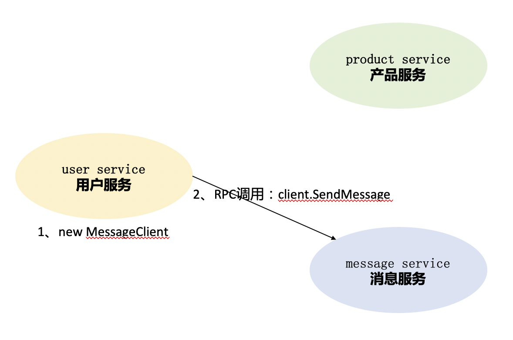
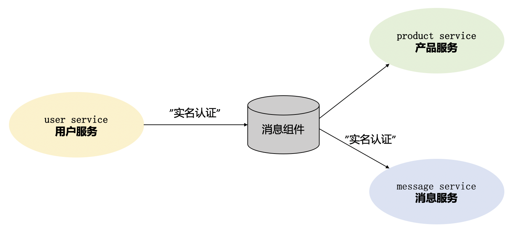
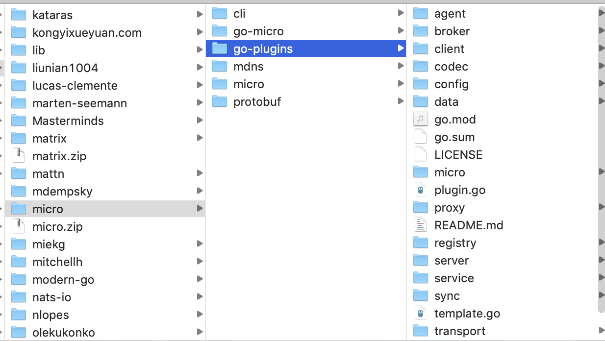
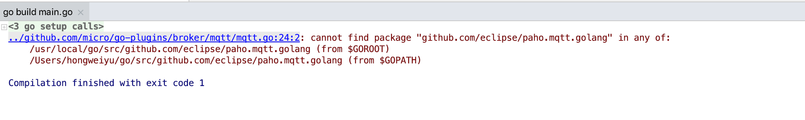
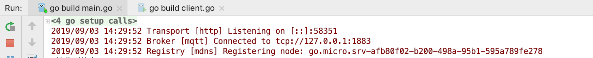
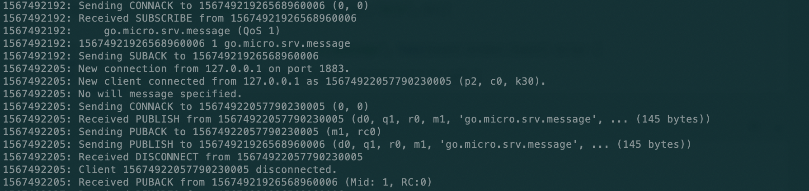

# go-micro使用(一)
**@author：Davie**
**版权所有：北京千锋互联科技有限公司**

## 一、心跳机制与可选项配置

### 1.1、背景
在前面一节课中,我们指定了consul作为微服务的注册组件，并在consul中看到了注册的新服务。这其中还包含其他内容，本节课我们继续来看。

### 1.2、代码实现consul配置
上节课中，我们使用的--registry选项配置的形式来指定注册到consul组件中，其实这一配置也可以在代码中进行实现。上节课说了go-micro在创建服务时提供了很多可选项配置，其中就包含服务组件的指定。指定注册到consul的编程代码实现如下：
```go
...
   //创建一个新的服务对象实例
	service := micro.NewService(
		micro.Name("student_service"),
		micro.Version("v1.0.0"),
		micro.Registry(consul.NewRegistry()),
	)
...
```
通过micro.Registry可以指定要注册的发现组件，这里我们注册到consul，因此调用consul.NewRegistry。

### 1.3、插件化
在前面的go-micro介绍课中，我们提到过go-micro是支持插件化的基础的微服务框架，不仅仅是go-micro，整个的micro都被设计成为“可插拔”的机制。

在上一节课的案例中，我们使用--registry选项指定将服务注册到对应的服务发现组件，我们选择的是注册到consul中。这里的--registry就是是“可插拔”的插件化机制的体现。因为在2019年最新的代码中，go-micro中默认将服务注册到mdns中，同时支持开发者手动指定特定的服务发现组件。

我们可以看到在这个过程中，我们的服务的程序没有发生任何变化，但是却轻松的实现了服务注册发现组件的更换，这就是插件化的优势，利用插件化能最大限度的解耦。

在go-micro框架中，支持consul，etcd，zookeeper，dns等组件实现服务注册和发现的功能。如果有需要，开发者可以根据自己的需要进行服务发现组件的替换。

### 1.4、服务注册发现的原理
让我们再回顾一下服务注册与发现的原理：服务注册发现是将所有的服务注册到注册组件中心，各服务在进行互相调用功能时，先通过查询方法获取到要调用的服务的状态信息和地址，然后向对应的微服务模块发起调用。我们学习过consul的工作原理和环境搭建，congsul的工作原理图如下所示：


### 1.5、未发现服务错误
回顾完了服务注册发现的原理，我们就可以知道，如果请求发起端程序不能在服务组件中发现对应的服务，则会产生错误。接下来我们利用程序演示错误。

首先，通过终端命令启动consul节点服务，以方便服务注册：
```go
consul agent -dev
```

#### 1.5.1、指定服务程序注册到consul
我们利用已经学习过的服务注册可选项指定注册到consul组件，详细命令如下：
```go
go run main.go --registry=consul
```
通过该命令，可以成功将服务注册到consul组件，并启动服务开始运行。

#### 1.5.2、运行客户端服务
由于服务端程序已经注册到consul,因此客户端程序在执行时也需要到consul中查询才能正确执行。运行客户端并注册到consul组件的命令是：
```go
go run client.go --registry=consul
```
通过以上命令，程序可以正确得到执行，并输出正确结果。

#### 1.5.3、未发现服务错误
我们可以主动让程序发生错误，来验证未发现的错误，以此来验证我们所学习的服务注册与发现的原理。在执行客户端程序时，我们不指定--registry选项，默认使用mdns，则命令为：
```go
go run client.go
```
我们执行上述命令，运行客户端程序。由于我们的客户端程序会连接对应的服务的方法，但是对应的服务并没有注册到mdns中，因此，程序会发生错误。本案例中，客户端程序执行错误如下：
```
{"id":"go.micro.client","code":500,"detail":"error selecting student_service node: not found","status":"Internal Server Error"}
```
我们可以看到，程序返回了错误信息，提示我们服务未找到。

通过这个主动错误的示范，我们能更加深刻的理解go-micro与consul的插件式协同工作和微服务内部的原理。

### 1.6、弊端与解决方法
服务实例与发现组件的工作机制是：当服务开启时，将自己的相关信息注册到发现组件中，当服务关闭时，发送卸载或者移除请求。在实际生产环境中，服务可能会出现很多异常情况，发生宕机或者其他等情况，往往服务进程会被销毁，或者网络出现故障也会导致通信链路发生问题，在这些情况下，服务实例会在服务发现组件中被移除。

#### 1.6.1、TTL和间隔时间
为了解决这个问题，go-micro框架提供了TTL机制和间隔时间注册机制。TTL是Time-To-Live的缩写，指定一次注册在注册组件中的有效期，过期后便会删除。而间隔时间注册则表示定时向注册组件中重新注册以确保服务在线。

* 指令方式
    这两种注册方式都可以通过可选项指令来实现配置，具体的命令如下：

    ```go
    go run main.go --registry=consul --register_ttl=10 --register_interval=5
    ```

    该命令表示我们每间隔5秒钟向服务注册组件注册一次，每次有效期限是10秒。
    
* 编码方式
  除了使用指令的方式以外，还可以在代码中实现这两种参数的设定，在微服务创建时通过配置来完成。具体代码如下：
  ```go
  ...
  service := micro.NewService(
		micro.Name("student_service"),
		micro.Version("v1.0.0"),
		micro.RegisterTTL(10*time.Second),
		micro.RegisterInterval(5*time.Second),
	)
  ...
  ```
  分别通过micro.RegisterTTL和micro.RegisterInterval来实现两个选项的设置。
  
  
## 二、解耦利器--事件驱动机制
前面我们已经学习了创建微服务和启动微服务的可选项配置，今天我们来学习事件驱动机制

### 2.1、背景
之前的课程中我们已经学习了使用go-micro创建微服务，并实现了服务的调用。我们具体的实现是实例化了client对象，并调用了对应服务的相关方法。这种方式可以实现系统功能，但有比较大的缺点。

我们通过举例来说明：在某个系统中存在用户服务（user service)、产品服务（product service)和消息服务（message service）。如果用户服务中要调用消息服务中的功能方法，则具体的实现方式可用下图所示方法表示：



按照正常的实现是在user service模块的程序中实例化message service的一个client，然后进行RPC调用，调用sendMessage来实现发送消息。

#### 2.1.1、缺点
这种实现方式代码耦合度高，用户服务的模块中出现了消息服务模块的代码，不利于系统的扩展和功能的迭代开发。

### 2.2、发布/订阅机制
#### 2.2.1、事件驱动
依然是上述的案例，用户服务在用户操作的过程中，需要调用消息服务的某个方法，假设为发送验证码消息的一个方法。为了使系统代码能够实现解耦，用户服务并不直接调用消息服务的具体的方法，而是将用户信息等相关数据发送到一个中间组件，该组件负责存储消息，而消息服务会按照特定的频率访问中间的消息存储组件，并取出其中的消息,然后执行发送验证码等操作。具体的示意图如下所示：


在上述的架构图中，我们可以看到，相较于之前的实现，多了一个中间的消息组件系统。

#### 2.2.2、事件发布
只有当用户服务中的某个功能执行时，才会触发相应的事件，并将对应的用户数据等消息发送到消息队列组件中，这个过程我们称之为事件发布。

#### 2.2.3、事件订阅
与事件发布对应的是事件订阅。我们增加消息队列组件的目的是实现模块程序的解耦，原来是程序调用端主动进行程序调用，现在需要由另外一方模块的程序到消息队列组件中主动获取需要相关数据并进行相关功能调用。这个主动获取的过程称之为订阅。

基于消息发布/订阅的消息系统有很多种框架的实现，常见的有：Kafka、RabbitMQ、ActiveMQ、Kestrel、NSQ等。

### 2.3、Broker
在我们介绍go-micro的时已经提到过，go-micro整个框架都是插件式的设计。没错，这里的发布/订阅也是通过接口设计来实现的。

#### 2.3.1、定义
```go
type Broker interface {
	Init(...Option) error
	Options() Options
	Address() string
	Connect() error
	Disconnect() error
	Publish(topic string, m *Message, opts ...PublishOption) error
	Subscribe(topic string, h Handler, opts ...SubscribeOption) (Subscriber, error)
	String() string
}
```

如果我们要具体实现事件的发布和订阅功能，只需要安装对应支持的go-plugins插件实现就可以了。go-plugins里支持的消息队列方式有：kafka、nsq、rabbitmq、redis等。同时，go-micro本身支持三种broker，分别是http、nats、memory，默认的broker是http，在实际使用过程中往往使用第三方的插件来进行消息发布/订阅的实现。

在本课程中，我们演示RabbitMQ插件实现的事件订阅和发布机制。

### 2.4、安装go-plugins
在go-micro框架的学习过程中，需要频繁的用到相关的插件。因此，首先安装go-plugins插件库，在go-plugins插件库中，封装提供了go-micro框架中的插件机制的实现方案。

#### 2.4.1、源码库
在github网站上能够找到对应的go-plugins插件库的源码，源码地址是：[https://github.com/micro/go-plugins](https://github.com/micro/go-plugins)

#### 2.4.2、安装
```go
go get github.com/micro/go-plugins
```

可以通过上述的命令安装micro的插件库，安装以后可以在当前系统的$GOPATH/src/github.com/micro目录中找到对应的插件库源码。

#### 2.4.3、Broker实现
在已经安装和下载的go-plugins插件库中,我们可以看到有一个broker目录，其中就封装了go-micro框架的broker机制支持的解决方案。

我们在本案例中，以mqtt进行讲解。

### 2.5、MQTT介绍及环境搭建
#### 2.5.1、MQTT简介
MQTT全称是Message Queuing Telemetry Transport，翻译为消息队列遥测传输协议，是一种基于发布/订阅模式的"轻量级"的通讯协议，该协议基于TCP/IP协议，由IBM在1999年发布。MQTT的最大优点在于，可以用极少的代码和有限的宽带,为连接远程设备提供提供实时可靠的消息服务。

#### 2.5.2、MQTT安装
在MacOS系统下，安装MQTT的服务器Mosquitto。可以在MacOS终端中使用命令进行安装：
```go
brew install mosquitto
```
#### 2.5.3、运行mosquitto
在MacOS系统中安装成功以后，可以通过命令进行启动mosquitto，具体操作命令如下：
```
$cd /usr/local/
$./sbin/mosquitto -c etc/mosquitto/mosquitto.conf -d -v
```
启动成功后，会在终端中有如下所示的日志输出：

出现如上图所示的输出内容，即表示mqtt启动成功。

windows系统上的mqtt的安装和启动，可以到[https://activemq.apache.org/](https://activemq.apache.org/)中下载最新的安装文件，然后进行安装和运行。

### 2.6、编程实现
接下来进行订阅和发布机制的编程的实现。

#### 2.6.1、消息组件初始化
如果要想使用消息组件完成消息的发布和订阅，首先应该让消息组件正常工作。因此，需要先对消息组件进行初始化。我们可以在服务创建时，对消息组件进行初始化，并进行可选项配置,设置使用mqtt作为消息组件。代码实现如下：
```go
...
server := micro.NewService(
		micro.Name("go.micro.srv"),
		micro.Version("latest"),
		micro.Broker(mqtt.NewBroker()),
)
...
```
可以使用micro.Broker来指定特定的消息组件，并通过mqtt.NewBroker初始化一个mqtt实例对象,作为broker参数。

#### 2.6.2、消息订阅
因为是时间驱动机制，消息的发送方随时可能发布相关事件。因此需要消息的接收方先进行订阅操作，避免遗漏消息。go-micro框架中可以通过broker.Subscribe实现消息订阅。编程代码如下所示：
```go
...
pubSub := service.Server().Options().Broker
_, err := pubSub.Subscribe("go.micro.srv.message", func(event broker.Event) error {
		var req *message.StudentRequest
		if err := json.Unmarshal(event.Message().Body, &req); err != nil {
			return err
		}
		fmt.Println(" 接收到信息：", req)
		//去执行其他操作
		
		return nil
	})
...
```

#### 2.6.3、消息发布
完成了消息的订阅，我们再来实现消息的发布。在客户端实现消息的发布。在go-micro框架中，可以使用broker.Publish来进行消息的发布,具体的代码如下：
```go
...

brok := service.Server().Options().Broker
if err := brok.Connect(); err != nil {
	log.Fatal(" broker connection failed, error : ", err.Error())
}

student := &message.Student{Name: "davie", Classes: "软件工程专业", Grade: 80, Phone: "12345678901"}
msgBody, err := json.Marshal(student)
if err != nil {
	log.Fatal(err.Error())
}
msg := &broker.Message{
	Header: map[string]string{
		"name": student.Name,
	},
	Body: msgBody,
}

err = brok.Publish("go.micro.srv.message", msg)
if err != nil {
	log.Fatal(" 消息发布失败：%s\n", err.Error())
} else {
	log.Print("消息发布成功")
}
	
...
```

### 2.7、运行程序
#### 2.7.1、启动mqtt服务器
mqtt服务器默认会在1883端口进行监听。

#### 2.7.2、启动server程序
首先运行server端程序的main.go文件中的main函数。

#### 2.7.3、错误
在运行main.go程序时，会报如下错误：cannot find package "github.com/eclipse/paho.mqtt.golang"：


需要我们安装对应的包源码，该包的源码地址在github地址代码库中：[https://github.com/eclipse/paho.mqtt.golang](https://github.com/eclipse/paho.mqtt.golang)，安装命令如下：
```go
go get github.com/eclipse/paho.mqtt.golang
```

包安装后，可以执行server.go文件中的main函数，启动程序如下：


#### 2.7.4、启动client程序
server程序启动后，启动客户端程序client.go，可以输出正确日志。另外可以在mqtt终端中输出相关的消息订阅和发布的日志，如下图所示：


### 2.8、弊端

在服务端通过fmt.println日志，可以输出event.Message().Body)数据，其格式为：
```
{"name":"davie","classes":"软件工程专业","grade":80,"phone":"12345678901"}
```
我们可以看到在服务实例之间传输的数据格式是json格式。根据之前学习proto知识可以知道，在进行消息通信时，采用JSON格式进行数据传输，其效率比较低。

因此，这意味着，当我们在使用第三方消息组件进行消息发布/订阅时，会失去对protobuf的使用。这对追求高消息的开发者而言，是需要解决和改进的问题。因为使用protobuf可以直接在多个服务之间使用二进制流数据进行传输，要比json格式高效的多。

### 2.9、googlepubsub
在go-micro框架中内置的Broker插件中，有google提供的googlepubsub插件实现，位于代理层之上，同时还省略了使用第三方代理消息组件（如mqtt)。

参考资料：[https://cloud.google.com/pubsub/](https://cloud.google.com/pubsub/)。感兴趣的同学可以自己动手实现，此处我们作为拓展思路，不再进行实现。