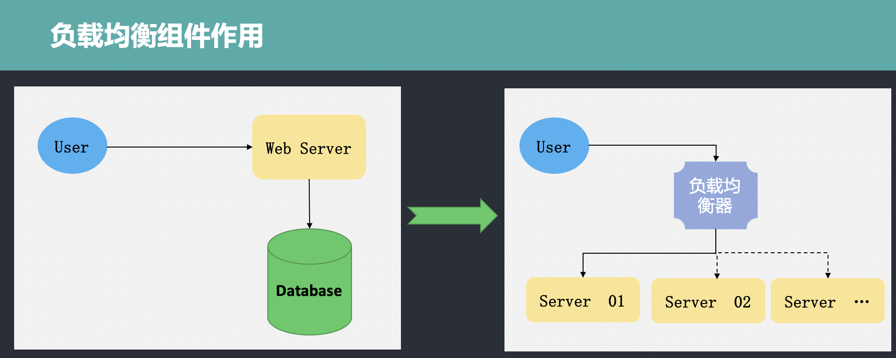

# go-micro使用(二)
**@author：Davie**
**版权所有：北京千锋互联科技有限公司**

## Micro负载均衡组件--Selector

### 背景
在Go-micro中的介绍课程中，我们说过go-micro具备负载均衡功能。所谓负载均衡，英文为Load Balance，其意思是将负载进行平衡、分摊到多个操作单元上进行执行。例如Web服务器，应用服务器，微服务程序服务器等，以此来完成达到高并发的目的。

当只有一台服务部署程序时，是不存在负载均衡问题的，此时所有的请求都由同一台服务器进行处理。随着业务复杂度的增加和功能迭代，单一的服务器无法满足业务增长需求，需要靠分布式来提高系统的扩展性，随着而来的就是负载均衡的问题。因此需要加入负载均衡组件或者功能，两者的区别和负载均衡的作用如下所示：



从图中可以看到，用户先访问负载均衡器，再由负载均衡器对请求进行处理，进而分发到不同的服务器上的服务程序进行处理。

负载均衡器主要处理四种请求，分别是：HTTP、HTTPS、TCP、UDP。

### 负载均衡算法
负载均衡器的作用既然是负责接收请求，并实现请求的分发，因此需要按照一定的规则进行转发处理。负载均衡器可以按照不同的规则实现请求的转发，其遵循的转发规则称之为负载均衡算法。常用的负载均衡算法有以下几个：

* Round Robin（轮训算法）：所谓轮训算法，其含义很简单，就是按照一定的顺序进行依次排队分发。当有请求队列需要转发时，为第一个请求选择可用服务列表中的第一个服务器，为下一个请求选择服务列表中的第二个服务器。按照此规则依次向下进行选择分发，直到选择到服务器列表的最后一个。当第一次列表转发完毕后，重新选择第一个服务器进行分发，此为轮训。

* Least Connections（最小连接）：因为分布式系统中有多台服务器程序在运行，每台服务器在某一个时刻处理的连接请求数量是不一样的。因此，当有新的请求需要转发时，按照最小连接数原则，负载均衡器会有限选择当前连接数最小的服务器，以此来作为转发的规则。

* Source（源）：还有一种常见的方式是将请求的IP进行hash计算，根据结算结果来匹配要转发的服务器，然后进行转发。这种方式可以一定程度上保证特定用户能够连接到相同的服务器。

### Mico的Selector
Selector的英文是选择器的意思，在Micro中实现了Selector组件，运行在客户端实现负载均衡功能。当客户端需要调用服务端方法时，客户端会根据其内部的selector组件中指定的负载均衡策略选择服务注册中中的一个服务实例。Go-micro中的Selector是基于Register模块构建的，提供负载均衡策略，同时还提供过滤、缓存和黑名单等功能。

### Selector定义
首先，让我们来看一下Selector的定义：
```go
type Selector interface {
	Init(opts ...Option) error
	Options() Options
	// Select returns a function which should return the next node
	Select(service string, opts ...SelectOption) (Next, error)
	// Mark sets the success/error against a node
	Mark(service string, node *registry.Node, err error)
	// Reset returns state back to zero for a service
	Reset(service string)
	// Close renders the selector unusable
	Close() error
	// Name of the selector
	String() string
}
```

如上是go-micro框架中的Selector的定义，Selector接口定义中包含Init、Options、Mark、Reset、Close、String方法。其中Select是核心方法，可以实现自定义的负载均衡策略，Mark方法用于标记服务节点的状态,String方法返回自定义负载均衡器的名称。

### DefaultSelector
在selector包下，除Selector接口定义外，还包含DefaultSelector的定义，作为go-micro默认的负载均衡器而被使用。DefaultSelector是通过NewSelector函数创建生成的。NewSelector函数实现如下:
```go
func NewSelector(opts ...Option) Selector {
	sopts := Options{
		Strategy: Random,
	}

	for _, opt := range opts {
		opt(&sopts)
	}

	if sopts.Registry == nil {
		sopts.Registry = registry.DefaultRegistry
	}

	s := &registrySelector{
		so: sopts,
	}
	s.rc = s.newCache()

	return s
}
```

在NewSelector中，实例化了registrySelector对象并进行了返回,在实例化的过程中，配置了Selector的Options选项，默认的配置是Random。我们进一步查看会发现Random是一个func，定义如下：
```go
func Random(services []*registry.Service) Next {
	var nodes []*registry.Node

	for _, service := range services {
		nodes = append(nodes, service.Nodes...)
	}

	return func() (*registry.Node, error) {
		if len(nodes) == 0 {
			return nil, ErrNoneAvailable
		}

		i := rand.Int() % len(nodes)
		return nodes[i], nil
	}
}
```

该算法是go-micro中默认的负载均衡器，会随机选择一个服务节点进行分发；除了Random算法外，还可以看到RoundRobin算法，如下所示：
```go
func RoundRobin(services []*registry.Service) Next {
	var nodes []*registry.Node

	for _, service := range services {
		nodes = append(nodes, service.Nodes...)
	}

	var i = rand.Int()
	var mtx sync.Mutex

	return func() (*registry.Node, error) {
		if len(nodes) == 0 {
			return nil, ErrNoneAvailable
		}

		mtx.Lock()
		node := nodes[i%len(nodes)]
		i++
		mtx.Unlock()
		return node, nil
	}
}
```

### registrySelector
registrySelector是selector包下default.go文件中的结构体定义，具体定义如下:
```go
type registrySelector struct {
	so Options
	rc cache.Cache
}
```

#### 缓存Cache
目前已经有了负载均衡器，我们可以看到在Selector的定义中，还包含一个cache.Cache结构体类型，这是什么作用呢？

有了Selector以后，我们每次请求负载均衡器都要去Register组件中查询一次，这样无形之中就增加了成本，降低了效率，没有办法达到高可用。为了解决以上这种问题，在设计Selector的时候设计一个缓存，Selector将自己查询到的服务列表数据缓存到本地Cache中。当需要处理转发时，先到缓存中查找，如果能找到即分发；如果缓存当中没有，会执行请求服务发现注册组件，然后缓存到本地。
具体的实现机制如下所示：
```go
type Cache interface {
	// embed the registry interface
	registry.Registry
	// stop the cache watcher
	Stop()
}

func (c *cache) watch(w registry.Watcher) error {
	// used to stop the watch
	stop := make(chan bool)

	// manage this loop
	go func() {
		defer w.Stop()

		select {
		// wait for exit
		case <-c.exit:
			return
		// we've been stopped
		case <-stop:
			return
		}
	}()

	for {
		res, err := w.Next()
		if err != nil {
			close(stop)
			return err
		}
		c.update(res)
	}
}
```

通过watch实现缓存的更新、创建、移除等操作。

#### 黑名单
在了解完了缓存后，我们再看看Selector中其他的方法。在Selector接口的定义中，还可以看到有Mark和Resetf昂发的声明。具体声明如下：

```go
// Mark sets the success/error against a node
Mark(service string, node *registry.Node, err error)
// Reset returns state back to zero for a service
Reset(service string)
```
Mark方法可以用于标记服务注册和发现组件中的某一个节点的状态，这是因为在某些情况下，负载均衡器跟踪请求的执行情况。如果请求被转发到某天服务节点上，多次执行失败，就意味着该节点状态不正常，此时可以通过Mark方法设置节点变成黑名单，以过滤掉掉状态不正常的节点。