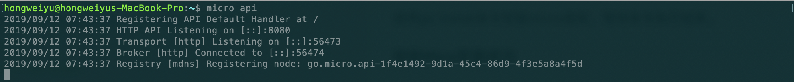

# RESTful API设计标准和实践
**@author：Davie**
**版权所有：北京千锋互联科技有限公司**

## 背景
在之前的几节课程中，已经介绍了go-micro的一些核心功能和核心机制。实现的都是着重于微服务之间。在实际的开发过程中，需要微服务仅仅是作为后台程序进行部署，需要整体向web前端用户端产品提供交互和数据。因此，我们来看看如何微服务如何与web进行交互。

## 划分调用范围
在整体的系统架构中，我们会将系统分为前台和后台。前台负责与用户交互，展示数据，执行操作。后台负责业务逻辑处理，数据持久化等操作。在系统运行过程中，前台和后台，后台和后台都可能发生功能调用：
* 内部调用：后台各个微服务之间的互相调用，属于系统后台内部的调用,称之为内部调用。

* 外部调用：前台与后台的接口请求调用，通常被城之外外部调用。

## 技术选型
在开发实践中，我们对于外部调用和内部调用所采用的技术方案会有所不同。

* RPC调用：后台各个服务之间内部的互相调用，为了实现高效率的服务的交互，通常采用RPC的方式进行实现。

* REST：对于前端客户端通过HTTP接口，与后台交互的场景。因为涉及到对不同资源的管理和操作，因此往往采用RESTful标准进行实现。

## Go-Micro API网关
Micro框架中有API网关的功能。API网关的作用是为微服务做代理，负责将微服务的RPC方法代理成支持HTTP协议的web请求，同时将用户端使用的URL进行暴露。

### 安装Micro工具
要想使用go-micro 的api网关功能。需要下载Micro源码并安装Mico。

#### 安装Micro
可以直接通过go get命令下载并安装,具体命令为：
```go
go get -u github.com/micro/micro
```
在使用go get命令下载源码和相应依赖时，国内由于网络环境的问题，可能会导致下载失败的错误。

如果在安装的过程中出现连接超时的错误，可以通过手动的方式下载相应的依赖库，然后再进行手动安装。因此，解决方案分为两步：
##### 安装golang的net、crypt、text等库
```
git clone https://github.com/grpc/grpc-go.git $GOPATH/src/google.golang.org/grpc  
git clone https://github.com/golang/net.git $GOPATH/src/golang.org/x/net  
git clone https://github.com/golang/text.git $GOPATH/src/golang.org/x/text  
git clone https://github.com/golang/crypto.git $GOPATH/src/golang.org/x/crypto
```
使用git clone命令将所需要的代码库进行下载。

##### 安装micro
```
go install github.com/micro/micro
```
 使用go install命令安装micro框架，等待命令执行结束。
 
#### 检验Micro安装成功
micro系列工具安装成功后，可以通过命令检验查看。
```go
micro --version
micro version 1.9.1
```
如上，输出了micro version 1.9.1即表示micro安装成功。


## Micro API工作原理
micro工具提供了构建api网关服务的功能，并基于go-micro框架进行编程实现，核心作用是把RPC形式的服务代理成为支持HTTP协议的WEB API请求。

## 运行Micro api服务
可以通过如下命令启动micro api：
```go
micro api
``` 


### 反向代理的API服务启动
在Micro api功能中,支持多种处理请求路由的方式，我们称之为Handler。包括：API Handler、RPC Handler、反向代理、Event Handler，RPC等五种方式。在本案例中，我们使用反向代理来进行演示。

#### 反向代理
* 格式：/[service]
* 请求/响应：HTTP方式
* micro api启动时通过--handler=proxy设置

因此，反向代理形式的micro api网关服务启动命令为：
```go
micro api --handler=http
```

在本案例中，我们将micro api的反向代理和REST代表的HTTP WEB请求结合起来一起使用。

## 安装go-restful
可以通过安装go-restful库来实现RESTful风格的路径映射，从而实现HTTP的WEB API服务。安装go-restful的命令如下：
```go
go get github.com/emicklei/go-restful
```
下载后，可以在当前系统目录的$GOPATH/src/github.com/emicklei/go-restful中进行查看相应的源码。

> 我们使用一个获取某个学生信息的服务为例，进行讲解micro api的编程实现。

## 服务定义和编译
定义学生消息体proto文件：
```proto
syntax = 'proto3';

package proto;

message Student {
    string id = 1;
    string name = 2;
    int32 grade = 3;
    string classes = 4;
}

message Request {
    string name = 1;
}

service StudentService {
    rpc GetStudent (Request) returns (Student);
}
```
在proto文件中定义了Student、Request消息体和rpc服务。使用micro api网关功能，编译proto文件，需要生成micro文件。编译生成该文件需要使用到一个新的protoc-gen-micro库，安装protoc-gen-micro库命令如下：
```go
go get github.com/micro/protoc-gen-micro
```
再次编译proto文件，需要指定两个参数，分别是：go_out和micro_out，详细命令如下：
```go
protoc --go_out=. --micro_out=. student.proto
```
上述命令执行成功后，会自动生成两个go语言文件：student.pb.go和student.micro.go。

micro.go文件中生成的内容包含服务的实例化，和相应的服务方法的底层实现。

## 服务端实现
我们都知道正常的Web服务，是通过路由处理http的请求的。在此处也是一样的，我们可以通过路由处理来解析HTTP请求的接口，service对象中包含路由处理方法。详细代码如下所示：
```go
...
type StudentServiceImpl struct {
}

//服务实现
func (ss *StudentServiceImpl) GetStudent(ctx context.Context, request *proto.Request, resp *proto.Student) error {

	//tom
	studentMap := map[string]proto.Student{
		"davie":  proto.Student{Name: "davie", Classes: "软件工程专业", Grade: 80},
		"steven": proto.Student{Name: "steven", Classes: "计算机科学与技术", Grade: 90},
		"tony":   proto.Student{Name: "tony", Classes: "计算机网络工程", Grade: 85},
		"jack":   proto.Student{Name: "jack", Classes: "工商管理", Grade: 96},
	}

	if request.Name == "" {
		return errors.New(" 请求参数错误,请重新请求。")
	}

	//获取对应的student
	student := studentMap[request.Name]
	if student.Name != "" {
		fmt.Println(student.Name, student.Classes, student.Grade)
		*resp = student
		return nil
	}
	return errors.New(" 未查询当相关学生信息 ")
}

func main() {
	service := micro.NewService(
		micro.Name("go.micro.srv.student"),
	)

	service.Init()
    proto.RegisterStudentServiceHandler(service.Server(), new(StudentServiceImpl))

	if err := service.Run(); err != nil {
		log.Fatal(err.Error())
	}
}
...
```
server程序进行服务的实现和服务的运行。

## REST 映射
现在，RPC服务已经编写完成。我们需要编程实现API的代理功能，用于处理HTTP形式的请求。
在rest.go文件中，实现rest的映射，详细代码如下：
```go
type Student struct {
}

var (
	cli proto.StudentService
)

func (s *Student) GetStudent(req *restful.Request, rsp *restful.Response) {

	name := req.PathParameter("name")
	fmt.Println(name)
	response, err := cli.GetStudent(context.TODO(), &proto.Request{
		Name: name,
	})

	if err != nil {
		fmt.Println(err.Error())
		rsp.WriteError(500, err)
	}

	rsp.WriteEntity(response)
}

func main() {

	service := web.NewService(
		web.Name("go.micro.api.student"),
	)

	service.Init()

	cli = proto.NewStudentService("go.micro.srv.student", client.DefaultClient)

	student := new(Student)
	ws := new(restful.WebService)
	ws.Path("/student")
	ws.Consumes(restful.MIME_XML, restful.MIME_JSON)
	ws.Produces(restful.MIME_JSON, restful.MIME_XML)

	ws.Route(ws.GET("/{name}").To(student.GetStudent))

	wc := restful.NewContainer()
	wc.Add(ws)

	service.Handle("/", wc)

	if err := service.Run(); err != nil {
		log.Fatal(err)
	}
}
```